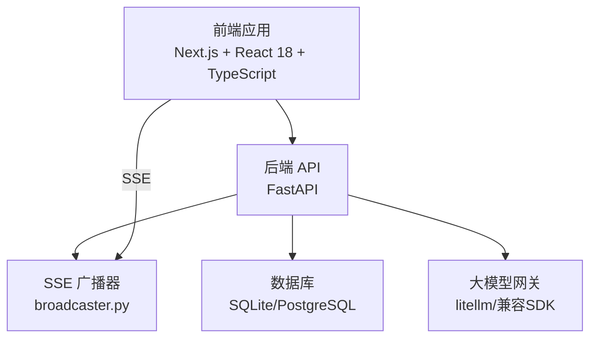
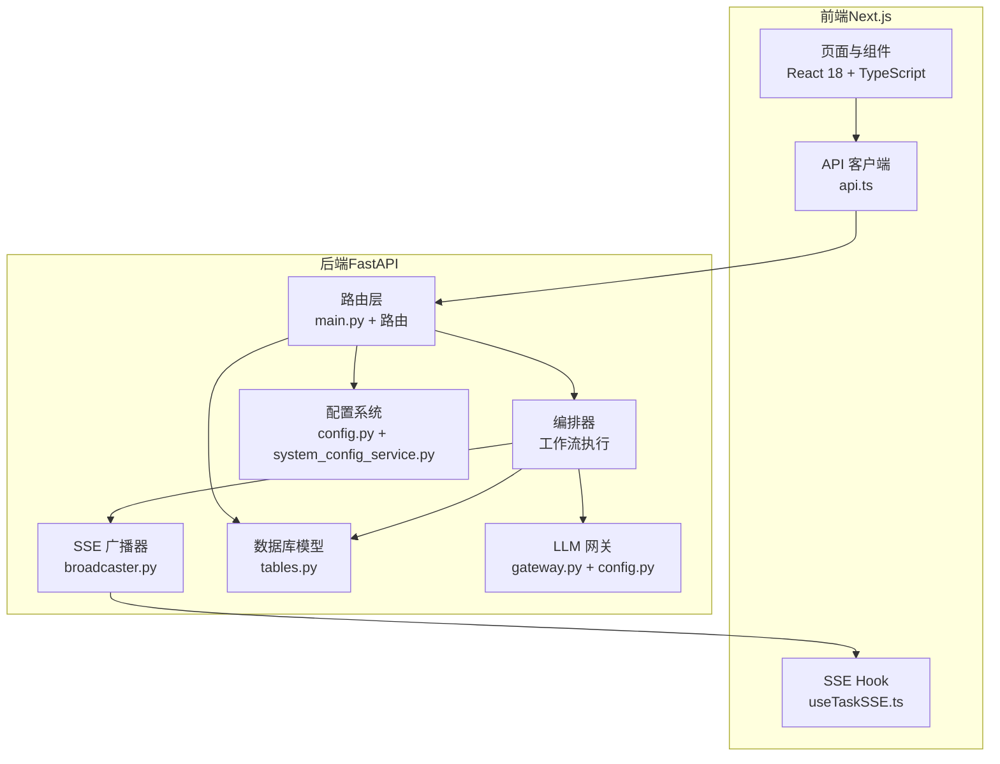
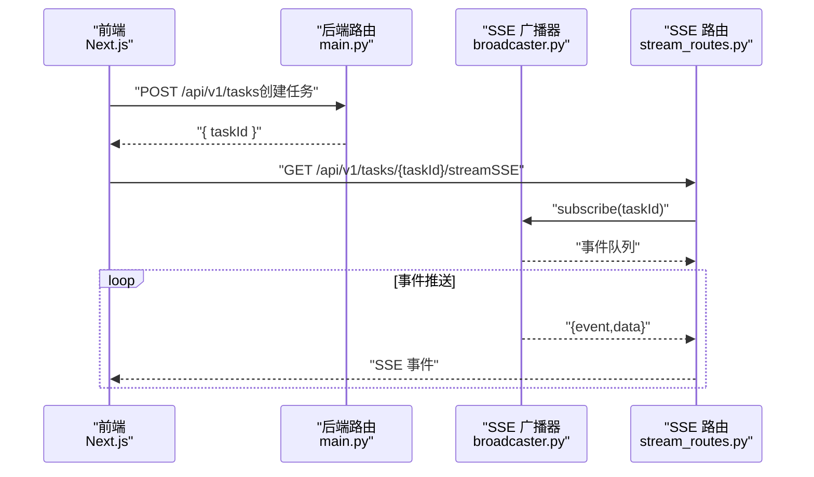
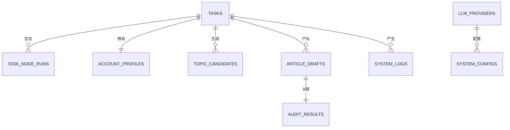
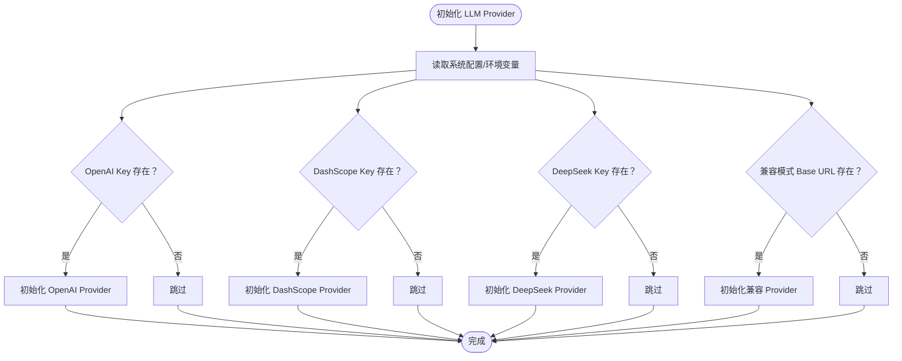
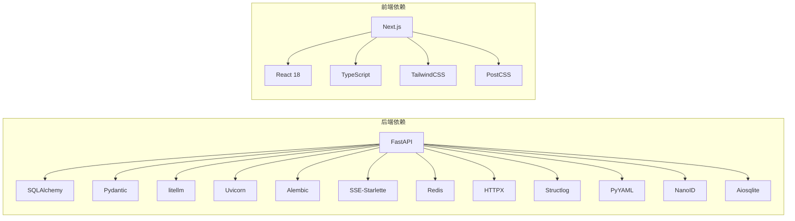

# 技术栈选择

<cite>
**本文引用的文件**
- [ARCHITECTURE.md](file://ARCHITECTURE.md)
- [pyproject.toml](file://backend/pyproject.toml)
- [package.json（前端）](file://frontend/package.json)
- [package.json（OpenClaw-bot-review）](file://OpenClaw-bot-review-main/package.json)
- [main.py](file://backend/app/main.py)
- [stream_routes.py](file://backend/app/api/stream_routes.py)
- [broadcaster.py](file://backend/app/orchestrator/broadcaster.py)
- [api.ts](file://frontend/lib/api.ts)
- [useTaskSSE.ts](file://frontend/hooks/useTaskSSE.ts)
- [next.config.ts](file://frontend/next.config.ts)
- [tables.py](file://backend/app/models/tables.py)
- [config.py（后端配置）](file://backend/app/core/config.py)
- [system_config_service.py](file://backend/app/services/system_config_service.py)
- [config.py（LLM配置）](file://backend/app/llm/config.py)
- [gateway.py（LLM网关）](file://backend/app/llm/gateway.py)
- [llm_provider_routes.py](file://backend/app/api/llm_provider_routes.py)
</cite>

## 目录
1. [引言](#引言)
2. [项目结构](#项目结构)
3. [核心组件](#核心组件)
4. [架构总览](#架构总览)
5. [详细组件分析](#详细组件分析)
6. [依赖分析](#依赖分析)
7. [性能考量](#性能考量)
8. [故障排查指南](#故障排查指南)
9. [结论](#结论)
10. [附录](#附录)

## 引言
本文件系统化阐述 HotClaw 项目的前后端技术栈选择与协同机制，覆盖后端（Python 3.11+、FastAPI、SQLAlchemy、litellm 等）与前端（React 18、TypeScript、Next.js、TailwindCSS 等）的技术选型理由、版本与兼容性、以及前后端通过 SSE 的实时通信机制。文档同时提供架构图、序列图与流程图，帮助初学者理解整体设计，也为有经验的开发者提供深入的技术细节。

## 项目结构
HotClaw 采用前后端分离架构，后端为 Python FastAPI 应用，前端为 Next.js 应用。二者通过 REST API 与 Server-Sent Events（SSE）进行交互，后端负责工作流编排、任务执行与状态广播，前端负责可视化展示与用户交互。

图表来源
- [main.py:69-153](file://backend/app/main.py#L69-L153)
- [stream_routes.py:14-43](file://backend/app/api/stream_routes.py#L14-L43)
- [broadcaster.py:11-99](file://backend/app/orchestrator/broadcaster.py#L11-L99)
- [tables.py:23-46](file://backend/app/models/tables.py#L23-L46)
- [config.py（后端配置）:52-99](file://backend/app/core/config.py#L52-L99)

章节来源
- [ARCHITECTURE.md:37-78](file://ARCHITECTURE.md#L37-L78)
- [main.py:69-153](file://backend/app/main.py#L69-L153)

## 核心组件
- 后端核心
  - FastAPI：异步 Web 框架，提供自动 OpenAPI 文档与良好的 SSE 支持。
  - SQLAlchemy 2.0 + alembic：异步 ORM 与迁移工具，支撑 SQLite/PostgreSQL。
  - litellm：统一多模型调用接口，简化不同 LLM 提供商的切换与测试。
  - SSE 广播器：基于 asyncio.Queue 的事件缓冲与订阅管理，确保前端连接建立前也能接收历史事件。
- 前端核心
  - Next.js：React 18 + TypeScript 的全栈框架，提供路由、构建与 SSR 能力。
  - TailwindCSS：实用优先的 CSS 框架，快速构建界面。
  - 自定义 API 客户端与 SSE Hook：封装 REST 请求与 SSE 事件订阅，驱动任务运行状态可视化。

章节来源
- [pyproject.toml:6-22](file://backend/pyproject.toml#L6-L22)
- [package.json（前端）:11-21](file://frontend/package.json#L11-L21)
- [stream_routes.py:14-43](file://backend/app/api/stream_routes.py#L14-L43)
- [broadcaster.py:11-99](file://backend/app/orchestrator/broadcaster.py#L11-L99)
- [api.ts:14-56](file://frontend/lib/api.ts#L14-L56)
- [useTaskSSE.ts:28-144](file://frontend/hooks/useTaskSSE.ts#L28-L144)

## 架构总览
下图展示了 HotClaw 的端到端架构：前端通过 Next.js 提供页面与交互，后端通过 FastAPI 提供 REST 与 SSE，数据库持久化任务与运行记录，LLM 网关统一调用不同模型提供商。

图表来源
- [main.py:69-153](file://backend/app/main.py#L69-L153)
- [stream_routes.py:14-43](file://backend/app/api/stream_routes.py#L14-L43)
- [broadcaster.py:11-99](file://backend/app/orchestrator/broadcaster.py#L11-L99)
- [tables.py:23-46](file://backend/app/models/tables.py#L23-L46)
- [config.py（后端配置）:52-99](file://backend/app/core/config.py#L52-L99)
- [system_config_service.py:119-223](file://backend/app/services/system_config_service.py#L119-L223)
- [gateway.py（LLM网关）:163-193](file://backend/app/llm/gateway.py#L163-L193)
- [config.py（LLM配置）:46-95](file://backend/app/llm/config.py#L46-L95)

## 详细组件分析

### 后端技术栈选择与理由
- Python 3.11+
  - 理由：AI/LLM 生态最佳，第三方 SDK 丰富，便于与 litellm 等工具集成。
  - 兼容性：项目要求 Python >= 3.11。
- FastAPI
  - 理由：异步支持好、自动 OpenAPI 文档、与 Pydantic 无缝集成、SSE 支持成熟。
  - 集成：CORS 中间件、全局异常处理、SSE 路由。
- SQLAlchemy 2.0 + alembic
  - 理由：成熟的 ORM 与异步支持，迁移工具完善，MVP 阶段可使用 SQLite，后续可平滑迁移到 PostgreSQL。
- litellm
  - 理由：统一多模型调用接口，支持 OpenAI、DeepSeek、DashScope、本地兼容模式等，便于切换与测试。
- Redis/SQLite/PostgreSQL
  - 理由：MVP 使用 SQLite（零部署），系统配置与运行时参数通过 Redis/数据库管理，后续可扩展至 PostgreSQL。
- structlog + 结构化日志表
  - 理由：零外部依赖的结构化日志，配合 system_logs 表入库可查询。

章节来源
- [pyproject.toml:5-22](file://backend/pyproject.toml#L5-L22)
- [main.py:69-153](file://backend/app/main.py#L69-L153)
- [tables.py:220-233](file://backend/app/models/tables.py#L220-L233)
- [system_config_service.py:119-223](file://backend/app/services/system_config_service.py#L119-L223)
- [config.py（后端配置）:52-99](file://backend/app/core/config.py#L52-L99)

### 前端技术栈选择与理由
- Next.js 16 + React 19 + TypeScript 5
  - 理由：全栈开发体验、路由与构建优化、类型安全、生态成熟。
- TailwindCSS
  - 理由：实用优先、快速样式开发、与组件解耦。
- 自定义 API 客户端与 SSE Hook
  - 理由：封装 REST 请求与 SSE 事件订阅，驱动任务运行状态可视化与交互。

章节来源
- [package.json（前端）:11-21](file://frontend/package.json#L11-L21)
- [api.ts:14-56](file://frontend/lib/api.ts#L14-L56)
- [useTaskSSE.ts:28-144](file://frontend/hooks/useTaskSSE.ts#L28-L144)
- [next.config.ts:3-12](file://frontend/next.config.ts#L3-L12)

### 前后端协同机制：SSE 实时通信
- 前端通过 useTaskSSE.ts 订阅后端 SSE 端点，事件类型包括 node_start、node_progress、node_complete、node_error、task_complete、task_error。
- 后端通过 broadcaster.py 维护每个 task_id 的订阅队列与历史事件缓冲，确保晚到的订阅也能收到历史事件。
- Next.js 通过 rewrites 将 /api/* 代理到后端服务地址，前端直接连接后端 SSE 端点以避免响应缓冲问题。

图表来源
- [useTaskSSE.ts:60-140](file://frontend/hooks/useTaskSSE.ts#L60-L140)
- [api.ts:48-55](file://frontend/lib/api.ts#L48-L55)
- [stream_routes.py:14-43](file://backend/app/api/stream_routes.py#L14-L43)
- [broadcaster.py:30-68](file://backend/app/orchestrator/broadcaster.py#L30-L68)
- [main.py:141-148](file://backend/app/main.py#L141-L148)

章节来源
- [useTaskSSE.ts:28-144](file://frontend/hooks/useTaskSSE.ts#L28-L144)
- [api.ts:14-56](file://frontend/lib/api.ts#L14-L56)
- [stream_routes.py:14-43](file://backend/app/api/stream_routes.py#L14-L43)
- [broadcaster.py:11-99](file://backend/app/orchestrator/broadcaster.py#L11-L99)
- [next.config.ts:3-12](file://frontend/next.config.ts#L3-L12)

### 数据库与工作流执行支撑
- 数据模型
  - 任务表、节点运行记录、账号画像、候选主题、文章草稿、审核结果、系统配置、系统日志、LLM 提供商等。
- 工作流执行
  - 编排器按 workflow 定义顺序调度 agent，将节点状态通过 SSE 广播给前端，同时持久化节点运行记录与系统日志。

图表来源
- [tables.py:23-158](file://backend/app/models/tables.py#L23-L158)

章节来源
- [tables.py:23-319](file://backend/app/models/tables.py#L23-L319)

### LLM 提供商配置与切换
- 配置来源：环境变量与系统配置表，支持 OpenAI、DeepSeek、DashScope、本地兼容模式等。
- 路由：提供 LLM Provider 的增删改查与测试接口，支持设置默认 Provider。
- 网关：根据默认 Provider 与配置动态初始化各提供商实例。

图表来源
- [config.py（后端配置）:21-49](file://backend/app/core/config.py#L21-L49)
- [gateway.py（LLM网关）:163-193](file://backend/app/llm/gateway.py#L163-L193)
- [config.py（LLM配置）:46-95](file://backend/app/llm/config.py#L46-L95)
- [llm_provider_routes.py:96-125](file://backend/app/api/llm_provider_routes.py#L96-L125)

章节来源
- [config.py（后端配置）:21-49](file://backend/app/core/config.py#L21-L49)
- [gateway.py（LLM网关）:163-193](file://backend/app/llm/gateway.py#L163-L193)
- [config.py（LLM配置）:46-95](file://backend/app/llm/config.py#L46-L95)
- [llm_provider_routes.py:96-125](file://backend/app/api/llm_provider_routes.py#L96-L125)

## 依赖分析
- 后端依赖
  - FastAPI、Uvicorn、SQLAlchemy（异步）、Alembic、Pydantic、Pydantic Settings、Redis、HTTPX、Structlog、PyYAML、SSE-Starlette、NanoID、litellm、Aiosqlite。
- 前端依赖
  - Next.js、React 18、TypeScript、TailwindCSS、PostCSS、相关类型包。

图表来源
- [pyproject.toml:6-22](file://backend/pyproject.toml#L6-L22)
- [package.json（前端）:11-21](file://frontend/package.json#L11-L21)

章节来源
- [pyproject.toml:6-22](file://backend/pyproject.toml#L6-L22)
- [package.json（前端）:11-21](file://frontend/package.json#L11-L21)

## 性能考量
- 异步与并发
  - FastAPI + SQLAlchemy 异步 + asyncio，适合 I/O 密集型任务（网络请求、LLM 调用）。
- SSE 事件流
  - 使用 asyncio.Queue 与事件缓冲，减少前端重连成本，提升实时性。
- 数据库与缓存
  - MVP 使用 SQLite，零部署；Redis 用于缓存与会话管理；后续可扩展至 PostgreSQL。
- LLM 调用
  - 通过 litellm 统一接口，支持超时、重试与默认模型配置，降低切换成本。

## 故障排查指南
- SSE 连接问题
  - 检查前端是否通过直连后端地址（绕过 Next.js 代理）建立 SSE；确认后端 SSE 路由与订阅逻辑正常。
- 任务状态不更新
  - 确认编排器是否正确广播事件；检查广播器的历史事件缓冲与订阅队列清理逻辑。
- LLM Provider 未生效
  - 检查系统配置表中的 Provider 配置与默认 Provider 设置；确认网关初始化逻辑。
- 数据库连接
  - 确认数据库 URL 与驱动（SQLite/PostgreSQL）配置；检查 Alembic 迁移是否成功。

章节来源
- [useTaskSSE.ts:60-140](file://frontend/hooks/useTaskSSE.ts#L60-L140)
- [stream_routes.py:14-43](file://backend/app/api/stream_routes.py#L14-L43)
- [broadcaster.py:30-99](file://backend/app/orchestrator/broadcaster.py#L30-L99)
- [llm_provider_routes.py:96-125](file://backend/app/api/llm_provider_routes.py#L96-L125)
- [gateway.py（LLM网关）:163-193](file://backend/app/llm/gateway.py#L163-L193)

## 结论
HotClaw 的技术栈围绕“可运行、可追踪、可维护”展开：后端采用 Python 3.11+、FastAPI、SQLAlchemy 与 litellm，强调异步 I/O、结构化日志与统一 LLM 调用；前端采用 Next.js 16、React 18、TypeScript 与 TailwindCSS，结合 SSE 实现实时状态可视化。该组合在 MVP 阶段具备低门槛、高性能与良好可扩展性，能够满足从账号定位到文章草稿的全链路内容生产需求。

## 附录
- 版本与兼容性
  - Python：>= 3.11
  - FastAPI：>= 0.115.0
  - SQLAlchemy：>= 2.0.0（异步）
  - litellm：>= 1.40.0
  - Next.js：^16.2.1
  - React：^19.2.4
  - TypeScript：^5.9.3
  - TailwindCSS：^4.2.2
- 开发与运行
  - 前端通过 Next.js 代理将 /api/* 转发到后端地址，SSE 直连后端以避免响应缓冲。
  - 后端通过 lifespan 初始化数据库与系统配置，提供健康检查端点。

章节来源
- [pyproject.toml:5-22](file://backend/pyproject.toml#L5-L22)
- [package.json（前端）:11-21](file://frontend/package.json#L11-L21)
- [next.config.ts:3-12](file://frontend/next.config.ts#L3-L12)
- [main.py:50-66](file://backend/app/main.py#L50-L66)