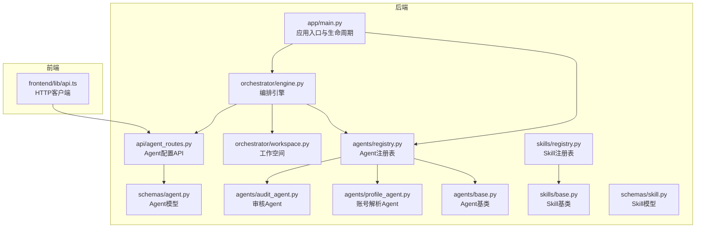
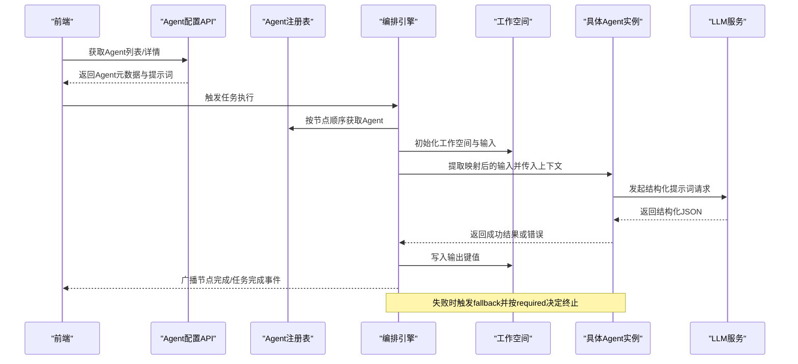
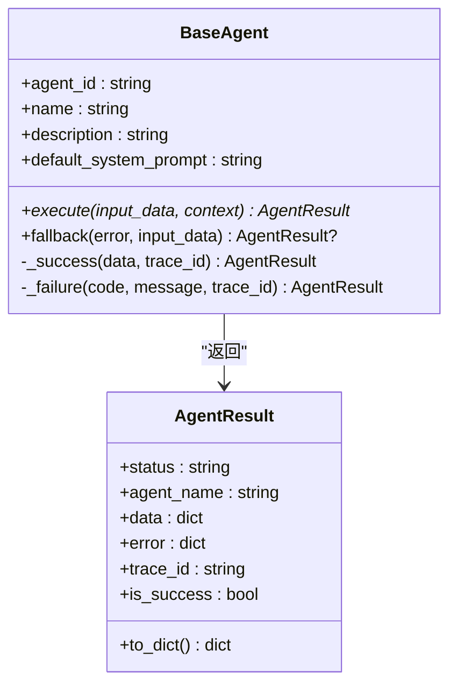
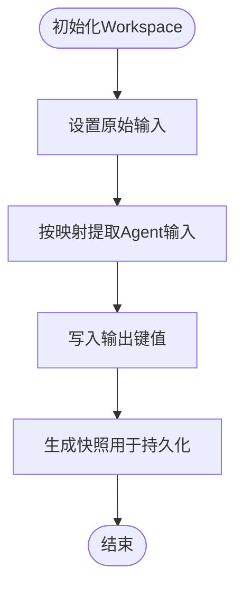
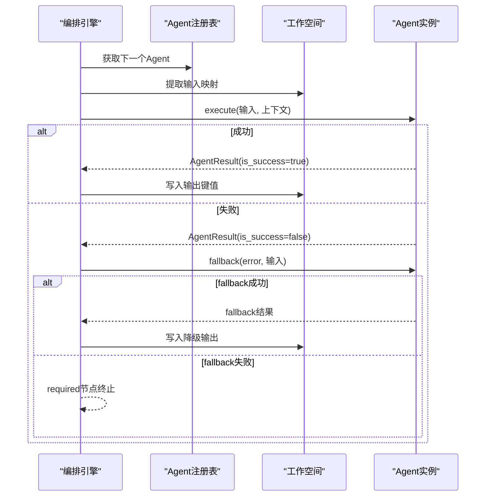
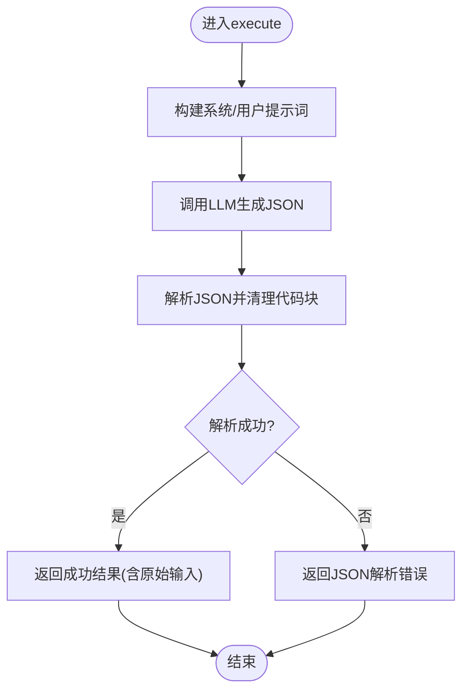
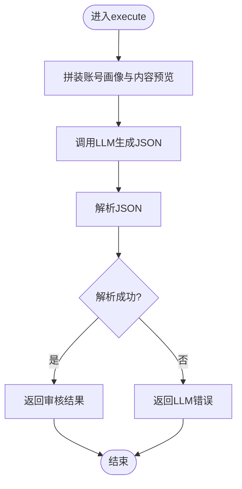
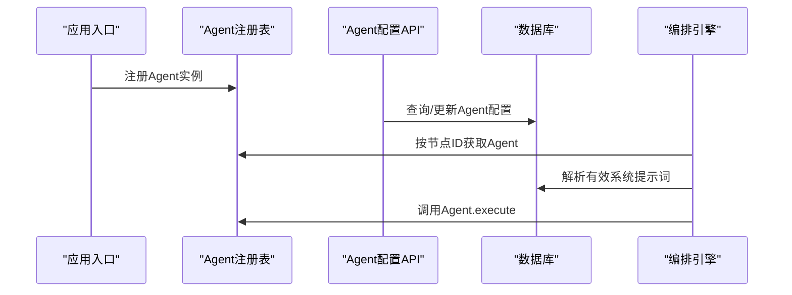
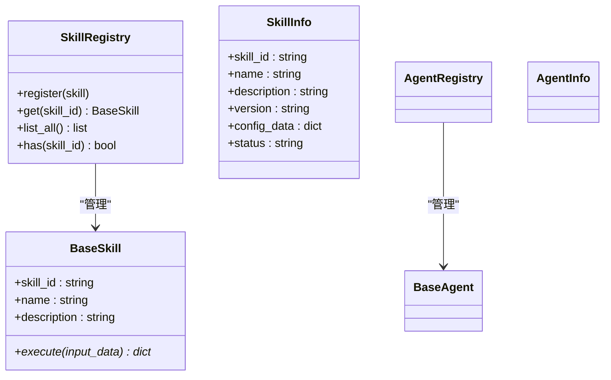
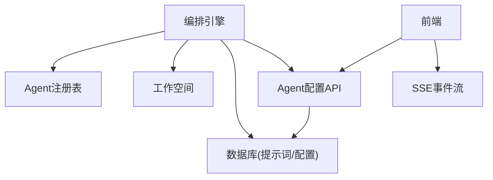

# Agent智能体概念

<cite>
**本文引用的文件**
- [backend/app/agents/base.py](file://backend/app/agents/base.py)
- [backend/app/schemas/agent.py](file://backend/app/schemas/agent.py)
- [backend/app/agents/registry.py](file://backend/app/agents/registry.py)
- [backend/app/orchestrator/workspace.py](file://backend/app/orchestrator/workspace.py)
- [backend/app/api/agent_routes.py](file://backend/app/api/agent_routes.py)
- [backend/app/agents/profile_agent.py](file://backend/app/agents/profile_agent.py)
- [backend/app/agents/audit_agent.py](file://backend/app/agents/audit_agent.py)
- [backend/app/schemas/skill.py](file://backend/app/schemas/skill.py)
- [backend/app/skills/base.py](file://backend/app/skills/base.py)
- [backend/app/skills/registry.py](file://backend/app/skills/registry.py)
- [backend/app/main.py](file://backend/app/main.py)
- [backend/app/orchestrator/engine.py](file://backend/app/orchestrator/engine.py)
- [frontend/lib/api.ts](file://frontend/lib/api.ts)
</cite>

## 目录
1. [引言](#引言)
2. [项目结构](#项目结构)
3. [核心组件](#核心组件)
4. [架构总览](#架构总览)
5. [详细组件分析](#详细组件分析)
6. [依赖分析](#依赖分析)
7. [性能考虑](#性能考虑)
8. [故障排查指南](#故障排查指南)
9. [结论](#结论)
10. [附录](#附录)

## 引言
本文件围绕HotClaw项目的Agent智能体概念展开，系统阐述“有角色、有上下文、有决策能力”的执行单元定义，并对比Agent与Skill的职责边界：前者是有状态的业务决策节点，后者是无状态的原子工具能力。文档从抽象到具体，结合账号解析、热点分析、选题策划等典型Agent实现，说明其结构化输入输出、依赖关系与执行流程；同时给出降级策略与fallback机制、注册与配置管理、以及动态调用的完整流程，帮助开发者把握Agent在整个系统架构中的核心地位。

## 项目结构
HotClaw采用前后端分离的多模块组织方式：
- 后端（Python/FastAPI）：包含Agent与Skill的抽象基类、注册表、工作空间、编排引擎、API路由与数据库模型等。
- 前端（Next.js）：提供Agent与Skill的配置与状态展示、任务流式输出订阅等交互界面。

下图展示与Agent相关的关键模块与文件：

图表来源
- [backend/app/main.py:34-42](file://backend/app/main.py#L34-L42)
- [backend/app/orchestrator/engine.py:89-285](file://backend/app/orchestrator/engine.py#L89-L285)
- [backend/app/orchestrator/workspace.py:12-53](file://backend/app/orchestrator/workspace.py#L12-L53)
- [backend/app/agents/registry.py:10-40](file://backend/app/agents/registry.py#L10-L40)
- [backend/app/agents/base.py:49-99](file://backend/app/agents/base.py#L49-L99)
- [backend/app/agents/profile_agent.py:12-102](file://backend/app/agents/profile_agent.py#L12-L102)
- [backend/app/agents/audit_agent.py:12-141](file://backend/app/agents/audit_agent.py#L12-L141)
- [backend/app/api/agent_routes.py:17-115](file://backend/app/api/agent_routes.py#L17-L115)
- [backend/app/schemas/agent.py:6-29](file://backend/app/schemas/agent.py#L6-L29)
- [backend/app/skills/base.py:16-37](file://backend/app/skills/base.py#L16-L37)
- [backend/app/skills/registry.py:10-37](file://backend/app/skills/registry.py#L10-L37)
- [backend/app/schemas/skill.py:6-22](file://backend/app/schemas/skill.py#L6-L22)
- [frontend/lib/api.ts:57-89](file://frontend/lib/api.ts#L57-L89)

章节来源
- [backend/app/main.py:34-42](file://backend/app/main.py#L34-L42)
- [backend/app/orchestrator/engine.py:31-86](file://backend/app/orchestrator/engine.py#L31-L86)
- [backend/app/orchestrator/workspace.py:12-53](file://backend/app/orchestrator/workspace.py#L12-L53)
- [backend/app/agents/registry.py:10-40](file://backend/app/agents/registry.py#L10-L40)
- [backend/app/api/agent_routes.py:17-115](file://backend/app/api/agent_routes.py#L17-L115)
- [frontend/lib/api.ts:57-89](file://frontend/lib/api.ts#L57-L89)

## 核心组件
本节聚焦Agent的抽象定义、属性特征与运行时契约，以及与Skill的职责差异。

- Agent抽象与结果封装
  - 抽象基类定义了统一的执行接口与标准化返回结构，确保所有Agent具备一致的输入输出与错误处理语义。
  - 结果对象包含状态、名称、数据、错误与追踪ID，便于可观测性与调试。

- Agent属性特征
  - agent_id：唯一标识符，用于注册表检索与API路由。
  - name：人类可读名称。
  - description：简要描述。
  - default_system_prompt：默认系统提示词，作为LLM推理的上下文基线。
  - 其他常用配置：模型参数、提示模板、重试配置等可通过配置API动态更新。

- Agent与Skill的区别
  - Agent：有状态（在工作空间内共享上下文）、承担业务决策、可调用Skill、可降级回退。
  - Skill：无状态、原子工具、稳定可复用、不参与编排。

章节来源
- [backend/app/agents/base.py:49-99](file://backend/app/agents/base.py#L49-L99)
- [backend/app/schemas/agent.py:6-29](file://backend/app/schemas/agent.py#L6-L29)
- [backend/app/skills/base.py:16-37](file://backend/app/skills/base.py#L16-L37)
- [backend/app/schemas/skill.py:6-22](file://backend/app/schemas/skill.py#L6-L22)

## 架构总览
下图展示了从任务创建到Agent编排执行的全链路流程，强调Agent在工作空间内的状态流转与降级策略。

图表来源
- [backend/app/api/agent_routes.py:17-115](file://backend/app/api/agent_routes.py#L17-L115)
- [backend/app/agents/registry.py:23-28](file://backend/app/agents/registry.py#L23-L28)
- [backend/app/orchestrator/engine.py:92-234](file://backend/app/orchestrator/engine.py#L92-L234)
- [backend/app/orchestrator/workspace.py:15-53](file://backend/app/orchestrator/workspace.py#L15-L53)
- [backend/app/agents/base.py:64-82](file://backend/app/agents/base.py#L64-L82)

## 详细组件分析

### Agent抽象与结果模型
- 抽象基类提供统一的execute接口与标准化结果封装，支持成功/失败两种路径，并内置便捷构造器。
- 结果对象包含状态码、错误码与追踪ID，便于跨服务溯源。

图表来源
- [backend/app/agents/base.py:49-99](file://backend/app/agents/base.py#L49-L99)

章节来源
- [backend/app/agents/base.py:49-99](file://backend/app/agents/base.py#L49-L99)

### 工作空间（Workspace）
- 以任务为作用域的上下文容器，支持读写、快照与按映射提取输入。
- 通过输入映射将上一节点输出或原始输入安全地注入到当前Agent的输入结构中。

图表来源
- [backend/app/orchestrator/workspace.py:15-53](file://backend/app/orchestrator/workspace.py#L15-L53)

章节来源
- [backend/app/orchestrator/workspace.py:12-53](file://backend/app/orchestrator/workspace.py#L12-L53)

### 编排引擎（OrchestratorEngine）
- 默认线性工作流节点定义了典型的内容生产链路：账号解析 → 热点分析 → 选题策划 → 标题生成 → 正文生成 → 审核评估。
- 执行时序：
  - 为每个节点创建运行记录并广播开始事件；
  - 从工作空间提取输入映射；
  - 获取有效系统提示词（优先DB自定义，其次默认）；
  - 在超时控制下调用Agent.execute；
  - 成功则写入工作空间，失败则尝试fallback，必要时终止并上报错误。

图表来源
- [backend/app/orchestrator/engine.py:92-234](file://backend/app/orchestrator/engine.py#L92-L234)
- [backend/app/orchestrator/engine.py:31-86](file://backend/app/orchestrator/engine.py#L31-L86)
- [backend/app/agents/base.py:77-82](file://backend/app/agents/base.py#L77-L82)

章节来源
- [backend/app/orchestrator/engine.py:89-285](file://backend/app/orchestrator/engine.py#L89-L285)

### Agent实现示例：账号解析Agent
- 角色与职责：将用户提供的账号定位描述解析为结构化画像，输出领域、受众、调性、风格与关键词等字段。
- 输入输出：输入为positioning字符串，输出为结构化JSON；保留原始输入以便审计与溯源。
- 错误处理：JSON解析失败与LLM调用异常分别映射到不同错误码；提供降级回退，保证系统可用性。

图表来源
- [backend/app/agents/profile_agent.py:43-78](file://backend/app/agents/profile_agent.py#L43-L78)
- [backend/app/agents/profile_agent.py:79-91](file://backend/app/agents/profile_agent.py#L79-L91)
- [backend/app/agents/profile_agent.py:92-102](file://backend/app/agents/profile_agent.py#L92-L102)

章节来源
- [backend/app/agents/profile_agent.py:12-102](file://backend/app/agents/profile_agent.py#L12-L102)

### Agent实现示例：审核Agent
- 角色与职责：对候选标题与正文进行合规性审核与质量评估，输出通过与否、风险等级、问题清单与综合评价。
- 输入输出：输入包含账号画像、候选标题与正文内容；输出为结构化审核报告。
- 降级策略：当服务异常时返回“建议人工复核”的降级结果，避免阻塞整个工作流。

图表来源
- [backend/app/agents/audit_agent.py:53-86](file://backend/app/agents/audit_agent.py#L53-L86)
- [backend/app/agents/audit_agent.py:134-141](file://backend/app/agents/audit_agent.py#L134-L141)

章节来源
- [backend/app/agents/audit_agent.py:12-141](file://backend/app/agents/audit_agent.py#L12-L141)

### Agent注册、配置管理与动态调用
- 注册：应用启动时将各Agent实例注册到全局注册表，后续由编排引擎按节点ID检索。
- 配置管理：通过Agent配置API查询与更新模型参数、提示模板与重试策略；支持DB持久化与默认回退。
- 动态调用：编排引擎在执行前解析有效系统提示词，按输入映射提取Agent输入，调用execute并在超时与异常时进行降级与终止。

图表来源
- [backend/app/main.py:34-42](file://backend/app/main.py#L34-L42)
- [backend/app/agents/registry.py:16-21](file://backend/app/agents/registry.py#L16-L21)
- [backend/app/api/agent_routes.py:46-115](file://backend/app/api/agent_routes.py#L46-L115)
- [backend/app/orchestrator/engine.py:140-147](file://backend/app/orchestrator/engine.py#L140-L147)

章节来源
- [backend/app/main.py:34-42](file://backend/app/main.py#L34-L42)
- [backend/app/api/agent_routes.py:17-115](file://backend/app/api/agent_routes.py#L17-L115)
- [backend/app/orchestrator/engine.py:92-234](file://backend/app/orchestrator/engine.py#L92-L234)

### Agent与Skill的关系
- Agent有状态、可调用Skill、可降级、参与编排；Skill无状态、原子能力、稳定可复用。
- 注册表与模型结构分别承载Agent与Skill的元数据与配置。

图表来源
- [backend/app/skills/base.py:16-37](file://backend/app/skills/base.py#L16-L37)
- [backend/app/skills/registry.py:10-37](file://backend/app/skills/registry.py#L10-L37)
- [backend/app/schemas/skill.py:6-22](file://backend/app/schemas/skill.py#L6-L22)
- [backend/app/agents/registry.py:10-40](file://backend/app/agents/registry.py#L10-L40)
- [backend/app/schemas/agent.py:6-29](file://backend/app/schemas/agent.py#L6-L29)

章节来源
- [backend/app/skills/base.py:16-37](file://backend/app/skills/base.py#L16-L37)
- [backend/app/skills/registry.py:10-37](file://backend/app/skills/registry.py#L10-L37)
- [backend/app/schemas/skill.py:6-22](file://backend/app/schemas/skill.py#L6-L22)
- [backend/app/agents/registry.py:10-40](file://backend/app/agents/registry.py#L10-L40)
- [backend/app/schemas/agent.py:6-29](file://backend/app/schemas/agent.py#L6-L29)

## 依赖分析
- 组件耦合
  - 编排引擎强依赖注册表与工作空间，弱依赖数据库（仅用于提示词解析与持久化）。
  - Agent基类与具体Agent实现之间为松耦合的继承关系。
  - 前端通过HTTP客户端调用后端API，不直接依赖后端内部实现。
- 外部依赖
  - LLM调用通过统一的配置与超时控制，便于替换与扩展。
  - SSE事件通过广播器向前端推送节点与任务状态。

图表来源
- [backend/app/orchestrator/engine.py:18-27](file://backend/app/orchestrator/engine.py#L18-L27)
- [backend/app/api/agent_routes.py:17-115](file://backend/app/api/agent_routes.py#L17-L115)
- [frontend/lib/api.ts:48-55](file://frontend/lib/api.ts#L48-L55)

章节来源
- [backend/app/orchestrator/engine.py:89-285](file://backend/app/orchestrator/engine.py#L89-L285)
- [backend/app/api/agent_routes.py:17-115](file://backend/app/api/agent_routes.py#L17-L115)
- [frontend/lib/api.ts:48-55](file://frontend/lib/api.ts#L48-L55)

## 性能考虑
- 超时控制：编排引擎对单节点执行设置超时阈值，避免长尾阻塞。
- Token统计：累积提示与补全token，辅助成本与性能监控。
- 输入裁剪：审核Agent对正文内容进行长度限制，防止超出token上限。
- 降级策略：在非必需节点出现异常时，优先返回降级结果以保障整体吞吐。

章节来源
- [backend/app/orchestrator/engine.py:236-243](file://backend/app/orchestrator/engine.py#L236-L243)
- [backend/app/orchestrator/engine.py:211-216](file://backend/app/orchestrator/engine.py#L211-L216)
- [backend/app/agents/audit_agent.py:111-115](file://backend/app/agents/audit_agent.py#L111-L115)

## 故障排查指南
- Agent执行失败
  - 检查Agent返回的错误码与消息，确认是否触发fallback。
  - 若为必需节点且无fallback，编排引擎会终止任务并上报错误。
- LLM调用异常
  - 核对模型名、API密钥与基础URL配置；检查网络连通性与超时设置。
- 配置问题
  - 通过Agent配置API确认DB中的自定义提示词与模型参数是否生效。
- 前端事件流
  - 使用SSE URL订阅任务事件，观察节点开始/完成与错误广播。

章节来源
- [backend/app/orchestrator/engine.py:154-175](file://backend/app/orchestrator/engine.py#L154-L175)
- [backend/app/api/agent_routes.py:74-115](file://backend/app/api/agent_routes.py#L74-L115)
- [frontend/lib/api.ts:48-55](file://frontend/lib/api.ts#L48-L55)

## 结论
Agent是HotClaw内容生产流水线的核心执行单元：它在工作空间内持有上下文、承担业务决策、可调用Skill并具备降级能力。通过统一的抽象基类、注册表与编排引擎，系统实现了可配置、可观测、可扩展的多Agent协作模式。配合前端的配置与事件订阅能力，开发者可以高效地设计、调试与运维Agent工作流。

## 附录
- 关键API与类型
  - Agent配置API：列出Agent、获取详情、更新配置。
  - 前端HTTP客户端：封装Agent与Skill的查询与更新请求。
- 典型Agent节点
  - 账号解析、热点分析、选题策划、标题生成、正文生成、审核评估。

章节来源
- [backend/app/api/agent_routes.py:17-115](file://backend/app/api/agent_routes.py#L17-L115)
- [frontend/lib/api.ts:57-89](file://frontend/lib/api.ts#L57-L89)
- [backend/app/orchestrator/engine.py:31-86](file://backend/app/orchestrator/engine.py#L31-L86)