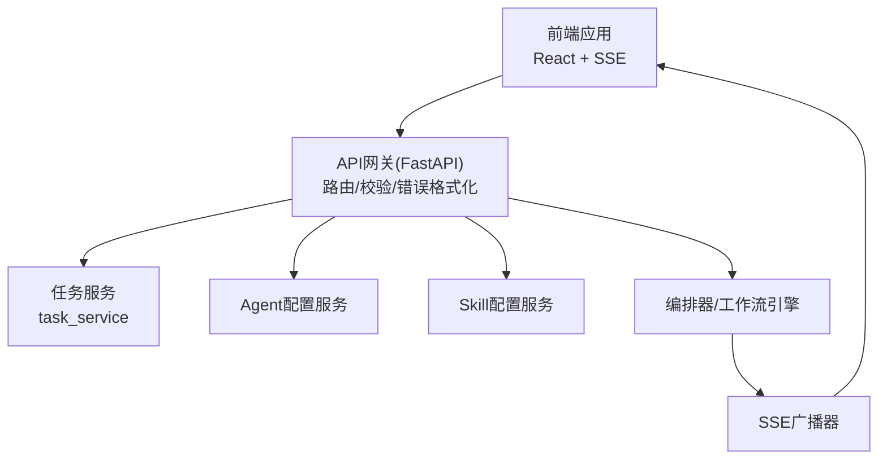
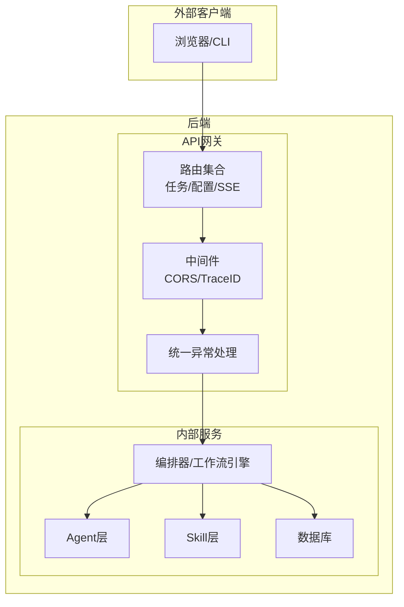
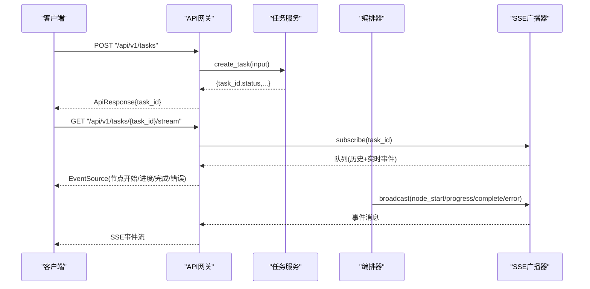
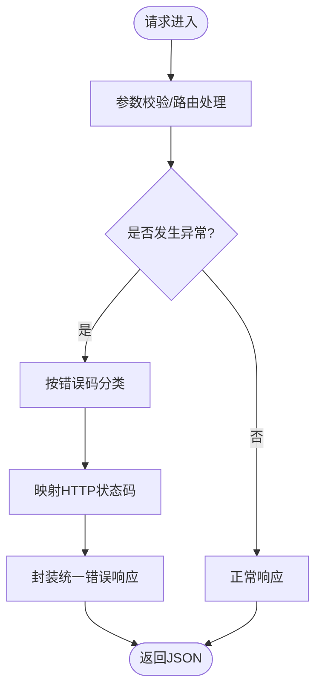
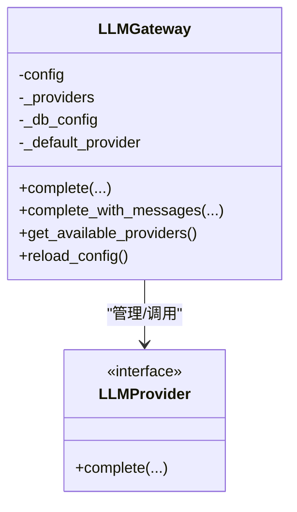
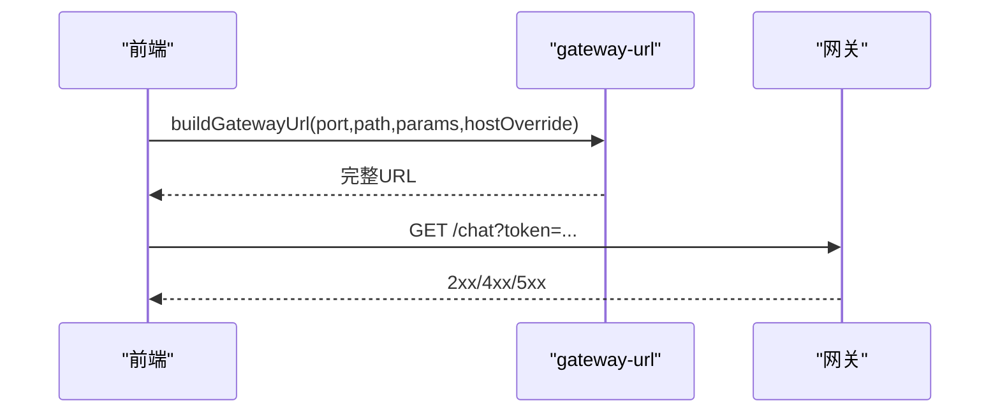
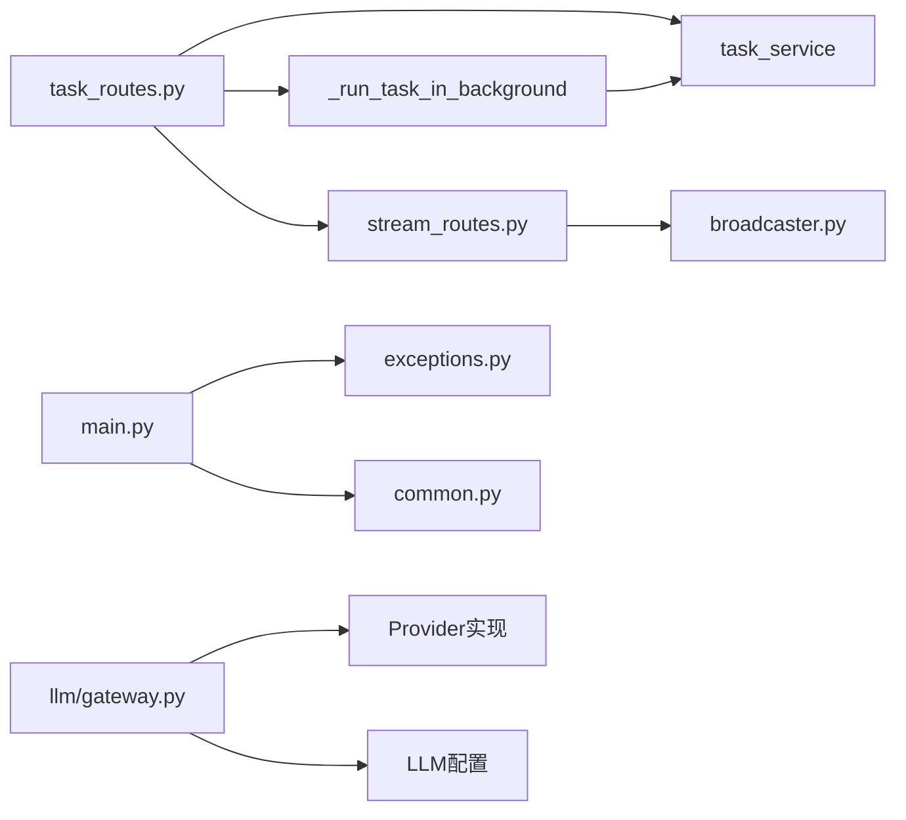

# Gateway网关概念

<cite>
**本文引用的文件**
- [ARCHITECTURE.md](file://ARCHITECTURE.md)
- [main.py](file://backend/app/main.py)
- [task_routes.py](file://backend/app/api/task_routes.py)
- [stream_routes.py](file://backend/app/api/stream_routes.py)
- [agent_routes.py](file://backend/app/api/agent_routes.py)
- [skill_routes.py](file://backend/app/api/skill_routes.py)
- [common.py](file://backend/app/schemas/common.py)
- [exceptions.py](file://backend/app/core/exceptions.py)
- [gateway.py](file://backend/app/llm/gateway.py)
- [broadcaster.py](file://backend/app/orchestrator/broadcaster.py)
- [useTaskSSE.ts](file://frontend/hooks/useTaskSSE.ts)
- [gateway-url.ts](file://OpenClaw-bot-review-main/lib/gateway-url.ts)
- [route.ts](file://OpenClaw-bot-review-main/app/api/test-session/route.ts)
- [route.ts](file://OpenClaw-bot-review-main/app/api/test-sessions/route.ts)
- [route.ts](file://OpenClaw-bot-review-main/app/api/gateway-health/route.ts)
</cite>

## 目录
1. [引言](#引言)
2. [项目结构](#项目结构)
3. [核心组件](#核心组件)
4. [架构总览](#架构总览)
5. [详细组件分析](#详细组件分析)
6. [依赖分析](#依赖分析)
7. [性能考量](#性能考量)
8. [故障排查指南](#故障排查指南)
9. [结论](#结论)
10. [附录](#附录)

## 引言
本文件围绕HotClaw项目的Gateway（网关）概念展开，系统阐述其作为“系统对外唯一入口”的职责与价值：统一路由、参数校验、错误格式化、鉴权与限流的前置处理，以及与内部服务的交互模式（请求转发、响应聚合、异常转换）。同时结合项目实际的FastAPI路由层、SSE事件流、统一异常处理与LLM网关等实现，给出可操作的设计原则、安全考虑与性能优化建议。

## 项目结构
HotClaw采用前后端分离架构：前端通过HTTP + SSE与后端交互；后端以FastAPI为核心，Gateway即路由层，负责接收请求、参数校验、统一错误响应与SSE事件分发；内部服务（编排器、Agent、Skill等）通过标准协议协作，不直接暴露给外部。



图表来源
- [main.py:69-147](file://backend/app/main.py#L69-L147)
- [task_routes.py:16-67](file://backend/app/api/task_routes.py#L16-L67)
- [stream_routes.py:14-42](file://backend/app/api/stream_routes.py#L14-L42)
- [broadcaster.py:11-98](file://backend/app/orchestrator/broadcaster.py#L11-L98)

章节来源
- [ARCHITECTURE.md:37-78](file://ARCHITECTURE.md#L37-L78)
- [main.py:69-147](file://backend/app/main.py#L69-L147)

## 核心组件
- API网关（FastAPI路由层）
  - 路由定义：任务、SSE、Agent配置、Skill配置、系统配置等
  - 参数校验：Pydantic模型驱动的输入校验
  - 错误格式化：统一响应包装与HTTP状态映射
  - 中间件：CORS、Trace ID注入
- SSE事件流
  - 广播器：维护订阅队列、历史缓冲、关闭信号与清理
  - 前端：EventSource自动重连与事件监听
- 统一异常体系
  - 分类错误码与HTTP状态映射，保证错误响应一致性
- LLM网关
  - Provider路由与选择、配置来源（数据库优先）、请求日志与追踪、异常转换

章节来源
- [task_routes.py:16-67](file://backend/app/api/task_routes.py#L16-L67)
- [stream_routes.py:14-42](file://backend/app/api/stream_routes.py#L14-L42)
- [common.py:7-27](file://backend/app/schemas/common.py#L7-L27)
- [exceptions.py:4-125](file://backend/app/core/exceptions.py#L4-L125)
- [broadcaster.py:11-98](file://backend/app/orchestrator/broadcaster.py#L11-L98)
- [gateway.py:24-440](file://backend/app/llm/gateway.py#L24-L440)

## 架构总览
Gateway在系统中的关键作用：
- 唯一入口：所有外部请求经由FastAPI路由进入，隐藏内部服务细节
- 协议标准化：统一HTTP + SSE接口协议，便于前端消费
- 边界与安全：前置鉴权、限流、参数校验与错误格式化，降低内部耦合



图表来源
- [main.py:69-147](file://backend/app/main.py#L69-L147)
- [ARCHITECTURE.md:49-59](file://ARCHITECTURE.md#L49-L59)

## 详细组件分析

### 组件A：任务路由与SSE事件流
- 任务路由
  - 创建任务：接收输入、创建任务记录、启动后台执行任务
  - 查询任务：状态、详情、节点执行记录、分页列表
- SSE事件流
  - 订阅/取消订阅：广播器管理每个task_id的订阅队列
  - 事件缓冲：历史事件重放，解决前端连接滞后问题
  - 关闭与清理：任务结束发送哨兵信号并延迟清理历史



图表来源
- [task_routes.py:39-67](file://backend/app/api/task_routes.py#L39-L67)
- [stream_routes.py:14-42](file://backend/app/api/stream_routes.py#L14-L42)
- [broadcaster.py:30-84](file://backend/app/orchestrator/broadcaster.py#L30-L84)

章节来源
- [task_routes.py:16-179](file://backend/app/api/task_routes.py#L16-L179)
- [stream_routes.py:14-42](file://backend/app/api/stream_routes.py#L14-L42)
- [broadcaster.py:11-98](file://backend/app/orchestrator/broadcaster.py#L11-L98)
- [useTaskSSE.ts:118-143](file://frontend/hooks/useTaskSSE.ts#L118-L143)

### 组件B：统一异常处理与错误响应
- 异常分类：用户输入、冲突、外部/执行、配置、系统等
- HTTP状态映射：根据错误码类别映射到4xx/5xx
- 统一响应：ApiResponse/ApiErrorResponse包装，包含code/message/data/details



图表来源
- [main.py:96-138](file://backend/app/main.py#L96-L138)
- [common.py:7-27](file://backend/app/schemas/common.py#L7-L27)
- [exceptions.py:4-125](file://backend/app/core/exceptions.py#L4-L125)

章节来源
- [main.py:96-138](file://backend/app/main.py#L96-L138)
- [common.py:7-27](file://backend/app/schemas/common.py#L7-L27)
- [exceptions.py:4-125](file://backend/app/core/exceptions.py#L4-L125)

### 组件C：Agent/Skill配置路由
- Agent配置：列出、获取、更新（支持自定义prompt、模型配置、重试配置）
- Skill配置：列出、更新（支持动态配置）

```mermaid
classDiagram
class AgentRoutes {
+GET /agents
+GET /agents/{agent_id}
+PUT /agents/{agent_id}/config
}
class SkillRoutes {
+GET /skills
+PUT /skills/{skill_id}/config
}
AgentRoutes --> "使用" AgentRegistry
AgentRoutes --> "使用" DB
SkillRoutes --> "使用" SkillRegistry
SkillRoutes --> "使用" DB
```

图表来源
- [agent_routes.py:17-115](file://backend/app/api/agent_routes.py#L17-L115)
- [skill_routes.py:17-61](file://backend/app/api/skill_routes.py#L17-L61)

章节来源
- [agent_routes.py:17-115](file://backend/app/api/agent_routes.py#L17-L115)
- [skill_routes.py:17-61](file://backend/app/api/skill_routes.py#L17-L61)

### 组件D：LLM网关（与Gateway协同）
- 统一LLM调用入口：Provider路由、配置来源（数据库优先）、请求日志与追踪、异常转换
- 支持多Provider：DashScope、OpenAI、DeepSeek、兼容接口等
- 动态配置与重载：支持数据库配置热更新



图表来源
- [gateway.py:24-440](file://backend/app/llm/gateway.py#L24-L440)

章节来源
- [gateway.py:24-440](file://backend/app/llm/gateway.py#L24-L440)

### 组件E：前端网关URL构建与健康探测
- 网关URL构建：支持主机覆盖、端口、参数拼接
- 健康探测：CLI与Web双通道探测，支持令牌与超时控制
- 会话测试：携带认证头与会话键发起测试请求



图表来源
- [gateway-url.ts:9-31](file://OpenClaw-bot-review-main/lib/gateway-url.ts#L9-L31)
- [route.ts:72-106](file://OpenClaw-bot-review-main/app/api/gateway-health/route.ts#L72-L106)
- [route.ts:1-29](file://OpenClaw-bot-review-main/app/api/test-session/route.ts#L1-L29)
- [route.ts:13-30](file://OpenClaw-bot-review-main/app/api/test-sessions/route.ts#L13-L30)

章节来源
- [gateway-url.ts:9-31](file://OpenClaw-bot-review-main/lib/gateway-url.ts#L9-L31)
- [route.ts:72-106](file://OpenClaw-bot-review-main/app/api/gateway-health/route.ts#L72-L106)
- [route.ts:1-29](file://OpenClaw-bot-review-main/app/api/test-session/route.ts#L1-L29)
- [route.ts:13-30](file://OpenClaw-bot-review-main/app/api/test-sessions/route.ts#L13-L30)

## 依赖分析
- 路由层依赖
  - 服务层：task_service、system_config_service
  - 广播器：SSE事件分发
  - 异常体系：统一错误处理
- SSE依赖
  - 广播器：订阅/取消订阅、历史缓冲、关闭信号
  - 前端：EventSource自动重连与事件监听
- LLM网关依赖
  - Provider实现：多厂商适配
  - 配置：数据库优先、.env回退
  - 日志与追踪：统一埋点



图表来源
- [task_routes.py:22-37](file://backend/app/api/task_routes.py#L22-L37)
- [stream_routes.py:14-42](file://backend/app/api/stream_routes.py#L14-L42)
- [broadcaster.py:30-84](file://backend/app/orchestrator/broadcaster.py#L30-L84)
- [main.py:96-138](file://backend/app/main.py#L96-L138)
- [gateway.py:136-232](file://backend/app/llm/gateway.py#L136-L232)

章节来源
- [task_routes.py:22-37](file://backend/app/api/task_routes.py#L22-L37)
- [stream_routes.py:14-42](file://backend/app/api/stream_routes.py#L14-L42)
- [broadcaster.py:30-84](file://backend/app/orchestrator/broadcaster.py#L30-L84)
- [main.py:96-138](file://backend/app/main.py#L96-L138)
- [gateway.py:136-232](file://backend/app/llm/gateway.py#L136-L232)

## 性能考量
- SSE长连接优化
  - 历史事件缓冲：减少前端重连丢失
  - 心跳保活：定时注释消息维持连接活跃
  - 清理策略：任务结束后延迟清理历史，避免内存泄漏
- 异常处理
  - 统一错误响应：减少前端分支判断开销
  - HTTP状态映射：快速失败，避免无效重试
- LLM调用
  - Provider选择与默认模型：减少不必要的配置查找
  - 动态配置重载：支持在线调整，无需重启
- 中间件
  - CORS放宽：开发期便利，生产需收紧
  - Trace ID：便于端到端追踪与性能分析

## 故障排查指南
- 网关健康探测
  - CLI与Web探测：确认网关端口、令牌与超时设置
  - 返回状态：2xx表示可达，4xx/5xx定位鉴权或服务异常
- SSE连接问题
  - 前端EventSource：自动重连，观察错误回调
  - 广播器：确认订阅队列、历史缓冲与关闭信号
- 统一异常
  - 错误码分类：快速定位问题类型（输入、冲突、执行、系统）
  - HTTP状态映射：依据状态码快速判断（400/404/500等）
- LLM调用
  - Provider可用性：检查初始化日志与可用列表
  - 配置来源：数据库配置优先，确保API Key与默认模型正确

章节来源
- [route.ts:72-106](file://OpenClaw-bot-review-main/app/api/gateway-health/route.ts#L72-L106)
- [useTaskSSE.ts:118-143](file://frontend/hooks/useTaskSSE.ts#L118-L143)
- [broadcaster.py:30-84](file://backend/app/orchestrator/broadcaster.py#L30-L84)
- [main.py:96-138](file://backend/app/main.py#L96-L138)
- [gateway.py:397-421](file://backend/app/llm/gateway.py#L397-L421)

## 结论
Gateway作为HotClaw系统的对外唯一入口，承担了路由、参数校验、错误格式化、鉴权与限流的前置职责，并通过SSE事件流实现与前端的实时交互。其设计遵循“控制平面与执行平面分离”“Gateway唯一入口”等原则，既保证了接口协议的标准化，又隐藏了内部服务细节，提升了系统的可维护性与可扩展性。配合统一异常处理与LLM网关，Gateway在保障稳定性的同时，也为后续的安全加固与性能优化提供了坚实基础。

## 附录
- 设计原则与安全考虑
  - 最小权限：仅暴露必要端点，鉴权令牌与请求头校验
  - 速率限制：在网关层实施简单限流，防止滥用
  - 传输安全：生产环境启用HTTPS与严格CORS
  - 可观测性：Trace ID贯穿请求链路，日志结构化
- 性能优化建议
  - SSE：合理的心跳与缓冲策略，避免频繁连接重建
  - 异常：统一错误响应减少前端分支，提升渲染效率
  - LLM：Provider缓存与默认模型预设，减少初始化开销
  - 中间件：生产收紧CORS与缓存策略，减少跨域开销