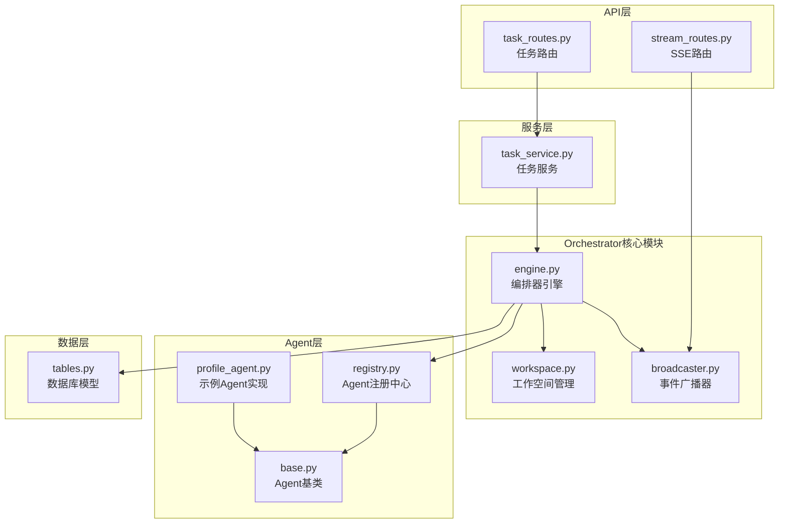
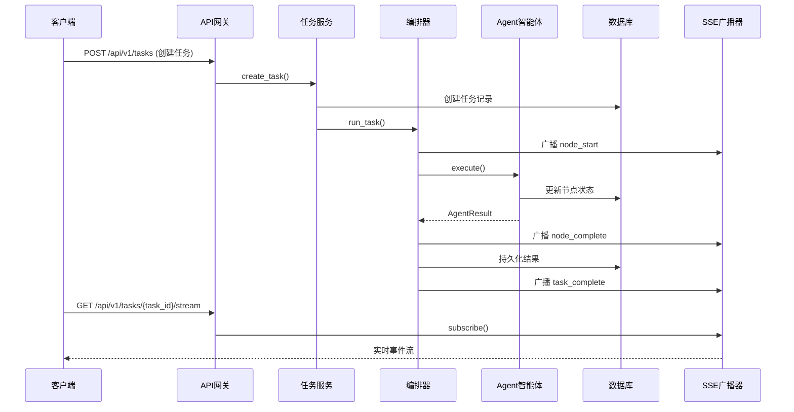
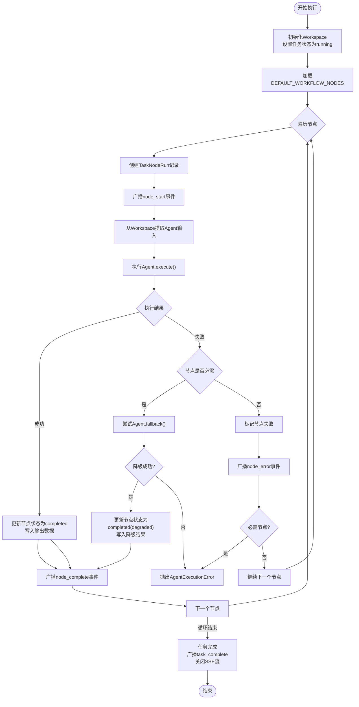
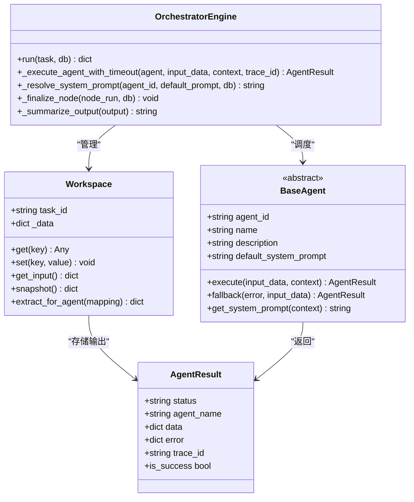
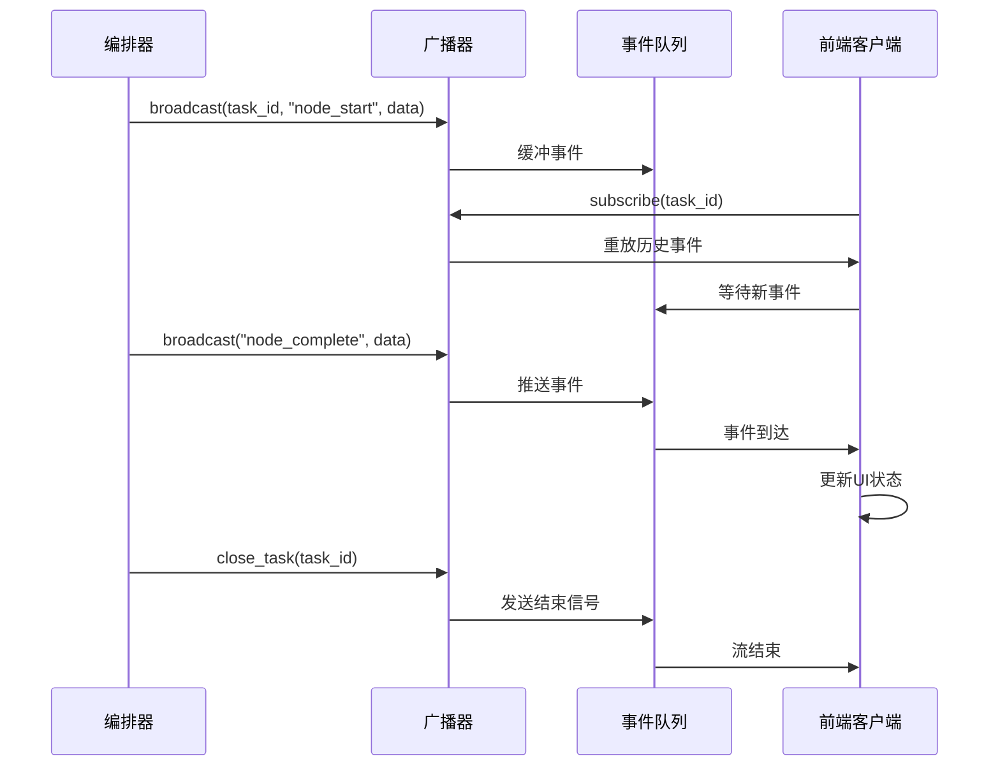
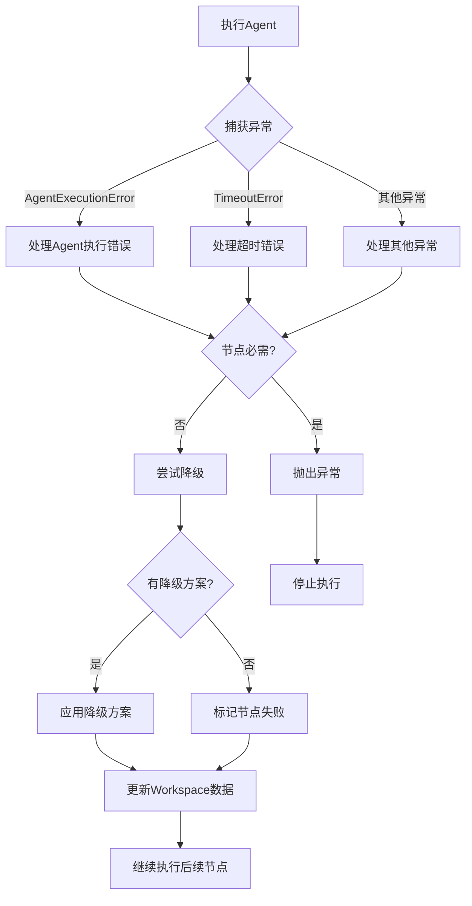
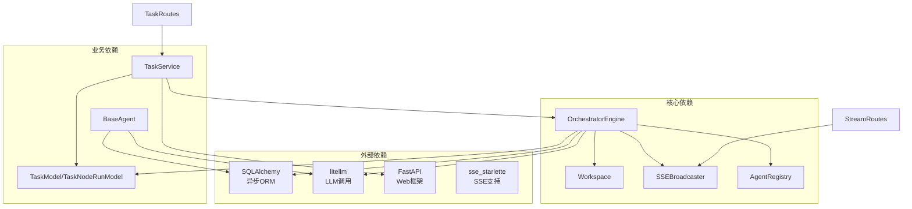

# Orchestrator编排器概念

<cite>
**本文档引用的文件**
- [engine.py](file://backend/app/orchestrator/engine.py)
- [workspace.py](file://backend/app/orchestrator/workspace.py)
- [broadcaster.py](file://backend/app/orchestrator/broadcaster.py)
- [main.py](file://backend/app/main.py)
- [tables.py](file://backend/app/models/tables.py)
- [base.py](file://backend/app/agents/base.py)
- [stream_routes.py](file://backend/app/api/stream_routes.py)
- [task_routes.py](file://backend/app/api/task_routes.py)
- [task_service.py](file://backend/app/services/task_service.py)
- [profile_agent.py](file://backend/app/agents/profile_agent.py)
- [registry.py](file://backend/app/agents/registry.py)
- [ARCHITECTURE.md](file://ARCHITECTURE.md)
</cite>

## 目录
1. [引言](#引言)
2. [项目结构](#项目结构)
3. [核心组件](#核心组件)
4. [架构概览](#架构概览)
5. [详细组件分析](#详细组件分析)
6. [依赖关系分析](#依赖关系分析)
7. [性能考量](#性能考量)
8. [故障排除指南](#故障排除指南)
9. [结论](#结论)

## 引言

HotClaw项目中的Orchestrator（编排器）是整个多智能体内容生产平台的核心调度引擎。作为工作流执行引擎，Orchestrator负责读取Workflow定义，按顺序/依赖调度Agent，管理Workspace生命周期，并广播执行状态。它扮演着编辑部"主编"的角色，协调6个Agent智能体的协同工作，从账号定位解析到文章草稿输出的完整内容生产流程。

根据架构文档的定义，Orchestrator具有以下核心特征：
- 工作流执行引擎：读取workflow定义，按顺序/依赖调度agent
- 上下文管理：管理workspace生命周期，确保agent间的数据共享
- 状态广播：通过SSE事件流实时推送执行状态给前端
- 异常处理：提供降级策略，确保单点故障不影响整体流程

## 项目结构

HotClaw项目的Orchestrator相关组件主要分布在backend目录下的orchestrator子模块中：

**图表来源**
- [engine.py:1-285](file://backend/app/orchestrator/engine.py#L1-L285)
- [workspace.py:1-53](file://backend/app/orchestrator/workspace.py#L1-L53)
- [broadcaster.py:1-99](file://backend/app/orchestrator/broadcaster.py#L1-L99)

**章节来源**
- [engine.py:1-285](file://backend/app/orchestrator/engine.py#L1-L285)
- [workspace.py:1-53](file://backend/app/orchestrator/workspace.py#L1-L53)
- [broadcaster.py:1-99](file://backend/app/orchestrator/broadcaster.py#L1-L99)

## 核心组件

### OrchestratorEngine（编排器引擎）

OrchestratorEngine是编排器的核心执行组件，负责整个工作流的调度和管理。其主要职责包括：

- **工作流加载**：从DEFAULT_WORKFLOW_NODES中读取预定义的执行计划
- **Agent调度**：按顺序调用各个Agent，管理执行顺序和依赖关系
- **状态管理**：跟踪每个节点的执行状态，维护TaskNodeRunModel记录
- **异常处理**：实现降级策略，处理Agent执行失败的情况
- **结果收集**：汇总所有Agent的输出，形成最终结果

### Workspace（工作空间）

Workspace作为任务执行的上下文容器，提供agent间的数据共享机制：

- **数据隔离**：每个任务创建独立的workspace实例
- **数据读写**：提供get/set方法管理workspace数据
- **输入提取**：支持基于映射的输入数据提取
- **快照功能**：支持完整的数据快照用于持久化

### SSEBroadcaster（SSE广播器）

SSEBroadcaster实现了事件驱动的执行模型，通过Server-Sent Events向前端推送实时状态：

- **订阅管理**：维护每个task_id的订阅队列
- **事件缓冲**：支持历史事件重放，解决前端连接时机问题
- **流控制**：提供任务结束信号和内存清理机制
- **格式化输出**：将事件数据格式化为SSE标准格式

**章节来源**
- [engine.py:89-285](file://backend/app/orchestrator/engine.py#L89-L285)
- [workspace.py:12-53](file://backend/app/orchestrator/workspace.py#L12-L53)
- [broadcaster.py:11-99](file://backend/app/orchestrator/broadcaster.py#L11-L99)

## 架构概览

HotClaw的Orchestrator采用事件驱动的架构模式，实现了控制平面与执行平面的分离：

**图表来源**
- [task_routes.py:39-67](file://backend/app/api/task_routes.py#L39-L67)
- [task_service.py:39-64](file://backend/app/services/task_service.py#L39-L64)
- [engine.py:92-234](file://backend/app/orchestrator/engine.py#L92-L234)
- [stream_routes.py:14-42](file://backend/app/api/stream_routes.py#L14-L42)

## 详细组件分析

### 编排器执行机制

OrchestratorEngine的执行机制体现了线性工作流的典型特征：

**图表来源**
- [engine.py:92-234](file://backend/app/orchestrator/engine.py#L92-L234)

#### Agent调度策略

Orchestrator采用严格的线性调度策略，确保执行的确定性和可审计性：

- **顺序执行**：严格按照DEFAULT_WORKFLOW_NODES中的定义顺序执行
- **依赖管理**：通过input_mapping确保数据依赖关系得到满足
- **超时控制**：每个Agent执行都有超时保护机制
- **降级策略**：非必需节点失败时提供降级选项

#### Workspace数据流管理

Workspace作为数据交换中心，实现了agent间的解耦：

**图表来源**
- [workspace.py:12-53](file://backend/app/orchestrator/workspace.py#L12-L53)
- [base.py:18-99](file://backend/app/agents/base.py#L18-L99)
- [engine.py:89-285](file://backend/app/orchestrator/engine.py#L89-L285)

**章节来源**
- [engine.py:92-234](file://backend/app/orchestrator/engine.py#L92-L234)
- [workspace.py:12-53](file://backend/app/orchestrator/workspace.py#L12-L53)
- [base.py:18-99](file://backend/app/agents/base.py#L18-L99)

### 事件广播机制

SSEBroadcaster实现了完整的事件驱动架构，支持实时状态更新：

**图表来源**
- [broadcaster.py:57-84](file://backend/app/orchestrator/broadcaster.py#L57-L84)
- [stream_routes.py:18-41](file://backend/app/api/stream_routes.py#L18-L41)

#### 事件类型定义

SSE广播器支持以下事件类型：

| 事件类型 | 触发时机 | 数据结构 | 用途 |
|---------|---------|---------|------|
| `node_start` | 节点开始执行 | `{node_id, agent_id, name, index, total, started_at}` | 初始化节点UI状态 |
| `node_progress` | 节点执行进度更新 | `{node_id, progress, elapsed_seconds}` | 更新节点进度条 |
| `node_complete` | 节点执行完成 | `{node_id, agent_id, name, elapsed_seconds, degraded, output_summary}` | 完成节点UI状态 |
| `node_error` | 节点执行失败 | `{node_id, error}` | 显示错误信息 |
| `task_complete` | 任务全部完成 | `{task_id, elapsed_seconds}` | 显示最终结果 |
| `task_error` | 任务级错误 | `{task_id, error}` | 显示任务错误 |

**章节来源**
- [broadcaster.py:11-99](file://backend/app/orchestrator/broadcaster.py#L11-L99)
- [stream_routes.py:14-43](file://backend/app/api/stream_routes.py#L14-L43)

### 异常处理与降级策略

Orchestrator实现了多层次的异常处理机制：

**图表来源**
- [engine.py:176-196](file://backend/app/orchestrator/engine.py#L176-L196)

#### 降级策略实现

每个Agent都可以实现自己的降级策略，Orchestrator会根据节点的必需性决定是否应用降级：

- **必需节点**：失败时抛出异常，中断整个工作流
- **非必需节点**：尝试降级，如果降级成功则继续执行
- **降级失败**：标记节点失败，但不影响其他节点执行

**章节来源**
- [engine.py:154-175](file://backend/app/orchestrator/engine.py#L154-L175)
- [base.py:77-82](file://backend/app/agents/base.py#L77-L82)

## 依赖关系分析

Orchestrator的依赖关系体现了清晰的分层架构：

**图表来源**
- [engine.py:16-26](file://backend/app/orchestrator/engine.py#L16-L26)
- [task_service.py:14-15](file://backend/app/services/task_service.py#L14-L15)
- [tables.py:23-73](file://backend/app/models/tables.py#L23-L73)

### 组件耦合度分析

- **低耦合设计**：OrchestratorEngine与具体Agent实现解耦，通过抽象基类和注册中心实现
- **清晰职责**：每个组件都有明确的职责边界，便于测试和维护
- **可扩展性**：新的Agent可以通过注册机制轻松添加，无需修改核心逻辑

**章节来源**
- [engine.py:18-26](file://backend/app/orchestrator/engine.py#L18-L26)
- [registry.py:10-36](file://backend/app/agents/registry.py#L10-L36)

## 性能考量

### 异步执行优化

Orchestrator采用asyncio实现异步执行，提高了并发性能：

- **异步Agent调用**：使用`asyncio.wait_for`实现超时控制
- **异步数据库操作**：基于SQLAlchemy异步会话，避免阻塞
- **异步事件广播**：SSE广播器使用asyncio.Queue实现高效事件传递

### 内存管理策略

- **事件缓冲限制**：SSE广播器为每个task_id维护事件历史，但提供60秒的清理机制
- **任务状态清理**：任务完成后及时释放内存资源
- **数据库连接池**：使用异步连接池管理数据库连接

### 扩展性考虑

- **Agent并发限制**：可通过配置调整Agent执行的并发数量
- **工作流扩展**：当前实现为线性工作流，可扩展为DAG工作流
- **监控指标**：可添加执行时间、错误率等监控指标

## 故障排除指南

### 常见问题诊断

#### Agent执行失败

**症状**：节点状态显示failed，前端显示错误信息

**排查步骤**：
1. 检查Agent的fallback方法是否正确实现
2. 验证Agent的输入数据格式是否符合schema
3. 查看Agent的日志输出，定位具体错误原因

**解决方案**：
- 实现适当的降级策略
- 修正Agent的输入数据处理逻辑
- 检查外部依赖（如LLM API）的可用性

#### SSE连接问题

**症状**：前端无法接收实时状态更新

**排查步骤**：
1. 检查SSE广播器的订阅队列状态
2. 验证任务ID的有效性
3. 查看SSE事件的序列化格式

**解决方案**：
- 确保任务ID正确传递
- 检查网络连接和防火墙设置
- 验证SSE事件格式的正确性

#### 数据库连接问题

**症状**：任务状态无法持久化，或查询超时

**排查步骤**：
1. 检查数据库连接字符串配置
2. 验证数据库服务的可用性
3. 查看SQLAlchemy的连接池状态

**解决方案**：
- 修正数据库配置参数
- 检查数据库服务状态
- 调整连接池大小和超时设置

**章节来源**
- [engine.py:176-196](file://backend/app/orchestrator/engine.py#L176-L196)
- [broadcaster.py:30-84](file://backend/app/orchestrator/broadcaster.py#L30-L84)

## 结论

HotClaw项目的Orchestrator编排器展现了现代多智能体系统的最佳实践。通过事件驱动的架构设计、严格的上下文管理和完善的异常处理机制，Orchestrator成功实现了从账号定位解析到文章草稿输出的完整内容生产流程。

### 设计优势

1. **清晰的职责分离**：控制平面与执行平面分离，便于维护和扩展
2. **事件驱动架构**：通过SSE实现实时状态更新，提升用户体验
3. **强健的异常处理**：多层次的降级策略确保系统稳定性
4. **可审计性**：完整的执行记录支持任务回放和问题诊断

### 扩展建议

1. **工作流引擎增强**：从线性工作流扩展到DAG工作流，支持并行执行
2. **监控告警系统**：添加执行指标监控和异常告警机制
3. **配置管理系统**：实现动态配置更新，支持运行时调整
4. **任务重试机制**：实现智能重试策略，提高系统可靠性

Orchestrator作为HotClaw系统的核心组件，为整个多智能体内容生产平台提供了稳定可靠的执行基础，是实现"从账号定位到文章草稿"全链路自动化的重要保障。