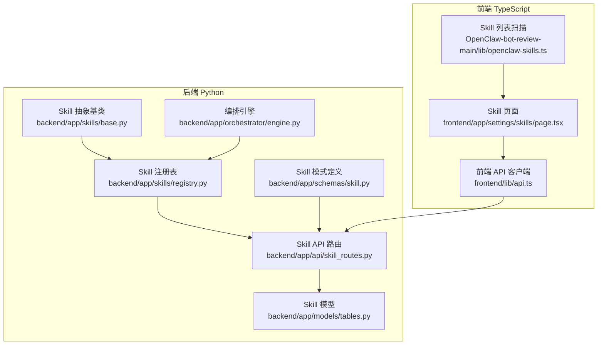
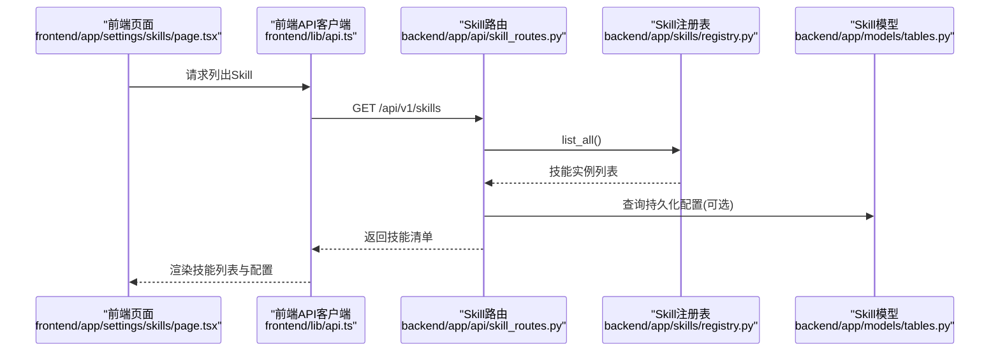
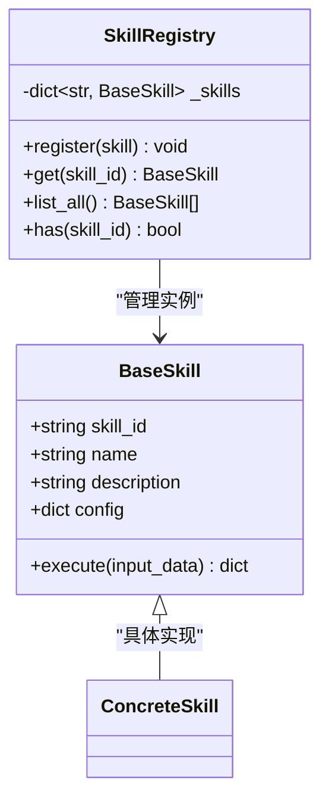
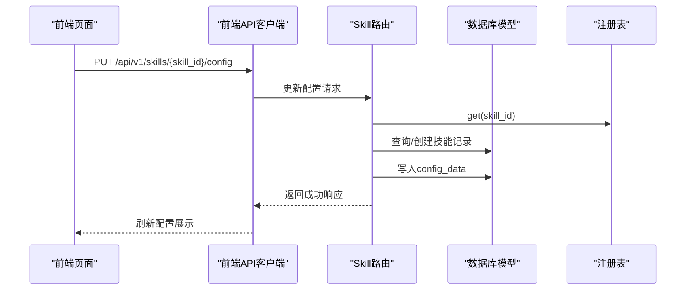
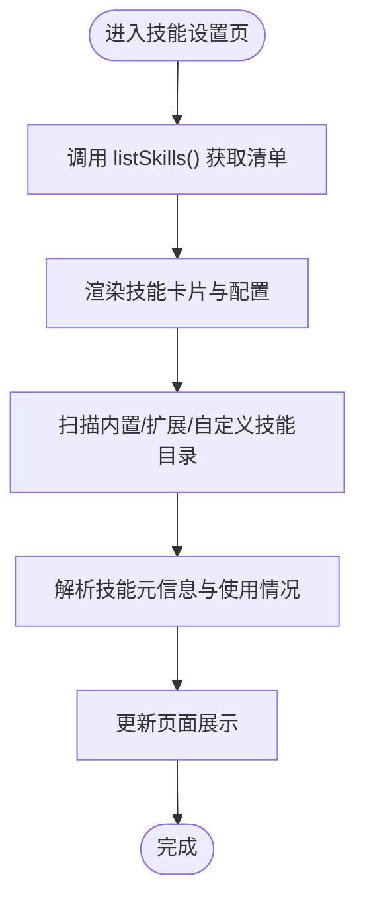
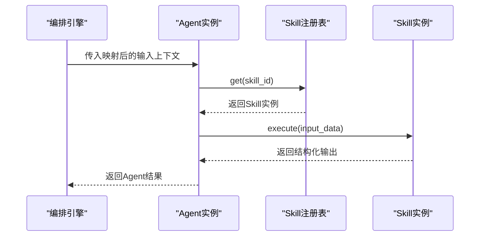
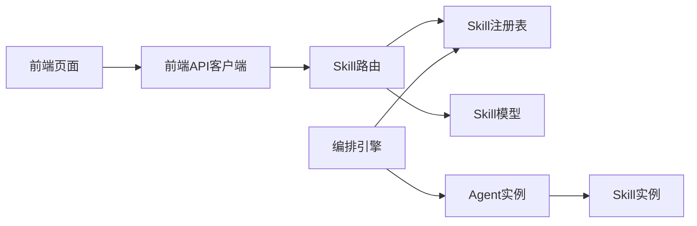

# Skill技能概念

<cite>
**本文引用的文件**
- [backend/app/schemas/skill.py](file://backend/app/schemas/skill.py)
- [backend/app/skills/base.py](file://backend/app/skills/base.py)
- [backend/app/skills/registry.py](file://backend/app/skills/registry.py)
- [backend/app/api/skill_routes.py](file://backend/app/api/skill_routes.py)
- [backend/app/models/tables.py](file://backend/app/models/tables.py)
- [backend/app/orchestrator/engine.py](file://backend/app/orchestrator/engine.py)
- [frontend/app/settings/skills/page.tsx](file://frontend/app/settings/skills/page.tsx)
- [frontend/lib/api.ts](file://frontend/lib/api.ts)
- [OpenClaw-bot-review-main/lib/openclaw-skills.ts](file://OpenClaw-bot-review-main/lib/openclaw-skills.ts)
</cite>

## 目录
1. [引言](#引言)
2. [项目结构](#项目结构)
3. [核心组件](#核心组件)
4. [架构总览](#架构总览)
5. [详细组件分析](#详细组件分析)
6. [依赖分析](#依赖分析)
7. [性能考虑](#性能考虑)
8. [故障排查指南](#故障排查指南)
9. [结论](#结论)
10. [附录](#附录)

## 引言
本文件围绕HotClaw项目的Skill（技能）概念进行系统化阐述，目标是帮助开发者建立对Skill作为“无状态的原子能力单元”的统一认知，并掌握其在系统中的职责边界、标准化接口、配置管理、注册与动态加载机制以及调用协议。同时，结合仓库中已有的抽象层与前端页面，给出设计原则、最佳实践与扩展方法，使Skill成为可复用、可治理、可观测的系统基础设施。

## 项目结构
从代码库可见，Skill相关能力横跨后端Python服务、前端TypeScript客户端与前端Next.js页面三部分：
- 后端Python侧提供Skill抽象基类、注册表、API路由与持久化模型；
- 前端TypeScript侧提供Skill清单扫描与展示逻辑；
- 前端Next.js页面负责展示已注册的Skill及其配置状态；
- 前端API客户端封装了与后端的交互协议。

图表来源
- [backend/app/skills/base.py:1-37](file://backend/app/skills/base.py#L1-L37)
- [backend/app/skills/registry.py:1-37](file://backend/app/skills/registry.py#L1-L37)
- [backend/app/api/skill_routes.py:1-61](file://backend/app/api/skill_routes.py#L1-L61)
- [backend/app/models/tables.py:183-200](file://backend/app/models/tables.py#L183-L200)
- [backend/app/schemas/skill.py:1-22](file://backend/app/schemas/skill.py#L1-L22)
- [backend/app/orchestrator/engine.py:89-285](file://backend/app/orchestrator/engine.py#L89-L285)
- [OpenClaw-bot-review-main/lib/openclaw-skills.ts:111-162](file://OpenClaw-bot-review-main/lib/openclaw-skills.ts#L111-L162)
- [frontend/app/settings/skills/page.tsx:1-81](file://frontend/app/settings/skills/page.tsx#L1-L81)
- [frontend/lib/api.ts:91-114](file://frontend/lib/api.ts#L91-L114)

章节来源
- [backend/app/skills/base.py:1-37](file://backend/app/skills/base.py#L1-L37)
- [backend/app/skills/registry.py:1-37](file://backend/app/skills/registry.py#L1-L37)
- [backend/app/api/skill_routes.py:1-61](file://backend/app/api/skill_routes.py#L1-L61)
- [backend/app/models/tables.py:183-200](file://backend/app/models/tables.py#L183-L200)
- [backend/app/schemas/skill.py:1-22](file://backend/app/schemas/skill.py#L1-L22)
- [backend/app/orchestrator/engine.py:89-285](file://backend/app/orchestrator/engine.py#L89-L285)
- [OpenClaw-bot-review-main/lib/openclaw-skills.ts:111-162](file://OpenClaw-bot-review-main/lib/openclaw-skills.ts#L111-L162)
- [frontend/app/settings/skills/page.tsx:1-81](file://frontend/app/settings/skills/page.tsx#L1-L81)
- [frontend/lib/api.ts:91-114](file://frontend/lib/api.ts#L91-L114)

## 核心组件
本节聚焦Skill的核心定义与其在系统中的关键角色与属性。

- 无状态原子能力单元
  - Skill是被Agent调用的“工具型处理单元”，不参与编排流程，不自作业务决策，仅执行稳定且可复用的能力。
  - 这一职责边界在后端注释中有明确说明，强调Skill不是工作流节点，也不参与编排。

- 标准化接口
  - 执行入口：异步execute方法接收结构化输入，返回结构化输出。
  - 配置注入：构造函数接受配置字典，便于运行期按需注入参数。

- 关键属性与模式
  - 后端模式定义包含SkillInfo、SkillListResponse、SkillConfigUpdateRequest等，用于API层的数据契约。
  - 数据模型SkillModel包含技能标识、名称、版本、模块路径、输入/输出/配置模式、状态等字段，支撑持久化与配置管理。

- 与Agent的根本区别
  - Agent负责业务决策与流程控制，Skill负责具体技术操作（API调用、数据处理、规则匹配等），二者通过编排引擎解耦协作。

章节来源
- [backend/app/skills/base.py:16-37](file://backend/app/skills/base.py#L16-L37)
- [backend/app/schemas/skill.py:6-22](file://backend/app/schemas/skill.py#L6-L22)
- [backend/app/models/tables.py:183-200](file://backend/app/models/tables.py#L183-L200)
- [backend/app/orchestrator/engine.py:3-9](file://backend/app/orchestrator/engine.py#L3-L9)

## 架构总览
下图展示了Skill在HotClaw系统中的位置与交互关系：前端页面通过API客户端调用后端Skill API，后端API路由访问注册表获取Skill实例，最终由编排引擎在任务执行链路中调度Agent，Agent再调用Skill完成具体能力执行。

图表来源
- [frontend/app/settings/skills/page.tsx:12-24](file://frontend/app/settings/skills/page.tsx#L12-L24)
- [frontend/lib/api.ts:102-104](file://frontend/lib/api.ts#L102-L104)
- [backend/app/api/skill_routes.py:17-31](file://backend/app/api/skill_routes.py#L17-L31)
- [backend/app/skills/registry.py:28-29](file://backend/app/skills/registry.py#L28-L29)
- [backend/app/models/tables.py:183-200](file://backend/app/models/tables.py#L183-L200)

## 详细组件分析

### Skill抽象基类与注册表
- 抽象基类
  - 定义skill_id、name、description等元信息，以及异步execute接口，确保所有Skill实现遵循统一的调用协议。
- 注册表
  - 提供register/get/list_all/has等方法，集中管理Skill实例，支持按ID检索与存在性检查；当重复注册时记录告警日志。

图表来源
- [backend/app/skills/base.py:16-37](file://backend/app/skills/base.py#L16-L37)
- [backend/app/skills/registry.py:10-37](file://backend/app/skills/registry.py#L10-L37)

章节来源
- [backend/app/skills/base.py:16-37](file://backend/app/skills/base.py#L16-L37)
- [backend/app/skills/registry.py:10-37](file://backend/app/skills/registry.py#L10-L37)

### API路由与配置更新
- 列出技能
  - 通过注册表获取已注册的Skill实例，组装为SkillInfo列表返回。
- 更新技能配置
  - 根据请求体更新数据库中对应技能的配置数据；若不存在则创建新记录，确保配置持久化。

图表来源
- [frontend/lib/api.ts:106-114](file://frontend/lib/api.ts#L106-L114)
- [backend/app/api/skill_routes.py:34-61](file://backend/app/api/skill_routes.py#L34-L61)
- [backend/app/models/tables.py:183-200](file://backend/app/models/tables.py#L183-L200)
- [backend/app/skills/registry.py:22-26](file://backend/app/skills/registry.py#L22-L26)

章节来源
- [backend/app/api/skill_routes.py:17-61](file://backend/app/api/skill_routes.py#L17-L61)
- [backend/app/models/tables.py:183-200](file://backend/app/models/tables.py#L183-L200)
- [frontend/lib/api.ts:102-114](file://frontend/lib/api.ts#L102-L114)

### 前端技能清单与扫描
- 列表页面
  - 通过API客户端拉取技能清单，渲染技能名称、ID、版本、状态与配置。
- 扫描逻辑
  - TypeScript侧提供扫描内置、扩展与自定义技能目录的能力，解析技能元信息（如名称、描述、表情符号等），并统计被哪些Agent使用过。

图表来源
- [frontend/app/settings/skills/page.tsx:12-24](file://frontend/app/settings/skills/page.tsx#L12-L24)
- [OpenClaw-bot-review-main/lib/openclaw-skills.ts:111-162](file://OpenClaw-bot-review-main/lib/openclaw-skills.ts#L111-L162)
- [frontend/lib/api.ts:102-104](file://frontend/lib/api.ts#L102-L104)

章节来源
- [frontend/app/settings/skills/page.tsx:1-81](file://frontend/app/settings/skills/page.tsx#L1-L81)
- [OpenClaw-bot-review-main/lib/openclaw-skills.ts:111-162](file://OpenClaw-bot-review-main/lib/openclaw-skills.ts#L111-L162)
- [frontend/lib/api.ts:91-114](file://frontend/lib/api.ts#L91-L114)

### 编排引擎中的Skill调用
- 职责边界
  - 编排引擎负责按顺序执行Agent节点，记录节点运行日志与追踪ID，但不直接调用Skill。
- 能力执行
  - 在Agent内部，通过注册表获取具体Skill实例并调用其execute方法，完成原子能力执行；若Agent失败可触发降级策略或报错。

图表来源
- [backend/app/orchestrator/engine.py:137-176](file://backend/app/orchestrator/engine.py#L137-L176)
- [backend/app/skills/registry.py:22-26](file://backend/app/skills/registry.py#L22-L26)
- [backend/app/skills/base.py:26-36](file://backend/app/skills/base.py#L26-L36)

章节来源
- [backend/app/orchestrator/engine.py:89-285](file://backend/app/orchestrator/engine.py#L89-L285)
- [backend/app/skills/registry.py:10-37](file://backend/app/skills/registry.py#L10-L37)
- [backend/app/skills/base.py:16-37](file://backend/app/skills/base.py#L16-L37)

### 具体实现示例（基于现有抽象）
以下示例以“新闻抓取”“摘要”“风险检测”“标题评分”为例，说明如何基于BaseSkill实现标准化输入输出与配置管理：

- 新闻抓取Skill
  - 输入：包含URL、来源站点等字段的结构化对象；
  - 输出：包含标题、正文、发布时间、来源等字段的结构化对象；
  - 配置：可注入HTTP超时、并发限制、UA等参数。
- 摘要Skill
  - 输入：长文本、目标长度等；
  - 输出：简洁摘要文本；
  - 配置：可切换摘要算法、语言偏好。
- 风险检测Skill
  - 输入：文本、关键词库、阈值；
  - 输出：风险等级、命中项、置信度；
  - 配置：关键词库路径、阈值、是否启用黑名单。
- 标题评分Skill
  - 输入：标题、主题标签、受众画像；
  - 输出：评分、维度得分、优化建议；
  - 配置：权重矩阵、阈值、评分模型。

上述示例均遵循BaseSkill的execute接口与配置注入方式，确保与Agent解耦、可复用、可治理。

章节来源
- [backend/app/skills/base.py:23-36](file://backend/app/skills/base.py#L23-L36)
- [backend/app/schemas/skill.py:6-22](file://backend/app/schemas/skill.py#L6-L22)
- [backend/app/models/tables.py:183-200](file://backend/app/models/tables.py#L183-L200)

## 依赖分析
- 组件内聚与耦合
  - BaseSkill与SkillRegistry低耦合：通过skill_id解耦，注册表仅维护实例索引；
  - API路由依赖注册表与数据库模型，承担配置持久化职责；
  - 编排引擎与Skill通过Agent间接耦合，保持清晰的职责边界。
- 外部依赖
  - 前端API客户端依赖后端REST协议；
  - 前端页面依赖API客户端与TypeScript扫描逻辑。

图表来源
- [frontend/app/settings/skills/page.tsx:12-24](file://frontend/app/settings/skills/page.tsx#L12-L24)
- [frontend/lib/api.ts:102-114](file://frontend/lib/api.ts#L102-L114)
- [backend/app/api/skill_routes.py:17-61](file://backend/app/api/skill_routes.py#L17-L61)
- [backend/app/skills/registry.py:10-37](file://backend/app/skills/registry.py#L10-L37)
- [backend/app/models/tables.py:183-200](file://backend/app/models/tables.py#L183-L200)
- [backend/app/orchestrator/engine.py:137-176](file://backend/app/orchestrator/engine.py#L137-L176)

章节来源
- [backend/app/api/skill_routes.py:17-61](file://backend/app/api/skill_routes.py#L17-L61)
- [backend/app/skills/registry.py:10-37](file://backend/app/skills/registry.py#L10-L37)
- [backend/app/models/tables.py:183-200](file://backend/app/models/tables.py#L183-L200)
- [backend/app/orchestrator/engine.py:89-285](file://backend/app/orchestrator/engine.py#L89-L285)
- [frontend/lib/api.ts:91-114](file://frontend/lib/api.ts#L91-L114)

## 性能考虑
- 异步执行
  - execute采用异步接口，有利于I/O密集型能力（如网络请求、文件读写）的并发提升。
- 配置缓存
  - 对频繁使用的配置（如外部API密钥、模型参数）可在Skill实例中缓存，避免重复查询。
- 日志与追踪
  - 编排引擎记录节点执行日志与追踪ID，有助于定位性能瓶颈与异常路径。
- 超时与降级
  - 编排引擎对Agent执行设置超时，Skill层面也应设置自身超时与重试策略，保障整体稳定性。

## 故障排查指南
- 未找到技能
  - 当通过注册表按ID获取技能失败时会抛出技能未找到异常；请确认技能是否已正确注册或ID是否正确。
- 配置未生效
  - 更新技能配置后需确认数据库记录已写入；可通过前端页面查看config_data是否更新。
- 执行失败
  - 若Agent在调用Skill时失败，编排引擎会记录错误信息并根据required字段决定是否终止任务；检查日志与错误消息定位问题。

章节来源
- [backend/app/skills/registry.py:22-26](file://backend/app/skills/registry.py#L22-L26)
- [backend/app/api/skill_routes.py:40-61](file://backend/app/api/skill_routes.py#L40-L61)
- [backend/app/orchestrator/engine.py:164-196](file://backend/app/orchestrator/engine.py#L164-L196)

## 结论
Skill作为HotClaw系统中的原子能力单元，通过统一的抽象基类、注册表与API协议，实现了能力的标准化、可复用与可治理。它与Agent的职责清晰分离，配合编排引擎形成稳定的执行链路。开发者可基于BaseSkill快速扩展新的能力实现，并通过配置管理与持久化模型实现灵活的运行期治理。

## 附录

### 设计原则与最佳实践
- 无状态与幂等
  - 尽量保持Skill无状态，必要时通过配置注入参数；避免依赖外部共享资源。
- 明确的输入输出契约
  - 使用结构化输入输出，配合Schema定义，确保调用方与实现方的一致性。
- 可观测性
  - 记录关键指标（耗时、错误率、Token消耗等），便于监控与优化。
- 可测试性
  - 将外部依赖（网络、数据库）抽象为可替换的依赖，便于单元测试与集成测试。
- 版本化与兼容
  - 通过版本号与配置迁移策略，保证向后兼容与平滑升级。

### 扩展方法
- 新增Skill
  - 继承BaseSkill，实现execute方法与必要的配置注入；在启动阶段注册到SkillRegistry。
- 动态加载
  - 可基于模块路径或配置中心动态发现与加载Skill实现，结合注册表统一管理。
- 配置管理
  - 使用SkillModel持久化配置，结合API路由提供在线更新与回滚能力。