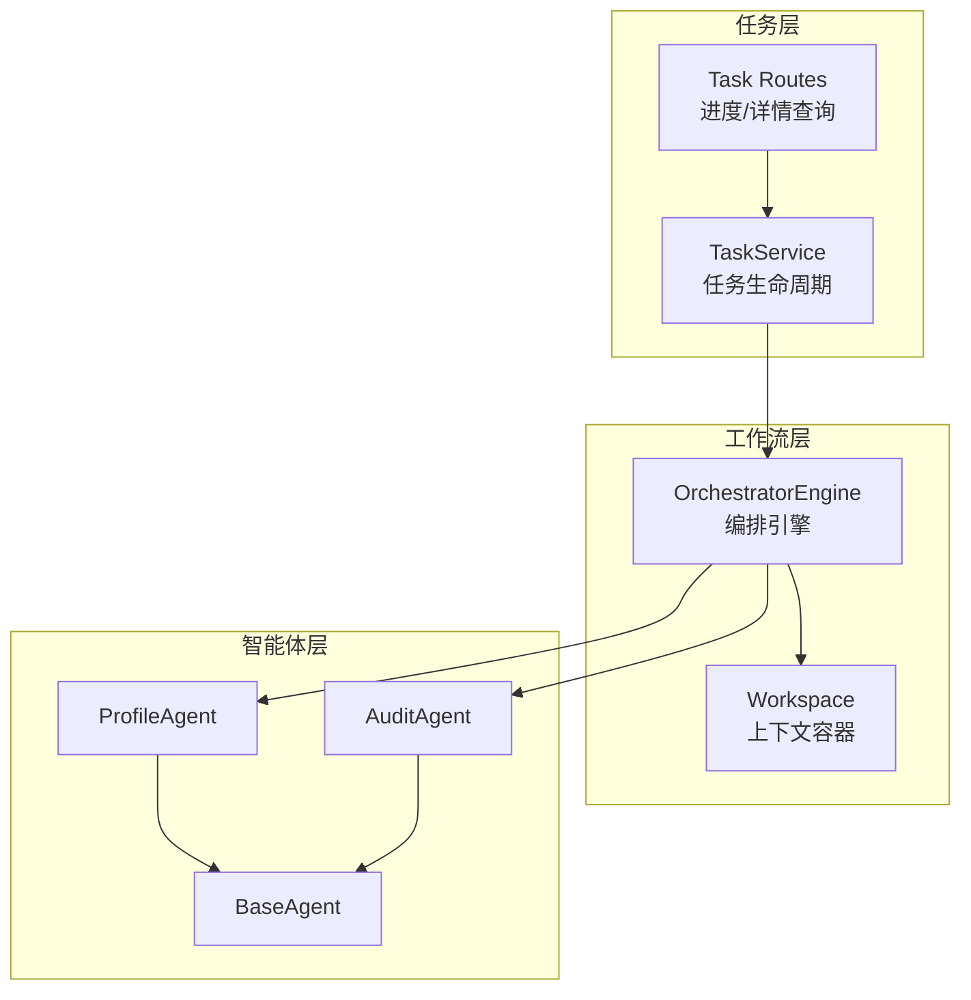
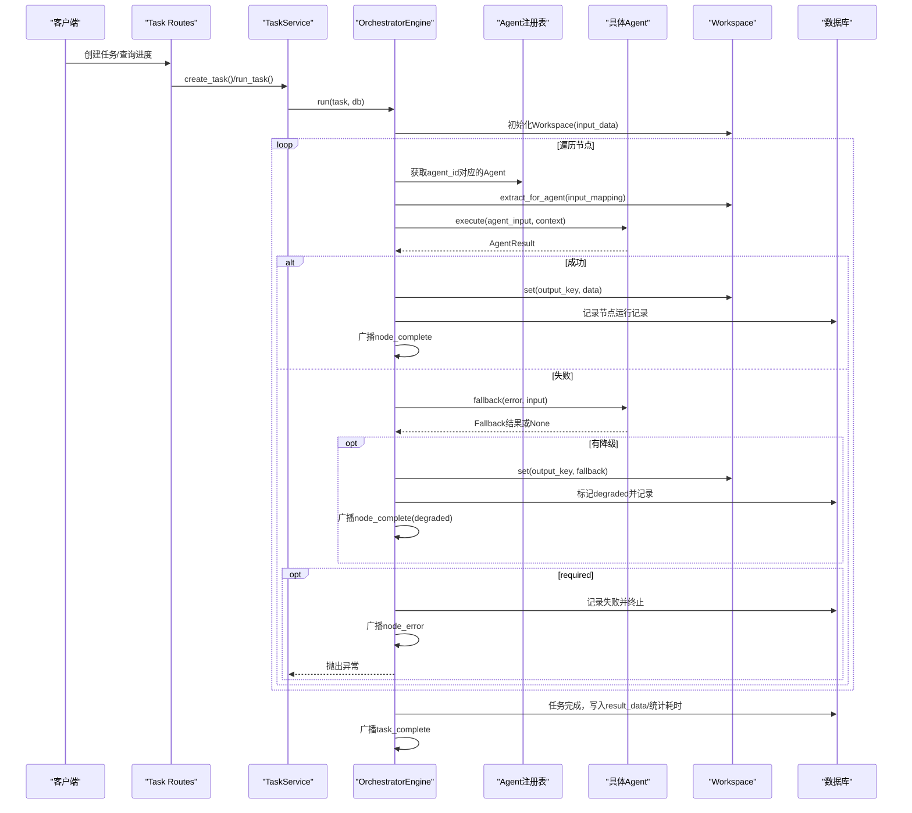
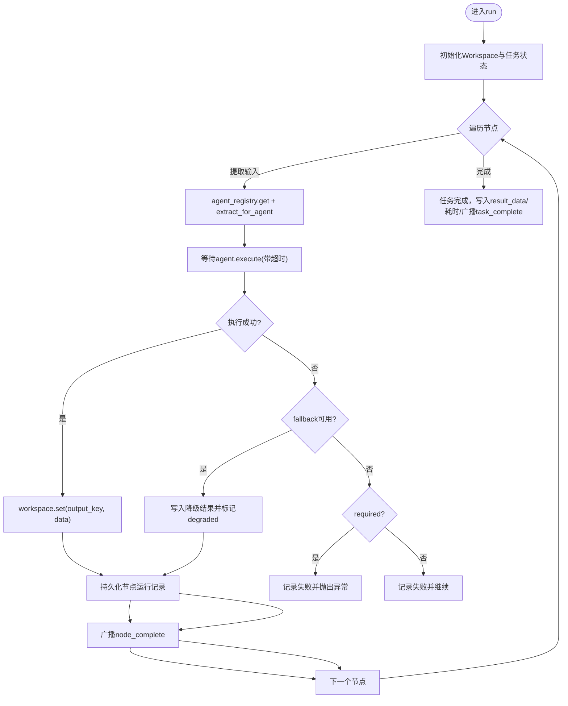
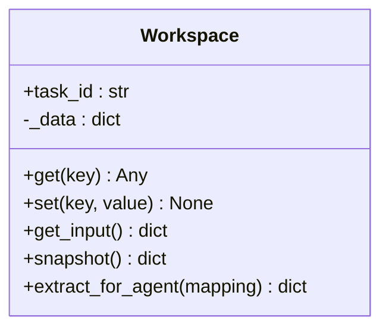
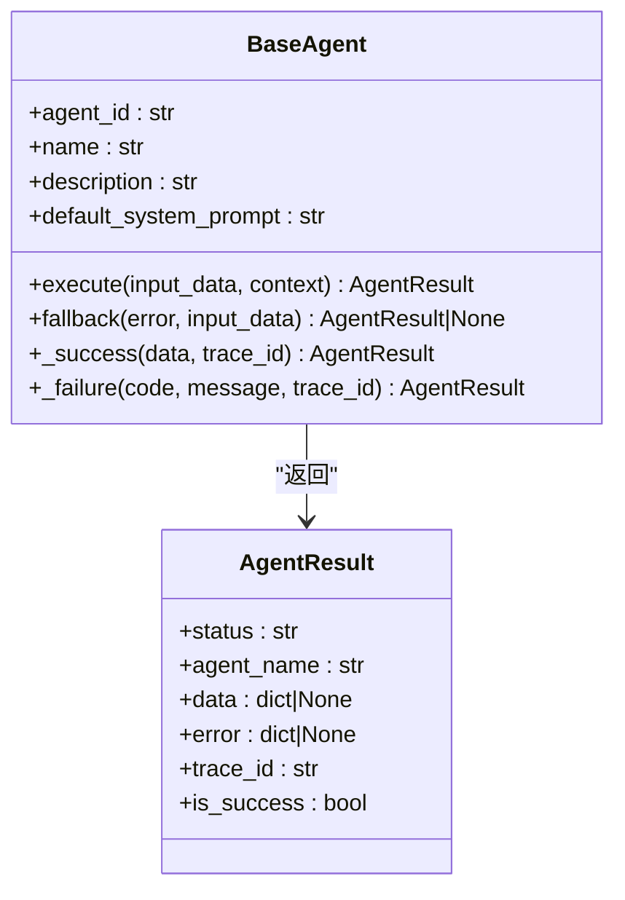
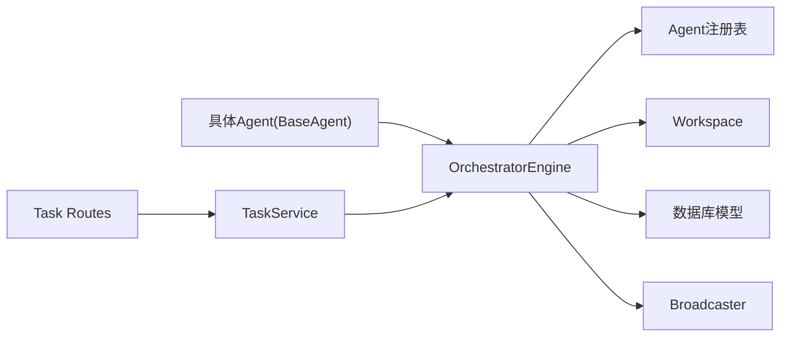

# Workflow工作流概念

<cite>
**本文引用的文件**
- [engine.py](file://backend/app/orchestrator/engine.py)
- [workspace.py](file://backend/app/orchestrator/workspace.py)
- [base.py](file://backend/app/agents/base.py)
- [profile_agent.py](file://backend/app/agents/profile_agent.py)
- [audit_agent.py](file://backend/app/agents/audit_agent.py)
- [task_service.py](file://backend/app/services/task_service.py)
- [task_routes.py](file://backend/app/api/task_routes.py)
- [tables.py](file://backend/app/models/tables.py)
- [ARCHITECTURE.md](file://ARCHITECTURE.md)
- [test_workflow.py](file://backend/scripts/test_workflow.py)
- [test_e2e_workflow.py](file://backend/scripts/test_e2e_workflow.py)
</cite>

## 目录
1. [引言](#引言)
2. [项目结构](#项目结构)
3. [核心组件](#核心组件)
4. [架构总览](#架构总览)
5. [详细组件分析](#详细组件分析)
6. [依赖分析](#依赖分析)
7. [性能考虑](#性能考虑)
8. [故障排查指南](#故障排查指南)
9. [结论](#结论)
10. [附录](#附录)

## 引言
本篇文档围绕HotClaw项目中的Workflow（工作流）概念展开，系统阐述其作为“编排核心”的定位与实现方式。Workflow定义为“定义Agent执行顺序与依赖关系的有向无环图（DAG）”，当前MVP阶段采用线性链式顺序执行，但数据结构与引擎已预留DAG扩展点，为后续支持复杂并行与条件执行奠定基础。

Workflow的关键价值在于：
- 明确的执行顺序与依赖约束，确保数据在Agent间有序传递
- 统一的输入/输出映射与输出键绑定，保证上下文一致性
- 可观测与可恢复：节点级广播、失败降级、任务级追踪
- 可演进：以线性链为基础，逐步过渡到DAG

## 项目结构
HotClaw后端围绕“任务-工作流-智能体”三层组织：
- 任务层：TaskService与API路由负责任务生命周期与进度查询
- 工作流层：OrchestratorEngine与Workspace负责编排与上下文管理
- 智能体层：各Agent实现具体业务任务，并提供降级策略

图表来源
- [task_service.py:20-73](file://backend/app/services/task_service.py#L20-L73)
- [task_routes.py:80-118](file://backend/app/api/task_routes.py#L80-L118)
- [engine.py:89-285](file://backend/app/orchestrator/engine.py#L89-L285)
- [workspace.py:12-53](file://backend/app/orchestrator/workspace.py#L12-L53)
- [base.py:49-99](file://backend/app/agents/base.py#L49-L99)
- [profile_agent.py:12-102](file://backend/app/agents/profile_agent.py#L12-L102)
- [audit_agent.py:12-141](file://backend/app/agents/audit_agent.py#L12-L141)

章节来源
- [task_service.py:20-73](file://backend/app/services/task_service.py#L20-L73)
- [task_routes.py:80-118](file://backend/app/api/task_routes.py#L80-L118)
- [engine.py:89-285](file://backend/app/orchestrator/engine.py#L89-L285)
- [workspace.py:12-53](file://backend/app/orchestrator/workspace.py#L12-L53)
- [base.py:49-99](file://backend/app/agents/base.py#L49-L99)
- [profile_agent.py:12-102](file://backend/app/agents/profile_agent.py#L12-L102)
- [audit_agent.py:12-141](file://backend/app/agents/audit_agent.py#L12-L141)

## 核心组件
- OrchestratorEngine：顺序编排器，按节点定义依次调度Agent，管理执行流程、错误与降级、广播事件与持久化
- Workspace：任务级上下文容器，提供键值读写、快照与按映射提取输入的能力
- BaseAgent：智能体抽象，统一执行协议、结果封装与降级策略
- TaskService/Task Routes：任务生命周期与进度查询接口
- WorkflowTemplateModel：工作流模板持久化结构，承载workflow_id、name、description、version、input_schema、definition等

章节来源
- [engine.py:89-285](file://backend/app/orchestrator/engine.py#L89-L285)
- [workspace.py:12-53](file://backend/app/orchestrator/workspace.py#L12-L53)
- [base.py:49-99](file://backend/app/agents/base.py#L49-L99)
- [task_service.py:20-73](file://backend/app/services/task_service.py#L20-L73)
- [task_routes.py:80-118](file://backend/app/api/task_routes.py#L80-L118)
- [tables.py:202-217](file://backend/app/models/tables.py#L202-L217)

## 架构总览
下图展示了从任务创建到工作流执行的端到端流程，以及节点级事件广播与持久化记录：

图表来源
- [task_routes.py:80-118](file://backend/app/api/task_routes.py#L80-L118)
- [task_service.py:20-73](file://backend/app/services/task_service.py#L20-L73)
- [engine.py:92-234](file://backend/app/orchestrator/engine.py#L92-L234)
- [workspace.py:36-52](file://backend/app/orchestrator/workspace.py#L36-L52)
- [base.py:64-82](file://backend/app/agents/base.py#L64-L82)

## 详细组件分析

### OrchestratorEngine（编排引擎）
- 职责
  - 读取任务输入，初始化Workspace
  - 顺序遍历节点，按input_mapping提取Agent输入
  - 调用Agent.execute，处理成功/失败/超时
  - 支持fallback降级，必要时中断并上报
  - 广播节点开始/完成/错误事件，持久化节点运行记录
  - 任务完成后汇总结果与耗时，广播任务完成
- 关键点
  - DEFAULT_WORKFLOW_NODES构成MVP线性链
  - 通过AgentRegistry获取Agent实例
  - 使用系统提示词解析优先级：DB自定义 > Agent默认
  - 节点运行记录包含prompt/completion tokens统计

图表来源
- [engine.py:92-234](file://backend/app/orchestrator/engine.py#L92-L234)

章节来源
- [engine.py:89-285](file://backend/app/orchestrator/engine.py#L89-L285)

### Workspace（工作区）
- 职责
  - 保存任务输入与中间输出，提供get/set快照
  - extract_for_agent按映射抽取Agent所需输入
  - 支持引用原始输入（input.前缀）
- 设计要点
  - MVP阶段使用简单键映射，非JSONPath
  - 便于Agent解耦与数据可见性控制

图表来源
- [workspace.py:12-53](file://backend/app/orchestrator/workspace.py#L12-L53)

章节来源
- [workspace.py:12-53](file://backend/app/orchestrator/workspace.py#L12-L53)

### BaseAgent（智能体基类）
- 职责
  - 统一execute协议，返回AgentResult（含status/data/error/trace_id）
  - 提供fallback降级策略钩子
  - 提供便捷的成功/失败构造器
- 与编排的关系
  - OrchestratorEngine以统一协议调用Agent
  - 通过AgentResult的is_success判断执行结果

图表来源
- [base.py:49-99](file://backend/app/agents/base.py#L49-L99)

章节来源
- [base.py:49-99](file://backend/app/agents/base.py#L49-L99)

### 具体Agent示例
- ProfileAgent：将用户输入的账号定位解析为结构化画像，提供降级策略
- AuditAgent：对生成内容进行合规审核与质量评估，提供降级策略

章节来源
- [profile_agent.py:12-102](file://backend/app/agents/profile_agent.py#L12-L102)
- [audit_agent.py:12-141](file://backend/app/agents/audit_agent.py#L12-L141)

### 任务与API
- TaskService：创建任务、后台运行编排、异常回滚与广播
- Task Routes：提供任务进度与详情查询，包含当前节点与完成节点数等

章节来源
- [task_service.py:20-73](file://backend/app/services/task_service.py#L20-L73)
- [task_routes.py:80-118](file://backend/app/api/task_routes.py#L80-L118)

### 工作流模板与数据模型
- WorkflowTemplateModel：持久化工作流模板，字段包括workflow_id、name、description、version、definition、input_schema、output_mapping等
- 与架构文档呼应：工作流定义支持DAG扩展点，当前以线性链落地

章节来源
- [tables.py:202-217](file://backend/app/models/tables.py#L202-L217)
- [ARCHITECTURE.md:1463-1510](file://ARCHITECTURE.md#L1463-L1510)

## 依赖分析
- 组件耦合
  - OrchestratorEngine依赖Agent注册表、Workspace、Broadcaster与数据库模型
  - Agent依赖BaseAgent协议与系统提示词解析
  - TaskService/Task Routes依赖OrchestratorEngine与数据库
- 外部依赖
  - LLM调用（通过settings与provider配置）
  - 数据库（SQLAlchemy异步会话）

图表来源
- [engine.py:18-26](file://backend/app/orchestrator/engine.py#L18-L26)
- [base.py:49-99](file://backend/app/agents/base.py#L49-L99)
- [task_service.py:14-15](file://backend/app/services/task_service.py#L14-L15)
- [task_routes.py:80-118](file://backend/app/api/task_routes.py#L80-L118)

章节来源
- [engine.py:18-26](file://backend/app/orchestrator/engine.py#L18-L26)
- [base.py:49-99](file://backend/app/agents/base.py#L49-L99)
- [task_service.py:14-15](file://backend/app/services/task_service.py#L14-L15)
- [task_routes.py:80-118](file://backend/app/api/task_routes.py#L80-L118)

## 性能考虑
- 超时控制：每个Agent执行设置超时，避免阻塞
- 令牌统计：累计prompt与completion tokens，便于成本与性能分析
- 事件广播：通过SSE推送节点进度，前端可渐进式渲染
- 数据库写入：节点运行记录与任务状态在事务内持久化，减少不一致

章节来源
- [engine.py:236-243](file://backend/app/orchestrator/engine.py#L236-L243)
- [engine.py:211-216](file://backend/app/orchestrator/engine.py#L211-L216)
- [engine.py:124-132](file://backend/app/orchestrator/engine.py#L124-L132)

## 故障排查指南
- 常见问题
  - Agent执行超时：检查LLM提供商配置与网络连通性
  - Agent执行失败：查看AgentResult.error，确认是否触发fallback
  - 节点required导致任务中断：确认节点required配置与业务容忍度
- 排查步骤
  - 通过Task Routes查询任务进度与当前节点
  - 在系统日志中按trace_id检索节点级事件
  - 检查Agent注册表是否包含对应agent_id
  - 运行脚本验证工作流链路与数据流

章节来源
- [task_routes.py:80-118](file://backend/app/api/task_routes.py#L80-L118)
- [engine.py:176-196](file://backend/app/orchestrator/engine.py#L176-L196)
- [test_workflow.py:53-187](file://backend/scripts/test_workflow.py#L53-L187)
- [test_e2e_workflow.py:86-236](file://backend/scripts/test_e2e_workflow.py#L86-L236)

## 结论
Workflow在HotClaw中承担“编排核心”的角色：以线性链实现清晰的执行顺序与依赖，同时以DAG扩展点预留未来能力。通过统一的输入/输出映射、节点级广播与降级策略，系统实现了可观测、可恢复的任务执行。建议在后续版本中逐步引入并行与条件分支，保持definition结构兼容现有实现。

## 附录

### Workflow结构组成与设计理念
- 核心元素
  - workflow_id、name、description、version：模板标识与元信息
  - input_schema：输入约束与校验
  - nodes：节点数组，每项包含node_id、agent_id、name、input_mapping、output_key、required等
- 设计理念
  - MVP线性链：简单可靠，易于验证
  - DAG扩展点：预留并行与条件执行，平滑演进

章节来源
- [tables.py:202-217](file://backend/app/models/tables.py#L202-L217)
- [ARCHITECTURE.md:1463-1510](file://ARCHITECTURE.md#L1463-L1510)

### 典型Workflow定义示例（节点、输入映射、输出键绑定、依赖关系）
- 示例参考：DEFAULT_WORKFLOW_NODES（线性链）
  - profile_parsing → profile_agent → profile
  - hot_topic_analysis → hot_topic_agent → hot_topics
  - topic_planning → topic_planner_agent → topics
  - title_generation → title_generator_agent → titles
  - content_writing → content_writer_agent → content
  - audit → audit_agent → audit_result
- 输入映射与依赖
  - 后续节点的input_mapping引用上游节点的output_key
  - 外部输入通过input_mapping引用原始输入（input.前缀）

章节来源
- [engine.py:31-86](file://backend/app/orchestrator/engine.py#L31-L86)
- [workspace.py:36-52](file://backend/app/orchestrator/workspace.py#L36-L52)
- [test_workflow.py:109-182](file://backend/scripts/test_workflow.py#L109-L182)
- [test_e2e_workflow.py:104-146](file://backend/scripts/test_e2e_workflow.py#L104-L146)

### 执行机制与最佳实践
- 执行机制
  - OrchestratorEngine顺序调度Agent，管理Workspace，广播事件，持久化节点运行记录
  - 支持fallback降级，required节点失败即中止
- 最佳实践
  - 明确每个节点的required属性，区分关键路径与可降级路径
  - 使用output_key统一命名，避免歧义
  - 为关键Agent提供降级策略，保障系统韧性
  - 通过系统日志与SSE事件实现可观测性

章节来源
- [engine.py:92-234](file://backend/app/orchestrator/engine.py#L92-L234)
- [base.py:77-82](file://backend/app/agents/base.py#L77-L82)
- [task_routes.py:80-118](file://backend/app/api/task_routes.py#L80-L118)