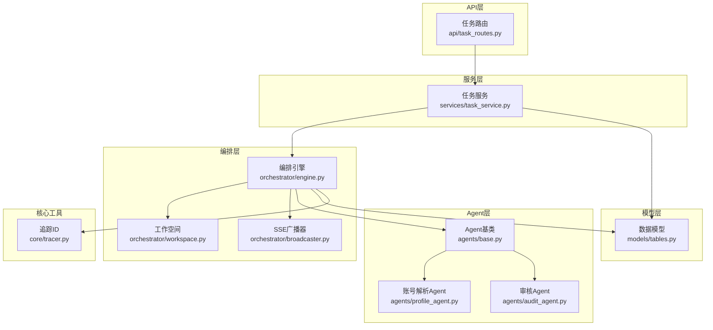
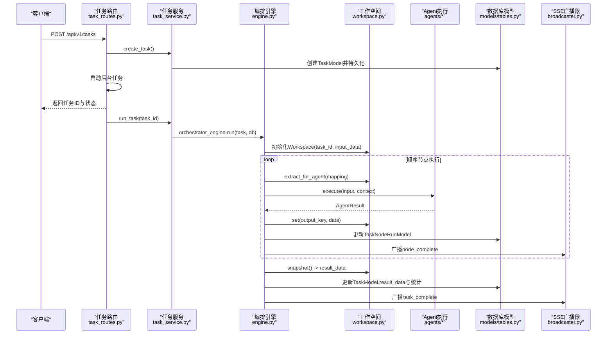
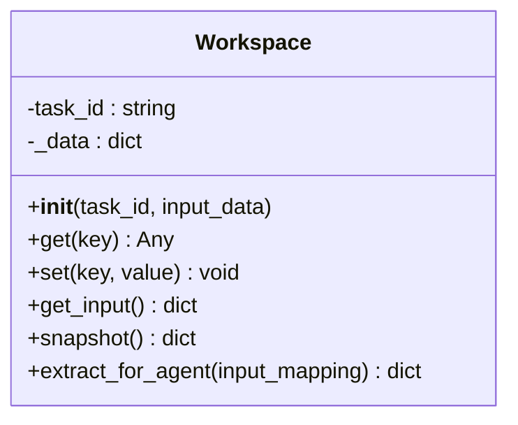
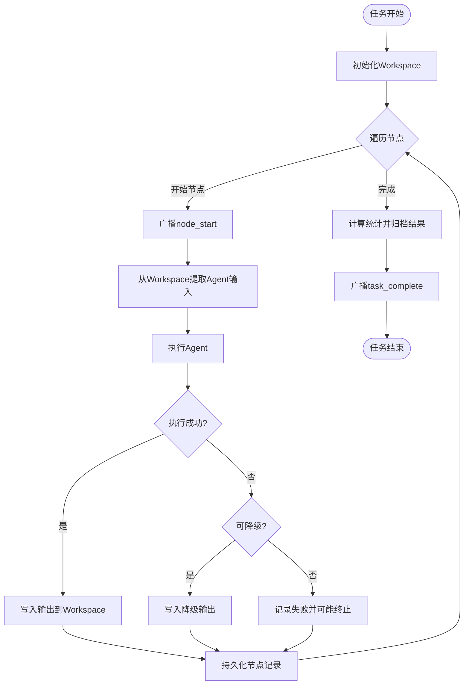
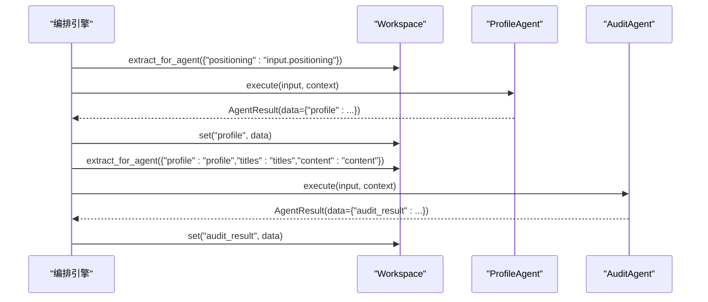
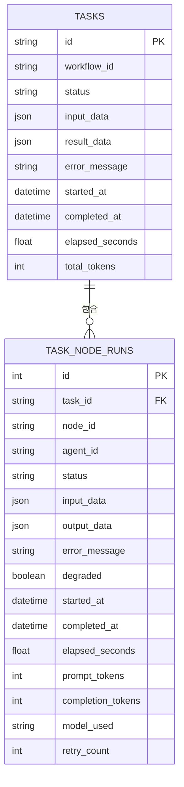
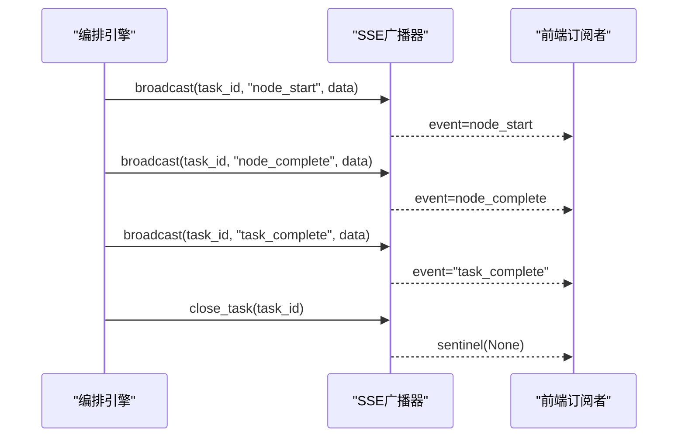
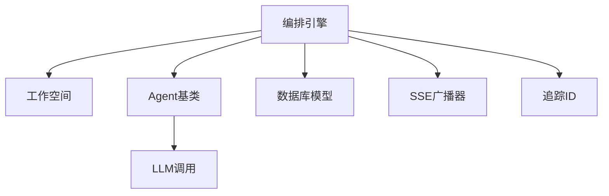

# Workspace工作空间概念

<cite>
**本文档引用的文件**
- [workspace.py](file://backend/app/orchestrator/workspace.py)
- [engine.py](file://backend/app/orchestrator/engine.py)
- [base.py](file://backend/app/agents/base.py)
- [profile_agent.py](file://backend/app/agents/profile_agent.py)
- [audit_agent.py](file://backend/app/agents/audit_agent.py)
- [tables.py](file://backend/app/models/tables.py)
- [task_routes.py](file://backend/app/api/task_routes.py)
- [task_service.py](file://backend/app/services/task_service.py)
- [broadcaster.py](file://backend/app/orchestrator/broadcaster.py)
- [tracer.py](file://backend/app/core/tracer.py)
- [ARCHITECTURE.md](file://ARCHITECTURE.md)
- [test_workspace.py](file://backend/tests/test_workspace.py)
</cite>

## 目录
1. [引言](#引言)
2. [项目结构](#项目结构)
3. [核心组件](#核心组件)
4. [架构概览](#架构概览)
5. [详细组件分析](#详细组件分析)
6. [依赖关系分析](#依赖关系分析)
7. [性能考量](#性能考量)
8. [故障排查指南](#故障排查指南)
9. [结论](#结论)

## 引言
Workspace（工作空间）是HotClaw系统中一次任务执行的上下文容器，承担着任务参数、各Agent输出、中间状态与元数据的集中管理职责。它既是Agent间共享数据的桥梁，也是任务状态的承载者与上下文隔离的机制。本文将深入解析Workspace的生命周期管理、数据结构、状态管理与访问控制，并结合实际实现展示其在系统中的关键作用与协作方式。

## 项目结构
HotClaw后端采用模块化分层设计，Workspace位于编排层（orchestrator），贯穿任务创建、执行与归档的全过程。核心文件分布如下：
- 编排层：orchestrator/workspace.py、orchestrator/engine.py、orchestrator/broadcaster.py
- 业务层：services/task_service.py、api/task_routes.py
- 模型层：models/tables.py
- Agent基类与具体Agent：agents/base.py、agents/profile_agent.py、agents/audit_agent.py
- 核心工具：core/tracer.py
- 架构文档：ARCHITECTURE.md
- 测试：tests/test_workspace.py

**图表来源**
- [task_routes.py:1-179](file://backend/app/api/task_routes.py#L1-L179)
- [task_service.py:1-126](file://backend/app/services/task_service.py#L1-L126)
- [engine.py:1-285](file://backend/app/orchestrator/engine.py#L1-L285)
- [workspace.py:1-53](file://backend/app/orchestrator/workspace.py#L1-L53)
- [broadcaster.py:1-99](file://backend/app/orchestrator/broadcaster.py#L1-L99)
- [base.py:1-99](file://backend/app/agents/base.py#L1-L99)
- [profile_agent.py:1-102](file://backend/app/agents/profile_agent.py#L1-L102)
- [audit_agent.py:1-141](file://backend/app/agents/audit_agent.py#L1-L141)
- [tables.py:1-319](file://backend/app/models/tables.py#L1-L319)
- [tracer.py:1-34](file://backend/app/core/tracer.py#L1-L34)

**章节来源**
- [ARCHITECTURE.md:124-135](file://ARCHITECTURE.md#L124-L135)
- [workspace.py:1-53](file://backend/app/orchestrator/workspace.py#L1-L53)
- [engine.py:1-285](file://backend/app/orchestrator/engine.py#L1-L285)

## 核心组件
- Workspace：任务级上下文容器，提供键值存取、输入读取、快照导出与Agent输入提取能力。
- OrchestratorEngine：工作流执行引擎，负责创建工作空间、按节点顺序调度Agent、管理状态与事件广播。
- Agent基类与具体Agent：定义统一的执行接口与降级策略，通过Workspace读写上下文。
- 任务模型与节点运行模型：持久化任务生命周期与节点执行记录，支撑任务状态可视化与回放。
- SSE广播器：向前端推送节点开始、完成、错误与任务完成事件，实现实时状态展示。
- 追踪ID：跨组件传播trace_id与task_id，确保可观测性与审计能力。

**章节来源**
- [workspace.py:12-53](file://backend/app/orchestrator/workspace.py#L12-L53)
- [engine.py:89-285](file://backend/app/orchestrator/engine.py#L89-L285)
- [base.py:49-99](file://backend/app/agents/base.py#L49-L99)
- [tables.py:23-74](file://backend/app/models/tables.py#L23-L74)
- [broadcaster.py:11-99](file://backend/app/orchestrator/broadcaster.py#L11-L99)
- [tracer.py:10-34](file://backend/app/core/tracer.py#L10-L34)

## 架构概览
Workspace在系统中的关键作用体现在：
- 作为Agent间共享数据的桥梁：通过统一的键值存储，上一个Agent的输出可被下一个Agent以映射方式读取。
- 作为任务状态的容器：保存任务输入、中间结果与最终结果，便于持久化与回放。
- 提供上下文隔离机制：每个任务拥有独立的Workspace实例，避免数据串扰。

**图表来源**
- [task_routes.py:39-67](file://backend/app/api/task_routes.py#L39-L67)
- [task_service.py:39-64](file://backend/app/services/task_service.py#L39-L64)
- [engine.py:92-234](file://backend/app/orchestrator/engine.py#L92-L234)
- [workspace.py:15-53](file://backend/app/orchestrator/workspace.py#L15-L53)
- [tables.py:23-74](file://backend/app/models/tables.py#L23-L74)
- [broadcaster.py:57-90](file://backend/app/orchestrator/broadcaster.py#L57-L90)

## 详细组件分析

### Workspace工作空间
- 定义与职责
  - 任务级上下文容器，包含任务参数、Agent输出、中间状态与元数据。
  - 提供get/set读写、get_input读取原始输入、snapshot导出快照、extract_for_agent按映射提取Agent输入。
- 数据结构
  - 内部使用字典存储，键为字符串，值为任意类型；保留"input"键存放原始输入。
- 生命周期
  - 创建：任务开始时由编排引擎初始化，传入task_id与input_data。
  - 使用：执行过程中Agent通过set写入输出，通过extract_for_agent读取所需字段。
  - 归档：任务完成后通过snapshot导出结果并持久化至TaskModel.result_data。
- 访问控制
  - 通过input_mapping实现字段级授权，仅暴露必要字段给下游Agent。
  - 日志记录每次set操作，便于审计与调试。

**图表来源**
- [workspace.py:12-53](file://backend/app/orchestrator/workspace.py#L12-L53)

**章节来源**
- [workspace.py:12-53](file://backend/app/orchestrator/workspace.py#L12-L53)
- [engine.py:98-150](file://backend/app/orchestrator/engine.py#L98-L150)
- [test_workspace.py:7-41](file://backend/tests/test_workspace.py#L7-L41)

### 编排引擎与任务生命周期
- 初始化
  - 生成trace_id，创建Workspace实例，设置任务状态为"running"并记录开始时间。
- 节点执行
  - 为每个节点创建TaskNodeRunModel记录，广播node_start事件。
  - 从Workspace提取Agent输入，注入system_prompt与上下文，执行Agent。
  - 成功则写入输出，失败则尝试降级；必要节点失败时终止并广播node_error。
- 完成与归档
  - 计算总耗时与token消耗，写入TaskModel，广播task_complete并关闭SSE通道。

**图表来源**
- [engine.py:92-234](file://backend/app/orchestrator/engine.py#L92-L234)
- [broadcaster.py:57-90](file://backend/app/orchestrator/broadcaster.py#L57-L90)
- [tables.py:23-74](file://backend/app/models/tables.py#L23-L74)

**章节来源**
- [engine.py:92-234](file://backend/app/orchestrator/engine.py#L92-L234)
- [broadcaster.py:11-99](file://backend/app/orchestrator/broadcaster.py#L11-L99)
- [tables.py:23-74](file://backend/app/models/tables.py#L23-L74)

### Agent协作与数据传递
- Agent基类
  - 定义统一的execute接口，接收input_data与context（即Workspace快照），返回AgentResult。
  - 提供fallback降级策略，增强系统韧性。
- 具体Agent示例
  - ProfileAgent：解析账号定位，输出结构化画像，写入Workspace的"profile"键。
  - AuditAgent：基于标题与正文进行合规审核，读取Workspace中的"profile"、"titles"、"content"等键。
- 数据传递
  - 通过Workspace的extract_for_agent按映射读取上游输出，避免硬编码键名，提升可维护性。

**图表来源**
- [engine.py:134-150](file://backend/app/orchestrator/engine.py#L134-L150)
- [profile_agent.py:43-77](file://backend/app/agents/profile_agent.py#L43-L77)
- [audit_agent.py:53-85](file://backend/app/agents/audit_agent.py#L53-L85)
- [base.py:64-75](file://backend/app/agents/base.py#L64-L75)

**章节来源**
- [base.py:49-99](file://backend/app/agents/base.py#L49-L99)
- [profile_agent.py:12-102](file://backend/app/agents/profile_agent.py#L12-L102)
- [audit_agent.py:12-141](file://backend/app/agents/audit_agent.py#L12-L141)
- [engine.py:134-150](file://backend/app/orchestrator/engine.py#L134-L150)

### 任务模型与持久化
- TaskModel：存储任务生命周期关键字段，包括状态、输入输出、错误信息、耗时与token统计。
- TaskNodeRunModel：记录每个节点的执行状态、输入输出、错误与耗时，支持节点级可视化与回放。
- 持久化流程：编排引擎在节点完成后更新TaskNodeRunModel，在任务完成后更新TaskModel.result_data与统计信息。

**图表来源**
- [tables.py:23-74](file://backend/app/models/tables.py#L23-L74)

**章节来源**
- [tables.py:23-74](file://backend/app/models/tables.py#L23-L74)
- [engine.py:114-198](file://backend/app/orchestrator/engine.py#L114-L198)

### SSE事件流与实时状态
- SSEBroadcaster：维护每个任务的订阅队列与历史缓冲，支持晚到订阅者重放事件。
- 事件类型：node_start、node_complete、node_error、task_complete、task_error。
- 生命周期：任务开始时创建队列，节点完成后推送事件，任务结束时关闭通道并清理历史。

**图表来源**
- [broadcaster.py:57-90](file://backend/app/orchestrator/broadcaster.py#L57-L90)
- [engine.py:124-232](file://backend/app/orchestrator/engine.py#L124-L232)

**章节来源**
- [broadcaster.py:11-99](file://backend/app/orchestrator/broadcaster.py#L11-L99)
- [engine.py:124-232](file://backend/app/orchestrator/engine.py#L124-L232)

## 依赖关系分析
- 组件耦合
  - OrchestratorEngine强依赖Workspace与AgentRegistry，弱依赖数据库与SSE广播器。
  - Agent通过BaseAgent抽象与Workspace交互，降低对具体实现的耦合。
- 外部依赖
  - 数据库：SQLAlchemy ORM模型用于持久化任务与节点记录。
  - LLM调用：通过配置与工具模块调用外部模型服务。
  - 追踪：ContextVar传播trace_id与task_id，贯穿请求链路。

**图表来源**
- [engine.py:18-27](file://backend/app/orchestrator/engine.py#L18-L27)
- [base.py:12-13](file://backend/app/agents/base.py#L12-L13)
- [tables.py:1-319](file://backend/app/models/tables.py#L1-319)
- [broadcaster.py:1-99](file://backend/app/orchestrator/broadcaster.py#L1-L99)
- [tracer.py:3-8](file://backend/app/core/tracer.py#L3-L8)

**章节来源**
- [engine.py:18-27](file://backend/app/orchestrator/engine.py#L18-L27)
- [base.py:12-13](file://backend/app/agents/base.py#L12-L13)
- [tables.py:1-319](file://backend/app/models/tables.py#L1-319)
- [broadcaster.py:1-99](file://backend/app/orchestrator/broadcaster.py#L1-L99)
- [tracer.py:3-8](file://backend/app/core/tracer.py#L3-L8)

## 性能考量
- 内存占用
  - Workspace为字典结构，键数量与数据规模直接影响内存；建议控制每节点输出大小，避免冗余字段。
- I/O开销
  - 每节点写入数据库与广播事件存在I/O成本；可通过批处理与异步写入优化。
- 超时与降级
  - 编排引擎对Agent执行设置超时，失败时优先降级，减少整体任务耗时波动。
- 可观测性
  - 通过trace_id与task_id串联日志与事件，便于性能分析与问题定位。

[本节为通用性能指导，无需特定文件来源]

## 故障排查指南
- 任务状态异常
  - 检查TaskModel.status与TaskNodeRunModel.status是否一致，确认节点执行是否正确持久化。
- Agent执行失败
  - 查看节点error_message与AgentResult.error，结合fallback策略判断是否触发降级。
- SSE事件缺失
  - 确认SSEBroadcaster是否已close_task或历史缓冲是否清理；晚到订阅者需重放历史。
- Workspace数据缺失
  - 核对extract_for_agent映射是否正确，确认上游Agent是否成功写入Workspace。

**章节来源**
- [engine.py:164-196](file://backend/app/orchestrator/engine.py#L164-L196)
- [broadcaster.py:70-90](file://backend/app/orchestrator/broadcaster.py#L70-L90)
- [tables.py:23-74](file://backend/app/models/tables.py#L23-L74)

## 结论
Workspace作为HotClaw系统的核心基础设施，实现了任务级上下文隔离、Agent间数据共享与状态承载。通过编排引擎的有序调度、SSE的实时广播与数据库的持久化记录，系统形成了从任务创建到执行归档的完整生命周期管理。遵循结构化输入输出、失败降级与配置优先的原则，Workspace为系统的可扩展性、可观测性与可维护性提供了坚实基础。