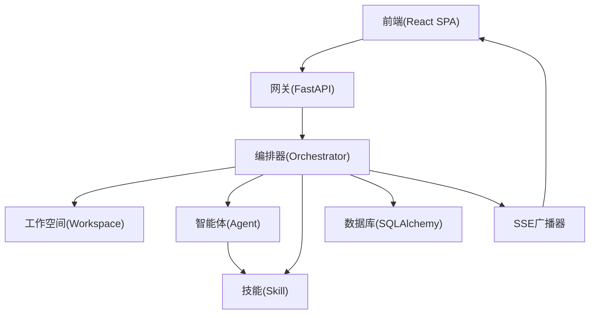
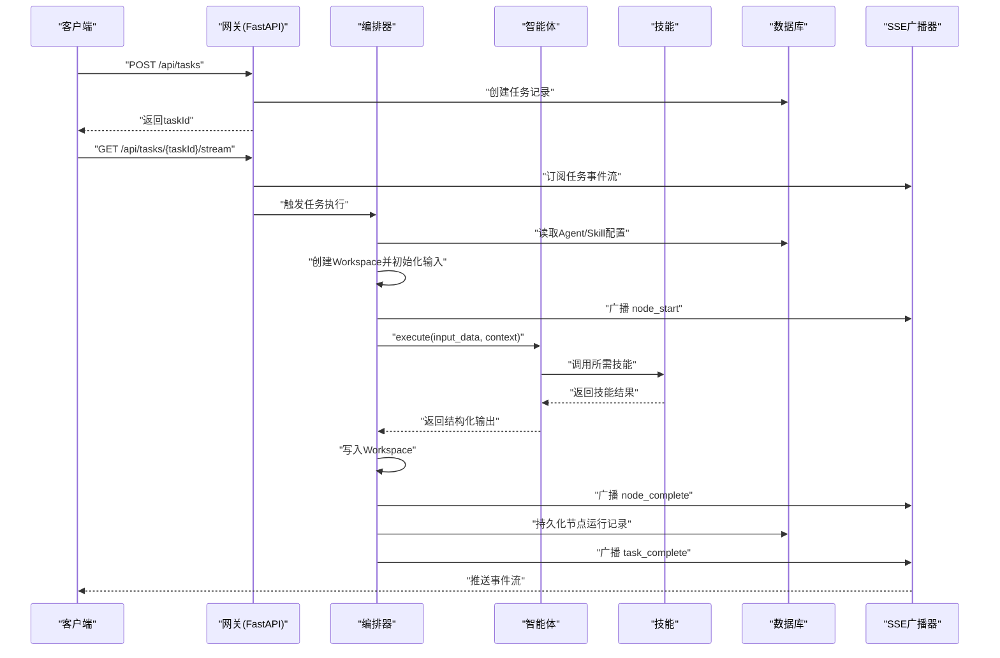
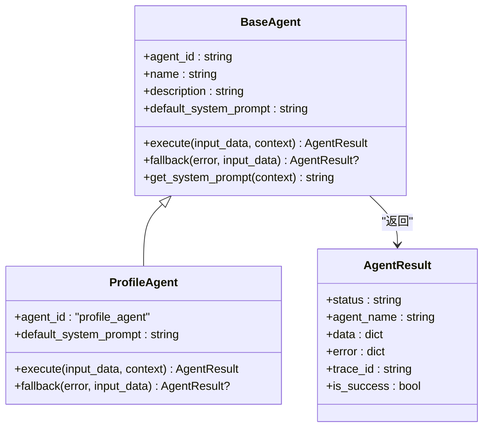
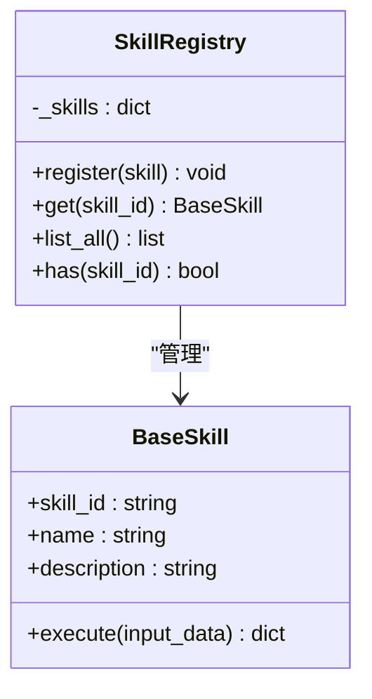
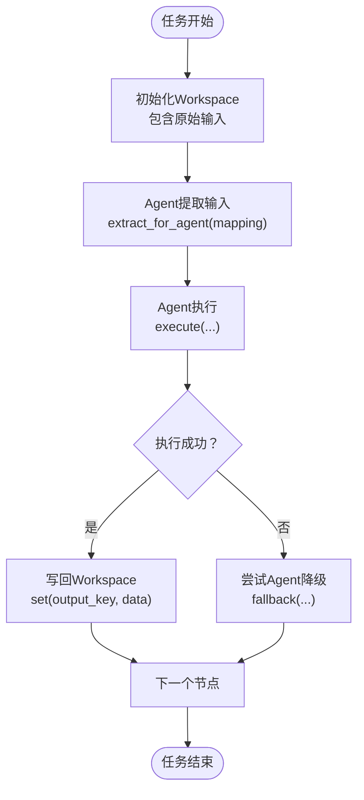
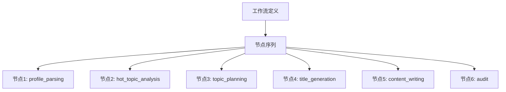
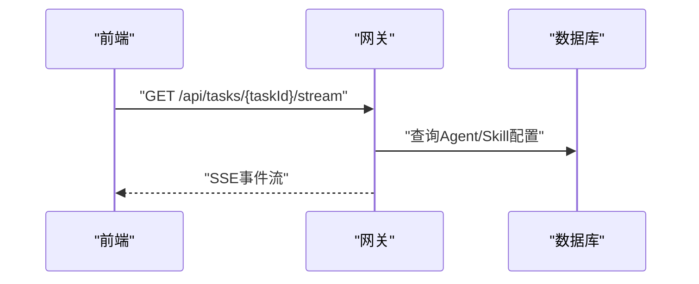
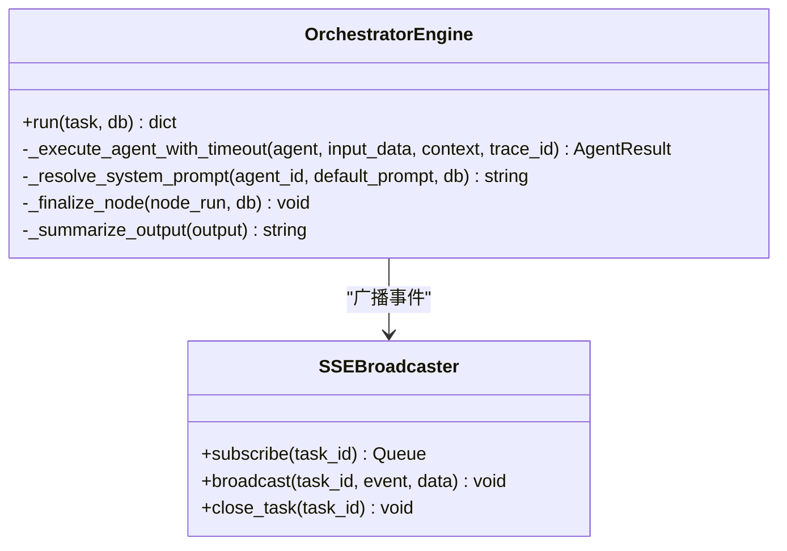
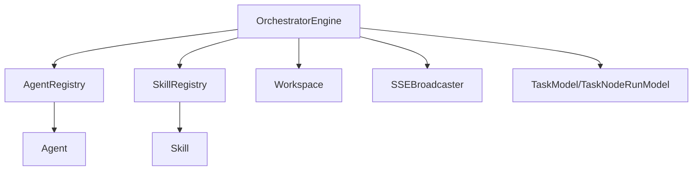

# 核心概念定义

<cite>
**本文引用的文件**
- [ARCHITECTURE.md](file://ARCHITECTURE.md)
- [engine.py](file://backend/app/orchestrator/engine.py)
- [workspace.py](file://backend/app/orchestrator/workspace.py)
- [base.py（Agent基类）](file://backend/app/agents/base.py)
- [base.py（Skill基类）](file://backend/app/skills/base.py)
- [registry.py（Agent注册表）](file://backend/app/agents/registry.py)
- [registry.py（Skill注册表）](file://backend/app/skills/registry.py)
- [tables.py（数据模型）](file://backend/app/models/tables.py)
- [agent_routes.py](file://backend/app/api/agent_routes.py)
- [skill_routes.py](file://backend/app/api/skill_routes.py)
- [profile_agent.py](file://backend/app/agents/profile_agent.py)
- [broadcaster.py](file://backend/app/orchestrator/broadcaster.py)
- [task.py（任务Schema）](file://backend/app/schemas/task.py)
- [agent.py（Agent Schema）](file://backend/app/schemas/agent.py)
- [skill.py（Skill Schema）](file://backend/app/schemas/skill.py)
</cite>

## 目录
1. [引言](#引言)
2. [项目结构](#项目结构)
3. [核心组件](#核心组件)
4. [架构总览](#架构总览)
5. [详细组件分析](#详细组件分析)
6. [依赖分析](#依赖分析)
7. [性能考量](#性能考量)
8. [故障排查指南](#故障排查指南)
9. [结论](#结论)
10. [附录](#附录)

## 引言
本文件面向HotClaw项目的核心概念定义，围绕Agent（智能体）、Skill（技能）、Workspace（工作空间）、Workflow（工作流）、Gateway（网关）、Orchestrator（编排器）等关键术语，提供清晰的定义、属性特征、系统作用与相互关系。文档通过类比帮助理解抽象概念（如将Agent比作编辑部“人”，将Skill比作编辑部“工具”），并通过代码级来源与图示展示实际实现与调用链路，兼顾初学者与高级开发者的需求。

## 项目结构
HotClaw采用前后端分离架构，后端以FastAPI为核心网关，内置Orchestrator工作流引擎，Agent与Skill分别承担“决策执行”和“原子能力”的职责，Workspace承载任务级上下文，SSE广播驱动前端可视化。整体模块划分如下：
- 前端：React SPA，负责可视化与交互
- 后端网关（Gateway）：FastAPI路由层，统一入口、参数校验、SSE端点
- 编排器（Orchestrator）：加载工作流、调度Agent、管理Workspace、广播状态
- 智能体层（Agent）：具体业务角色，调用LLM与Skill完成任务
- 技能层（Skill）：无状态原子能力，被Agent调用
- 数据层：SQLAlchemy ORM模型，持久化任务、节点运行、配置等

图表来源
- [ARCHITECTURE.md](file://ARCHITECTURE.md)
- [engine.py](file://backend/app/orchestrator/engine.py)
- [workspace.py](file://backend/app/orchestrator/workspace.py)
- [broadcaster.py](file://backend/app/orchestrator/broadcaster.py)

章节来源
- [ARCHITECTURE.md](file://ARCHITECTURE.md)

## 核心组件
本节给出HotClaw六大核心概念的定义、属性与系统作用，并辅以类比帮助理解。

- Agent（智能体）
  - 定义：有角色、有上下文、有决策能力的执行单元。每个Agent有明确的输入输出Schema，内部可调用LLM与/或Skills完成任务。在HotClaw中，Agent是有状态的（在Workspace内）。
  - 类比：编辑部里的“人”——选题编辑、标题编辑、审核编辑。
  - 属性与职责：
    - 标准化执行接口：execute(input_data, context)返回结构化结果
    - 可选降级策略：fallback(error, input_data)提供失败时的默认输出
    - 系统Prompt解析：从context中获取有效Prompt（优先DB自定义，其次默认）
  - 代码参考：[BaseAgent](file://backend/app/agents/base.py)，[ProfileAgent](file://backend/app/agents/profile_agent.py)

- Skill（技能）
  - 定义：无状态的原子能力，封装具体技术操作（API调用、数据处理、规则匹配等），对外提供标准化输入输出接口。Skill不做业务决策，只做能力执行。
  - 类比：编辑部里的“工具”——搜索引擎、评分卡、敏感词库。
  - 属性与职责：
    - 标准化执行接口：execute(input_data)返回结构化结果
    - 可独立运行，通常由Agent在执行过程中调用
    - 无状态、可复用、可配置
  - 代码参考：[BaseSkill](file://backend/app/skills/base.py)，[Skill注册表](file://backend/app/skills/registry.py)

- Workspace（工作空间）
  - 定义：一次任务执行的上下文容器，包含任务参数、各Agent的输出、中间状态、元数据。Workspace在任务创建时初始化，任务结束后归档。
  - 类比：编辑部的“选题卡”。
  - 属性与职责：
    - 读写隔离：get/set提供键值访问
    - 快照持久化：snapshot用于持久化
    - 输入映射提取：extract_for_agent按字段映射抽取Agent所需输入
  - 代码参考：[Workspace](file://backend/app/orchestrator/workspace.py)

- Workflow（工作流）
  - 定义：定义Agent的执行顺序与依赖关系的有向无环图（DAG）。MVP阶段为线性链，但数据结构预留DAG扩展。
  - 类比：编辑部的“工作流程SOP”。
  - 属性与职责：
    - 节点定义：node_id、agent_id、input_mapping、output_key、required等
    - 默认线性链：MVP内置默认节点序列
  - 代码参考：[默认工作流节点](file://backend/app/orchestrator/engine.py)

- Gateway（网关）
  - 定义：系统对外的唯一入口，负责路由、参数校验、错误格式化。在MVP中即FastAPI的路由层。
  - 类比：编辑部的“前台”。
  - 属性与职责：
    - 统一入口：接收HTTP请求，参数校验
    - SSE端点：提供任务状态事件流
    - 配置管理：Agent/Skill配置的查询与更新
  - 代码参考：[agent_routes](file://backend/app/api/agent_routes.py)，[skill_routes](file://backend/app/api/skill_routes.py)

- Orchestrator（编排器）
  - 定义：工作流执行引擎，读取工作流定义，按顺序/依赖调度Agent，管理Workspace生命周期，广播执行状态，处理异常与降级。
  - 类比：编辑部的“主编”。
  - 属性与职责：
    - 顺序调度：遍历节点，解析系统Prompt，执行Agent，写回Workspace
    - 降级策略：失败时尝试Agent.fallback，必要时抛出异常
    - 事件广播：通过SSE广播node_start/node_complete/node_error/task_complete
    - 节点运行记录：持久化节点输入/输出/耗时/token/错误信息
  - 代码参考：[OrchestratorEngine](file://backend/app/orchestrator/engine.py)，[SSE广播器](file://backend/app/orchestrator/broadcaster.py)

章节来源
- [ARCHITECTURE.md](file://ARCHITECTURE.md)
- [engine.py](file://backend/app/orchestrator/engine.py)
- [workspace.py](file://backend/app/orchestrator/workspace.py)
- [base.py（Agent基类）](file://backend/app/agents/base.py)
- [base.py（Skill基类）](file://backend/app/skills/base.py)
- [registry.py（Agent注册表）](file://backend/app/agents/registry.py)
- [registry.py（Skill注册表）](file://backend/app/skills/registry.py)
- [broadcaster.py](file://backend/app/orchestrator/broadcaster.py)

## 架构总览
下图展示了HotClaw从请求进入网关，到编排器调度Agent与Skill，再到SSE广播与前端可视化的端到端流程。

图表来源
- [engine.py](file://backend/app/orchestrator/engine.py)
- [broadcaster.py](file://backend/app/orchestrator/broadcaster.py)
- [agent_routes.py](file://backend/app/api/agent_routes.py)
- [skill_routes.py](file://backend/app/api/skill_routes.py)
- [tables.py](file://backend/app/models/tables.py)

章节来源
- [ARCHITECTURE.md](file://ARCHITECTURE.md)

## 详细组件分析

### Agent（智能体）分析
- 设计要点
  - AgentResult标准化返回：包含status、agent_name、data/error、trace_id
  - execute接口：输入为结构化input_data，上下文为只读引用（来自Workspace）
  - fallback可选：在执行失败时提供降级输出，避免整条链路中断
  - 系统Prompt解析：优先使用DB自定义模板，否则使用默认模板
- 典型调用链
  - 编排器从Workspace提取输入映射
  - 解析有效系统Prompt
  - 调用Agent.execute，得到AgentResult
  - 若成功写回Workspace；若失败尝试Agent.fallback或抛出异常
- 代码参考：[BaseAgent](file://backend/app/agents/base.py)，[ProfileAgent](file://backend/app/agents/profile_agent.py)

图表来源
- [base.py（Agent基类）](file://backend/app/agents/base.py)
- [profile_agent.py](file://backend/app/agents/profile_agent.py)

章节来源
- [base.py（Agent基类）](file://backend/app/agents/base.py)
- [profile_agent.py](file://backend/app/agents/profile_agent.py)

### Skill（技能）分析
- 设计要点
  - BaseSkill提供execute(input_data)接口，返回结构化字典
  - 无状态、可复用、可独立运行
  - 通过SkillRegistry集中注册与获取
- 调用协议
  - Agent在执行过程中通过skill_registry.get(skill_id)获取实例
  - 构造符合输入Schema的结构化输入
  - 调用execute并处理返回结果
- 代码参考：[BaseSkill](file://backend/app/skills/base.py)，[Skill注册表](file://backend/app/skills/registry.py)

图表来源
- [base.py（Skill基类）](file://backend/app/skills/base.py)
- [registry.py（Skill注册表）](file://backend/app/skills/registry.py)

章节来源
- [base.py（Skill基类）](file://backend/app/skills/base.py)
- [registry.py（Skill注册表）](file://backend/app/skills/registry.py)

### Workspace（工作空间）分析
- 设计要点
  - 任务级上下文容器，初始化时包含原始输入
  - 提供get/set读写接口，支持snapshot持久化
  - extract_for_agent按字段映射从Workspace抽取Agent输入
- 与Agent的关系
  - Agent通过extract_for_agent获取自身输入
  - Agent成功执行后通过set写回输出，供后续Agent使用
- 代码参考：[Workspace](file://backend/app/orchestrator/workspace.py)

图表来源
- [workspace.py](file://backend/app/orchestrator/workspace.py)
- [engine.py](file://backend/app/orchestrator/engine.py)

章节来源
- [workspace.py](file://backend/app/orchestrator/workspace.py)
- [engine.py](file://backend/app/orchestrator/engine.py)

### Workflow（工作流）分析
- 设计要点
  - 节点定义包含node_id、agent_id、name、input_mapping、output_key、required等
  - MVP阶段为线性链，预留DAG扩展
  - 默认工作流节点在编排器中定义
- 与编排器的关系
  - 编排器按节点顺序调度Agent
  - 依据input_mapping从Workspace抽取输入
  - 将输出写入Workspace的指定key
- 代码参考：[默认工作流节点](file://backend/app/orchestrator/engine.py)

图表来源
- [engine.py](file://backend/app/orchestrator/engine.py)

章节来源
- [engine.py](file://backend/app/orchestrator/engine.py)

### Gateway（网关）分析
- 设计要点
  - FastAPI路由层，统一入口、参数校验、错误格式化
  - 提供SSE端点：/api/tasks/{taskId}/stream
  - 提供Agent与Skill配置管理API
- 代码参考：[agent_routes](file://backend/app/api/agent_routes.py)，[skill_routes](file://backend/app/api/skill_routes.py)

图表来源
- [agent_routes.py](file://backend/app/api/agent_routes.py)
- [skill_routes.py](file://backend/app/api/skill_routes.py)
- [tables.py](file://backend/app/models/tables.py)

章节来源
- [agent_routes.py](file://backend/app/api/agent_routes.py)
- [skill_routes.py](file://backend/app/api/skill_routes.py)
- [tables.py](file://backend/app/models/tables.py)

### Orchestrator（编排器）分析
- 设计要点
  - run方法：创建Workspace，遍历节点，调度Agent，写回结果，广播事件
  - 超时控制：_execute_agent_with_timeout
  - Prompt解析：_resolve_system_prompt（DB自定义优先）
  - 降级策略：Agent.fallback，必要时抛出异常
  - 节点运行记录：TaskNodeRunModel持久化
- 代码参考：[OrchestratorEngine](file://backend/app/orchestrator/engine.py)，[SSE广播器](file://backend/app/orchestrator/broadcaster.py)

图表来源
- [engine.py](file://backend/app/orchestrator/engine.py)
- [broadcaster.py](file://backend/app/orchestrator/broadcaster.py)

章节来源
- [engine.py](file://backend/app/orchestrator/engine.py)
- [broadcaster.py](file://backend/app/orchestrator/broadcaster.py)

## 依赖分析
- 组件耦合与内聚
  - Orchestrator与Agent通过agent_registry解耦，与Skill通过skill_registry解耦
  - Workspace作为共享上下文，降低Agent间耦合
  - Gateway仅负责路由与SSE，不参与业务逻辑
- 直接与间接依赖
  - Orchestrator依赖AgentRegistry、SkillRegistry、Workspace、SSEBroadcaster
  - Agent依赖LLM与Skill（通过SkillRegistry）
  - 数据模型（TaskModel、TaskNodeRunModel等）支撑持久化
- 循环依赖
  - 未发现循环依赖；模块职责清晰
- 外部依赖与集成点
  - LLM调用（如dashscope）、数据库（SQLAlchemy）、SSE事件流

图表来源
- [engine.py](file://backend/app/orchestrator/engine.py)
- [workspace.py](file://backend/app/orchestrator/workspace.py)
- [registry.py（Agent注册表）](file://backend/app/agents/registry.py)
- [registry.py（Skill注册表）](file://backend/app/skills/registry.py)
- [tables.py](file://backend/app/models/tables.py)

章节来源
- [engine.py](file://backend/app/orchestrator/engine.py)
- [workspace.py](file://backend/app/orchestrator/workspace.py)
- [registry.py（Agent注册表）](file://backend/app/agents/registry.py)
- [registry.py（Skill注册表）](file://backend/app/skills/registry.py)
- [tables.py](file://backend/app/models/tables.py)

## 性能考量
- 超时与降级
  - 编排器对Agent执行设置超时，超时即失败并可降级
  - 降级策略避免整条链路阻塞，提升鲁棒性
- 事件缓冲与回放
  - SSE广播器维护事件历史，解决前端连接晚于任务启动的问题
- Token统计与耗时
  - 节点运行记录包含prompt_tokens、completion_tokens、elapsed_seconds，便于成本与性能分析
- 建议
  - 合理设置Agent超时阈值
  - 对关键节点开启降级策略
  - 利用SSE事件进行前端增量渲染，减少轮询开销

章节来源
- [engine.py](file://backend/app/orchestrator/engine.py)
- [broadcaster.py](file://backend/app/orchestrator/broadcaster.py)

## 故障排查指南
- 常见问题与定位
  - Agent执行失败：检查AgentResult.error，确认是否触发fallback
  - Prompt未生效：确认DB中是否存在自定义模板，Orchestrator是否正确解析
  - SSE无事件：确认订阅队列是否建立，任务是否已关闭
  - 节点记录缺失：检查TaskNodeRunModel是否正确持久化
- 相关实现参考
  - Agent执行与降级：[OrchestratorEngine.run](file://backend/app/orchestrator/engine.py)
  - Prompt解析优先级：[OrchestratorEngine._resolve_system_prompt](file://backend/app/orchestrator/engine.py)
  - SSE事件广播与关闭：[SSEBroadcaster](file://backend/app/orchestrator/broadcaster.py)
  - 节点运行记录持久化：[TaskNodeRunModel](file://backend/app/models/tables.py)

章节来源
- [engine.py](file://backend/app/orchestrator/engine.py)
- [broadcaster.py](file://backend/app/orchestrator/broadcaster.py)
- [tables.py](file://backend/app/models/tables.py)

## 结论
HotClaw通过“Gateway + Orchestrator + Agent + Skill + Workspace”的分层设计，实现了从输入到输出的全链路自动化与可观测性。核心概念之间职责清晰、耦合低、扩展性强：Agent负责决策与执行，Skill提供原子能力，Workspace承载上下文，Gateway统一入口，Orchestrator编排调度并广播状态。该设计既满足MVP线性链路的快速落地，也为未来DAG工作流与更多能力扩展预留了空间。

## 附录
- 概念对照表（再次强调类比）
  - Agent：编辑部“人”
  - Skill：编辑部“工具”
  - Workflow：编辑部“SOP”
  - Workspace：编辑部“选题卡”
  - Gateway：编辑部“前台”
  - Orchestrator：编辑部“主编”

章节来源
- [ARCHITECTURE.md](file://ARCHITECTURE.md)