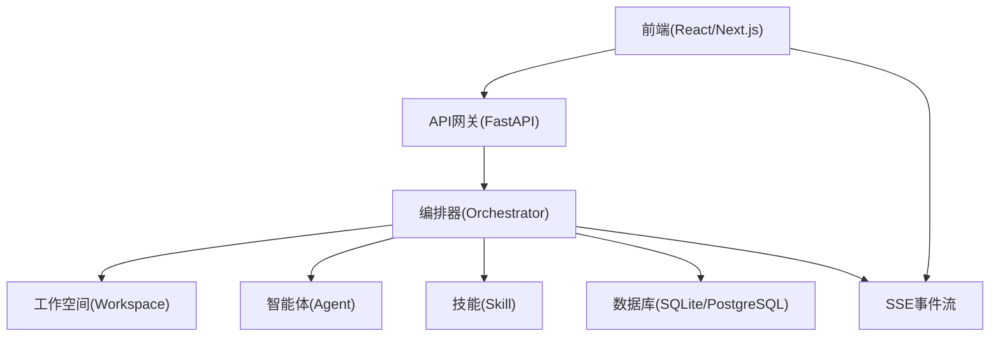
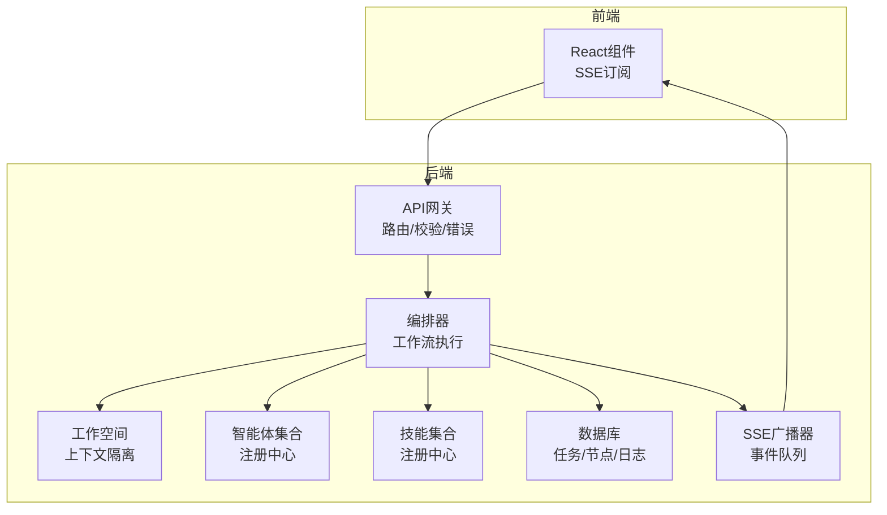
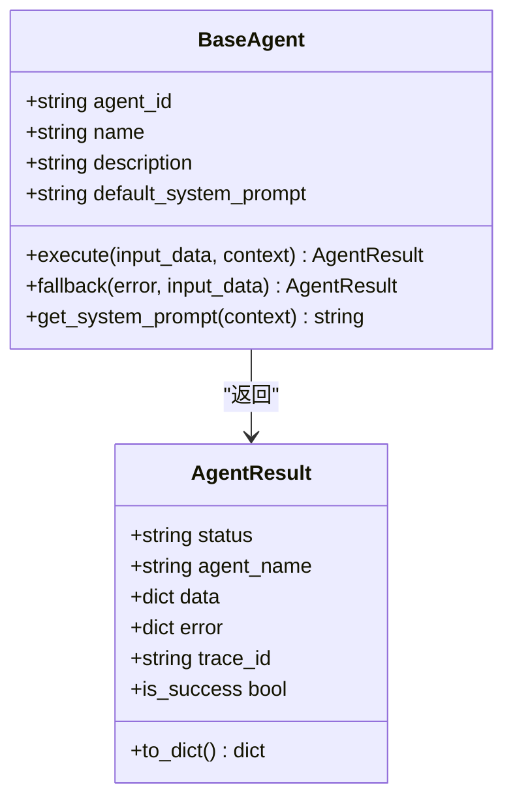
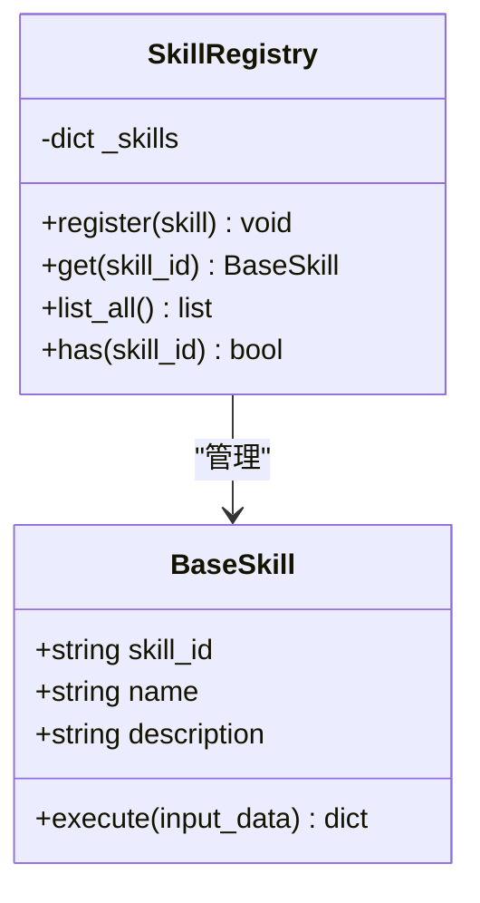
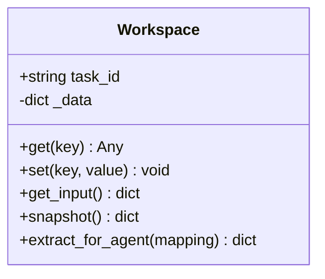
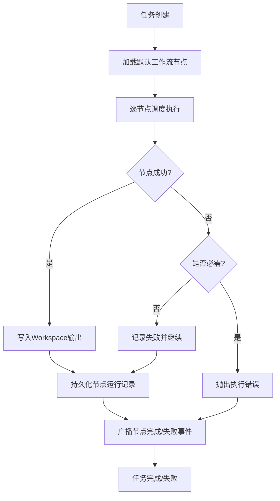
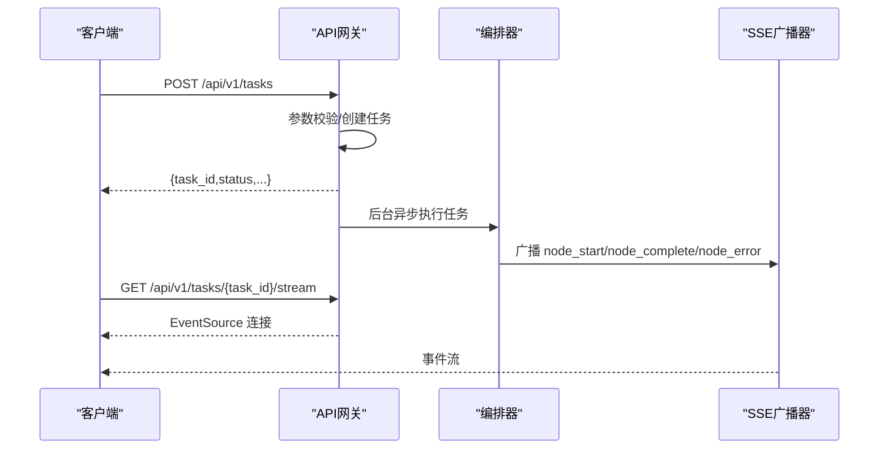
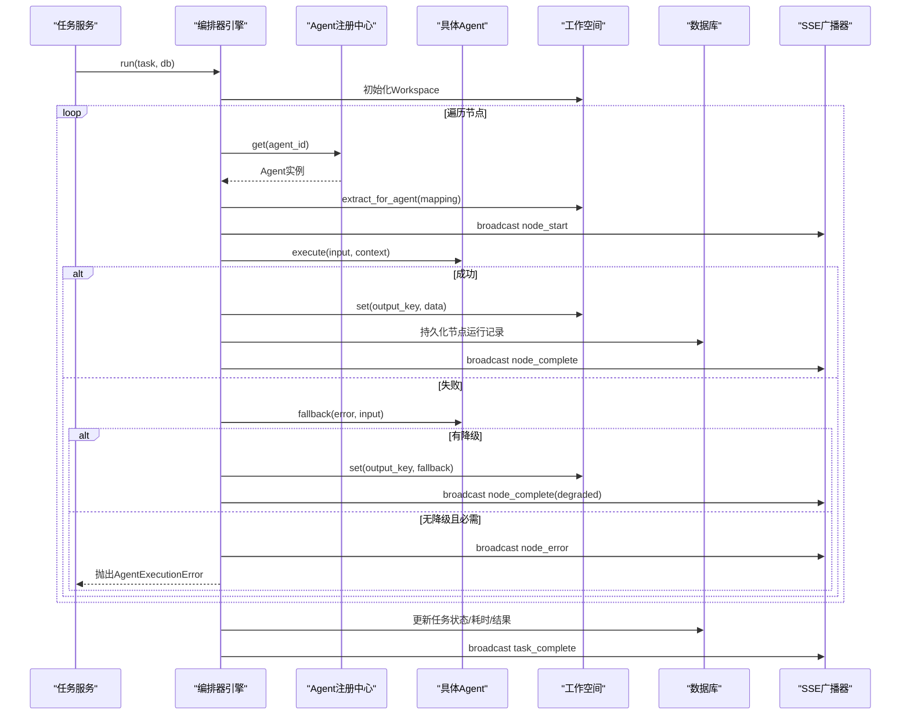
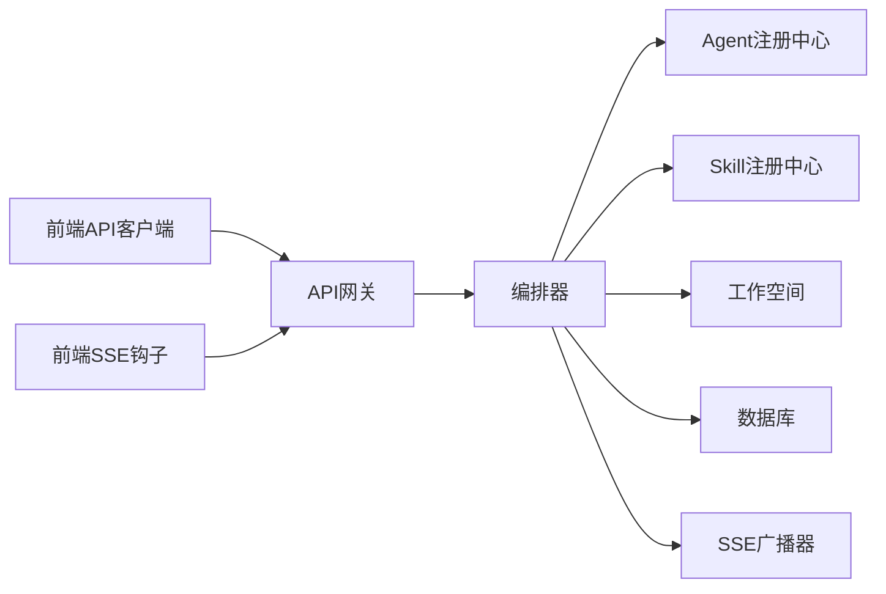

# 核心概念解析

<cite>
**本文档引用的文件**
- [engine.py](file://backend/app/orchestrator/engine.py)
- [workspace.py](file://backend/app/orchestrator/workspace.py)
- [base.py](file://backend/app/agents/base.py)
- [registry.py](file://backend/app/agents/registry.py)
- [base.py](file://backend/app/skills/base.py)
- [registry.py](file://backend/app/skills/registry.py)
- [broadcaster.py](file://backend/app/orchestrator/broadcaster.py)
- [tables.py](file://backend/app/models/tables.py)
- [task_routes.py](file://backend/app/api/task_routes.py)
- [main.py](file://backend/app/main.py)
- [api.ts](file://frontend/lib/api.ts)
- [useTaskSSE.ts](file://frontend/hooks/useTaskSSE.ts)
- [ARCHITECTURE.md](file://ARCHITECTURE.md)
- [Notice.md](file://Notice.md)
</cite>

## 目录
1. [引言](#引言)
2. [项目结构](#项目结构)
3. [核心组件](#核心组件)
4. [架构概览](#架构概览)
5. [详细组件分析](#详细组件分析)
6. [依赖分析](#依赖分析)
7. [性能考虑](#性能考虑)
8. [故障排查指南](#故障排查指南)
9. [结论](#结论)

## 引言
本文件面向HotClaw平台的初学者与开发者，系统性解析多智能体系统中的核心概念：Agent（智能体）、Skill（技能）、Workspace（工作空间）、Workflow（工作流）、Gateway（网关）、Orchestrator（编排器）。通过编辑部类比帮助理解抽象概念，结合实际代码路径展示数据结构、生命周期管理与组件交互关系。

## 项目结构
HotClaw采用前后端分离架构，后端以FastAPI为核心，提供API网关、编排器、Agent与Skill执行层；前端使用React/Next.js消费SSE事件流，实时展示任务执行状态。

**图表来源**
- [main.py:60-142](file://backend/app/main.py#L60-L142)
- [engine.py:89-285](file://backend/app/orchestrator/engine.py#L89-L285)
- [workspace.py:12-53](file://backend/app/orchestrator/workspace.py#L12-L53)
- [broadcaster.py:11-94](file://backend/app/orchestrator/broadcaster.py#L11-L94)

**章节来源**
- [main.py:1-142](file://backend/app/main.py#L1-L142)
- [ARCHITECTURE.md:37-78](file://ARCHITECTURE.md#L37-L78)

## 核心组件
- Agent（智能体）：工作流节点角色，负责单一业务任务，具备明确输入输出，可调用Skill，返回结构化JSON。
- Skill（技能）：无状态工具能力，封装具体技术操作（API调用、数据处理），不参与编排。
- Workspace（工作空间）：任务级上下文容器，隔离与协作的基础单位，支持数据读写与快照。
- Workflow（工作流）：定义Agent执行顺序与依赖关系的DAG结构，MVP阶段为线性链。
- Gateway（网关）：统一入口，负责路由、参数校验、错误格式化与SSE端点。
- Orchestrator（编排器）：工作流执行引擎，加载workflow、调度Agent、管理Workspace、广播状态。

**章节来源**
- [Notice.md:124-164](file://Notice.md#L124-L164)
- [ARCHITECTURE.md:124-135](file://ARCHITECTURE.md#L124-L135)

## 架构概览
HotClaw将“控制平面（编排器）”与“执行平面（Agent/Skill）”分离，Gateway作为唯一入口，Workspace承载任务上下文，Orchestrator驱动Agent按顺序执行并广播节点状态。

**图表来源**
- [main.py:14-137](file://backend/app/main.py#L14-L137)
- [engine.py:89-285](file://backend/app/orchestrator/engine.py#L89-L285)
- [workspace.py:12-53](file://backend/app/orchestrator/workspace.py#L12-L53)
- [broadcaster.py:11-94](file://backend/app/orchestrator/broadcaster.py#L11-L94)

## 详细组件分析

### Agent（智能体）
- 角色定位：工作流节点角色，负责单一业务任务，如账号定位解析、热点分析、选题策划、标题生成、正文生成、审核评估。
- 输入输出：强结构化JSON Schema，避免自由文本传递。
- 能力边界：可调用Skill，不应承担多重职责。
- 统一返回：标准化AgentResult，包含status、agent_name、data/error、trace_id。

**图表来源**
- [base.py:18-99](file://backend/app/agents/base.py#L18-L99)

**章节来源**
- [base.py:1-99](file://backend/app/agents/base.py#L1-L99)
- [Notice.md:126-143](file://Notice.md#L126-L143)

### Skill（技能）
- 角色定位：无状态原子能力，封装具体技术操作（如新闻抓取、摘要、风险检测、标题评分）。
- 能力边界：不参与编排，不单独做决策，输出稳定可复用。
- 注册机制：通过manifest声明式注册，启动时动态加载。

**图表来源**
- [base.py:16-37](file://backend/app/skills/base.py#L16-L37)
- [registry.py:10-37](file://backend/app/skills/registry.py#L10-L37)

**章节来源**
- [base.py:1-37](file://backend/app/skills/base.py#L1-L37)
- [registry.py:1-37](file://backend/app/skills/registry.py#L1-L37)
- [Notice.md:144-158](file://Notice.md#L144-L158)

### Workspace（工作空间）
- 生命周期：随任务创建而初始化，随任务结束而归档。
- 数据隔离：任务级上下文容器，包含输入参数、各Agent输出、中间状态与元数据。
- 读写接口：get/set/snapshot/extraction映射，支持按字段提取供Agent使用。

**图表来源**
- [workspace.py:12-53](file://backend/app/orchestrator/workspace.py#L12-L53)

**章节来源**
- [workspace.py:1-53](file://backend/app/orchestrator/workspace.py#L1-L53)
- [ARCHITECTURE.md:98-110](file://ARCHITECTURE.md#L98-L110)

### Workflow（工作流）
- 结构设计：DAG结构，MVP阶段为线性链，便于理解与调试。
- 节点定义：包含node_id、agent_id、名称、输入映射、输出key、是否必需等。
- 执行顺序：由编排器按节点顺序调度，严格控制Agent执行顺序。

**图表来源**
- [engine.py:31-86](file://backend/app/orchestrator/engine.py#L31-L86)
- [engine.py:92-234](file://backend/app/orchestrator/engine.py#L92-L234)

**章节来源**
- [engine.py:31-86](file://backend/app/orchestrator/engine.py#L31-L86)
- [Notice.md:167-187](file://Notice.md#L167-L187)

### Gateway（网关）
- 统一入口：所有外部请求经API网关进入，负责路由、参数校验、错误格式化。
- SSE端点：提供任务状态事件流，前端通过EventSource订阅。
- 中间件：Trace ID中间件贯穿请求生命周期，便于追踪。

**图表来源**
- [task_routes.py:19-51](file://backend/app/api/task_routes.py#L19-L51)
- [broadcaster.py:30-68](file://backend/app/orchestrator/broadcaster.py#L30-L68)
- [main.py:77-84](file://backend/app/main.py#L77-L84)

**章节来源**
- [task_routes.py:1-163](file://backend/app/api/task_routes.py#L1-L163)
- [main.py:60-142](file://backend/app/main.py#L60-L142)
- [ARCHITECTURE.md:100-101](file://ARCHITECTURE.md#L100-L101)

### Orchestrator（编排器）
- 职责边界：加载workflow、创建Workspace、按顺序调度Agent、管理节点生命周期、广播状态、异常处理与降级。
- 超时与降级：为Agent执行设置超时，失败时触发fallback策略。
- 事件广播：通过SSE广播节点开始、完成、失败与任务完成事件。

**图表来源**
- [engine.py:92-234](file://backend/app/orchestrator/engine.py#L92-L234)
- [registry.py:23-28](file://backend/app/agents/registry.py#L23-L28)
- [broadcaster.py:57-68](file://backend/app/orchestrator/broadcaster.py#L57-L68)

**章节来源**
- [engine.py:89-285](file://backend/app/orchestrator/engine.py#L89-L285)
- [registry.py:1-40](file://backend/app/agents/registry.py#L1-L40)
- [broadcaster.py:1-94](file://backend/app/orchestrator/broadcaster.py#L1-L94)

## 依赖分析
- Agent与Skill解耦：Agent通过注册中心获取实例，Skill通过注册中心获取实例，二者通过标准协议通信。
- 编排器依赖：编排器依赖Agent注册中心、Skill注册中心、Workspace、数据库与SSE广播器。
- 前后端依赖：前端通过API客户端与SSE钩子消费后端服务。

**图表来源**
- [engine.py:18-26](file://backend/app/orchestrator/engine.py#L18-L26)
- [registry.py:3-5](file://backend/app/agents/registry.py#L3-L5)
- [registry.py:3-5](file://backend/app/skills/registry.py#L3-L5)
- [api.ts:1-110](file://frontend/lib/api.ts#L1-L110)
- [useTaskSSE.ts:1-124](file://frontend/hooks/useTaskSSE.ts#L1-L124)

**章节来源**
- [engine.py:18-26](file://backend/app/orchestrator/engine.py#L18-L26)
- [api.ts:1-110](file://frontend/lib/api.ts#L1-L110)
- [useTaskSSE.ts:1-124](file://frontend/hooks/useTaskSSE.ts#L1-L124)

## 性能考虑
- 串行调度：MVP阶段采用线性链式调度，降低并发复杂度，便于监控与调试。
- 超时控制：为Agent执行设置超时，防止长时间阻塞影响整体性能。
- 事件缓冲：SSE广播器对历史事件进行缓冲，解决前端晚到订阅问题，避免重复计算。
- Token统计：节点运行记录中累计prompt与completion token，便于成本控制与优化。

**章节来源**
- [engine.py:236-243](file://backend/app/orchestrator/engine.py#L236-L243)
- [broadcaster.py:22-29](file://backend/app/orchestrator/broadcaster.py#L22-L29)
- [engine.py:211-216](file://backend/app/orchestrator/engine.py#L211-L216)

## 故障排查指南
- 节点失败：编排器捕获Agent执行异常与超时，记录错误信息并根据required字段决定是否中断任务。
- 降级策略：Agent可提供fallback方法，在失败时返回默认值或降级结果，避免整条链路崩溃。
- 事件监听：前端通过SSE钩子监听node_error与task_error事件，及时反馈错误信息。
- 日志追踪：每个任务与节点均携带trace_id，便于跨服务追踪与问题定位。

**章节来源**
- [engine.py:176-196](file://backend/app/orchestrator/engine.py#L176-L196)
- [base.py:77-82](file://backend/app/agents/base.py#L77-L82)
- [useTaskSSE.ts:91-111](file://frontend/hooks/useTaskSSE.ts#L91-L111)
- [Notice.md:342-370](file://Notice.md#L342-L370)

## 结论
HotClaw通过清晰的概念划分与严格的分层设计，实现了从账号定位到文章草稿的全链路自动化。Agent与Skill职责明确、Workspace隔离上下文、Gateway统一入口、Orchestrator严格调度，配合SSE事件流实现可视化运行与可观测性。建议在后续版本中逐步引入DAG工作流编辑器与插件机制，以满足更复杂的业务场景。