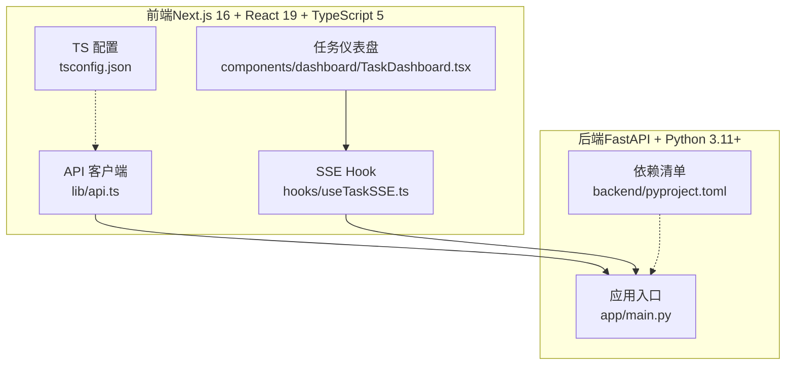
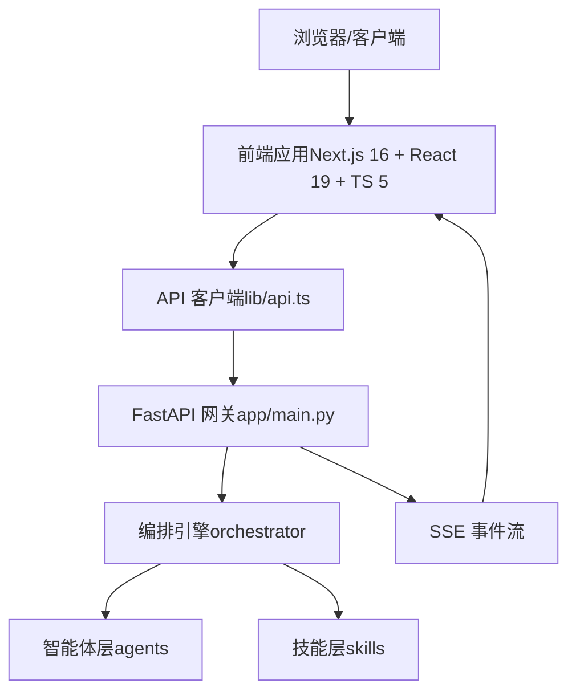
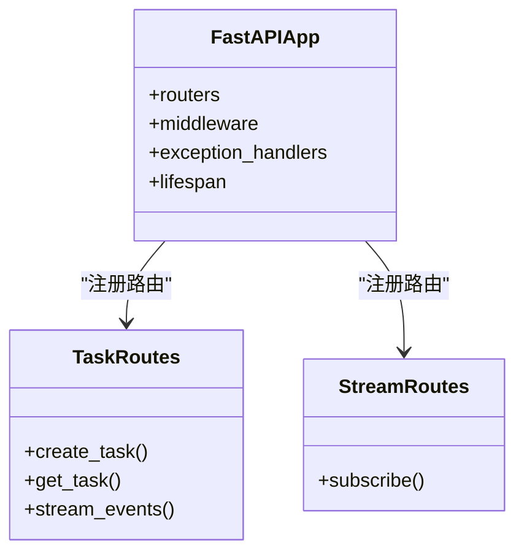
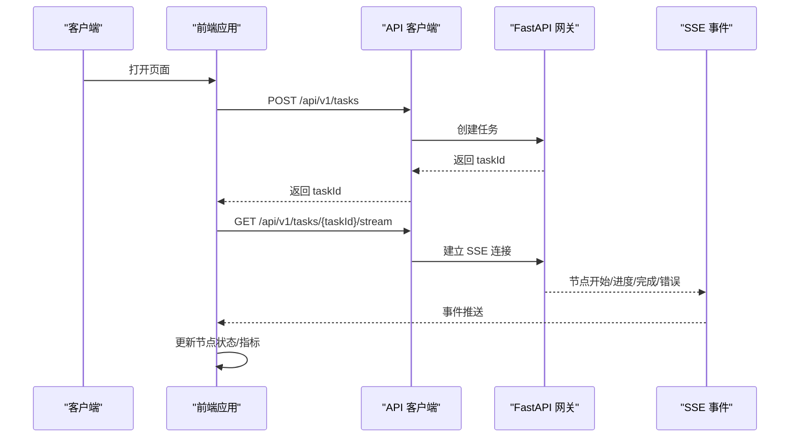
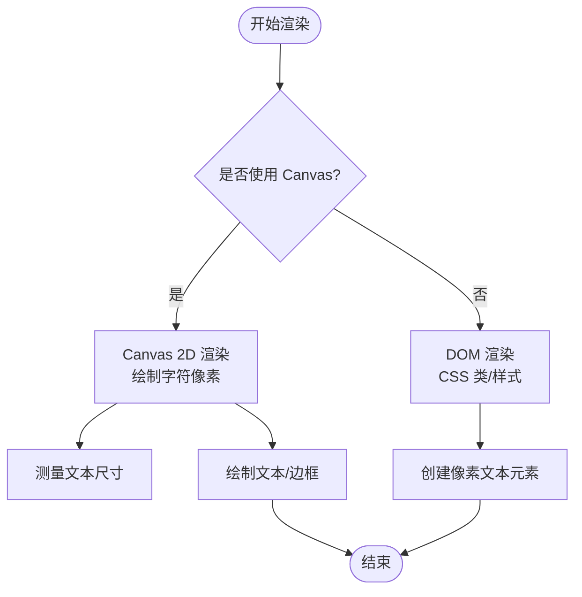
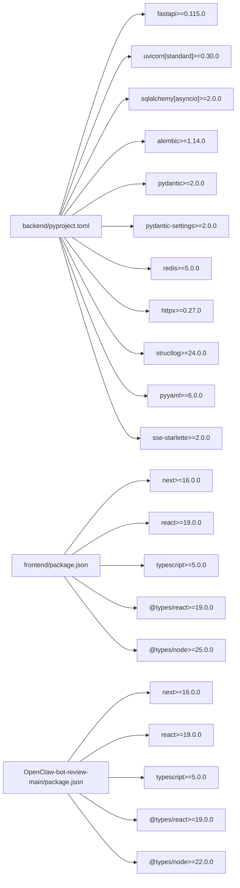

# 技术栈选择

<cite>
**本文引用的文件**
- [ARCHITECTURE.md](file://ARCHITECTURE.md)
- [pyproject.toml](file://backend/pyproject.toml)
- [package.json](file://frontend/package.json)
- [package.json](file://OpenClaw-bot-review-main/package.json)
- [tsconfig.json](file://frontend/tsconfig.json)
- [main.py](file://backend/app/main.py)
- [api.ts](file://frontend/lib/api.ts)
- [useTaskSSE.ts](file://frontend/hooks/useTaskSSE.ts)
- [TaskDashboard.tsx](file://frontend/components/dashboard/TaskDashboard.tsx)
- [PixelFontSystem.ts](file://frontend/lib/pixel-font/PixelFontSystem.ts)
</cite>

## 目录
1. [引言](#引言)
2. [项目结构](#项目结构)
3. [核心组件](#核心组件)
4. [架构总览](#架构总览)
5. [详细组件分析](#详细组件分析)
6. [依赖分析](#依赖分析)
7. [性能考量](#性能考量)
8. [故障排查指南](#故障排查指南)
9. [结论](#结论)
10. [附录](#附录)

## 引言
本文件围绕 HotClaw 系统的技术栈选择进行深入分析，重点解释后端 Python 3.11+ 与 FastAPI、前端 React 18 + TypeScript 的选型理由与优势，并结合项目实际代码体现技术栈如何支撑多智能体协作、实时通信与可视化需求。同时提供版本兼容性信息、升级路径建议以及对开发效率、部署复杂度与维护成本的影响评估。

## 项目结构
HotClaw 采用前后端分离架构：前端使用 Next.js 16（React 19）、TypeScript 5，后端使用 FastAPI 0.115+、Python 3.11+。整体结构清晰，职责边界明确，便于并行开发与演进。

**图表来源**
- [main.py:69-153](file://backend/app/main.py#L69-L153)
- [api.ts:14-55](file://frontend/lib/api.ts#L14-L55)
- [useTaskSSE.ts:60-140](file://frontend/hooks/useTaskSSE.ts#L60-L140)
- [TaskDashboard.tsx:21-176](file://frontend/components/dashboard/TaskDashboard.tsx#L21-L176)
- [tsconfig.json:1-42](file://frontend/tsconfig.json#L1-L42)
- [pyproject.toml:1-41](file://backend/pyproject.toml#L1-L41)

**章节来源**
- [ARCHITECTURE.md:191-240](file://ARCHITECTURE.md#L191-L240)
- [pyproject.toml:1-41](file://backend/pyproject.toml#L1-L41)
- [package.json:1-23](file://frontend/package.json#L1-L23)
- [package.json:1-23](file://OpenClaw-bot-review-main/package.json#L1-L23)
- [tsconfig.json:1-42](file://frontend/tsconfig.json#L1-L42)

## 核心组件
- 后端框架：FastAPI 0.115+，提供异步支持、自动 OpenAPI 文档与 SSE 能力，满足实时事件推送与高性能 API 场景。
- 语言与生态：Python 3.11+，面向 AI/LLM 的生态最成熟，SDK 丰富，便于集成多模型供应商。
- ORM 与迁移：SQLAlchemy 2.0 + alembic，异步 ORM 与数据库迁移工具链成熟稳定。
- 实时通信：SSE（Server-Sent Events）用于节点状态与任务进度的单向推送，简化实现与调试。
- 前端框架：Next.js 16（React 19）、TypeScript 5，构建快速、类型安全、生态完善。
- 可视化与像素风格：自研像素字体渲染系统（Canvas 2D），满足特定视觉风格与性能要求。

**章节来源**
- [ARCHITECTURE.md:401-448](file://ARCHITECTURE.md#L401-L448)
- [ARCHITECTURE.md:191-240](file://ARCHITECTURE.md#L191-L240)
- [pyproject.toml:6-22](file://backend/pyproject.toml#L6-L22)
- [package.json:11-21](file://frontend/package.json#L11-L21)

## 架构总览
HotClaw 的前后端技术栈服务于“多智能体内容生产”的核心目标：前端负责可视化与交互，后端负责智能体编排与实时事件广播。SSE 使前端能够实时消费节点状态，形成流畅的用户体验。

**图表来源**
- [main.py:69-153](file://backend/app/main.py#L69-L153)
- [api.ts:14-55](file://frontend/lib/api.ts#L14-L55)
- [useTaskSSE.ts:60-140](file://frontend/hooks/useTaskSSE.ts#L60-L140)

**章节来源**
- [ARCHITECTURE.md:37-78](file://ARCHITECTURE.md#L37-L78)
- [ARCHITECTURE.md:449-494](file://ARCHITECTURE.md#L449-L494)

## 详细组件分析

### 后端技术栈（Python 3.11+ 与 FastAPI）
- 语言选择：Python 3.11+，AI/LLM 生态最佳，多模型 SDK 与工具链成熟，便于统一调用与治理。
- Web 框架：FastAPI 0.115+，异步原生支持、自动 OpenAPI 文档、SSE 支持良好，适配本项目的事件驱动特性。
- ORM 与迁移：SQLAlchemy 2.0 + alembic，异步 ORM 与迁移工具成熟，保障数据一致性与演进能力。
- 实时事件：SSE（s-se-starlette）用于节点状态与任务完成事件推送，前端通过 EventSource 接收。
- 配置与校验：pydantic v2 与 pydantic-settings，与 FastAPI 无缝集成，确保输入输出结构化与强约束。
- 依赖管理：pyproject.toml 清晰列出核心依赖，便于版本锁定与升级规划。

**图表来源**
- [main.py:14-21](file://backend/app/main.py#L14-L21)
- [main.py:69-153](file://backend/app/main.py#L69-L153)

**章节来源**
- [pyproject.toml:6-22](file://backend/pyproject.toml#L6-L22)
- [main.py:69-153](file://backend/app/main.py#L69-L153)

### 前端技术栈（React 18 + TypeScript）
- 框架与构建：Next.js 16（React 19）、TypeScript 5，类型安全与快速开发体验兼顾。
- 实时通信：SSE（EventSource）用于订阅后端节点事件，前端 Hook 管理连接生命周期与状态。
- 可视化组件：任务仪表盘组件基于节点状态计算实时指标，SVG 绘制进度环，像素风格字体系统用于特定 UI 元素。
- 配置与类型：tsconfig.json 严格配置，确保类型检查与模块解析一致性。

**图表来源**
- [api.ts:26-55](file://frontend/lib/api.ts#L26-L55)
- [useTaskSSE.ts:60-140](file://frontend/hooks/useTaskSSE.ts#L60-L140)
- [main.py:142-147](file://backend/app/main.py#L142-L147)

**章节来源**
- [ARCHITECTURE.md:325-360](file://ARCHITECTURE.md#L325-L360)
- [api.ts:14-55](file://frontend/lib/api.ts#L14-L55)
- [useTaskSSE.ts:28-143](file://frontend/hooks/useTaskSSE.ts#L28-L143)
- [TaskDashboard.tsx:21-176](file://frontend/components/dashboard/TaskDashboard.tsx#L21-L176)
- [tsconfig.json:1-42](file://frontend/tsconfig.json#L1-L42)

### 可视化与像素风格（Canvas 2D）
- 像素字体系统：通过 Canvas 2D 绘制 8x8 像素字符，支持缩放、间距、边框与背景，满足复古像素风格需求。
- DOM 替代方案：提供 CSS 类与内联样式方法，用于非 Canvas 场景的文字渲染。
- 性能与一致性：Canvas 方案在高频刷新与大规模文本渲染时具备更佳性能，CSS 方案更易与现有 UI 组件融合。

**图表来源**
- [PixelFontSystem.ts:410-441](file://frontend/lib/pixel-font/PixelFontSystem.ts#L410-L441)
- [PixelFontSystem.ts:518-537](file://frontend/lib/pixel-font/PixelFontSystem.ts#L518-L537)

**章节来源**
- [PixelFontSystem.ts:1-579](file://frontend/lib/pixel-font/PixelFontSystem.ts#L1-L579)

### 技术栈对比与替代方案
- 前端替代方案
  - Vue 3 + TypeScript：生态成熟，但本项目已采用 React 生态，迁移成本较高。
  - SvelteKit：构建更快，但与现有 React 组件与工具链整合成本更高。
  - Vite + React：构建体验好，但 Next.js 提供 SSR/静态导出与路由约定，更适合当前项目形态。
- 后端替代方案
  - Django + DRF：生态成熟，但异步与 SSE 支持不如 FastAPI 原生友好。
  - Tornado：异步性能好，但缺少自动文档与生态协同。
  - Quart：与 Flask 类似，生态与 FastAPI 相比略逊。
- 实时通信替代方案
  - WebSocket：双向通信能力强，但本项目为单向事件推送，SSE 更简单可靠。
  - gRPC/长轮询：复杂度与延迟均不如 SSE。
- 像素风格替代方案
  - SVG 字体/位图：可复用性强，但 Canvas 在高频刷新场景性能更优。
  - CSS 字体：无法保证像素风格的一致性与可控性。

**章节来源**
- [ARCHITECTURE.md:191-240](file://ARCHITECTURE.md#L191-L240)
- [pyproject.toml:6-22](file://backend/pyproject.toml#L6-L22)
- [package.json:11-21](file://frontend/package.json#L11-L21)

### 版本兼容性与升级路径
- Python 3.11+
  - 升级路径：从 3.11.x 平滑升级至 3.12.x，注意第三方库的兼容性矩阵。
  - 影响范围：LLM SDK、SQLAlchemy、Redis、httpx 等。
- FastAPI 0.115+
  - 升级路径：遵循语义化版本，先在测试环境验证，再灰度上线。
  - 影响范围：路由装饰器、依赖注入、异常处理与中间件。
- Next.js 16 + React 19 + TypeScript 5
  - 升级路径：先升级 TypeScript，再升级 React 与 Next.js，确保类型与组件 API 兼容。
  - 影响范围：Hooks、Suspense、SSR 行为与构建产物。
- SQLAlchemy 2.0 + alembic
  - 升级路径：关注异步 ORM API 变化与迁移脚本语法。
  - 影响范围：模型定义、会话管理与迁移命令。
- SSE 与浏览器兼容
  - EventSource 在现代浏览器中广泛支持，注意跨域与代理配置。

**章节来源**
- [pyproject.toml:5-22](file://backend/pyproject.toml#L5-L22)
- [package.json:11-21](file://frontend/package.json#L11-L21)
- [tsconfig.json:1-42](file://frontend/tsconfig.json#L1-L42)

### 开发效率、部署复杂度与维护成本
- 开发效率
  - 前端：TypeScript 类型安全减少运行时错误；Next.js 提供路由、SSR、静态优化。
  - 后端：FastAPI 自动生成 API 文档，SSE 简化实时事件；Pydantic 强约束降低数据歧义。
- 部署复杂度
  - 前端：Next.js 构建产物可静态部署，部署门槛低。
  - 后端：FastAPI + uvicorn 标准部署，容器化友好；SSE 与 CORS 配置需注意。
- 维护成本
  - 依赖版本集中管理（pyproject.toml、package.json），升级与回滚可控。
  - 结构化输入输出与统一异常处理降低维护成本。

**章节来源**
- [ARCHITECTURE.md:80-89](file://ARCHITECTURE.md#L80-L89)
- [pyproject.toml:1-41](file://backend/pyproject.toml#L1-L41)
- [package.json:1-23](file://frontend/package.json#L1-L23)

## 依赖分析
后端与前端的关键依赖关系如下：

**图表来源**
- [pyproject.toml:6-22](file://backend/pyproject.toml#L6-L22)
- [package.json:11-21](file://frontend/package.json#L11-L21)
- [package.json:11-21](file://OpenClaw-bot-review-main/package.json#L11-L21)

**章节来源**
- [pyproject.toml:1-41](file://backend/pyproject.toml#L1-L41)
- [package.json:1-23](file://frontend/package.json#L1-L23)
- [package.json:1-23](file://OpenClaw-bot-review-main/package.json#L1-L23)

## 性能考量
- 后端性能
  - FastAPI 异步原生支持与 uvicorn 高性能 ASGI 服务器，适合高并发请求与 SSE。
  - SQLAlchemy 2.0 异步 ORM 降低数据库 I/O 阻塞，配合连接池提升吞吐。
  - SSE 单向推送避免 WebSocket 双工复杂度，事件粒度细、内存占用低。
- 前端性能
  - Next.js 16 的 Turbopack 与 React 19 的并发特性提升开发与运行时性能。
  - SSE 事件流在浏览器端由 EventSource 自动重连与背压处理，稳定性高。
  - 像素字体系统在 Canvas 上绘制，适合高频刷新与大规模文本渲染场景。
- 可扩展性
  - 模块化设计（agents/skills/orchestrator/services/models/schemas）便于横向扩展与替换。
  - 声明式配置（manifest）与结构化输入输出，降低耦合度与变更风险。

[本节为通用性能讨论，无需引用具体文件]

## 故障排查指南
- SSE 连接问题
  - 检查后端 CORS 配置与 SSE 路由注册，确认浏览器与后端端口一致。
  - 前端 EventSource 是否正确实例化与监听事件类型。
- API 请求失败
  - 校验请求头 Content-Type 与后端异常处理器返回码映射。
  - 检查 trace_id 头部与日志输出，定位具体错误。
- 像素字体渲染异常
  - Canvas 上下文是否存在；缩放与间距参数是否合理；字符映射表是否覆盖所需字符。

**章节来源**
- [main.py:76-93](file://backend/app/main.py#L76-L93)
- [main.py:96-138](file://backend/app/main.py#L96-L138)
- [api.ts:14-24](file://frontend/lib/api.ts#L14-L24)
- [useTaskSSE.ts:60-140](file://frontend/hooks/useTaskSSE.ts#L60-L140)

## 结论
HotClaw 的技术栈选择以“AI 生态友好、实时通信简洁、可视化可控”为核心目标。后端采用 Python 3.11+ 与 FastAPI，满足多智能体编排与 SSE 推送；前端采用 Next.js 16 + React 19 + TypeScript 5，提供类型安全与高效开发体验。像素字体系统通过 Canvas 2D 实现高性能与一致性的复古风格渲染。整体技术栈在开发效率、部署复杂度与维护成本之间取得良好平衡，并为后续扩展（如 DAG 工作流、多前端形态）预留空间。

[本节为总结性内容，无需引用具体文件]

## 附录
- 关键实现参考
  - 后端应用入口与中间件：[main.py:69-153](file://backend/app/main.py#L69-L153)
  - 前端 API 客户端与 SSE Hook：[api.ts:14-55](file://frontend/lib/api.ts#L14-L55)、[useTaskSSE.ts:28-143](file://frontend/hooks/useTaskSSE.ts#L28-L143)
  - 像素字体渲染系统：[PixelFontSystem.ts:410-441](file://frontend/lib/pixel-font/PixelFontSystem.ts#L410-L441)

[本节为补充说明，无需引用具体文件]