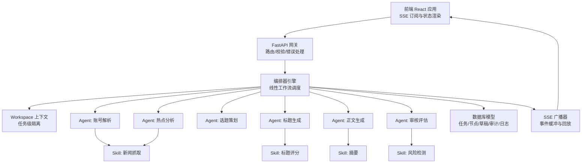
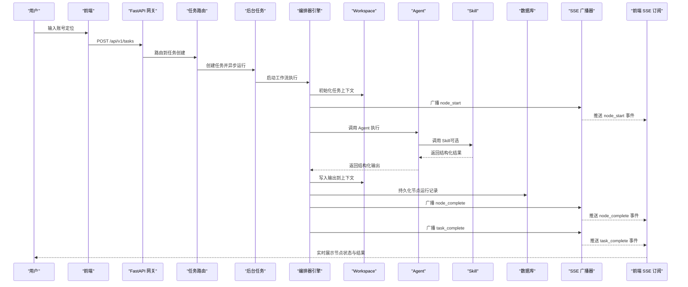
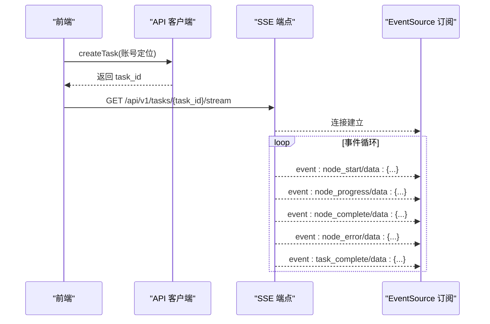
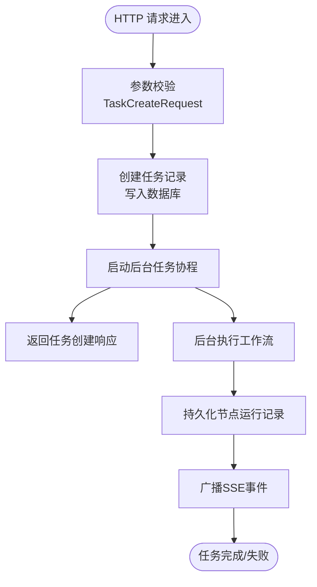
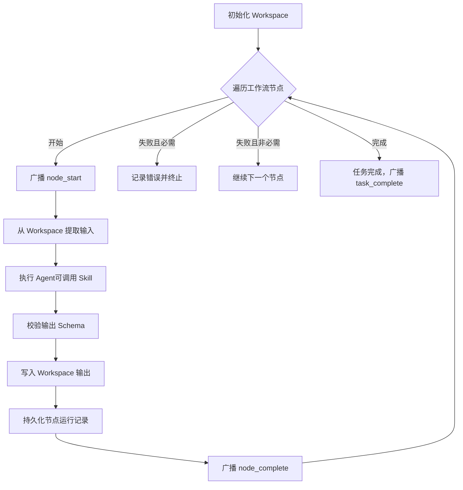
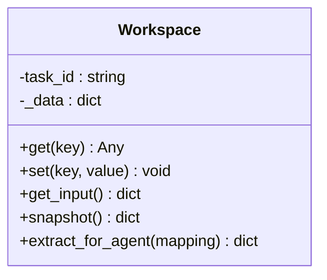
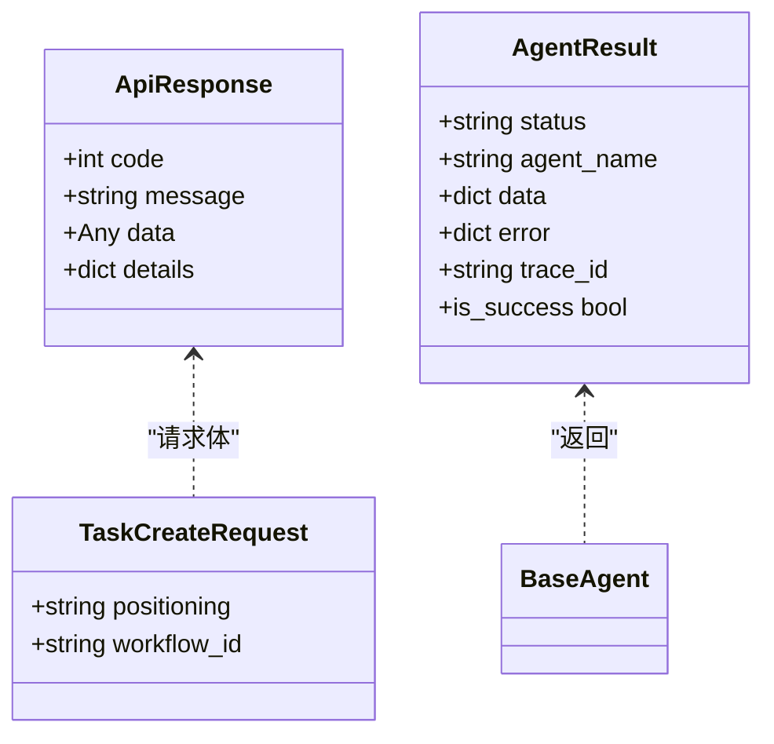
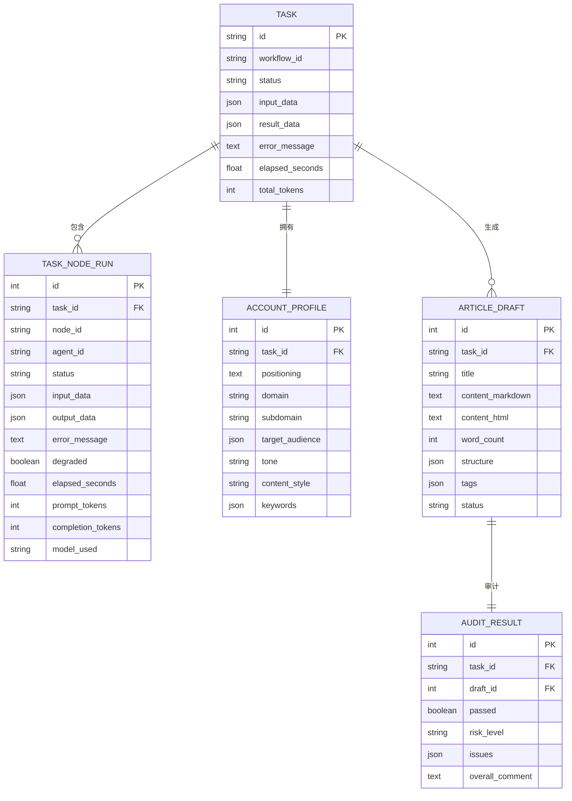
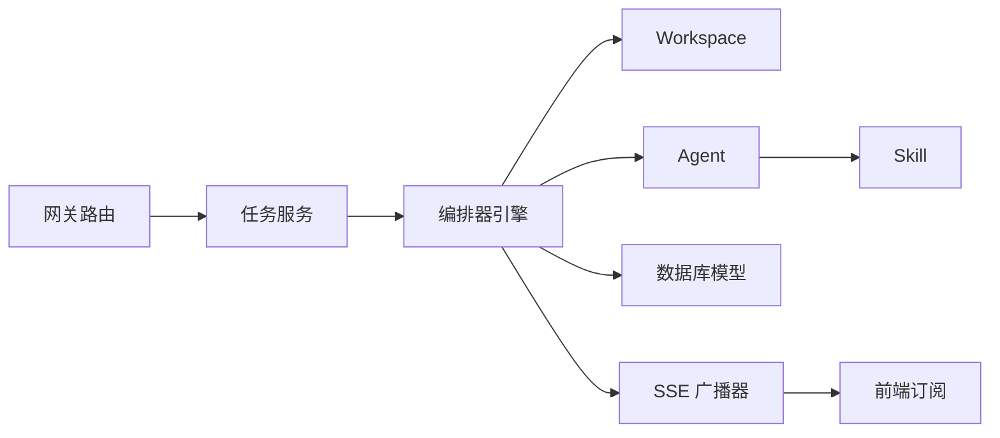

# 数据流架构

<cite>
**本文引用的文件**
- [ARCHITECTURE.md](file://ARCHITECTURE.md)
- [backend/app/main.py](file://backend/app/main.py)
- [backend/app/api/task_routes.py](file://backend/app/api/task_routes.py)
- [backend/app/api/stream_routes.py](file://backend/app/api/stream_routes.py)
- [backend/app/orchestrator/engine.py](file://backend/app/orchestrator/engine.py)
- [backend/app/orchestrator/workspace.py](file://backend/app/orchestrator/workspace.py)
- [backend/app/orchestrator/broadcaster.py](file://backend/app/orchestrator/broadcaster.py)
- [backend/app/models/tables.py](file://backend/app/models/tables.py)
- [backend/app/schemas/task.py](file://backend/app/schemas/task.py)
- [backend/app/schemas/common.py](file://backend/app/schemas/common.py)
- [backend/app/schemas/agent.py](file://backend/app/schemas/agent.py)
- [backend/app/agents/base.py](file://backend/app/agents/base.py)
- [frontend/lib/api.ts](file://frontend/lib/api.ts)
- [frontend/hooks/useTaskSSE.ts](file://frontend/hooks/useTaskSSE.ts)
- [frontend/types/index.ts](file://frontend/types/index.ts)
</cite>

## 目录
1. [简介](#简介)
2. [项目结构](#项目结构)
3. [核心组件](#核心组件)
4. [架构总览](#架构总览)
5. [详细组件分析](#详细组件分析)
6. [依赖分析](#依赖分析)
7. [性能考量](#性能考量)
8. [故障排查指南](#故障排查指南)
9. [结论](#结论)
10. [附录](#附录)

## 简介
本文件面向HotClaw系统，系统性阐述数据从“前端用户输入”到“后端Agent执行”，再到“结果输出”的完整数据流。重点覆盖：
- 数据产生与采集：前端输入、任务创建、参数校验
- 数据传输与路由：HTTP + SSE事件流
- 数据处理与编排：工作流引擎、Agent执行、降级策略
- 数据存储与持久化：数据库模型、节点运行记录、回放能力
- 实时性与可回放：SSE事件推送、历史缓冲、任务级追踪
- 结构化输入输出Schema：确保一致性与可验证性
- 调试与监控最佳实践：日志、追踪、错误映射

## 项目结构
HotClaw采用前后端分离架构，后端以FastAPI为核心，前端以React为主。数据流贯穿以下层次：
- 前端层：React应用，负责用户交互、SSE订阅、状态渲染
- 网关层：FastAPI路由，统一入口、参数校验、错误格式化
- 编排层：工作流引擎，按线性DAG调度Agent，管理Workspace上下文
- 执行层：Agent与Skill，执行具体业务任务
- 存储层：SQLite + SQLAlchemy，持久化任务、节点运行、配置与日志



图表来源
- [backend/app/main.py:14-29](file://backend/app/main.py#L14-L29)
- [backend/app/api/task_routes.py:39-67](file://backend/app/api/task_routes.py#L39-L67)
- [backend/app/orchestrator/engine.py:92-234](file://backend/app/orchestrator/engine.py#L92-L234)
- [backend/app/orchestrator/workspace.py:12-52](file://backend/app/orchestrator/workspace.py#L12-L52)
- [backend/app/orchestrator/broadcaster.py:11-98](file://backend/app/orchestrator/broadcaster.py#L11-L98)
- [backend/app/models/tables.py:23-157](file://backend/app/models/tables.py#L23-L157)

章节来源
- [ARCHITECTURE.md:37-78](file://ARCHITECTURE.md#L37-L78)
- [backend/app/main.py:69-83](file://backend/app/main.py#L69-L83)

## 核心组件
- 前端API客户端：负责创建任务、拉取任务详情、订阅SSE事件
- 任务路由：创建任务、查询状态、查询节点明细、分页列表
- SSE路由：基于EventSourceResponse的SSE端点
- 编排器引擎：加载默认工作流、逐节点调度Agent、广播事件、持久化节点运行
- Workspace：任务级上下文容器，支持提取与写入
- 广播器：按任务维护事件队列，支持历史回放与连接保活
- 数据模型：任务、节点运行、账号画像、候选主题、文章草稿、审计结果、系统日志、系统配置、LLM Provider
- Schema：统一响应包装、任务请求/响应、通用错误、Agent配置

章节来源
- [frontend/lib/api.ts:26-55](file://frontend/lib/api.ts#L26-L55)
- [backend/app/api/task_routes.py:39-179](file://backend/app/api/task_routes.py#L39-L179)
- [backend/app/api/stream_routes.py:14-42](file://backend/app/api/stream_routes.py#L14-L42)
- [backend/app/orchestrator/engine.py:92-234](file://backend/app/orchestrator/engine.py#L92-L234)
- [backend/app/orchestrator/workspace.py:12-52](file://backend/app/orchestrator/workspace.py#L12-L52)
- [backend/app/orchestrator/broadcaster.py:11-98](file://backend/app/orchestrator/broadcaster.py#L11-L98)
- [backend/app/models/tables.py:23-319](file://backend/app/models/tables.py#L23-L319)
- [backend/app/schemas/common.py:7-27](file://backend/app/schemas/common.py#L7-L27)
- [backend/app/schemas/task.py:10-83](file://backend/app/schemas/task.py#L10-L83)
- [backend/app/schemas/agent.py:6-29](file://backend/app/schemas/agent.py#L6-L29)
- [backend/app/agents/base.py:18-99](file://backend/app/agents/base.py#L18-L99)

## 架构总览
HotClaw的数据流遵循“结构化输入输出 + 事件驱动 + 任务级追踪”的设计原则。整体流程如下：



图表来源
- [backend/app/api/task_routes.py:39-67](file://backend/app/api/task_routes.py#L39-L67)
- [backend/app/orchestrator/engine.py:92-234](file://backend/app/orchestrator/engine.py#L92-L234)
- [backend/app/orchestrator/broadcaster.py:57-68](file://backend/app/orchestrator/broadcaster.py#L57-L68)
- [backend/app/api/stream_routes.py:14-42](file://backend/app/api/stream_routes.py#L14-L42)
- [frontend/hooks/useTaskSSE.ts:64-133](file://frontend/hooks/useTaskSSE.ts#L64-L133)

## 详细组件分析

### 1) 前端数据流与SSE订阅
- 前端通过API客户端创建任务，随后建立SSE连接订阅任务事件流
- SSE事件类型包括节点开始、节点进度、节点完成、节点错误、任务完成、任务错误
- 前端根据事件更新节点状态、耗时、降级标记与输出摘要



图表来源
- [frontend/lib/api.ts:26-55](file://frontend/lib/api.ts#L26-L55)
- [frontend/hooks/useTaskSSE.ts:64-133](file://frontend/hooks/useTaskSSE.ts#L64-L133)
- [backend/app/api/stream_routes.py:14-42](file://backend/app/api/stream_routes.py#L14-L42)

章节来源
- [frontend/lib/api.ts:26-55](file://frontend/lib/api.ts#L26-L55)
- [frontend/hooks/useTaskSSE.ts:28-143](file://frontend/hooks/useTaskSSE.ts#L28-L143)
- [frontend/types/index.ts:66-94](file://frontend/types/index.ts#L66-L94)

### 2) 后端任务创建与异步执行
- 网关接收任务创建请求，参数校验通过后创建任务记录并立即返回
- 后台任务在独立协程中运行，避免阻塞HTTP响应
- 任务状态与节点运行记录在数据库中持久化，供查询与回放



图表来源
- [backend/app/api/task_routes.py:39-67](file://backend/app/api/task_routes.py#L39-L67)
- [backend/app/models/tables.py:23-73](file://backend/app/models/tables.py#L23-L73)

章节来源
- [backend/app/api/task_routes.py:39-103](file://backend/app/api/task_routes.py#L39-L103)
- [backend/app/schemas/task.py:10-40](file://backend/app/schemas/task.py#L10-L40)

### 3) 工作流编排与Agent执行
- 编排器加载默认线性工作流，按顺序调度Agent
- 每个节点执行前从Workspace提取输入，执行后写回输出
- 广播节点开始/完成事件，记录耗时、Token用量、降级标记
- 节点失败时触发降级策略，必要时终止任务



图表来源
- [backend/app/orchestrator/engine.py:92-234](file://backend/app/orchestrator/engine.py#L92-L234)
- [backend/app/orchestrator/workspace.py:36-52](file://backend/app/orchestrator/workspace.py#L36-L52)
- [backend/app/orchestrator/broadcaster.py:57-68](file://backend/app/orchestrator/broadcaster.py#L57-L68)

章节来源
- [backend/app/orchestrator/engine.py:92-234](file://backend/app/orchestrator/engine.py#L92-L234)
- [backend/app/orchestrator/workspace.py:12-52](file://backend/app/orchestrator/workspace.py#L12-L52)
- [backend/app/agents/base.py:49-99](file://backend/app/agents/base.py#L49-L99)

### 4) SSE事件流与数据推送策略
- 广播器按任务维护事件队列，支持历史回放与连接保活
- 订阅端断开自动清理，结束信号用于关闭流
- 事件类型与负载结构在前端类型定义中对齐

```mermaid
classDiagram
class SSEBroadcaster {
-_subscribers : dict
-_history : dict
-_closed : dict
+subscribe(task_id) Queue
+unsubscribe(task_id, queue) void
+broadcast(task_id, event, data) void
+close_task(task_id) void
+format_sse(event, data) string
}
class StreamRoutes {
+GET /tasks/{task_id}/stream
}
SSEBroadcaster <.. StreamRoutes : "订阅/推送"
```

图表来源
- [backend/app/orchestrator/broadcaster.py:11-98](file://backend/app/orchestrator/broadcaster.py#L11-L98)
- [backend/app/api/stream_routes.py:14-42](file://backend/app/api/stream_routes.py#L14-L42)

章节来源
- [backend/app/orchestrator/broadcaster.py:11-98](file://backend/app/orchestrator/broadcaster.py#L11-L98)
- [backend/app/api/stream_routes.py:14-42](file://backend/app/api/stream_routes.py#L14-L42)
- [frontend/hooks/useTaskSSE.ts:64-133](file://frontend/hooks/useTaskSSE.ts#L64-L133)

### 5) Workspace上下文传递
- Workspace为任务级上下文容器，支持读取/写入/快照
- Agent输入通过映射从Workspace抽取，输出写回指定key
- 支持对原始输入的引用（如input.positioning）



图表来源
- [backend/app/orchestrator/workspace.py:12-52](file://backend/app/orchestrator/workspace.py#L12-L52)

章节来源
- [backend/app/orchestrator/workspace.py:12-52](file://backend/app/orchestrator/workspace.py#L12-L52)

### 6) 结构化输入输出Schema
- 统一响应包装：code/message/data/details
- 任务Schema：创建请求、状态响应、节点运行、任务详情、分页
- Agent配置Schema：模型配置、提示词模板、重试配置
- Agent基类：标准化执行结果（成功/失败、trace_id、data/error）



图表来源
- [backend/app/schemas/common.py:7-27](file://backend/app/schemas/common.py#L7-L27)
- [backend/app/schemas/task.py:10-83](file://backend/app/schemas/task.py#L10-L83)
- [backend/app/schemas/agent.py:6-29](file://backend/app/schemas/agent.py#L6-L29)
- [backend/app/agents/base.py:18-99](file://backend/app/agents/base.py#L18-L99)

章节来源
- [backend/app/schemas/common.py:7-27](file://backend/app/schemas/common.py#L7-L27)
- [backend/app/schemas/task.py:10-83](file://backend/app/schemas/task.py#L10-L83)
- [backend/app/schemas/agent.py:6-29](file://backend/app/schemas/agent.py#L6-L29)
- [backend/app/agents/base.py:18-99](file://backend/app/agents/base.py#L18-L99)

### 7) 数据模型与持久化
- 任务模型：任务生命周期、状态、输入/结果、耗时、Token统计
- 节点运行模型：节点状态、输入/输出、耗时、Token、错误信息、降级标记
- 业务实体：账号画像、候选主题、文章草稿、审计结果
- 系统日志与配置：结构化日志、系统配置、LLM Provider



图表来源
- [backend/app/models/tables.py:23-157](file://backend/app/models/tables.py#L23-L157)

章节来源
- [backend/app/models/tables.py:23-319](file://backend/app/models/tables.py#L23-L319)

## 依赖分析
- 组件耦合
  - 网关层仅负责路由与校验，业务逻辑在服务层与编排层
  - 编排器与Agent解耦，通过标准协议通信（输入/输出Schema）
  - 广播器与编排器弱耦合，仅通过事件接口交互
- 外部依赖
  - SSE依赖：sset-starlette
  - 数据库：SQLAlchemy + SQLite
  - 日志与追踪：结构化日志、trace_id传播
- 循环依赖
  - 未发现循环导入；模块职责清晰，分层明确



图表来源
- [backend/app/main.py:14-29](file://backend/app/main.py#L14-L29)
- [backend/app/api/task_routes.py:39-67](file://backend/app/api/task_routes.py#L39-L67)
- [backend/app/orchestrator/engine.py:92-234](file://backend/app/orchestrator/engine.py#L92-L234)
- [backend/app/orchestrator/broadcaster.py:11-98](file://backend/app/orchestrator/broadcaster.py#L11-L98)

章节来源
- [backend/app/main.py:14-29](file://backend/app/main.py#L14-L29)
- [backend/app/api/task_routes.py:39-67](file://backend/app/api/task_routes.py#L39-L67)

## 性能考量
- 实时性
  - SSE单向推送，事件保活与历史回放减少首屏等待
  - 广播器使用队列，避免阻塞执行
- 吞吐与延迟
  - 后台任务异步执行，避免阻塞HTTP请求
  - 编排器按节点串行执行，简化并发控制
- 存储与回放
  - 节点运行记录完整保存，支持任务级回放
  - 历史缓冲在内存中，任务结束后清理，避免长期占用

[本节为通用性能讨论，无需列出章节来源]

## 故障排查指南
- 错误映射
  - 自定义异常HotClawError映射为HTTP状态码，便于前端识别
  - 未捕获异常统一返回500，开发模式下返回详细错误
- 日志与追踪
  - trace_id贯穿请求链路，便于问题定位
  - 结构化日志记录关键事件与上下文
- 前端SSE
  - EventSource自动重连，浏览器指数退避；断线时保持节点状态
  - 断开连接后自动清理订阅，避免资源泄漏

章节来源
- [backend/app/main.py:96-138](file://backend/app/main.py#L96-L138)
- [backend/app/orchestrator/broadcaster.py:47-56](file://backend/app/orchestrator/broadcaster.py#L47-L56)
- [frontend/hooks/useTaskSSE.ts:129-140](file://frontend/hooks/useTaskSSE.ts#L129-L140)

## 结论
HotClaw通过“结构化Schema + 事件驱动 + 任务级追踪”的数据流设计，在保证一致性与可验证性的前提下，实现了从前端输入到后端Agent执行的全链路可观测与可回放。SSE事件流确保了实时性，Workspace上下文使Agent间协作清晰可控，数据库持久化为审计与回放提供了坚实基础。

[本节为总结性内容，无需列出章节来源]

## 附录
- 关键节点与潜在瓶颈
  - 网关：参数校验与错误格式化，需避免过度复杂逻辑
  - 编排器：节点串行执行，瓶颈主要在慢Agent或外部依赖
  - SSE：事件缓冲与保活，注意长任务的内存占用
  - 数据库：节点运行记录频繁写入，建议合理分页与索引
- 实时性与可回放
  - SSE事件缓冲与历史回放，支持晚到订阅
  - 任务级追踪与结构化日志，便于回放与审计
- 调试与监控最佳实践
  - 使用trace_id关联请求与日志
  - 前端SSE连接状态与错误日志双管齐下
  - 逐步增加Agent与Skill，先验证Schema再扩展能力

[本节为通用指导，无需列出章节来源]