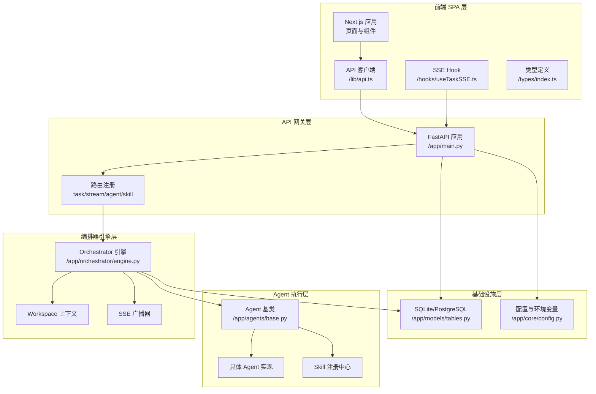
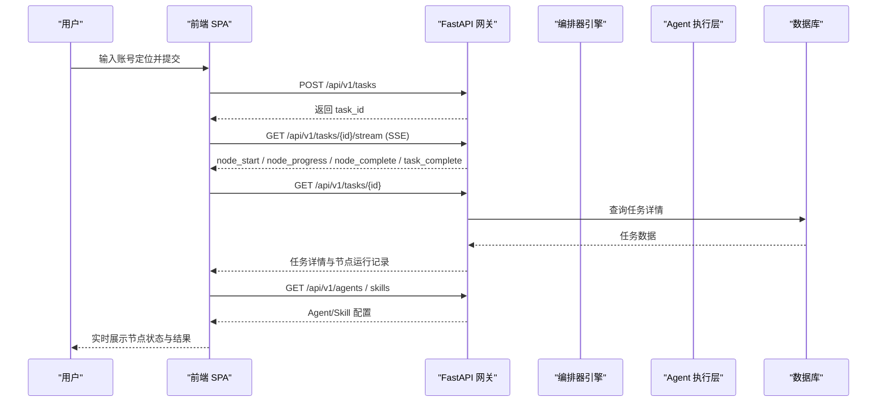
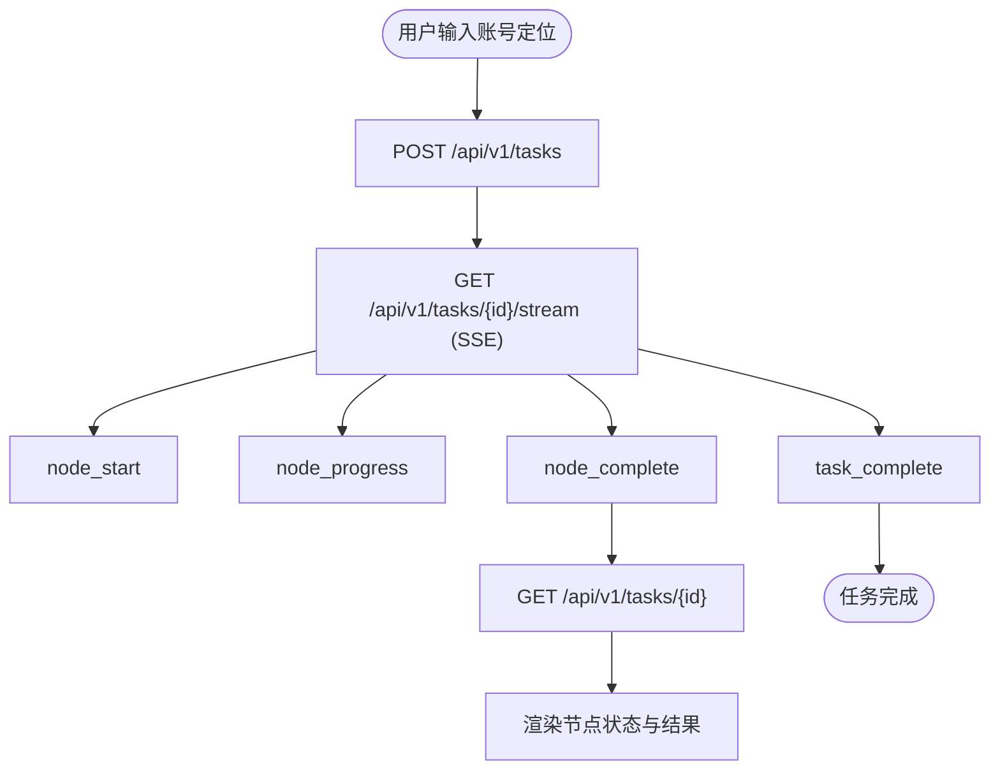
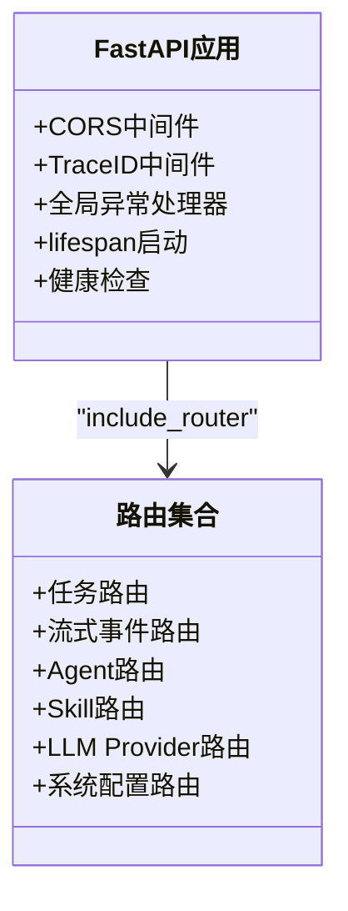
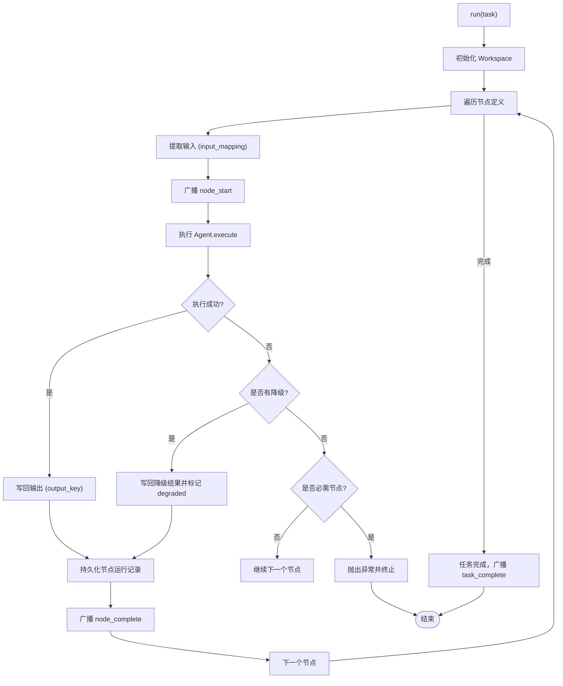
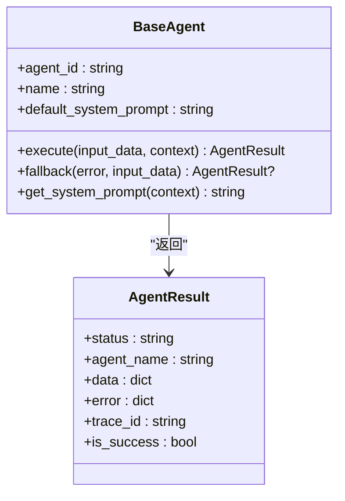
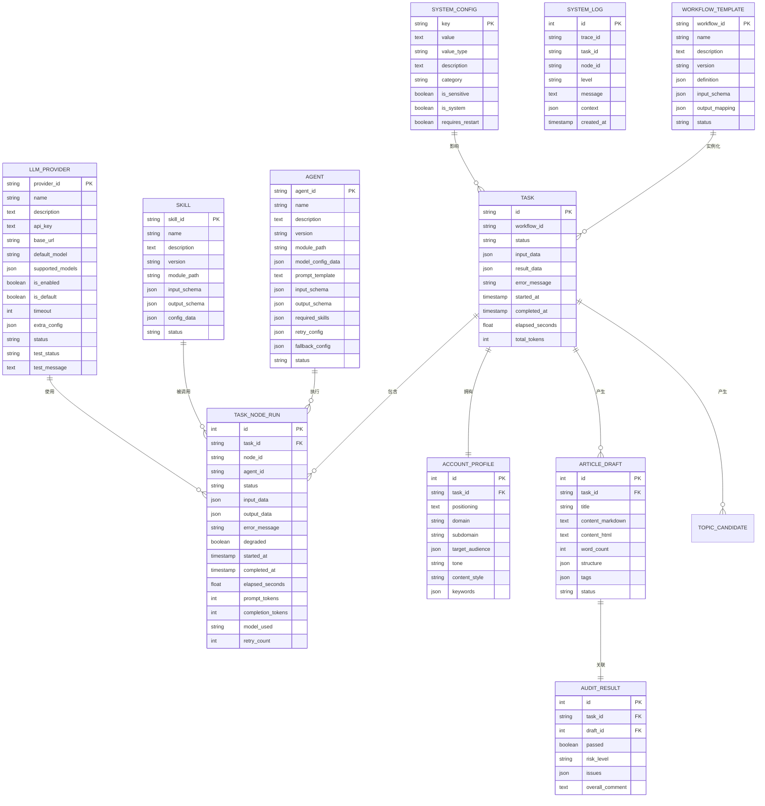
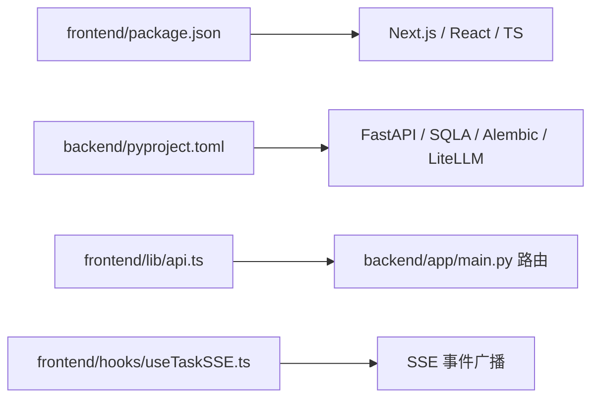
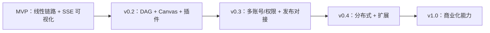

# 整体架构设计

<cite>
**本文引用的文件**
- [ARCHITECTURE.md](file://ARCHITECTURE.md)
- [backend/pyproject.toml](file://backend/pyproject.toml)
- [frontend/package.json](file://frontend/package.json)
- [OpenClaw-bot-review-main/package.json](file://OpenClaw-bot-review-main/package.json)
- [backend/app/main.py](file://backend/app/main.py)
- [backend/app/orchestrator/engine.py](file://backend/app/orchestrator/engine.py)
- [backend/app/agents/base.py](file://backend/app/agents/base.py)
- [backend/app/schemas/agent.py](file://backend/app/schemas/agent.py)
- [backend/app/models/tables.py](file://backend/app/models/tables.py)
- [backend/app/core/config.py](file://backend/app/core/config.py)
- [frontend/lib/api.ts](file://frontend/lib/api.ts)
- [frontend/hooks/useTaskSSE.ts](file://frontend/hooks/useTaskSSE.ts)
- [frontend/types/index.ts](file://frontend/types/index.ts)
- [frontend/components/office/PixelCharacter.tsx](file://frontend/components/office/PixelCharacter.tsx)
- [frontend/components/office/OfficeScene.tsx](file://frontend/components/office/OfficeScene.tsx)
</cite>

## 目录
1. [引言](#引言)
2. [项目结构](#项目结构)
3. [核心组件](#核心组件)
4. [架构总览](#架构总览)
5. [详细组件分析](#详细组件分析)
6. [依赖分析](#依赖分析)
7. [性能考量](#性能考量)
8. [故障排查指南](#故障排查指南)
9. [结论](#结论)
10. [附录](#附录)

## 引言
HotClaw 是一个“基于多智能体协作的公众号内容生产平台”。用户仅需输入“账号定位”，系统即可自动完成从热点抓取、选题策划、标题生成、正文撰写到审核风控的全链路内容生产，并输出可编辑的文章草稿。系统采用前后端分离架构，后端以 FastAPI 为核心，前端以 React/Next.js 为核心，结合 SSE 实现实时状态推送与可视化展示。

## 项目结构
仓库包含四个主要子系统：
- backend：后端服务，基于 FastAPI，提供 API 网关、编排器引擎、智能体与技能层、数据库与配置管理。
- frontend：前端 SPA，基于 Next.js，负责任务创建、运行监控、结果预览、配置管理与可视化。
- OpenClaw-bot-review-main：另一个前端 Next.js 项目，可能用于评审或辅助功能。
- manifests：声明式配置与工作流定义目录，用于注册 Agent、Skill、Workflow。

图表来源
- [backend/app/main.py:69-153](file://backend/app/main.py#L69-L153)
- [backend/app/orchestrator/engine.py:89-285](file://backend/app/orchestrator/engine.py#L89-L285)
- [backend/app/agents/base.py:49-99](file://backend/app/agents/base.py#L49-L99)
- [backend/app/models/tables.py:23-319](file://backend/app/models/tables.py#L23-L319)
- [backend/app/core/config.py:52-99](file://backend/app/core/config.py#L52-L99)
- [frontend/lib/api.ts:14-289](file://frontend/lib/api.ts#L14-L289)
- [frontend/hooks/useTaskSSE.ts:28-144](file://frontend/hooks/useTaskSSE.ts#L28-L144)
- [frontend/types/index.ts:10-119](file://frontend/types/index.ts#L10-L119)

章节来源
- [ARCHITECTURE.md:37-78](file://ARCHITECTURE.md#L37-L78)
- [backend/app/main.py:69-153](file://backend/app/main.py#L69-L153)
- [frontend/package.json:1-23](file://frontend/package.json#L1-L23)
- [OpenClaw-bot-review-main/package.json:1-23](file://OpenClaw-bot-review-main/package.json#L1-L23)

## 核心组件
- 前端 SPA 层
  - Next.js 页面与组件：首页、任务运行页、结果页、配置页、历史页。
  - API 客户端：封装 /api/v1 前缀的请求与错误处理。
  - SSE Hook：订阅任务事件流，驱动节点状态与结果更新。
  - 类型定义：统一前后端数据契约，确保事件与状态结构一致。
- API 网关层（FastAPI）
  - 路由注册：任务、流式事件、Agent、Skill、LLM Provider、系统配置。
  - 中间件：CORS、Trace ID、全局异常处理。
  - 健康检查：/api/v1/health。
- 编排器引擎层
  - 线性工作流：MVP 阶段为线性链，后续可扩展为 DAG。
  - Workspace 上下文：任务级隔离，跨节点共享数据。
  - SSE 广播：节点开始、进度、完成、错误事件。
  - 降级策略：单节点失败不影响整条链路。
- Agent 执行层
  - Agent 基类：标准化输入输出、系统提示注入、降级返回。
  - 具体 Agent：账号解析、热点分析、选题策划、标题生成、正文生成、审核。
  - Skill 注册中心：声明式注册、配置校验、可复用原子能力。
- 基础设施层
  - 数据库：SQLAlchemy ORM，SQLite/PostgreSQL，持久化任务、节点运行、草稿、审计、系统配置。
  - 配置：Pydantic Settings，支持环境变量与运行时系统配置表。
  - 日志与追踪：结构化日志、trace_id 传播。

章节来源
- [ARCHITECTURE.md:191-398](file://ARCHITECTURE.md#L191-L398)
- [backend/app/main.py:69-153](file://backend/app/main.py#L69-L153)
- [backend/app/orchestrator/engine.py:89-285](file://backend/app/orchestrator/engine.py#L89-L285)
- [backend/app/agents/base.py:49-99](file://backend/app/agents/base.py#L49-L99)
- [backend/app/models/tables.py:23-319](file://backend/app/models/tables.py#L23-L319)
- [backend/app/core/config.py:52-99](file://backend/app/core/config.py#L52-L99)

## 架构总览
系统采用“前后端分离 + 事件驱动”的分层架构：
- 前端通过 HTTP + SSE 与后端交互，实时消费节点状态与结果。
- 后端以 FastAPI 作为统一入口，负责参数校验、路由与异常处理。
- 编排器引擎负责加载工作流、调度 Agent、管理 Workspace、广播事件。
- Agent 层专注于业务任务执行，Skill 层提供可复用的原子能力。
- 基础设施层提供数据库、配置与日志追踪。

图表来源
- [frontend/lib/api.ts:26-46](file://frontend/lib/api.ts#L26-L46)
- [frontend/hooks/useTaskSSE.ts:64-127](file://frontend/hooks/useTaskSSE.ts#L64-L127)
- [backend/app/main.py:141-153](file://backend/app/main.py#L141-L153)
- [backend/app/orchestrator/engine.py:124-232](file://backend/app/orchestrator/engine.py#L124-L232)

章节来源
- [ARCHITECTURE.md:325-360](file://ARCHITECTURE.md#L325-L360)
- [frontend/lib/api.ts:14-289](file://frontend/lib/api.ts#L14-L289)
- [frontend/hooks/useTaskSSE.ts:28-144](file://frontend/hooks/useTaskSSE.ts#L28-L144)
- [backend/app/main.py:69-153](file://backend/app/main.py#L69-L153)
- [backend/app/orchestrator/engine.py:89-285](file://backend/app/orchestrator/engine.py#L89-L285)

## 详细组件分析

### 前端 SPA 层
- 技术栈与路由
  - React 18 + TypeScript + Next.js App Router，使用 Zustand 管理状态，Ant Design 5 与 TailwindCSS 构建 UI。
  - 路由覆盖首页、任务运行页、结果页、Agent 配置页、Skill 管理页、历史任务页。
- 实时通信
  - SSE：通过 useTaskSSE 订阅 /api/v1/tasks/{id}/stream，监听节点状态变化与任务完成事件。
  - API 客户端：封装统一的请求与错误处理，便于前端与后端契约对齐。
- 可视化与交互
  - OfficeScene 采用像素风格场景，6 个 Agent 对应不同区域，配合 PixelCharacter 与 SpeechBubble 展示状态与简要输出。
  - 3 面板底部栏：LOGS（日志）、STATUS（状态图标）、VISITORS（访客列表）。

图表来源
- [frontend/lib/api.ts:26-46](file://frontend/lib/api.ts#L26-L46)
- [frontend/hooks/useTaskSSE.ts:64-127](file://frontend/hooks/useTaskSSE.ts#L64-L127)
- [frontend/components/office/OfficeScene.tsx:62-222](file://frontend/components/office/OfficeScene.tsx#L62-L222)
- [frontend/components/office/PixelCharacter.tsx:35-63](file://frontend/components/office/PixelCharacter.tsx#L35-L63)

章节来源
- [ARCHITECTURE.md:191-398](file://ARCHITECTURE.md#L191-L398)
- [frontend/package.json:11-21](file://frontend/package.json#L11-L21)
- [frontend/lib/api.ts:14-289](file://frontend/lib/api.ts#L14-L289)
- [frontend/hooks/useTaskSSE.ts:28-144](file://frontend/hooks/useTaskSSE.ts#L28-L144)
- [frontend/components/office/OfficeScene.tsx:62-428](file://frontend/components/office/OfficeScene.tsx#L62-L428)
- [frontend/components/office/PixelCharacter.tsx:35-83](file://frontend/components/office/PixelCharacter.tsx#L35-L83)

### API 网关层（FastAPI）
- 路由组织
  - 任务路由、流式事件路由、Agent 路由、Skill 路由、LLM Provider 路由、系统配置路由。
- 中间件与异常
  - CORS 放通，Trace ID 中间件，全局异常处理器将业务错误映射为 HTTP 状态码。
- 启动与健康检查
  - lifespan 中完成日志初始化、Agent 注册、数据库表创建、默认配置初始化。
  - /api/v1/health 健康检查端点。

图表来源
- [backend/app/main.py:69-153](file://backend/app/main.py#L69-L153)

章节来源
- [backend/app/main.py:69-153](file://backend/app/main.py#L69-L153)

### 编排器引擎层
- 工作流与调度
  - MVP 默认线性工作流：账号解析 → 热点分析 → 选题策划 → 标题生成 → 正文生成 → 审核。
  - Workspace 管理任务上下文，按节点 input_mapping 提取输入，按 output_key 写回输出。
- 事件广播与降级
  - 广播 node_start / node_progress / node_complete / node_error / task_complete。
  - 单节点失败时尝试 Agent.fallback，若失败且 required=true，则中断并抛出异常。
- 超时与统计
  - 统一的 Agent 超时控制，累计 prompt/completion tokens，计算任务耗时。

图表来源
- [backend/app/orchestrator/engine.py:92-234](file://backend/app/orchestrator/engine.py#L92-L234)

章节来源
- [ARCHITECTURE.md:496-538](file://ARCHITECTURE.md#L496-L538)
- [backend/app/orchestrator/engine.py:89-285](file://backend/app/orchestrator/engine.py#L89-L285)

### Agent 执行层
- Agent 基类
  - 标准化输入输出结构，支持系统提示注入与降级返回。
- 具体 Agent
  - 账号解析、热点分析、选题策划、标题生成、正文生成、审核，均具备结构化输出与降级策略。
- Schema 与配置
  - Pydantic Schema 约束输入输出，AgentConfigUpdateRequest 支持动态更新模型与提示词。

图表来源
- [backend/app/agents/base.py:49-99](file://backend/app/agents/base.py#L49-L99)
- [backend/app/schemas/agent.py:6-29](file://backend/app/schemas/agent.py#L6-L29)

章节来源
- [ARCHITECTURE.md:541-632](file://ARCHITECTURE.md#L541-L632)
- [backend/app/agents/base.py:49-99](file://backend/app/agents/base.py#L49-L99)
- [backend/app/schemas/agent.py:6-29](file://backend/app/schemas/agent.py#L6-L29)

### 基础设施层
- 数据模型
  - 任务、节点运行、账号画像、候选主题、文章草稿、审计结果、Agent/Skill/Workflow 模板、系统日志、系统配置、LLM Provider。
- 配置与环境
  - Settings 从环境变量加载，支持多 LLM Provider 配置与超时参数。
- 日志与追踪
  - 结构化日志表，trace_id 注入与传播，便于问题定位与审计。

图表来源
- [backend/app/models/tables.py:23-319](file://backend/app/models/tables.py#L23-L319)

章节来源
- [backend/app/models/tables.py:23-319](file://backend/app/models/tables.py#L23-L319)
- [backend/app/core/config.py:52-99](file://backend/app/core/config.py#L52-L99)

## 依赖分析
- 后端依赖
  - FastAPI、Uvicorn、SQLAlchemy 2.0 + Alembic、Pydantic、Redis、HTTPX、Structlog、PyYAML、SSE-Starlette、LiteLLM、Aiosqlite。
- 前端依赖
  - Next.js、React、TypeScript、TailwindCSS、@types/*。
- 项目间关系
  - frontend 与 backend 通过 /api/v1 协议通信；OpenClaw-bot-review-main 为独立前端项目，可能用于评审或辅助功能。

图表来源
- [backend/pyproject.toml:6-22](file://backend/pyproject.toml#L6-L22)
- [frontend/package.json:11-21](file://frontend/package.json#L11-L21)
- [OpenClaw-bot-review-main/package.json:11-21](file://OpenClaw-bot-review-main/package.json#L11-L21)
- [frontend/lib/api.ts:14-289](file://frontend/lib/api.ts#L14-L289)
- [frontend/hooks/useTaskSSE.ts:64-127](file://frontend/hooks/useTaskSSE.ts#L64-L127)
- [backend/app/main.py:141-153](file://backend/app/main.py#L141-L153)

章节来源
- [backend/pyproject.toml:1-41](file://backend/pyproject.toml#L1-L41)
- [frontend/package.json:1-23](file://frontend/package.json#L1-L23)
- [OpenClaw-bot-review-main/package.json:1-23](file://OpenClaw-bot-review-main/package.json#L1-L23)

## 性能考量
- 实时性
  - SSE 单向推送，避免 WebSocket 复杂性，前端自动重连与指数退避，保障弱网环境下的稳定性。
- 并发与超时
  - 编排器统一超时控制，单节点失败不影响整条链路，提升整体吞吐与可用性。
- 存储与索引
  - 关键字段建立索引（trace_id、task_id、node_id），优化日志与审计查询。
- LLM 与外部服务
  - 通过 LLM Provider 管理多模型与超时，支持本地与云端模型切换，降低延迟与成本波动。

## 故障排查指南
- 前端
  - 检查 /api/v1/health 是否可达；确认 SSE URL 与主机端口；查看浏览器网络面板与控制台错误。
  - 使用 useTaskSSE 的错误回调与 taskError 字段定位任务级错误。
- 后端
  - 查看结构化日志表，按 trace_id 定位问题；检查 Agent.fallback 是否生效；确认数据库连接与表结构。
  - 全局异常处理器会将业务错误映射为 HTTP 状态码，便于前端统一处理。
- 数据一致性
  - 核对节点运行记录与任务状态；确认 Workspace 写回是否成功；检查降级标记与错误信息。

章节来源
- [frontend/hooks/useTaskSSE.ts:129-133](file://frontend/hooks/useTaskSSE.ts#L129-L133)
- [backend/app/main.py:96-138](file://backend/app/main.py#L96-L138)
- [backend/app/models/tables.py:220-233](file://backend/app/models/tables.py#L220-L233)

## 结论
HotClaw 采用“前后端分离 + 事件驱动”的架构，既满足了实时可视化与交互体验的需求，又通过声明式配置与工作流编排实现了可扩展的多智能体内容生产体系。FastAPI 与 React 的组合兼顾了开发效率与运行时性能，SSE 与 Workspace 的设计保证了可观测性与可回放性。MVP 阶段聚焦线性链路，为后续 DAG 可视化与分布式扩展打下坚实基础。

## 附录
- 架构演进路线图（概念示意）
  - MVP：线性工作流、声明式配置、SSE 可视化。
  - v0.2：引入 DAG 编排器、Canvas 可视化、插件系统。
  - v0.3：多账号与权限体系、发布对接、A/B 测试与回流。
  - v0.4：分布式部署、水平扩展、可观测性增强。
  - v1.0：完整商业化能力，支持多平台前端与 CLI。

[此图为概念示意，无需图表来源]