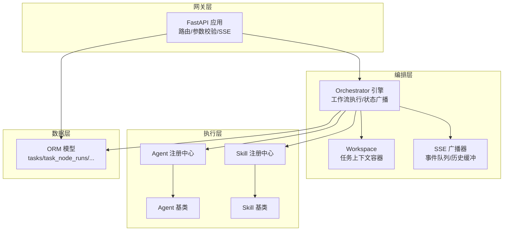
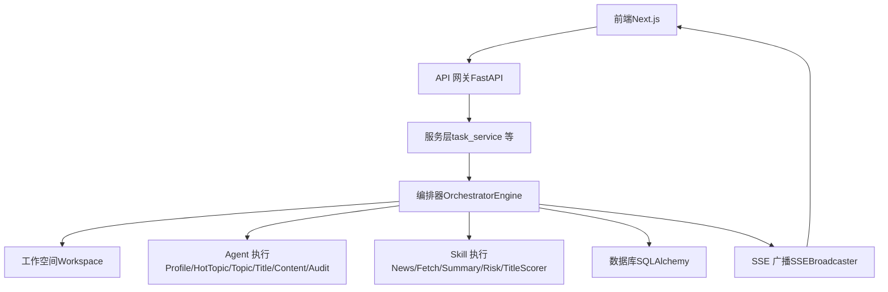
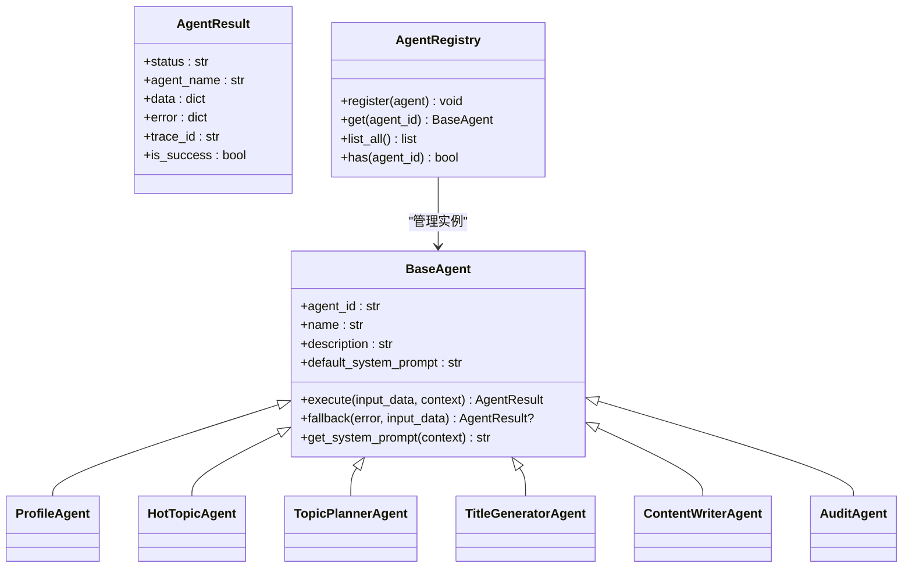
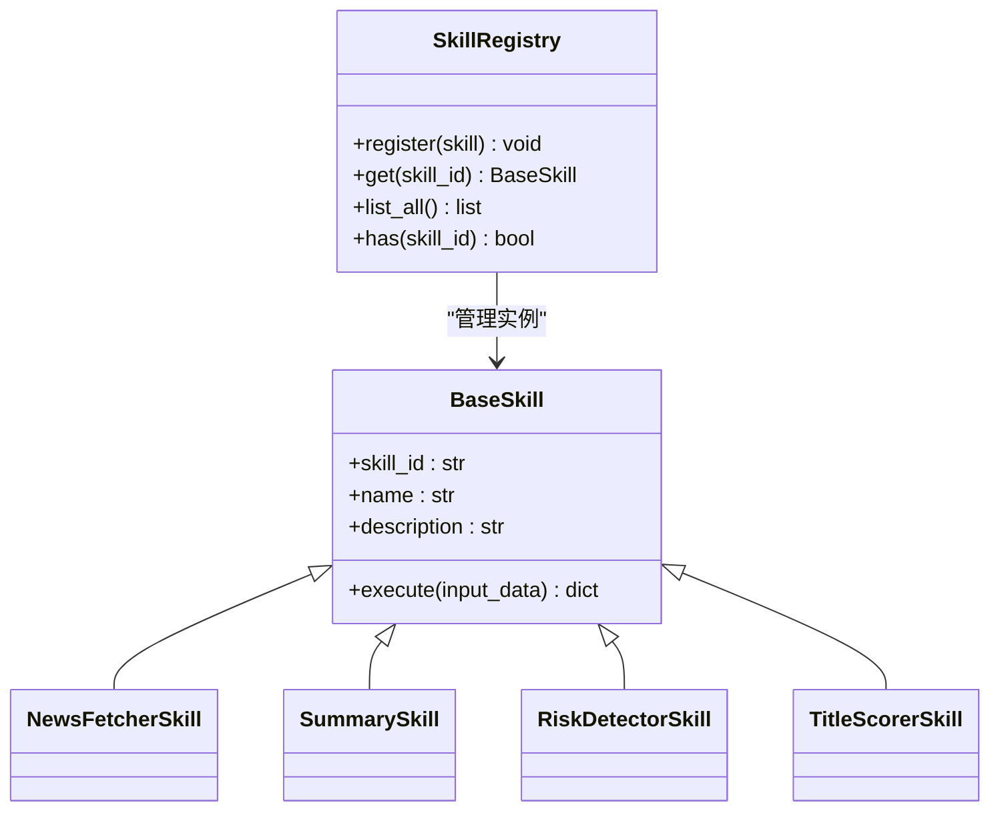
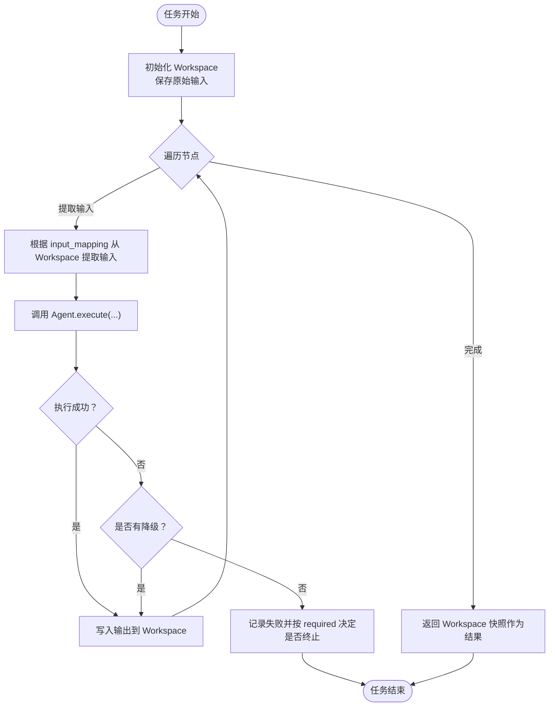
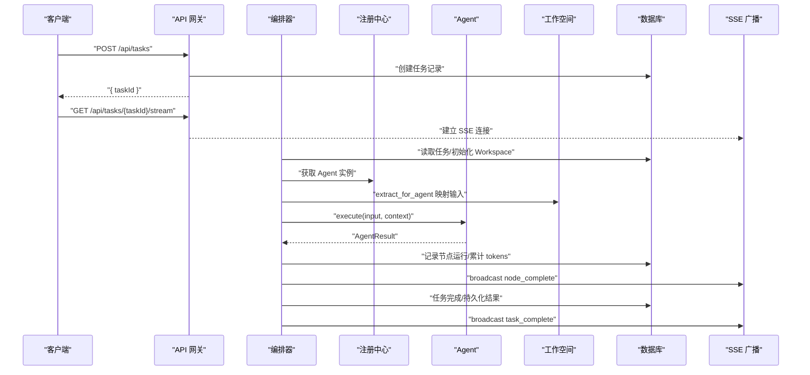
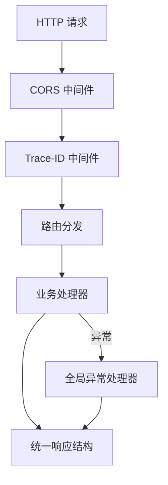
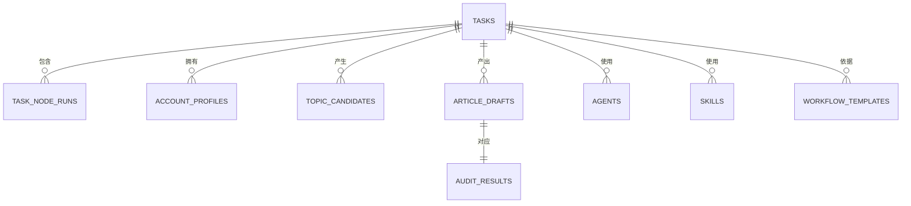
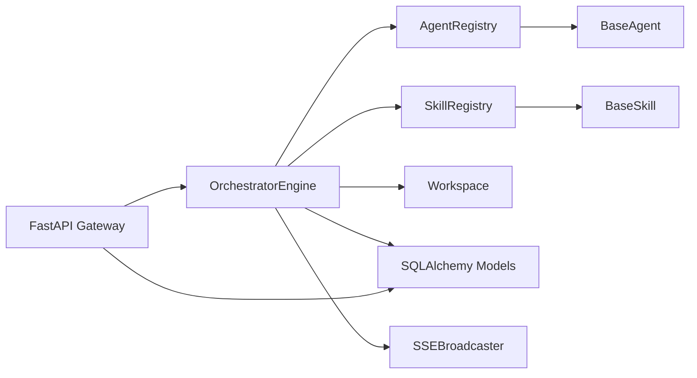

# 核心概念定义

<cite>
**本文引用的文件**
- [backend/app/main.py](file://backend/app/main.py)
- [backend/app/orchestrator/engine.py](file://backend/app/orchestrator/engine.py)
- [backend/app/orchestrator/workspace.py](file://backend/app/orchestrator/workspace.py)
- [backend/app/orchestrator/broadcaster.py](file://backend/app/orchestrator/broadcaster.py)
- [backend/app/agents/base.py](file://backend/app/agents/base.py)
- [backend/app/agents/registry.py](file://backend/app/agents/registry.py)
- [backend/app/skills/base.py](file://backend/app/skills/base.py)
- [backend/app/skills/registry.py](file://backend/app/skills/registry.py)
- [backend/app/models/tables.py](file://backend/app/models/tables.py)
- [backend/app/schemas/agent.py](file://backend/app/schemas/agent.py)
- [ARCHITECTURE.md](file://ARCHITECTURE.md)
- [Notice.md](file://Notice.md)
</cite>

## 目录
1. [引言](#引言)
2. [项目结构](#项目结构)
3. [核心组件](#核心组件)
4. [架构总览](#架构总览)
5. [详细组件分析](#详细组件分析)
6. [依赖分析](#依赖分析)
7. [性能考量](#性能考量)
8. [故障排查指南](#故障排查指南)
9. [结论](#结论)
10. [附录](#附录)

## 引言
本文件围绕 HotClaw 多智能体协作系统的核心概念进行系统化定义与说明，包括 Agent（智能体）、Skill（技能）、Plugin（插件）、Workflow（工作流）、Workspace（工作空间）、Gateway（网关）、Orchestrator（编排器）。我们将通过“编辑部类比”的方式帮助不同背景的读者快速建立直觉理解，并结合代码与配置层面的结构、生命周期、依赖关系与约束条件，解释它们如何共同支撑起从“账号定位”到“文章草稿”的全链路内容生产。

## 项目结构
HotClaw 后端采用清晰的分层职责划分：
- gateway：API 网关层，负责路由、参数校验、统一错误响应与 SSE 端点
- orchestrator：工作流编排引擎，加载 workflow、调度 agent、管理 workspace、广播状态
- agents：智能体执行层，提供基类与注册中心，承载具体业务智能体
- skills：技能层，提供工具能力封装与注册中心
- services：业务服务层（如 task_service、config_service、draft_service、audit_service）
- models/schemas：ORM 模型与 Pydantic 输入输出模型
- core：核心工具（日志、异常、追踪）

图表来源
- [backend/app/main.py:14-21](file://backend/app/main.py#L14-L21)
- [backend/app/orchestrator/engine.py:89-90](file://backend/app/orchestrator/engine.py#L89-L90)
- [backend/app/orchestrator/workspace.py:12-13](file://backend/app/orchestrator/workspace.py#L12-L13)
- [backend/app/orchestrator/broadcaster.py:11-12](file://backend/app/orchestrator/broadcaster.py#L11-L12)
- [backend/app/agents/registry.py:10-11](file://backend/app/agents/registry.py#L10-L11)
- [backend/app/skills/registry.py:10-11](file://backend/app/skills/registry.py#L10-L11)
- [backend/app/models/tables.py:23-46](file://backend/app/models/tables.py#L23-L46)

章节来源
- [backend/app/main.py:14-21](file://backend/app/main.py#L14-L21)
- [ARCHITECTURE.md:414-448](file://ARCHITECTURE.md#L414-L448)

## 核心组件
本节从“定义—作用—类比—数据结构—生命周期—在系统中的位置—依赖关系—约束条件”八个维度，系统阐述核心概念。

- Agent（智能体）
  - 定义：工作流中的节点角色，负责完成单一业务任务，具备明确输入输出，可调用 Skill，尽量返回结构化 JSON
  - 作用：承接业务决策与执行，串联工作流节点
  - 类比：编辑部里的“人”——选题编辑、标题编辑、审核编辑
  - 数据结构：agent_id/name/description/default_system_prompt；执行返回标准化 AgentResult
  - 生命周期：注册到 AgentRegistry → 编排器按序调度 → 执行/降级 → 写入 Workspace → 记录节点运行
  - 位置：agents/ 下的实现与注册中心
  - 依赖：Skill 注册中心、Workspace、Orchestrator、LLM
  - 约束：不可跳过/新增步骤；必须记录节点日志；支持任务级追踪

- Skill（技能）
  - 定义：无状态的原子能力，封装具体技术操作（API 调用、数据处理、规则匹配），不参与编排
  - 作用：为 Agent 提供可复用的工具能力
  - 类比：编辑部里的“工具”——搜索引擎、评分卡、敏感词库
  - 数据结构：skill_id/name/description；执行返回结构化字典
  - 生命周期：注册到 SkillRegistry → Agent 按需调用 → 可独立运行
  - 位置：skills/ 下的实现与注册中心
  - 依赖：外部服务/本地函数
  - 约束：不依赖其他 Skill；输出稳定可复用

- Plugin（插件）
  - 定义：MVP 阶段暂不实现；未来用于接入外部系统（如公众号 API、数据分析平台）
  - 作用：扩展系统与外部生态的连接能力
  - 类比：编辑部对接的“外部系统”
  - 数据结构：预留（MVP 不实现）
  - 生命周期：预留（MVP 不实现）
  - 位置：预留（MVP 不实现）
  - 依赖：外部系统
  - 约束：当前版本不实现

- Workflow（工作流）
  - 定义：定义 agent 的执行顺序与依赖关系的有向无环图（DAG）。MVP 为线性链，但数据结构预留 DAG
  - 作用：控制执行顺序与依赖，确保节点按序推进
  - 类比：编辑部的“工作流程 SOP”
  - 数据结构：nodes 列表（node_id/agent_id/input_mapping/output_key/required/timeout 等）
  - 生命周期：加载 manifest → 编排器按序调度 → 执行/降级/记录
  - 位置：manifests/workflows/（当前以默认节点定义内嵌在引擎）
  - 依赖：Agent 注册中心、Workspace
  - 约束：节点顺序由编排器控制；单节点失败需明确错误输出

- Workspace（工作空间）
  - 定义：一次任务执行的上下文容器，包含任务参数、各 agent 的输出、中间状态、元数据
  - 作用：在任务内隔离与协作，作为 agent 数据共享的唯一来源
  - 类比：编辑部的“选题卡”
  - 数据结构：字典结构，提供 get/set/snapshot/extract_for_agent
  - 生命周期：任务创建时初始化 → 执行期间读写 → 任务结束归档
  - 位置：orchestrator/workspace.py
  - 依赖：编排器、Agent
  - 约束：严格键映射；支持 input.* 引用原始输入

- Gateway（网关）
  - 定义：系统对外唯一入口，负责路由、参数校验、错误格式化
  - 作用：统一入口、鉴权、限流、参数校验
  - 类比：编辑部的“前台”
  - 数据结构：FastAPI 路由集合与中间件
  - 生命周期：应用启动时注册路由 → 请求进入 → 参数校验 → 调用服务层 → 返回统一结构
  - 位置：FastAPI 应用与路由模块
  - 依赖：Schemas、Services、异常处理器
  - 约束：统一返回结构；错误码映射；CORS/Trace-ID 中间件

- Orchestrator（编排器）
  - 定义：工作流执行引擎，读取 workflow 定义，按顺序/依赖调度 agent，管理 workspace 生命周期，广播执行状态
  - 作用：控制平面，协调执行平面
  - 类比：编辑部的“主编”
  - 数据结构：默认节点定义、任务模型、节点运行模型
  - 生命周期：接收任务 → 初始化 Workspace → 逐节点执行/降级/记录 → 广播完成 → 归档结果
  - 位置：orchestrator/engine.py
  - 依赖：Agent/Skill 注册中心、Workspace、SSE 广播器、数据库
  - 约束：节点顺序由编排器控制；失败需明确错误输出；支持任务级追踪

章节来源
- [ARCHITECTURE.md:124-135](file://ARCHITECTURE.md#L124-L135)
- [Notice.md:124-187](file://Notice.md#L124-L187)
- [backend/app/agents/base.py:18-47](file://backend/app/agents/base.py#L18-L47)
- [backend/app/skills/base.py:16-36](file://backend/app/skills/base.py#L16-L36)
- [backend/app/orchestrator/workspace.py:12-53](file://backend/app/orchestrator/workspace.py#L12-L53)
- [backend/app/orchestrator/engine.py:89-285](file://backend/app/orchestrator/engine.py#L89-L285)
- [backend/app/orchestrator/broadcaster.py:11-99](file://backend/app/orchestrator/broadcaster.py#L11-L99)
- [backend/app/agents/registry.py:10-39](file://backend/app/agents/registry.py#L10-L39)
- [backend/app/skills/registry.py:10-37](file://backend/app/skills/registry.py#L10-L37)

## 架构总览
HotClaw 的系统边界与整体调用链如下：

图表来源
- [ARCHITECTURE.md:449-494](file://ARCHITECTURE.md#L449-L494)
- [backend/app/main.py:14-21](file://backend/app/main.py#L14-L21)
- [backend/app/orchestrator/engine.py:89-285](file://backend/app/orchestrator/engine.py#L89-L285)
- [backend/app/orchestrator/broadcaster.py:11-99](file://backend/app/orchestrator/broadcaster.py#L11-L99)
- [backend/app/models/tables.py:23-46](file://backend/app/models/tables.py#L23-L46)

## 详细组件分析

### Agent（智能体）分析
- 设计要点
  - 统一返回结构：AgentResult，包含 status/agent_name/data/error/trace_id
  - 执行协议：execute(input_data, context) → AgentResult
  - 降级策略：fallback(error, input_data) → 可选降级结果
  - 系统提示：get_system_prompt(context) 优先使用上下文中的 system_prompt
- 生命周期
  - 注册：启动时注册到 AgentRegistry
  - 调度：编排器按 workflow 节点顺序获取 agent 实例
  - 执行：提取输入映射 → 设置系统提示 → 超时控制 → 执行/降级
  - 记录：节点运行记录持久化，SSE 广播
- 代码片段路径
  - [Agent 基类与返回结构:18-99](file://backend/app/agents/base.py#L18-L99)
  - [Agent 注册中心:10-39](file://backend/app/agents/registry.py#L10-L39)
  - [编排器调度与执行:137-196](file://backend/app/orchestrator/engine.py#L137-L196)

图表来源
- [backend/app/agents/base.py:18-99](file://backend/app/agents/base.py#L18-L99)
- [backend/app/agents/registry.py:10-39](file://backend/app/agents/registry.py#L10-L39)

章节来源
- [backend/app/agents/base.py:18-99](file://backend/app/agents/base.py#L18-L99)
- [backend/app/agents/registry.py:10-39](file://backend/app/agents/registry.py#L10-L39)
- [backend/app/orchestrator/engine.py:137-196](file://backend/app/orchestrator/engine.py#L137-L196)

### Skill（技能）分析
- 设计要点
  - 原子能力：无状态、可复用、稳定输出
  - 执行协议：execute(input_data) → dict
  - 注册中心：SkillRegistry 统一管理
- 生命周期
  - 注册：启动时注册到 SkillRegistry
  - 调用：Agent 通过注册中心获取实例并执行
  - 独立运行：可独立于编排器运行
- 代码片段路径
  - [Skill 基类:16-36](file://backend/app/skills/base.py#L16-L36)
  - [Skill 注册中心:10-37](file://backend/app/skills/registry.py#L10-L37)

图表来源
- [backend/app/skills/base.py:16-36](file://backend/app/skills/base.py#L16-L36)
- [backend/app/skills/registry.py:10-37](file://backend/app/skills/registry.py#L10-L37)

章节来源
- [backend/app/skills/base.py:16-36](file://backend/app/skills/base.py#L16-L36)
- [backend/app/skills/registry.py:10-37](file://backend/app/skills/registry.py#L10-L37)

### Workspace（工作空间）分析
- 设计要点
  - 任务级上下文容器：包含原始输入与各节点输出
  - 键映射提取：支持 input.* 与顶层键映射
  - 日志与快照：set/get/snapshot/extract_for_agent
- 生命周期
  - 初始化：任务创建时传入 input_data
  - 读写：Agent 通过 extract_for_agent 获取输入，set 写入输出
  - 归档：任务结束返回快照作为最终结果
- 代码片段路径
  - [Workspace 实现:12-53](file://backend/app/orchestrator/workspace.py#L12-L53)

图表来源
- [backend/app/orchestrator/workspace.py:12-53](file://backend/app/orchestrator/workspace.py#L12-L53)
- [backend/app/orchestrator/engine.py:107-234](file://backend/app/orchestrator/engine.py#L107-L234)

章节来源
- [backend/app/orchestrator/workspace.py:12-53](file://backend/app/orchestrator/workspace.py#L12-L53)
- [backend/app/orchestrator/engine.py:107-234](file://backend/app/orchestrator/engine.py#L107-L234)

### Orchestrator（编排器）分析
- 设计要点
  - 默认线性工作流：固定节点顺序与映射
  - 超时控制：统一的 agent_timeout 配置
  - 降级策略：失败时尝试 agent.fallback，必要时终止
  - 事件广播：SSE 广播 node_start/node_complete/node_error/task_complete
  - 结果归档：累计 tokens、计算耗时、持久化任务与节点运行
- 代码片段路径
  - [OrchestratorEngine.run:92-234](file://backend/app/orchestrator/engine.py#L92-L234)
  - [系统提示解析:245-263](file://backend/app/orchestrator/engine.py#L245-L263)
  - [节点收尾与耗时计算:265-271](file://backend/app/orchestrator/engine.py#L265-L271)

图表来源
- [backend/app/orchestrator/engine.py:92-234](file://backend/app/orchestrator/engine.py#L92-L234)
- [backend/app/orchestrator/broadcaster.py:57-68](file://backend/app/orchestrator/broadcaster.py#L57-L68)
- [backend/app/models/tables.py:23-74](file://backend/app/models/tables.py#L23-L74)

章节来源
- [backend/app/orchestrator/engine.py:92-234](file://backend/app/orchestrator/engine.py#L92-L234)
- [backend/app/orchestrator/broadcaster.py:57-68](file://backend/app/orchestrator/broadcaster.py#L57-L68)

### Gateway（网关）分析
- 设计要点
  - FastAPI 应用：注册路由、CORS 中间件、Trace-ID 中间件
  - 全局异常处理：HotClawError 与通用异常映射
  - 健康检查端点：/api/v1/health
- 代码片段路径
  - [应用启动与中间件:44-94](file://backend/app/main.py#L44-L94)
  - [全局异常处理器:96-138](file://backend/app/main.py#L96-L138)
  - [路由注册:141-147](file://backend/app/main.py#L141-L147)

图表来源
- [backend/app/main.py:44-147](file://backend/app/main.py#L44-L147)

章节来源
- [backend/app/main.py:44-147](file://backend/app/main.py#L44-L147)

### 数据模型（与概念映射）
- TaskModel：任务生命周期与结果归档
- TaskNodeRunModel：节点级执行记录（输入/输出/错误/耗时/tokens）
- AccountProfileModel/TopicCandidateModel/ArticleDraftModel/AuditResultModel：业务实体
- AgentModel/SkillModel/WorkflowTemplateModel/SystemConfigModel：配置与元数据
- SystemLogModel：结构化系统日志（trace_id/task_id/node_id 等）

图表来源
- [backend/app/models/tables.py:23-158](file://backend/app/models/tables.py#L23-L158)

章节来源
- [backend/app/models/tables.py:23-158](file://backend/app/models/tables.py#L23-L158)

## 依赖分析
- 组件耦合与内聚
  - Orchestrator 与 Agent/Skill 注册中心松耦合，通过 ID 解析与协议通信
  - Workspace 作为共享上下文，降低 Agent 间耦合
  - SSE 广播器与编排器弱耦合，通过事件队列解耦
- 直接与间接依赖
  - Agent 依赖 Skill 注册中心与 LLM
  - 编排器依赖 Agent/Skill 注册中心、Workspace、数据库、SSE 广播器
  - Gateway 依赖路由模块、异常处理器、Schemas
- 外部依赖与集成点
  - LLM 提供商配置（LLMProviderModel）
  - 数据库（SQLAlchemy/alembic）
  - 前端通过 SSE 实时消费事件流
- 接口契约与实现细节
  - AgentResult 统一返回结构
  - 系统提示解析优先级：DB 自定义 > Agent 默认
  - 节点映射提取：支持 input.* 与顶层键映射

图表来源
- [backend/app/orchestrator/engine.py:18-26](file://backend/app/orchestrator/engine.py#L18-L26)
- [backend/app/agents/registry.py:10-39](file://backend/app/agents/registry.py#L10-L39)
- [backend/app/skills/registry.py:10-37](file://backend/app/skills/registry.py#L10-L37)
- [backend/app/orchestrator/broadcaster.py:11-99](file://backend/app/orchestrator/broadcaster.py#L11-L99)
- [backend/app/models/tables.py:23-46](file://backend/app/models/tables.py#L23-L46)

章节来源
- [backend/app/orchestrator/engine.py:18-26](file://backend/app/orchestrator/engine.py#L18-L26)
- [backend/app/agents/registry.py:10-39](file://backend/app/agents/registry.py#L10-L39)
- [backend/app/skills/registry.py:10-37](file://backend/app/skills/registry.py#L10-L37)
- [backend/app/orchestrator/broadcaster.py:11-99](file://backend/app/orchestrator/broadcaster.py#L11-L99)
- [backend/app/models/tables.py:23-46](file://backend/app/models/tables.py#L23-L46)

## 性能考量
- 超时控制：统一的 agent_timeout 配置，避免单节点阻塞整条链路
- 事件缓冲：SSE 广播器对历史事件进行缓冲，解决前端晚到问题
- 资源统计：累计 prompt/completion tokens，便于成本与性能分析
- 降级策略：失败时返回默认值或跳过，保障整体可用性
- 数据持久化：节点运行记录包含耗时与 tokens，便于回放与优化

## 故障排查指南
- 统一错误码映射
  - HotClawError 按类别映射到 HTTP 状态码，特殊错误码有专门处理
  - 未捕获异常统一返回 500，并在调试模式下返回 details
- 日志与追踪
  - 每个任务与节点均携带 trace_id，支持任务级追踪
  - 结构化日志记录输入/输出快照与错误信息
- 常见问题定位
  - Agent 执行失败：查看节点运行记录的 error_message 与 degraded 标记
  - 超时：检查 agent_timeout 配置与外部服务响应
  - SSE 未收到事件：确认订阅队列与历史缓冲是否正确

章节来源
- [backend/app/main.py:96-138](file://backend/app/main.py#L96-L138)
- [backend/app/orchestrator/engine.py:176-196](file://backend/app/orchestrator/engine.py#L176-L196)
- [backend/app/orchestrator/broadcaster.py:57-68](file://backend/app/orchestrator/broadcaster.py#L57-L68)
- [Notice.md:342-370](file://Notice.md#L342-L370)

## 结论
HotClaw 通过“编辑部类比”将复杂的多智能体协作系统抽象为清晰的概念体系：Agent 是“人”，Skill 是“工具”，Workspace 是“选题卡”，Orchestrator 是“主编”，Gateway 是“前台”，Workflow 是“SOP”。在 MVP 阶段，系统以线性工作流为核心，强调结构化输入输出、可审计可回放、失败降级与可视化运行。随着演进，可逐步引入 DAG 工作流、Plugin 插件与更丰富的配置能力，但核心理念与分层职责将保持稳定。

## 附录
- 配置与 Schema
  - Agent 配置更新请求体包含 model_config_data/prompt_template/retry_config
  - Agent 列表响应包含 agent_id/name/description/version/prompt_template 等
- 示例参考路径
  - [Agent 配置更新请求体:24-29](file://backend/app/schemas/agent.py#L24-L29)
  - [Agent 列表响应:20-22](file://backend/app/schemas/agent.py#L20-L22)

章节来源
- [backend/app/schemas/agent.py:20-29](file://backend/app/schemas/agent.py#L20-L29)
- [ARCHITECTURE.md:124-135](file://ARCHITECTURE.md#L124-L135)
- [Notice.md:124-187](file://Notice.md#L124-L187)