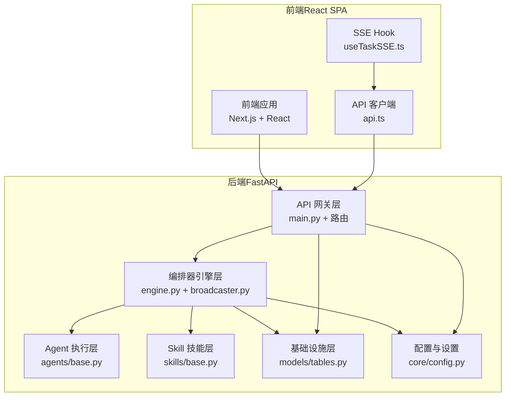
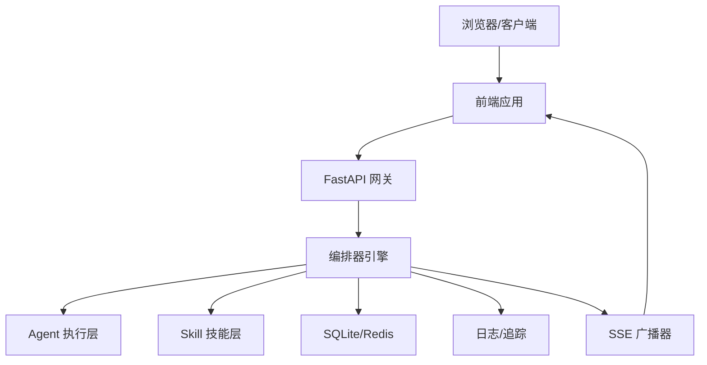
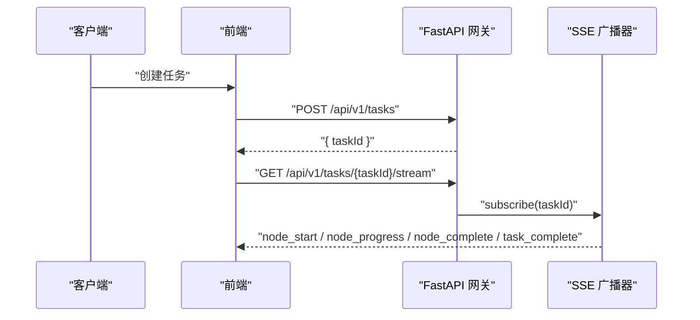
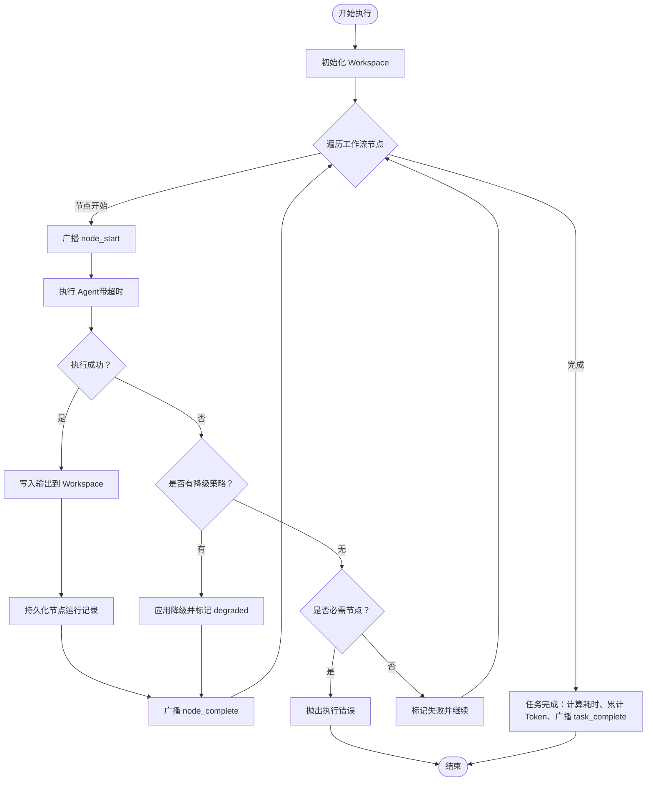
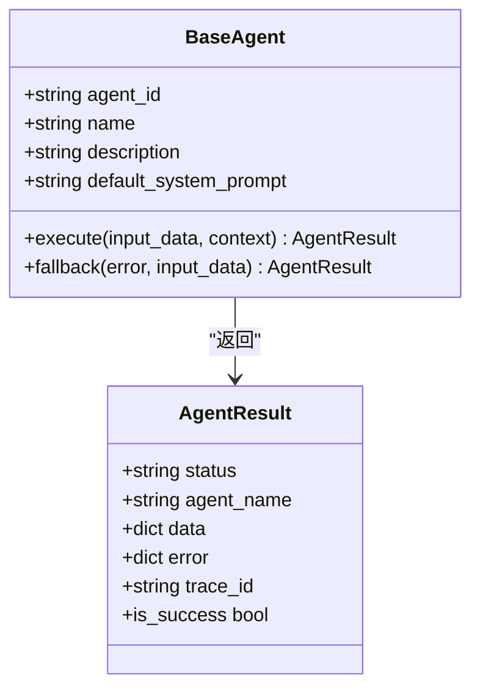
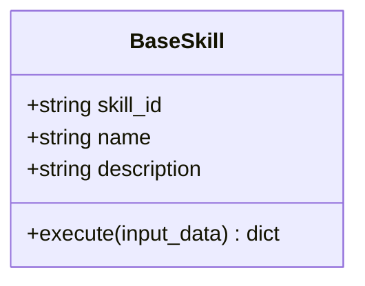
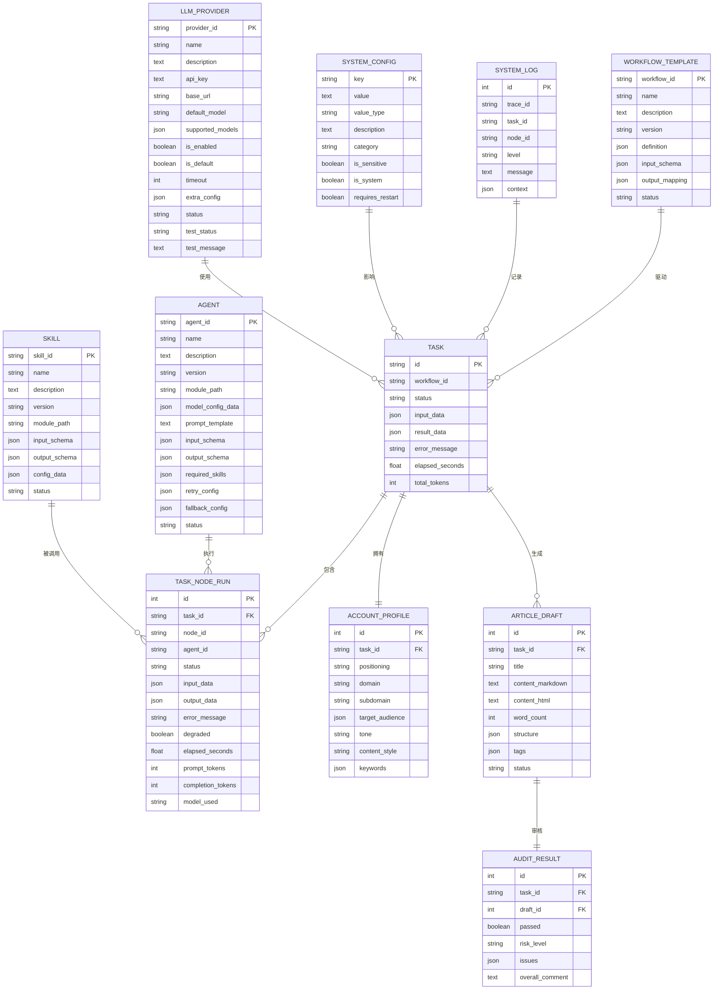
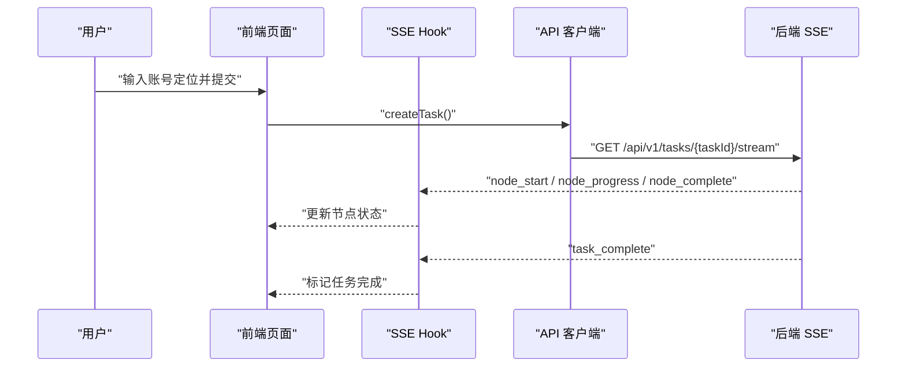
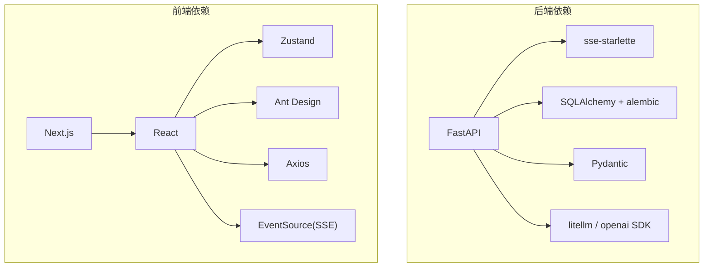

# 系统架构总览

<cite>
**本文引用的文件**
- [ARCHITECTURE.md](file://ARCHITECTURE.md)
- [backend/app/main.py](file://backend/app/main.py)
- [backend/app/orchestrator/engine.py](file://backend/app/orchestrator/engine.py)
- [backend/app/orchestrator/broadcaster.py](file://backend/app/orchestrator/broadcaster.py)
- [backend/app/api/stream_routes.py](file://backend/app/api/stream_routes.py)
- [backend/app/agents/base.py](file://backend/app/agents/base.py)
- [backend/app/skills/base.py](file://backend/app/skills/base.py)
- [backend/app/models/tables.py](file://backend/app/models/tables.py)
- [backend/app/core/config.py](file://backend/app/core/config.py)
- [frontend/hooks/useTaskSSE.ts](file://frontend/hooks/useTaskSSE.ts)
- [frontend/lib/api.ts](file://frontend/lib/api.ts)
- [frontend/app/layout.tsx](file://frontend/app/layout.tsx)
- [OpenClaw-bot-review-main/app/layout.tsx](file://OpenClaw-bot-review-main/app/layout.tsx)
- [backend/pyproject.toml](file://backend/pyproject.toml)
- [frontend/package.json](file://frontend/package.json)
- [OpenClaw-bot-review-main/package.json](file://OpenClaw-bot-review-main/package.json)
</cite>

## 目录
1. [引言](#引言)
2. [项目结构](#项目结构)
3. [核心组件](#核心组件)
4. [架构总览](#架构总览)
5. [详细组件分析](#详细组件分析)
6. [依赖分析](#依赖分析)
7. [性能考虑](#性能考虑)
8. [故障排查指南](#故障排查指南)
9. [结论](#结论)
10. [附录](#附录)

## 引言
HotClaw 是一个“基于多智能体协作的公众号内容生产平台”。用户仅需输入“账号定位”，系统即可自动完成从热点抓取、选题策划、标题生成、正文撰写到审核风控的全链路内容生产，并输出可编辑的文章草稿。系统采用前后端分离架构，后端以 FastAPI 为核心，构建了“微服务风格”的 Agent 执行层与事件驱动的 SSE 通信机制，形成“控制平面与执行平面分离”的工作流编排体系。

## 项目结构
系统采用分层清晰的目录组织方式：
- 后端（Python/FastAPI）：app 下按职责划分为 gateway、orchestrator、agents、skills、services、models、schemas、core 等模块
- 前端（Next.js/React）：app 下包含页面、组件、hooks、stores、lib 等
- 文档与资产：ARCHITECTURE.md 提供架构设计说明，manifests 存放声明式配置，assets 提供资源

图表来源
- [backend/app/main.py:69-148](file://backend/app/main.py#L69-L148)
- [backend/app/orchestrator/engine.py:89-285](file://backend/app/orchestrator/engine.py#L89-L285)
- [backend/app/orchestrator/broadcaster.py:11-99](file://backend/app/orchestrator/broadcaster.py#L11-L99)
- [backend/app/agents/base.py:49-99](file://backend/app/agents/base.py#L49-L99)
- [backend/app/skills/base.py:16-37](file://backend/app/skills/base.py#L16-L37)
- [backend/app/models/tables.py:23-319](file://backend/app/models/tables.py#L23-L319)
- [backend/app/core/config.py:52-99](file://backend/app/core/config.py#L52-L99)
- [frontend/hooks/useTaskSSE.ts:28-144](file://frontend/hooks/useTaskSSE.ts#L28-L144)
- [frontend/lib/api.ts:14-55](file://frontend/lib/api.ts#L14-L55)

章节来源
- [ARCHITECTURE.md:37-78](file://ARCHITECTURE.md#L37-L78)
- [backend/app/main.py:14-67](file://backend/app/main.py#L14-L67)
- [frontend/app/layout.tsx:1-16](file://frontend/app/layout.tsx#L1-L16)
- [OpenClaw-bot-review-main/app/layout.tsx:18-33](file://OpenClaw-bot-review-main/app/layout.tsx#L18-L33)

## 核心组件
- API 网关层（FastAPI）
  - 负责统一入口、参数校验、路由与错误格式化，以及 SSE 事件流端点
  - 示例：健康检查、任务创建、流式事件订阅等路由注册与中间件
- 编排器引擎层（Orchestrator）
  - 负责加载工作流、按序调度 Agent、管理 Workspace 上下文、广播状态、异常处理与降级
  - 示例：线性工作流节点顺序执行、超时控制、事件广播与持久化
- Agent 执行层
  - 有角色、有上下文、有决策能力的执行单元，内部调用 LLM 与/或 Skills
  - 示例：账号解析、热点分析、选题策划、标题生成、正文生成、审核
- Skill 技能层
  - 无状态的原子能力，封装具体技术操作（API 调用、数据处理、规则匹配等）
  - 示例：新闻抓取、摘要、风险检测、标题评分
- 基础设施层（数据库、缓存、日志、追踪）
  - 数据模型覆盖任务、节点运行、账号画像、话题候选、文章草稿、审核结果、系统日志、系统配置、LLM Provider 等
  - 配置模块支持 LLM 提供商、超时、数据库与 Redis 等参数

章节来源
- [backend/app/main.py:14-67](file://backend/app/main.py#L14-L67)
- [backend/app/orchestrator/engine.py:89-285](file://backend/app/orchestrator/engine.py#L89-L285)
- [backend/app/agents/base.py:49-99](file://backend/app/agents/base.py#L49-L99)
- [backend/app/skills/base.py:16-37](file://backend/app/skills/base.py#L16-L37)
- [backend/app/models/tables.py:23-319](file://backend/app/models/tables.py#L23-L319)
- [backend/app/core/config.py:52-99](file://backend/app/core/config.py#L52-L99)

## 架构总览
系统采用“前后端分离 + 微服务风格的 Agent 执行层 + 事件驱动的 SSE 通信”三位一体的设计：
- 前后端分离：后端专注 Agent 调度与业务逻辑，前端专注可视化与交互体验；SSE 实时推送节点状态，前端独立消费事件流
- 微服务风格的 Agent：每个 Agent 是独立的执行单元，通过注册机制动态加载，职责单一且可配置
- 事件驱动的 SSE：编排器通过广播器将节点状态事件推送给前端，前端以 Hook 方式订阅并渲染

图表来源
- [backend/app/api/stream_routes.py:14-43](file://backend/app/api/stream_routes.py#L14-L43)
- [backend/app/orchestrator/broadcaster.py:11-99](file://backend/app/orchestrator/broadcaster.py#L11-L99)
- [frontend/hooks/useTaskSSE.ts:60-140](file://frontend/hooks/useTaskSSE.ts#L60-L140)

章节来源
- [ARCHITECTURE.md:80-89](file://ARCHITECTURE.md#L80-L89)
- [ARCHITECTURE.md:37-78](file://ARCHITECTURE.md#L37-L78)

## 详细组件分析

### API 网关层（FastAPI）
- 职责
  - 路由定义与参数校验、统一错误响应、CORS 中间件、Trace ID 中间件、全局异常处理
  - SSE 事件流端点：/api/v1/tasks/{task_id}/stream
- 关键点
  - 应用生命周期：启动时注册 Agent、创建数据库表、初始化系统配置
  - 异常映射：根据业务错误码映射到 HTTP 状态码，保证前端可读性
  - 健康检查：/api/v1/health

图表来源
- [backend/app/main.py:69-148](file://backend/app/main.py#L69-L148)
- [backend/app/api/stream_routes.py:14-43](file://backend/app/api/stream_routes.py#L14-L43)
- [frontend/lib/api.ts:26-31](file://frontend/lib/api.ts#L26-L31)
- [frontend/hooks/useTaskSSE.ts:60-140](file://frontend/hooks/useTaskSSE.ts#L60-L140)

章节来源
- [backend/app/main.py:69-148](file://backend/app/main.py#L69-L148)
- [backend/app/api/stream_routes.py:14-43](file://backend/app/api/stream_routes.py#L14-L43)

### 编排器引擎层（Orchestrator）
- 职责
  - 加载工作流定义（MVP 为线性链）、创建 Workspace、按序调度 Agent、收集结果、广播状态、异常处理与降级
- 关键点
  - 默认工作流节点顺序：账号解析 → 热点分析 → 选题策划 → 标题生成 → 正文生成 → 审核
  - 超时控制：对 Agent 执行设置超时，避免阻塞
  - 降级策略：单节点失败时尝试 Agent 回退，必要时抛出错误终止
  - 事件广播：节点开始、进度、完成、失败、任务完成等事件

图表来源
- [backend/app/orchestrator/engine.py:92-234](file://backend/app/orchestrator/engine.py#L92-L234)

章节来源
- [backend/app/orchestrator/engine.py:89-285](file://backend/app/orchestrator/engine.py#L89-L285)

### Agent 执行层
- 职责
  - 有角色、有上下文、有决策能力的执行单元；每个 Agent 有明确的输入输出 Schema，内部调用 LLM 与/或 Skills
- 关键点
  - 基类定义统一的执行接口与结果结构；支持回退策略
  - 第一版内置 6 个 Agent：账号解析、热点分析、选题策划、标题生成、正文生成、审核

图表来源
- [backend/app/agents/base.py:49-99](file://backend/app/agents/base.py#L49-L99)

章节来源
- [backend/app/agents/base.py:18-99](file://backend/app/agents/base.py#L18-L99)

### Skill 技能层
- 职责
  - 无状态的原子能力，封装具体技术操作；不参与编排，仅做执行
- 关键点
  - 基类定义统一的执行接口；通过 manifest 声明式注册
  - 第一版内置 4 个 Skill：新闻抓取、摘要、风险检测、标题评分

图表来源
- [backend/app/skills/base.py:16-37](file://backend/app/skills/base.py#L16-L37)

章节来源
- [backend/app/skills/base.py:16-37](file://backend/app/skills/base.py#L16-L37)

### 基础设施层（数据模型与配置）
- 数据模型
  - 任务、节点运行、账号画像、话题候选、文章草稿、审核结果、系统日志、系统配置、LLM Provider 等
- 配置
  - LLM 提供商配置（OpenAI、DashScope、DeepSeek、本地等）、超时、数据库与 Redis 连接等

图表来源
- [backend/app/models/tables.py:23-319](file://backend/app/models/tables.py#L23-L319)

章节来源
- [backend/app/models/tables.py:23-319](file://backend/app/models/tables.py#L23-L319)
- [backend/app/core/config.py:52-99](file://backend/app/core/config.py#L52-L99)

### 前端（React + SSE）
- 职责
  - 页面与组件负责任务创建、运行监控、结果预览、Agent/Skill 配置、历史任务查询与回放
- 关键点
  - 使用 SSE Hook 订阅后端事件流，实时渲染节点状态
  - API 客户端封装统一的请求与错误处理

图表来源
- [frontend/hooks/useTaskSSE.ts:28-144](file://frontend/hooks/useTaskSSE.ts#L28-L144)
- [frontend/lib/api.ts:26-31](file://frontend/lib/api.ts#L26-L31)
- [frontend/lib/api.ts:48-55](file://frontend/lib/api.ts#L48-L55)

章节来源
- [frontend/hooks/useTaskSSE.ts:28-144](file://frontend/hooks/useTaskSSE.ts#L28-L144)
- [frontend/lib/api.ts:14-55](file://frontend/lib/api.ts#L14-L55)
- [frontend/app/layout.tsx:1-16](file://frontend/app/layout.tsx#L1-L16)

## 依赖分析
- 技术选型与理由
  - 后端：FastAPI（异步支持好、自动 OpenAPI 文档、SSE 支持）、SQLAlchemy 2.0 + alembic（成熟稳定的 ORM 与迁移）、litellm/openai SDK（统一多模型调用接口）
  - 前端：Next.js/React（成熟生态、SSR/CSR、组件化）、Zustand（轻量状态管理）、Ant Design（完善的 UI 组件）、Axios（拦截器友好）、SSE（单向推送足够）
- 模块耦合与内聚
  - 网关层与编排器层通过标准协议通信，Agent 与 Skill 通过注册中心解耦
  - 数据模型与配置模块为上层提供稳定契约，降低变更成本

图表来源
- [backend/pyproject.toml:6-22](file://backend/pyproject.toml#L6-L22)
- [frontend/package.json:11-21](file://frontend/package.json#L11-L21)
- [OpenClaw-bot-review-main/package.json:11-22](file://OpenClaw-bot-review-main/package.json#L11-L22)

章节来源
- [backend/pyproject.toml:6-22](file://backend/pyproject.toml#L6-L22)
- [frontend/package.json:11-21](file://frontend/package.json#L11-L21)
- [OpenClaw-bot-review-main/package.json:11-22](file://OpenClaw-bot-review-main/package.json#L11-L22)

## 性能考虑
- 异步与并发
  - 后端使用 asyncio 与 FastAPI 异步特性，提升 I/O 密集场景下的吞吐
- 超时与降级
  - 为 Agent 执行设置超时，防止阻塞；节点失败时优先尝试降级策略，保障整体可用性
- 事件流优化
  - SSE 广播器支持事件缓冲与重放，解决前端连接建立时机问题；连接断开由浏览器自动重连
- 数据持久化
  - 任务与节点运行记录结构化存储，便于审计与回放；日志与追踪贯穿全链路

## 故障排查指南
- 常见问题与定位
  - 任务长时间无响应：检查 Agent 超时配置与 LLM Provider 连通性
  - 节点失败：查看节点运行记录中的错误信息与降级标记
  - SSE 连接中断：确认前端直连后端地址、浏览器自动重连行为
- 日志与追踪
  - 使用 Trace ID 关联请求链路，结合系统日志定位问题
- 配置校验
  - 通过系统配置与 LLM Provider 管理界面校验关键参数（如 API Key、Base URL、超时）

章节来源
- [backend/app/orchestrator/engine.py:176-196](file://backend/app/orchestrator/engine.py#L176-L196)
- [backend/app/orchestrator/broadcaster.py:30-45](file://backend/app/orchestrator/broadcaster.py#L30-L45)
- [backend/app/core/config.py:79-82](file://backend/app/core/config.py#L79-L82)
- [backend/app/models/tables.py:220-233](file://backend/app/models/tables.py#L220-L233)

## 结论
HotClaw 通过“前后端分离 + 微服务风格的 Agent 执行层 + 事件驱动的 SSE 通信”实现了清晰的职责划分与良好的扩展性。核心设计原则（Workspace-First、Manifest-First、控制平面与执行平面分离等）贯穿系统各层，既满足 MVP 的快速交付，又为后续演进（如 DAG 工作流、插件化、分布式部署）预留了空间。

## 附录
- 设计理念与原则
  - Workspace-First：任务级上下文隔离与协作
  - Manifest-First：声明式注册与配置优先
  - 控制平面与执行平面分离：编排与执行通过标准协议通信
  - 可审计可回放：节点级输入输出与耗时、Token 消耗记录
- 核心概念
  - Agent：有角色、有上下文、有决策能力的执行单元
  - Skill：无状态的原子能力，封装具体技术操作
  - Workflow：定义 Agent 的执行顺序与依赖关系
  - Workspace：任务执行的上下文容器
  - Gateway：系统对外唯一入口
  - Orchestrator：工作流执行引擎

章节来源
- [ARCHITECTURE.md:92-135](file://ARCHITECTURE.md#L92-L135)
- [ARCHITECTURE.md:138-188](file://ARCHITECTURE.md#L138-L188)