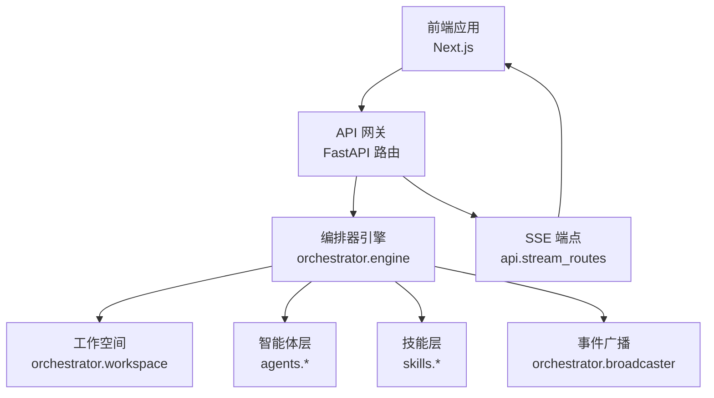
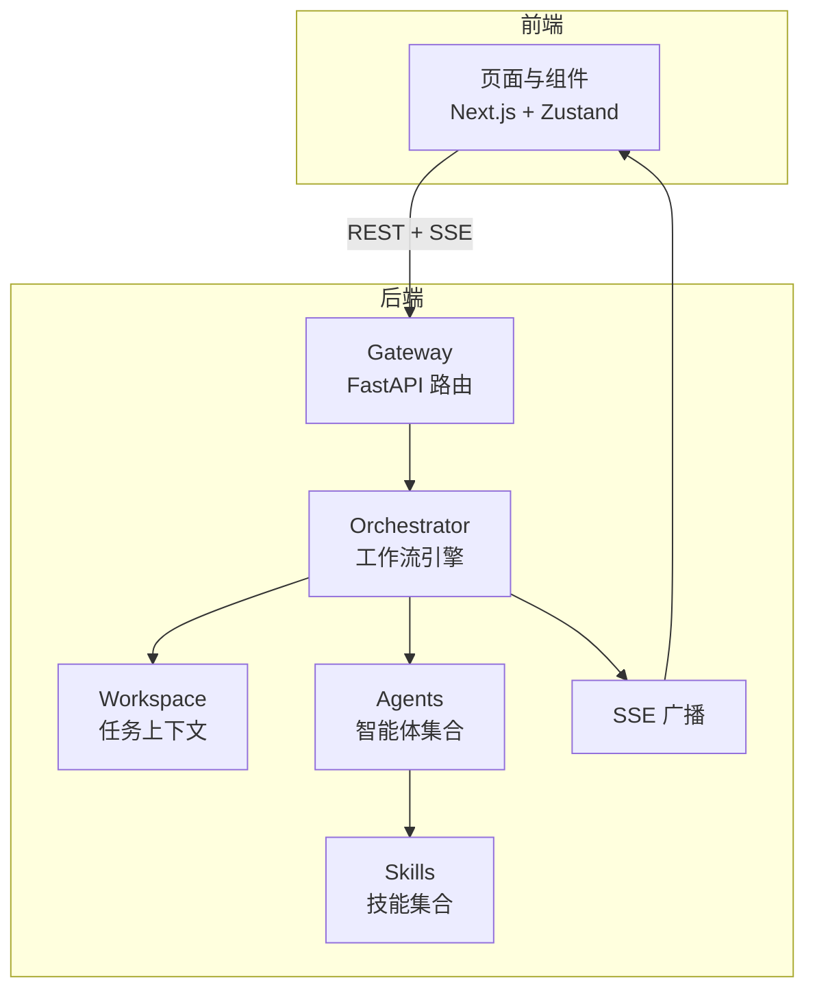
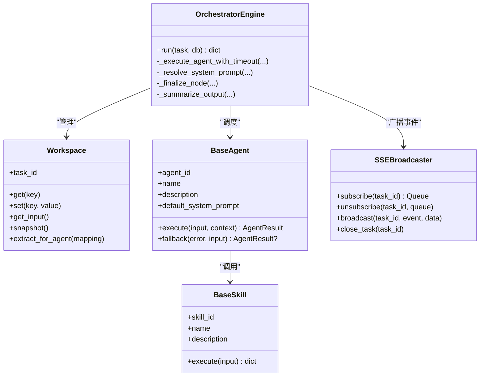
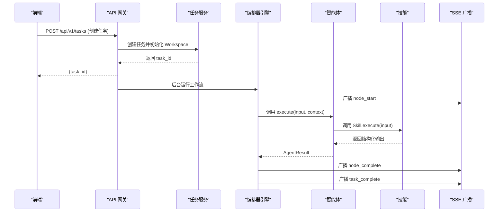
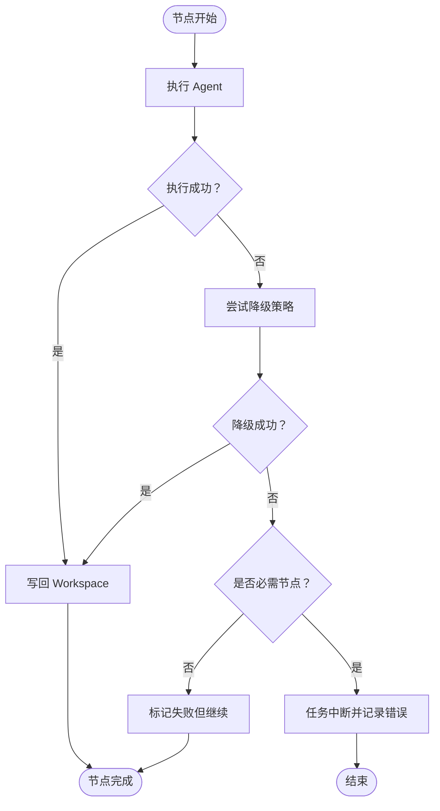
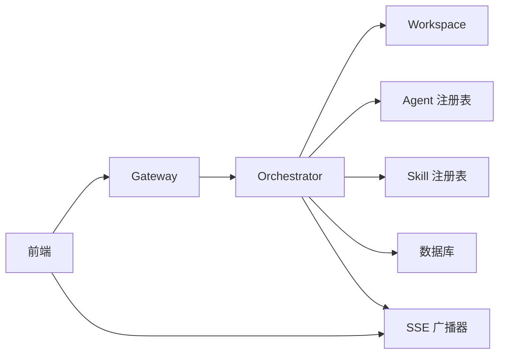

# 设计原则

<cite>
**本文引用的文件**
- [ARCHITECTURE.md](file://ARCHITECTURE.md)
- [backend/app/main.py](file://backend/app/main.py)
- [backend/app/orchestrator/engine.py](file://backend/app/orchestrator/engine.py)
- [backend/app/orchestrator/workspace.py](file://backend/app/orchestrator/workspace.py)
- [backend/app/orchestrator/broadcaster.py](file://backend/app/orchestrator/broadcaster.py)
- [backend/app/agents/base.py](file://backend/app/agents/base.py)
- [backend/app/agents/profile_agent.py](file://backend/app/agents/profile_agent.py)
- [backend/app/skills/base.py](file://backend/app/skills/base.py)
- [backend/app/skills/registry.py](file://backend/app/skills/registry.py)
- [backend/app/api/task_routes.py](file://backend/app/api/task_routes.py)
- [backend/app/api/stream_routes.py](file://backend/app/api/stream_routes.py)
- [backend/app/core/config.py](file://backend/app/core/config.py)
- [frontend/lib/api.ts](file://frontend/lib/api.ts)
- [frontend/app/layout.tsx](file://frontend/app/layout.tsx)
</cite>

## 目录
1. [引言](#引言)
2. [项目结构](#项目结构)
3. [核心组件](#核心组件)
4. [架构总览](#架构总览)
5. [详细组件分析](#详细组件分析)
6. [依赖分析](#依赖分析)
7. [性能考量](#性能考量)
8. [故障排查指南](#故障排查指南)
9. [结论](#结论)
10. [附录](#附录)

## 引言
本文件围绕 HotClaw 系统的12条核心设计原则展开，结合架构文档与代码实现，逐条阐释原则的含义、应用场景与落地方式。重点解析 Workspace-First、Manifest-First、控制平面与执行平面分离等关键原则如何指导系统设计，并对比 OpenClaw 理念与 HotClaw 的改造差异。同时给出可扩展性、可维护性与可审计性的保障机制，以及面向不同经验层次开发者的理解与实践建议。

## 项目结构
HotClaw 采用前后端分离架构：前端为 Next.js 应用，后端为 FastAPI 应用，中间通过 REST + SSE 实现实时状态推送。后端模块划分清晰：Gateway（API 路由）、Orchestrator（工作流引擎）、Agents（智能体层）、Skills（技能层）、Services（业务服务）、Models/Schemas（数据与校验）、Core（日志、异常、追踪）。

图表来源
- [backend/app/api/stream_routes.py:14-43](file://backend/app/api/stream_routes.py#L14-L43)
- [backend/app/orchestrator/broadcaster.py:11-99](file://backend/app/orchestrator/broadcaster.py#L11-L99)
- [backend/app/orchestrator/engine.py:89-235](file://backend/app/orchestrator/engine.py#L89-L235)
- [backend/app/orchestrator/workspace.py:12-53](file://backend/app/orchestrator/workspace.py#L12-L53)
- [backend/app/agents/base.py:49-99](file://backend/app/agents/base.py#L49-L99)
- [backend/app/skills/base.py:16-37](file://backend/app/skills/base.py#L16-L37)

章节来源
- [ARCHITECTURE.md:37-78](file://ARCHITECTURE.md#L37-L78)
- [ARCHITECTURE.md:414-448](file://ARCHITECTURE.md#L414-L448)

## 核心组件
- 控制平面（Orchestrator）：负责加载工作流、按序调度 Agent、管理 Workspace 生命周期、广播事件、持久化节点运行记录。
- 执行平面（Agent/Skill）：Agent 有上下文状态，负责业务决策与调用 Skill；Skill 为无状态原子能力，封装具体技术操作。
- Gateway（API 网关）：统一入口，参数校验、错误格式化、SSE 端点。
- Workspace：任务级上下文容器，跨 Agent 共享数据。
- SSE 广播：事件缓冲与回放，解决前端连接建立时机问题。

章节来源
- [backend/app/orchestrator/engine.py:89-235](file://backend/app/orchestrator/engine.py#L89-L235)
- [backend/app/orchestrator/workspace.py:12-53](file://backend/app/orchestrator/workspace.py#L12-L53)
- [backend/app/orchestrator/broadcaster.py:11-99](file://backend/app/orchestrator/broadcaster.py#L11-L99)
- [backend/app/agents/base.py:49-99](file://backend/app/agents/base.py#L49-L99)
- [backend/app/skills/base.py:16-37](file://backend/app/skills/base.py#L16-L37)
- [backend/app/api/stream_routes.py:14-43](file://backend/app/api/stream_routes.py#L14-L43)

## 架构总览
HotClaw 的整体架构强调“控制与执行分离”“结构化输入输出”“可审计可回放”“可视化是一等公民”。MVP 阶段采用线性工作流，但数据结构与事件模型已为 DAG 可视化预留扩展点。

图表来源
- [ARCHITECTURE.md:37-78](file://ARCHITECTURE.md#L37-L78)
- [backend/app/main.py:69-153](file://backend/app/main.py#L69-L153)
- [backend/app/orchestrator/engine.py:89-235](file://backend/app/orchestrator/engine.py#L89-L235)
- [backend/app/orchestrator/broadcaster.py:11-99](file://backend/app/orchestrator/broadcaster.py#L11-L99)

## 详细组件分析

### 设计原则详解与落地

#### 原则1：Workspace-First
- 含义：每个任务创建独立 Workspace，所有 Agent 在同一 Workspace 内共享上下文，Workspace 是隔离与协作的基本单位。
- 场景：账号画像解析完成后，后续热点分析、选题策划、标题生成、正文生成、审核均从 Workspace 读取所需字段，避免重复计算与状态漂移。
- 实现要点：
  - 任务创建时初始化 Workspace，保存原始输入与中间产物。
  - Agent 通过输入映射从 Workspace 提取所需字段。
  - 节点执行结果写回 Workspace，供下游使用。
- 代码示例路径
  - [Workspace 初始化与提取:15-52](file://backend/app/orchestrator/workspace.py#L15-L52)
  - [编排器按节点映射提取输入:134-135](file://backend/app/orchestrator/engine.py#L134-L135)
  - [编排器写回输出到 Workspace:149-150](file://backend/app/orchestrator/engine.py#L149-L150)
- 价值：提升可维护性（集中上下文管理）、可审计性（可回放完整上下文）、可扩展性（新增 Agent 仅需声明输入映射）。

章节来源
- [ARCHITECTURE.md:98-98](file://ARCHITECTURE.md#L98-L98)
- [backend/app/orchestrator/workspace.py:12-53](file://backend/app/orchestrator/workspace.py#L12-L53)
- [backend/app/orchestrator/engine.py:92-235](file://backend/app/orchestrator/engine.py#L92-L235)

#### 原则2：Manifest-First
- 含义：新增 Agent/Skill/Workflow 通过 YAML/JSON Manifest 声明式注册，系统启动时扫描加载，拒绝硬编码。
- 场景：Skill 的配置（如新闻源、缓存 TTL）与 Agent 的输入输出 Schema 通过 Manifest 管理，便于版本化与变更。
- 实现要点：
  - 启动时加载 manifests 目录，校验格式并动态注册。
  - Agent/Skill 基类提供标准化输入输出与配置 Schema。
- 代码示例路径
  - [Agent 基类与结果封装:18-99](file://backend/app/agents/base.py#L18-L99)
  - [Skill 基类:16-37](file://backend/app/skills/base.py#L16-L37)
  - [Skill 注册中心:10-37](file://backend/app/skills/registry.py#L10-L37)
- 价值：降低耦合、提升可维护性与可审计性（变更可追溯）。

章节来源
- [ARCHITECTURE.md:99-99](file://ARCHITECTURE.md#L99-L99)
- [backend/app/agents/base.py:49-99](file://backend/app/agents/base.py#L49-L99)
- [backend/app/skills/base.py:16-37](file://backend/app/skills/base.py#L16-L37)
- [backend/app/skills/registry.py:10-37](file://backend/app/skills/registry.py#L10-L37)

#### 原则3：控制平面与执行平面分离
- 含义：Orchestrator 只负责调度（何时调谁），Agent 只负责执行（做什么事）；两者通过标准协议通信。
- 场景：编排器按节点顺序调度 Agent，Agent 仅关注自身业务逻辑与降级策略。
- 实现要点：
  - 编排器持有 Agent 注册表，按节点定义调用。
  - Agent 通过统一的 AgentResult 接口返回结构化结果。
- 代码示例路径
  - [编排器调度与超时控制:137-171](file://backend/app/orchestrator/engine.py#L137-L171)
  - [Agent 执行接口与降级:64-99](file://backend/app/agents/base.py#L64-L99)
  - [ProfileAgent 示例:43-102](file://backend/app/agents/profile_agent.py#L43-L102)
- 价值：提升可扩展性（可替换 Agent 实现）、可维护性（职责单一）、可审计性（事件与结果可持久化）。

章节来源
- [ARCHITECTURE.md:100-100](file://ARCHITECTURE.md#L100-L100)
- [backend/app/orchestrator/engine.py:89-235](file://backend/app/orchestrator/engine.py#L89-L235)
- [backend/app/agents/base.py:49-99](file://backend/app/agents/base.py#L49-L99)
- [backend/app/agents/profile_agent.py:12-102](file://backend/app/agents/profile_agent.py#L12-L102)

#### 原则4：Gateway 唯一入口
- 含义：所有外部请求经 API Gateway 进入，统一鉴权、限流、参数校验；内部服务不暴露。
- 场景：任务创建、状态查询、节点详情、SSE 流等均由 Gateway 路由。
- 实现要点：
  - FastAPI 路由集中定义，全局异常处理，CORS 中间件。
  - SSE 端点独立路由，事件队列由广播器管理。
- 代码示例路径
  - [应用入口与路由注册:69-153](file://backend/app/main.py#L69-L153)
  - [任务 API 路由:39-179](file://backend/app/api/task_routes.py#L39-L179)
  - [SSE 流路由:14-43](file://backend/app/api/stream_routes.py#L14-L43)
- 价值：统一安全边界、简化前端对接、便于可观测性。

章节来源
- [ARCHITECTURE.md:101-101](file://ARCHITECTURE.md#L101-L101)
- [backend/app/main.py:69-153](file://backend/app/main.py#L69-L153)
- [backend/app/api/task_routes.py:1-179](file://backend/app/api/task_routes.py#L1-L179)
- [backend/app/api/stream_routes.py:1-43](file://backend/app/api/stream_routes.py#L1-L43)

#### 原则5：结构化输入输出
- 含义：所有 Agent 的输入输出必须是 JSON Schema 定义的结构体，拒绝自由文本传递。
- 场景：ProfileAgent 的输入为 positioning，输出为结构化账号画像；后续节点严格依赖该结构。
- 实现要点：
  - Agent 基类提供标准化返回 AgentResult。
  - 编排器对输出进行 Schema 校验与持久化。
- 代码示例路径
  - [AgentResult 标准化:18-47](file://backend/app/agents/base.py#L18-L47)
  - [ProfileAgent 输出结构:17-41](file://backend/app/agents/profile_agent.py#L17-L41)
  - [编排器写回与摘要:149-150](file://backend/app/orchestrator/engine.py#L149-L150)
- 价值：提升稳定性、可审计性（可回放）、可测试性（Mock 输入输出）。

章节来源
- [ARCHITECTURE.md:102-102](file://ARCHITECTURE.md#L102-L102)
- [backend/app/agents/base.py:18-47](file://backend/app/agents/base.py#L18-L47)
- [backend/app/agents/profile_agent.py:17-41](file://backend/app/agents/profile_agent.py#L17-L41)
- [backend/app/orchestrator/engine.py:149-150](file://backend/app/orchestrator/engine.py#L149-L150)

#### 原则6：可审计可回放
- 含义：每个节点的输入、输出、耗时、Token 消耗、错误信息全部持久化，支持任务级回放。
- 场景：历史任务查询、节点详情、节点运行记录导出。
- 实现要点：
  - 编排器记录节点运行记录，包含输入、输出、耗时、Token、错误。
  - SSE 广播节点事件，前端可实时回放。
- 代码示例路径
  - [节点运行记录持久化:113-122](file://backend/app/orchestrator/engine.py#L113-L122)
  - [节点完成事件广播:200-209](file://backend/app/orchestrator/engine.py#L200-L209)
  - [任务详情与节点列表 API:106-149](file://backend/app/api/task_routes.py#L106-L149)
- 价值：满足合规与质量追溯需求，便于问题定位与优化。

章节来源
- [ARCHITECTURE.md:103-103](file://ARCHITECTURE.md#L103-L103)
- [backend/app/orchestrator/engine.py:113-232](file://backend/app/orchestrator/engine.py#L113-L232)
- [backend/app/api/task_routes.py:106-149](file://backend/app/api/task_routes.py#L106-L149)

#### 原则7：渐进式自动化
- 含义：MVP 阶段允许用户在关键节点介入（选择选题、修改标题），不追求全自动黑盒。
- 场景：前端展示候选选题与标题，用户可选择后继续流程。
- 实现要点：
  - 前端页面与组件树包含“候选选题列表”“候选标题列表”等交互元素。
  - 后端提供节点详情与任务详情 API，便于前端展示。
- 代码示例路径
  - [前端页面与组件树:240-289](file://ARCHITECTURE.md#L240-L289)
  - [任务详情与节点列表 API:106-149](file://backend/app/api/task_routes.py#L106-L149)
- 价值：提升用户体验与信任度，便于逐步引入自动化。

章节来源
- [ARCHITECTURE.md:104-104](file://ARCHITECTURE.md#L104-L104)
- [ARCHITECTURE.md:240-289](file://ARCHITECTURE.md#L240-L289)
- [backend/app/api/task_routes.py:106-149](file://backend/app/api/task_routes.py#L106-L149)

#### 原则8：Skills 是原子能力
- 含义：Skill 是无状态的、可复用的原子工具；Agent 是有上下文的决策者，Agent 调用 Skill。
- 场景：热点抓取、摘要、风险检测、标题评分等。
- 实现要点：
  - Skill 基类提供 execute 接口，注册中心集中管理。
  - Agent 内部通过注册中心获取 Skill 实例并调用。
- 代码示例路径
  - [Skill 基类:16-37](file://backend/app/skills/base.py#L16-L37)
  - [Skill 注册中心:10-37](file://backend/app/skills/registry.py#L10-L37)
  - [Agent 调用 Skill 的示例（注释说明）:699-720](file://ARCHITECTURE.md#L699-L720)
- 价值：解耦业务与技术实现，提升可维护性与可测试性。

章节来源
- [ARCHITECTURE.md:105-105](file://ARCHITECTURE.md#L105-L105)
- [backend/app/skills/base.py:16-37](file://backend/app/skills/base.py#L16-L37)
- [backend/app/skills/registry.py:10-37](file://backend/app/skills/registry.py#L10-L37)
- [ARCHITECTURE.md:699-720](file://ARCHITECTURE.md#L699-L720)

#### 原则9：失败不阻塞
- 含义：单个 Agent 失败时提供降级策略（返回默认值/跳过/重试），不让整条链路崩溃。
- 场景：网络波动、LLM 超时、外部 API 失败。
- 实现要点：
  - 编排器捕获异常并尝试 Agent.fallback；若失败且节点为必需，则中断任务。
  - SSE 广播节点错误事件，前端展示。
- 代码示例路径
  - [编排器降级与错误处理:154-171](file://backend/app/orchestrator/engine.py#L154-L171)
  - [Agent 降级接口:77-82](file://backend/app/agents/base.py#L77-L82)
  - [ProfileAgent 降级示例:92-102](file://backend/app/agents/profile_agent.py#L92-L102)
- 价值：提升系统韧性与用户体验。

章节来源
- [ARCHITECTURE.md:106-106](file://ARCHITECTURE.md#L106-L106)
- [backend/app/orchestrator/engine.py:154-171](file://backend/app/orchestrator/engine.py#L154-L171)
- [backend/app/agents/base.py:77-82](file://backend/app/agents/base.py#L77-L82)
- [backend/app/agents/profile_agent.py:92-102](file://backend/app/agents/profile_agent.py#L92-L102)

#### 原则10：配置优先于代码
- 含义：能通过配置改变的行为，不写死在代码里；包括 prompt 模板、模型选择、重试策略等。
- 场景：不同 Agent 的系统提示词可通过数据库覆盖；模型提供商可切换。
- 实现要点：
  - 编排器解析有效系统提示词（DB 自定义 > 默认）。
  - 配置模块加载 LLM 提供商与模型信息。
- 代码示例路径
  - [系统提示词解析:245-263](file://backend/app/orchestrator/engine.py#L245-L263)
  - [LLM 配置加载:21-95](file://backend/app/core/config.py#L21-L95)
- 价值：提升灵活性与可运维性。

章节来源
- [ARCHITECTURE.md:107-107](file://ARCHITECTURE.md#L107-L107)
- [backend/app/orchestrator/engine.py:245-263](file://backend/app/orchestrator/engine.py#L245-L263)
- [backend/app/core/config.py:21-95](file://backend/app/core/config.py#L21-L95)

#### 原则11：最小权限原则
- 含义：每个 Agent 只能访问自己声明的 Skills 与 Workspace 中被显式授权的字段。
- 场景：ProfileAgent 仅依赖自身逻辑，不直接访问其他 Agent 的输出。
- 实现要点：
  - 输入映射严格限定字段来源（input.* 或上游输出键）。
  - 编排器按映射提取，避免越权访问。
- 代码示例路径
  - [输入映射提取:36-52](file://backend/app/orchestrator/workspace.py#L36-L52)
  - [节点定义中的 input_mapping:32-86](file://backend/app/orchestrator/engine.py#L32-L86)
- 价值：提升安全性与可维护性。

章节来源
- [ARCHITECTURE.md:108-108](file://ARCHITECTURE.md#L108-L108)
- [backend/app/orchestrator/workspace.py:36-52](file://backend/app/orchestrator/workspace.py#L36-L52)
- [backend/app/orchestrator/engine.py:32-86](file://backend/app/orchestrator/engine.py#L32-L86)

#### 原则12：可视化是一等公民
- 含义：运行链路可视化不是附加功能，而是核心能力；架构设计时即考虑状态广播。
- 场景：前端实时看到节点状态、耗时、输出摘要；支持任务完成与错误事件。
- 实现要点：
  - SSE 广播器缓冲历史事件，解决前端连接时机问题。
  - 前端通过 EventSource 订阅任务流。
- 代码示例路径
  - [SSE 广播器与事件缓冲:11-99](file://backend/app/orchestrator/broadcaster.py#L11-L99)
  - [SSE 路由:14-43](file://backend/app/api/stream_routes.py#L14-L43)
  - [前端 API 客户端与 SSE URL:48-55](file://frontend/lib/api.ts#L48-L55)
- 价值：提升可观测性与用户体验。

章节来源
- [ARCHITECTURE.md:109-109](file://ARCHITECTURE.md#L109-L109)
- [backend/app/orchestrator/broadcaster.py:11-99](file://backend/app/orchestrator/broadcaster.py#L11-L99)
- [backend/app/api/stream_routes.py:14-43](file://backend/app/api/stream_routes.py#L14-L43)
- [frontend/lib/api.ts:48-55](file://frontend/lib/api.ts#L48-L55)

### OpenClaw 理念与 HotClaw 改造对比
- 控制平面/执行平面分离：保留；HotClaw 的 Orchestrator 为内置模块而非独立服务（MVP 阶段不需要微服务）。
- Gateway 唯一入口：保留；HotClaw 的 Gateway 即 FastAPI 的路由层。
- Workspace 上下文隔离：保留并强化；HotClaw 的 workspace 绑定到具体“任务”，Agent 间通过 workspace 共享数据。
- Tool/Plugin 注册机制：改造为 Skill 层；HotClaw 的 Skill 比 Tool 更重，具备配置、限流、缓存策略。
- Manifest 声明式注册：保留；HotClaw 用 YAML manifest 注册 Agent/Skill/Workflow，启动时校验并加载。
- Canvas 可视化：简化；MVP 不做拖拽式 Canvas，只做线性流程的节点状态卡片可视化；但架构预留 DAG 可视化扩展点。
- 严格配置校验：保留；使用 JSON Schema 校验 manifest 与运行时输入输出。
- 可回放可审计：保留；记录每个节点的完整输入输出快照，支持任务级回放。

章节来源
- [ARCHITECTURE.md:111-123](file://ARCHITECTURE.md#L111-L123)

### 概念与关系图

图表来源
- [backend/app/orchestrator/workspace.py:12-53](file://backend/app/orchestrator/workspace.py#L12-L53)
- [backend/app/agents/base.py:49-99](file://backend/app/agents/base.py#L49-L99)
- [backend/app/skills/base.py:16-37](file://backend/app/skills/base.py#L16-L37)
- [backend/app/orchestrator/engine.py:89-285](file://backend/app/orchestrator/engine.py#L89-L285)
- [backend/app/orchestrator/broadcaster.py:11-99](file://backend/app/orchestrator/broadcaster.py#L11-L99)

### 关键流程：任务创建与执行

图表来源
- [backend/app/api/task_routes.py:39-67](file://backend/app/api/task_routes.py#L39-L67)
- [backend/app/orchestrator/engine.py:92-235](file://backend/app/orchestrator/engine.py#L92-L235)
- [backend/app/orchestrator/broadcaster.py:57-68](file://backend/app/orchestrator/broadcaster.py#L57-L68)
- [backend/app/agents/base.py:64-75](file://backend/app/agents/base.py#L64-L75)
- [backend/app/skills/base.py:26-36](file://backend/app/skills/base.py#L26-L36)

### 失败处理流程（降级与中断）

图表来源
- [backend/app/orchestrator/engine.py:154-171](file://backend/app/orchestrator/engine.py#L154-L171)
- [backend/app/agents/base.py:77-82](file://backend/app/agents/base.py#L77-L82)

## 依赖分析
- 模块内聚与耦合：
  - Orchestrator 与 Agent/Skill 通过注册表与输入映射解耦，耦合度低。
  - Gateway 仅负责路由与异常处理，业务逻辑集中在服务层。
  - SSE 广播器与编排器弱耦合，通过事件队列通信。
- 外部依赖：
  - LLM 提供商配置通过 Settings 动态加载。
  - 数据库与 Redis 通过 SQLAlchemy 与异步会话管理。
- 循环依赖：
  - 通过延迟导入与运行时注册避免循环依赖。

图表来源
- [backend/app/main.py:69-153](file://backend/app/main.py#L69-L153)
- [backend/app/orchestrator/engine.py:89-285](file://backend/app/orchestrator/engine.py#L89-L285)
- [backend/app/orchestrator/broadcaster.py:11-99](file://backend/app/orchestrator/broadcaster.py#L11-L99)

章节来源
- [backend/app/main.py:69-153](file://backend/app/main.py#L69-L153)
- [backend/app/orchestrator/engine.py:89-285](file://backend/app/orchestrator/engine.py#L89-L285)
- [backend/app/orchestrator/broadcaster.py:11-99](file://backend/app/orchestrator/broadcaster.py#L11-L99)

## 性能考量
- 并发与超时：
  - 编排器为每个 Agent 执行设置超时，避免阻塞。
  - 使用 asyncio 与异步数据库会话，提升吞吐。
- 事件缓冲与回放：
  - SSE 广播器缓冲历史事件，减少前端重连成本。
- 日志与追踪：
  - 全局中间件注入 trace_id，便于跨服务追踪。
- 配置优先：
  - LLM 提供商与模型可在运行时切换，便于性能调优。

章节来源
- [backend/app/orchestrator/engine.py:236-243](file://backend/app/orchestrator/engine.py#L236-L243)
- [backend/app/core/config.py:79-95](file://backend/app/core/config.py#L79-L95)
- [backend/app/main.py:86-93](file://backend/app/main.py#L86-L93)

## 故障排查指南
- 常见问题与定位：
  - 任务长时间无响应：检查 Agent 超时设置与 LLM 提供商状态。
  - 节点失败：查看节点运行记录中的 error_message 与 degraded 标记。
  - SSE 无法接收事件：确认前端 SSE URL 与后端广播器订阅状态。
- 诊断工具：
  - 任务状态与节点详情 API。
  - 全局异常处理器返回的结构化错误码与消息。
- 代码示例路径
  - [任务状态与节点详情 API:70-149](file://backend/app/api/task_routes.py#L70-L149)
  - [全局异常处理:96-138](file://backend/app/main.py#L96-L138)
  - [SSE 订阅与事件生成:14-43](file://backend/app/api/stream_routes.py#L14-L43)

章节来源
- [backend/app/api/task_routes.py:70-149](file://backend/app/api/task_routes.py#L70-L149)
- [backend/app/main.py:96-138](file://backend/app/main.py#L96-L138)
- [backend/app/api/stream_routes.py:14-43](file://backend/app/api/stream_routes.py#L14-L43)

## 结论
HotClaw 的12条设计原则贯穿架构与实现：以 Workspace-First 保证上下文一致性，以 Manifest-First 实现声明式注册与可演进配置，以控制平面与执行平面分离实现职责清晰与可替换性，以 Gateway 唯一入口与结构化输入输出提升安全性与稳定性，以可审计可回放与可视化一等公民增强可观测性与用户体验，以失败不阻塞与最小权限原则提升韧性与安全，以配置优先于代码与渐进式自动化提升灵活性与可接受度。这些原则共同确保了系统的可扩展性、可维护性与可审计性。

## 附录
- 前端布局与元数据
  - [根布局与元数据:1-16](file://frontend/app/layout.tsx#L1-L16)
- 前端 API 客户端
  - [REST 与 SSE 客户端:1-289](file://frontend/lib/api.ts#L1-L289)