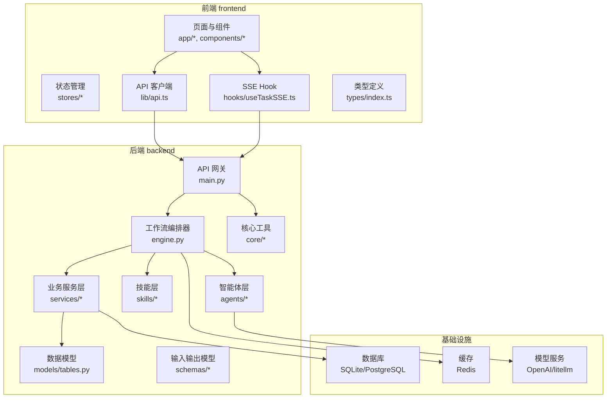
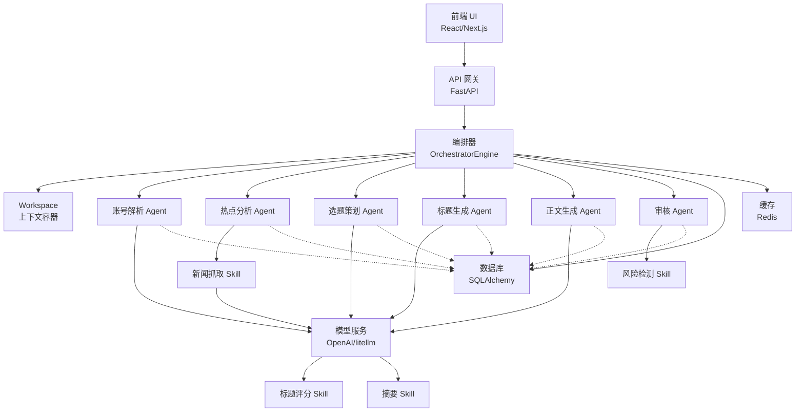
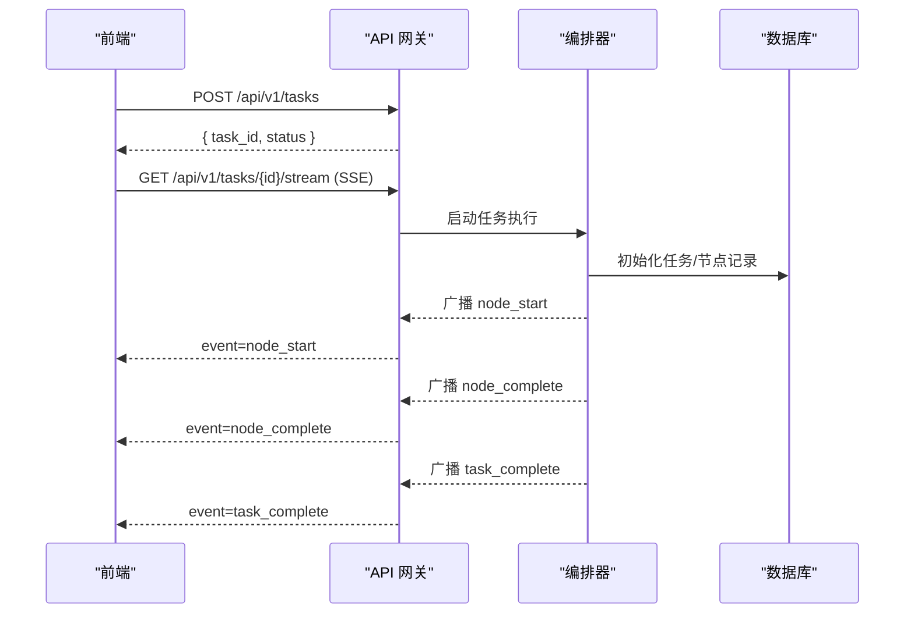
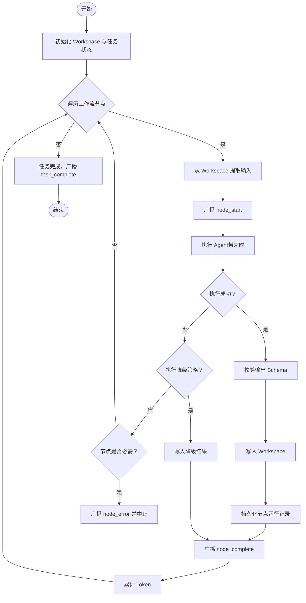
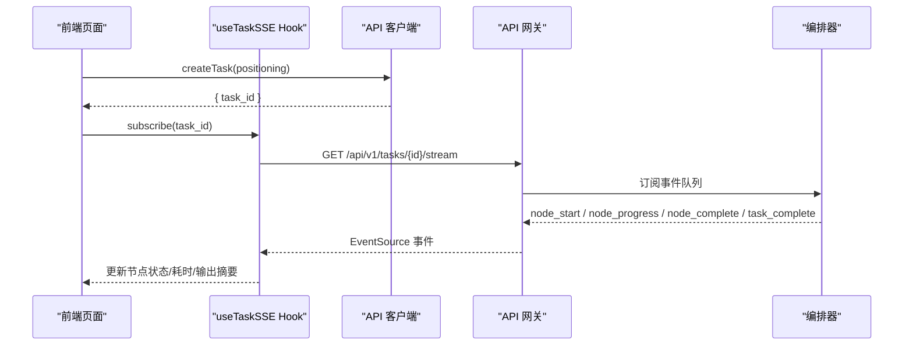
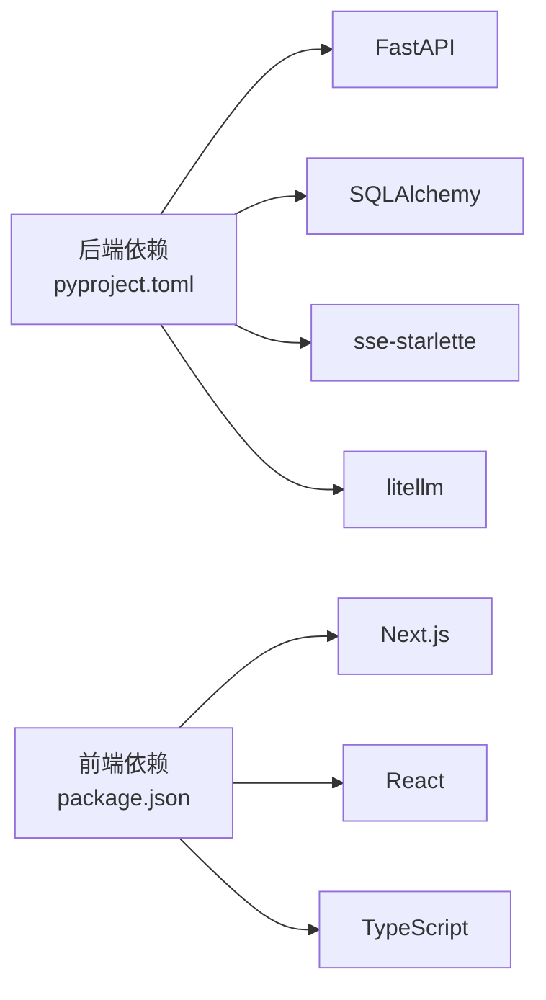

# 系统架构设计

<cite>
**本文引用的文件**
- [ARCHITECTURE.md](file://ARCHITECTURE.md)
- [pyproject.toml](file://backend/pyproject.toml)
- [package.json](file://frontend/package.json)
- [package.json](file://OpenClaw-bot-review-main/package.json)
- [main.py](file://backend/app/main.py)
- [engine.py](file://backend/app/orchestrator/engine.py)
- [stream_routes.py](file://backend/app/api/stream_routes.py)
- [task.py](file://backend/app/schemas/task.py)
- [tables.py](file://backend/app/models/tables.py)
- [config.py](file://backend/app/core/config.py)
- [api.ts](file://frontend/lib/api.ts)
- [useTaskSSE.ts](file://frontend/hooks/useTaskSSE.ts)
- [index.ts](file://frontend/types/index.ts)
</cite>

## 目录
1. [引言](#引言)
2. [项目结构](#项目结构)
3. [核心组件](#核心组件)
4. [架构总览](#架构总览)
5. [详细组件分析](#详细组件分析)
6. [依赖分析](#依赖分析)
7. [性能考虑](#性能考虑)
8. [故障排查指南](#故障排查指南)
9. [结论](#结论)
10. [附录](#附录)

## 引言
本设计文档面向“HotClaw 多智能体公众号内容生产平台”，系统采用前后端分离架构，围绕“控制平面与执行平面分离”“Workspace-First”“Manifest-First”的核心理念，构建从账号定位到文章草稿的全链路内容生产流水线。后端基于 Python FastAPI，前端基于 React/Next.js，通过 SSE 实现实时状态推送，确保可视化与可观测性。

## 项目结构
系统采用“双仓库 + 多子目录”的组织方式：
- backend：Python FastAPI 后端，包含网关、编排器、智能体、技能、服务、模型、Schema、核心工具等模块
- frontend：React/Next.js 前端，包含页面、组件、状态管理、API 客户端、Hook 等
- OpenClaw-bot-review-main：另一个 Next.js 前端示例工程，便于对比与复用
- manifests：声明式配置目录（当前示例文件不存在，但架构已预留）
- 其他资源：脚本、资产包、README 等

图表来源
- [main.py:60-142](file://backend/app/main.py#L60-L142)
- [engine.py:89-285](file://backend/app/orchestrator/engine.py#L89-L285)
- [stream_routes.py:14-43](file://backend/app/api/stream_routes.py#L14-L43)
- [tables.py:23-233](file://backend/app/models/tables.py#L23-L233)
- [pyproject.toml:6-22](file://backend/pyproject.toml#L6-L22)

章节来源
- [ARCHITECTURE.md:37-78](file://ARCHITECTURE.md#L37-L78)
- [ARCHITECTURE.md:414-448](file://ARCHITECTURE.md#L414-L448)

## 核心组件
- API 网关（FastAPI）：统一入口、参数校验、SSE 端点、全局异常处理、CORS、Trace-ID 注入
- 工作流编排器（Orchestrator）：加载默认线性工作流、按序调度 Agent、管理 Workspace、广播事件、持久化节点运行记录
- 智能体层（Agent）：有上下文、有决策能力的执行单元，遵循结构化输入输出
- 技能层（Skill）：无状态原子能力，封装外部 API/规则引擎，供 Agent 调用
- 业务服务层（Services）：任务 CRUD、配置管理、草稿/审核服务等
- 数据模型（Models）：任务、节点运行、账号画像、选题候选、文章草稿、审核结果、Agent/Skill/工作流模板、系统日志
- 前端（React/Next.js）：页面路由、组件树、状态管理、SSE Hook、API 客户端

章节来源
- [main.py:14-137](file://backend/app/main.py#L14-L137)
- [engine.py:31-86](file://backend/app/orchestrator/engine.py#L31-L86)
- [engine.py:89-285](file://backend/app/orchestrator/engine.py#L89-L285)
- [tables.py:23-233](file://backend/app/models/tables.py#L23-L233)
- [ARCHITECTURE.md:414-448](file://ARCHITECTURE.md#L414-L448)

## 架构总览
系统采用“控制平面与执行平面分离”的设计：编排器（控制平面）负责调度与上下文管理，Agent（执行平面）负责具体任务执行。Workspace 作为任务级上下文容器，贯穿全链路。前端通过 SSE 实时接收节点状态，实现可视化与可观测性。

图表来源
- [ARCHITECTURE.md:39-78](file://ARCHITECTURE.md#L39-L78)
- [engine.py:31-86](file://backend/app/orchestrator/engine.py#L31-L86)
- [engine.py:92-234](file://backend/app/orchestrator/engine.py#L92-L234)
- [tables.py:23-233](file://backend/app/models/tables.py#L23-L233)

## 详细组件分析

### API 网关（FastAPI）
- 职责：路由注册、参数校验、统一错误响应、CORS、Trace-ID 注入、健康检查
- 关键点：全局异常处理器将业务错误映射为 HTTP 状态码；SSE 端点通过 sse-starlette 返回 EventSourceResponse；中间件注入 X-Trace-Id
- 依赖：路由模块（task、stream、agent、skill）、核心异常与日志

图表来源
- [main.py:133-142](file://backend/app/main.py#L133-L142)
- [stream_routes.py:14-43](file://backend/app/api/stream_routes.py#L14-L43)
- [engine.py:124-132](file://backend/app/orchestrator/engine.py#L124-L132)
- [engine.py:200-209](file://backend/app/orchestrator/engine.py#L200-L209)
- [engine.py:228-232](file://backend/app/orchestrator/engine.py#L228-L232)

章节来源
- [main.py:60-142](file://backend/app/main.py#L60-L142)
- [stream_routes.py:14-43](file://backend/app/api/stream_routes.py#L14-L43)

### 工作流编排器（OrchestratorEngine）
- 职责：加载默认线性工作流、按序调度 Agent、提取输入、广播事件、降级策略、持久化节点运行记录、计算耗时与 Token
- 设计要点：严格控制 Agent 执行顺序；节点失败时根据 required 字段决定是否中断；支持系统提示词动态解析；输出摘要用于 SSE 展示
- 事件广播：node_start、node_progress（在实现中可扩展）、node_complete、node_error、task_complete、task_error

图表来源
- [engine.py:92-234](file://backend/app/orchestrator/engine.py#L92-L234)
- [engine.py:265-271](file://backend/app/orchestrator/engine.py#L265-L271)
- [engine.py:273-281](file://backend/app/orchestrator/engine.py#L273-L281)

章节来源
- [engine.py:89-285](file://backend/app/orchestrator/engine.py#L89-L285)

### 智能体层（Agent）
- 设计原则：有角色、有上下文、有决策能力；输入输出均为结构化 Schema；可定义降级策略
- 第一版 Agent：账号解析、热点分析、选题策划、标题生成、正文生成、审核
- 与技能协作：Agent 调用 Skill 完成原子能力执行；Skill 无状态、可复用

章节来源
- [ARCHITECTURE.md:541-632](file://ARCHITECTURE.md#L541-L632)

### 技能层（Skill）
- 定义：无状态原子能力单元，封装 API 调用、规则匹配、数据处理
- 注册机制：通过 YAML manifest 声明式注册，系统启动时加载并校验
- 调用协议：Agent 通过 SkillRegistry 获取实例并调用 execute，传入标准化输入与配置

章节来源
- [ARCHITECTURE.md:635-758](file://ARCHITECTURE.md#L635-L758)

### 数据模型与持久化
- 核心表：tasks、task_node_runs、account_profiles、topic_candidates、article_drafts、audit_results、agents、skills、workflow_templates、system_logs
- 设计要点：每个节点运行记录包含输入/输出、耗时、Token、错误信息、降级标记；任务表聚合统计信息

章节来源
- [tables.py:23-233](file://backend/app/models/tables.py#L23-L233)

### 前端架构与实时推送（SSE）
- 技术栈：Next.js、TypeScript、Zustand、Ant Design、Axios、SSE
- 页面与路由：首页、任务运行页、结果页、配置页、历史页
- SSE 实现：useTaskSSE Hook 订阅 /api/v1/tasks/{id}/stream，监听 node_start/node_complete/node_error/task_complete 事件，驱动 UI 状态更新
- API 客户端：封装统一响应格式与错误处理

图表来源
- [useTaskSSE.ts:28-124](file://frontend/hooks/useTaskSSE.ts#L28-L124)
- [api.ts:26-50](file://frontend/lib/api.ts#L26-L50)
- [stream_routes.py:14-43](file://backend/app/api/stream_routes.py#L14-L43)
- [engine.py:124-132](file://backend/app/orchestrator/engine.py#L124-L132)
- [engine.py:200-209](file://backend/app/orchestrator/engine.py#L200-L209)
- [engine.py:228-232](file://backend/app/orchestrator/engine.py#L228-L232)

章节来源
- [ARCHITECTURE.md:191-398](file://ARCHITECTURE.md#L191-L398)
- [useTaskSSE.ts:1-124](file://frontend/hooks/useTaskSSE.ts#L1-L124)
- [api.ts:1-110](file://frontend/lib/api.ts#L1-L110)
- [index.ts:66-95](file://frontend/types/index.ts#L66-L95)

## 依赖分析
- 后端依赖：FastAPI、Uvicorn、SQLAlchemy 2.0、Alembic、Pydantic、Redis、HTTPX、Structlog、PyYAML、sse-starlette、LiteLLM、Aiosqlite
- 前端依赖：Next.js、React、TypeScript、TailwindCSS、Axios、SSE（浏览器 EventSource）

图表来源
- [pyproject.toml:6-22](file://backend/pyproject.toml#L6-L22)
- [package.json:11-21](file://frontend/package.json#L11-L21)

章节来源
- [pyproject.toml:1-41](file://backend/pyproject.toml#L1-L41)
- [package.json:1-23](file://frontend/package.json#L1-L23)

## 性能考虑
- 异步与并发：后端使用 asyncio 与异步 SQLAlchemy，避免阻塞；SSE 使用 EventSource，单向推送降低复杂度
- 超时与降级：为 Agent/Skill/LLM 设置超时阈值；节点失败时执行降级策略，保障链路稳定性
- 缓存与持久化：Redis 用于会话与缓存；数据库记录节点运行明细，支持回放与审计
- 日志与追踪：结构化日志与 Trace-ID，便于问题定位与性能分析

## 故障排查指南
- 常见错误分类与映射：业务错误码按类别映射为 4xx/5xx；特殊码映射为 404/504
- 未捕获异常：统一返回 500，并在调试模式下返回错误详情
- SSE 连接断开：EventSource 自动重连；后端发送 keepalive 注释维持连接
- 任务失败定位：查看节点运行记录中的 error_message、degraded 标记、耗时与 Token 统计

章节来源
- [main.py:87-130](file://backend/app/main.py#L87-L130)
- [stream_routes.py:18-42](file://backend/app/api/stream_routes.py#L18-L42)
- [engine.py:164-196](file://backend/app/orchestrator/engine.py#L164-L196)

## 结论
HotClaw 以“控制平面与执行平面分离”为核心，结合 Workspace-First 与 Manifest-First 的设计，构建了可配置、可观测、可回放的内容生产流水线。前后端分离与 SSE 实时推送提升了用户体验与开发效率。后续可在保持现有架构稳定性的前提下，逐步引入 DAG 工作流、插件化扩展与分布式部署。

## 附录
- 设计原则与核心概念：详见 ARCHITECTURE.md 第 2 章与第 3 章
- 页面与路由：详见 ARCHITECTURE.md 第 4.2 节
- 技术栈选择理由：详见 ARCHITECTURE.md 第 4.1 节与第 5.1 节
- 配置与环境变量：详见 ARCHITECTURE.md 第 5.3 节与 config.py