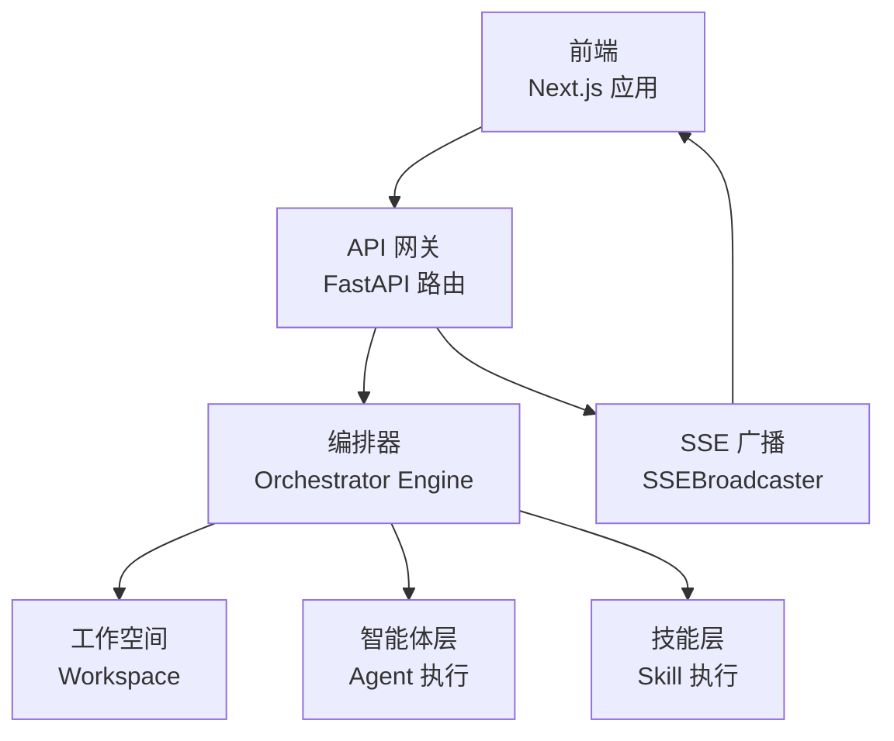
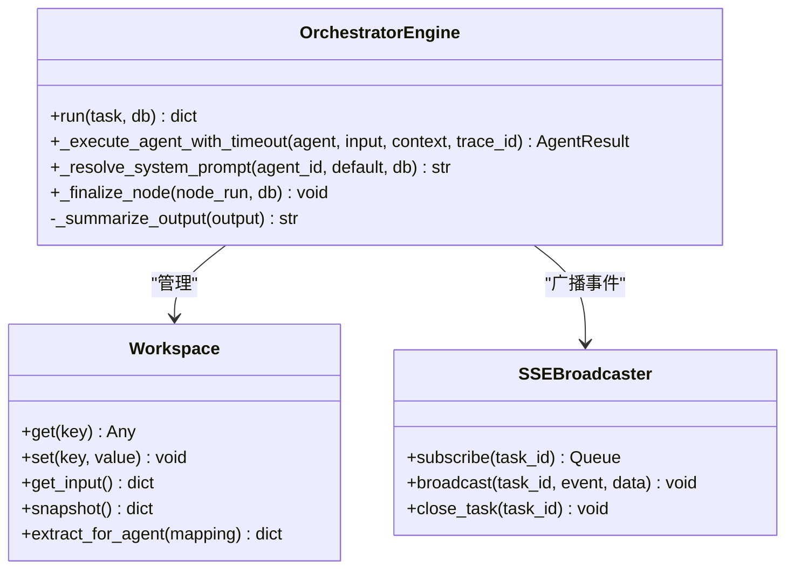
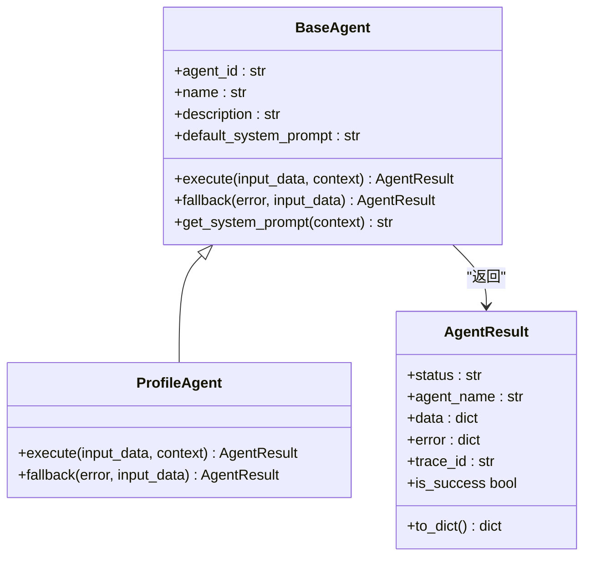
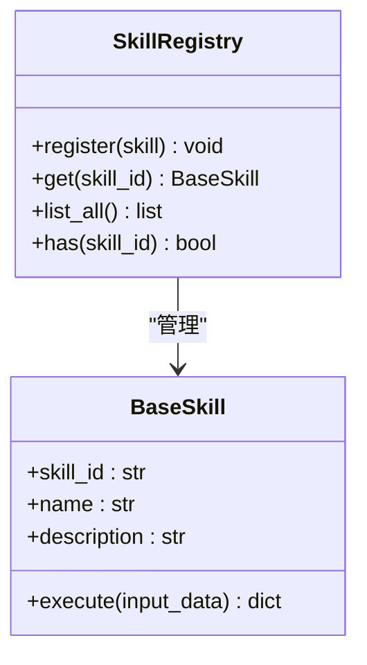
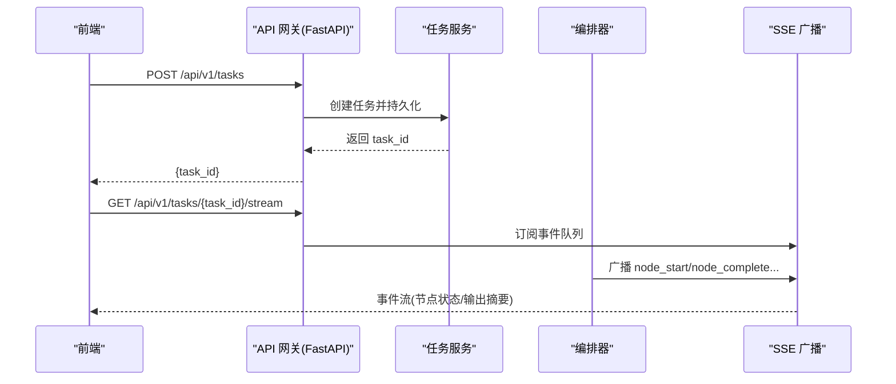
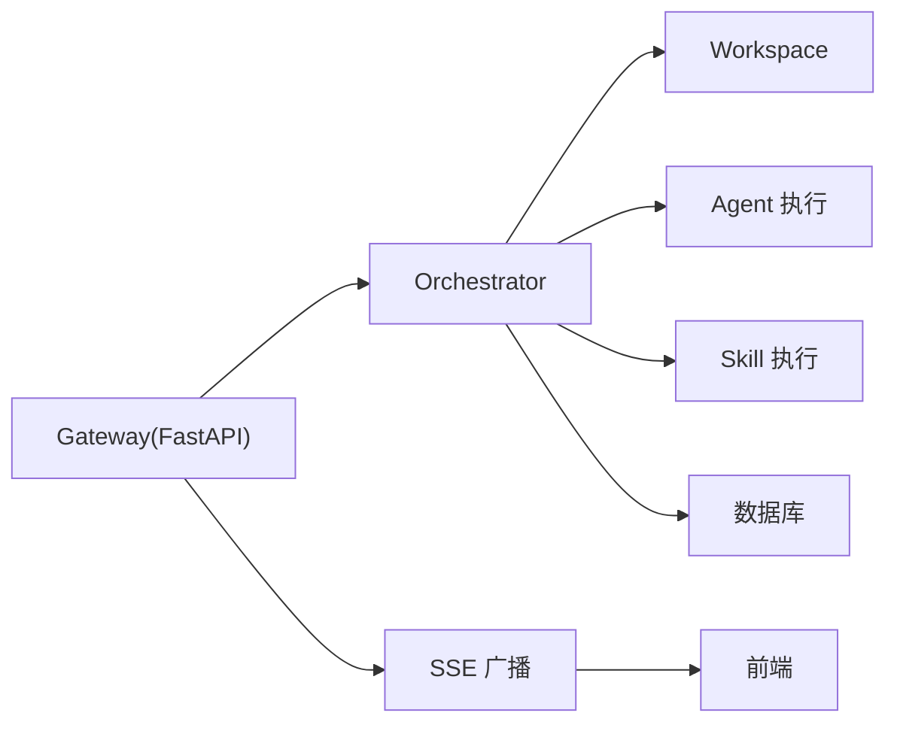

# 设计原则

<cite>
**本文引用的文件**
- [ARCHITECTURE.md](file://ARCHITECTURE.md)
- [backend/app/main.py](file://backend/app/main.py)
- [backend/app/orchestrator/engine.py](file://backend/app/orchestrator/engine.py)
- [backend/app/orchestrator/workspace.py](file://backend/app/orchestrator/workspace.py)
- [backend/app/orchestrator/broadcaster.py](file://backend/app/orchestrator/broadcaster.py)
- [backend/app/agents/base.py](file://backend/app/agents/base.py)
- [backend/app/agents/profile_agent.py](file://backend/app/agents/profile_agent.py)
- [backend/app/skills/base.py](file://backend/app/skills/base.py)
- [backend/app/skills/registry.py](file://backend/app/skills/registry.py)
- [backend/app/api/task_routes.py](file://backend/app/api/task_routes.py)
- [backend/app/api/stream_routes.py](file://backend/app/api/stream_routes.py)
- [frontend/app/layout.tsx](file://frontend/app/layout.tsx)
</cite>

## 目录
1. [引言](#引言)
2. [项目结构](#项目结构)
3. [核心设计原则详解](#核心设计原则详解)
4. [架构总览](#架构总览)
5. [关键组件深度解析](#关键组件深度解析)
6. [依赖关系分析](#依赖关系分析)
7. [性能考量](#性能考量)
8. [故障排查指南](#故障排查指南)
9. [结论](#结论)
10. [附录](#附录)

## 引言
本文件系统化阐述 HotClaw 项目的12条核心设计原则，结合架构文档与代码实现，逐条解释其含义、实施方法与预期收益，并给出与 OpenClaw 理念的对比与改造点。文档同时提供可落地的最佳实践、代码片段路径与可视化图示，帮助不同经验层次的开发者快速理解并正确应用这些原则。

## 项目结构
HotClaw 采用前后端分离架构：前端为 Next.js 应用，后端为 FastAPI 应用，中间通过 API Gateway（即 FastAPI 路由层）统一入口提供 HTTP + SSE 实时事件推送。后端内部进一步划分为网关层、编排器（Orchestrator）、Agent 执行层、Skill 技能层、服务层、模型与 Schema、配置与核心工具等模块。

图表来源
- [backend/app/main.py:69-147](file://backend/app/main.py#L69-L147)
- [backend/app/orchestrator/engine.py:89-234](file://backend/app/orchestrator/engine.py#L89-L234)
- [backend/app/orchestrator/workspace.py:12-53](file://backend/app/orchestrator/workspace.py#L12-L53)
- [backend/app/orchestrator/broadcaster.py:11-99](file://backend/app/orchestrator/broadcaster.py#L11-L99)
- [frontend/app/layout.tsx:1-16](file://frontend/app/layout.tsx#L1-L16)

章节来源
- [ARCHITECTURE.md:37-78](file://ARCHITECTURE.md#L37-L78)
- [ARCHITECTURE.md:414-447](file://ARCHITECTURE.md#L414-L447)
- [backend/app/main.py:69-147](file://backend/app/main.py#L69-L147)

## 核心设计原则详解
本节逐条展开12条设计原则，结合架构文档与代码实现，说明其在系统中的落地方式与收益。

### 原则1：Workspace-First（工作空间优先）
- 含义：每个任务创建独立工作空间（Workspace），所有 Agent 在同一上下文中共享数据，Workspace 是隔离与协作的基本单位。
- 实施要点：
  - 任务创建时初始化 Workspace，保存原始输入与中间结果。
  - Agent 通过 Workspace 读取上游输出、写入自身结果。
  - 输入映射（input_mapping）将上游输出映射到当前 Agent 的输入字段。
- 预期收益：强隔离、可审计、可回放；避免全局状态污染；便于调试与溯源。
- 代码路径：
  - [backend/app/orchestrator/workspace.py:12-53](file://backend/app/orchestrator/workspace.py#L12-L53)
  - [backend/app/orchestrator/engine.py:98-135](file://backend/app/orchestrator/engine.py#L98-L135)

章节来源
- [ARCHITECTURE.md:98](file://ARCHITECTURE.md#L98)
- [ARCHITECTURE.md:124-134](file://ARCHITECTURE.md#L124-L134)
- [backend/app/orchestrator/workspace.py:12-53](file://backend/app/orchestrator/workspace.py#L12-L53)
- [backend/app/orchestrator/engine.py:98-135](file://backend/app/orchestrator/engine.py#L98-L135)

### 原则2：Manifest-First（清单优先）
- 含义：新增 Agent/Skill/Workflow 通过 YAML/JSON 清单声明式注册，系统启动时扫描加载，拒绝硬编码。
- 实施要点：
  - 清单目录包含 agents、skills、workflows、schemas 四类清单。
  - 启动时校验清单格式与模块路径，动态加载并注册。
  - 清单驱动配置优先，便于非代码变更行为。
- 预期收益：可演进、可替换、可回滚；降低耦合；提升可维护性。
- 代码路径：
  - [ARCHITECTURE.md:99](file://ARCHITECTURE.md#L99)
  - [ARCHITECTURE.md:761-791](file://ARCHITECTURE.md#L761-L791)

章节来源
- [ARCHITECTURE.md:99](file://ARCHITECTURE.md#L99)
- [ARCHITECTURE.md:761-791](file://ARCHITECTURE.md#L761-L791)

### 原则3：控制平面与执行平面分离
- 含义：编排器（Orchestrator）只负责调度（何时调谁），Agent 只负责执行（做什么事）；两者通过标准协议通信。
- 实施要点：
  - Orchestrator 负责加载 workflow、按序调度 Agent、管理 Workspace 生命周期、广播状态。
  - Agent 仅实现 execute/fallback，不参与编排。
- 预期收益：职责清晰、易于测试与替换；降低复杂度与耦合。
- 代码路径：
  - [ARCHITECTURE.md:100](file://ARCHITECTURE.md#L100)
  - [backend/app/orchestrator/engine.py:89-234](file://backend/app/orchestrator/engine.py#L89-L234)
  - [backend/app/agents/base.py:49-99](file://backend/app/agents/base.py#L49-L99)

章节来源
- [ARCHITECTURE.md:100](file://ARCHITECTURE.md#L100)
- [backend/app/orchestrator/engine.py:89-234](file://backend/app/orchestrator/engine.py#L89-L234)
- [backend/app/agents/base.py:49-99](file://backend/app/agents/base.py#L49-L99)

### 原则4：Gateway 唯一入口
- 含义：所有外部请求经 API Gateway 进入，统一鉴权、限流、参数校验；内部服务不暴露。
- 实施要点：
  - FastAPI 路由层承担 Gateway 职责，集中处理路由、CORS、异常与追踪头。
  - SSE 事件通过统一端点推送。
- 预期收益：安全边界清晰、便于治理与可观测；简化前端对接。
- 代码路径：
  - [ARCHITECTURE.md:101](file://ARCHITECTURE.md#L101)
  - [backend/app/main.py:69-147](file://backend/app/main.py#L69-L147)
  - [backend/app/api/stream_routes.py:14-42](file://backend/app/api/stream_routes.py#L14-L42)

章节来源
- [ARCHITECTURE.md:101](file://ARCHITECTURE.md#L101)
- [backend/app/main.py:69-147](file://backend/app/main.py#L69-L147)
- [backend/app/api/stream_routes.py:14-42](file://backend/app/api/stream_routes.py#L14-L42)

### 原则5：结构化输入输出
- 含义：所有 Agent 的输入输出必须是 JSON Schema 定义的结构体，拒绝自由文本传递。
- 实施要点：
  - Agent 基类提供标准化返回结构 AgentResult。
  - Orchestrator 对输出进行 schema 校验与持久化。
- 预期收益：可预测、可校验、可回放；降低集成与调试成本。
- 代码路径：
  - [ARCHITECTURE.md:102](file://ARCHITECTURE.md#L102)
  - [backend/app/agents/base.py:18-47](file://backend/app/agents/base.py#L18-L47)
  - [backend/app/orchestrator/engine.py:147-171](file://backend/app/orchestrator/engine.py#L147-L171)

章节来源
- [ARCHITECTURE.md:102](file://ARCHITECTURE.md#L102)
- [backend/app/agents/base.py:18-47](file://backend/app/agents/base.py#L18-L47)
- [backend/app/orchestrator/engine.py:147-171](file://backend/app/orchestrator/engine.py#L147-L171)

### 原则6：可审计可回放
- 含义：每个节点的输入、输出、耗时、Token 消耗、错误信息全部持久化，支持任务级回放。
- 实施要点：
  - 每个节点运行记录包含输入/输出、耗时、模型、Token 等。
  - 通过 SSE 广播节点事件，前端可实时回放。
- 预期收益：全流程可观测、可追溯、可复盘；便于质量与成本分析。
- 代码路径：
  - [ARCHITECTURE.md:103](file://ARCHITECTURE.md#L103)
  - [backend/app/orchestrator/engine.py:113-198](file://backend/app/orchestrator/engine.py#L113-L198)
  - [backend/app/orchestrator/broadcaster.py:57-68](file://backend/app/orchestrator/broadcaster.py#L57-L68)

章节来源
- [ARCHITECTURE.md:103](file://ARCHITECTURE.md#L103)
- [backend/app/orchestrator/engine.py:113-198](file://backend/app/orchestrator/engine.py#L113-L198)
- [backend/app/orchestrator/broadcaster.py:57-68](file://backend/app/orchestrator/broadcaster.py#L57-L68)

### 原则7：渐进式自动化
- 含义：MVP 阶段允许用户在关键节点介入（选择选题、修改标题），不追求全自动黑盒。
- 实施要点：
  - 前端页面支持查看与编辑 Agent 配置，支持人工干预。
  - 任务链路可视化，节点状态可观察。
- 预期收益：降低用户学习成本，提升可控性与信任度。
- 代码路径：
  - [ARCHITECTURE.md:104](file://ARCHITECTURE.md#L104)
  - [ARCHITECTURE.md:165-175](file://ARCHITECTURE.md#L165-L175)

章节来源
- [ARCHITECTURE.md:104](file://ARCHITECTURE.md#L104)
- [ARCHITECTURE.md:165-175](file://ARCHITECTURE.md#L165-L175)

### 原则8：Skills 是原子能力
- 含义：Skill 是无状态的、可复用的原子工具；Agent 是有上下文的决策者，Agent 调用 Skill。
- 实施要点：
  - Skill 基类提供标准化 execute 接口，无状态、可独立运行。
  - Agent 通过 SkillRegistry 获取并调用 Skill。
- 预期收益：能力解耦、复用性强、易于测试与替换。
- 代码路径：
  - [ARCHITECTURE.md:105](file://ARCHITECTURE.md#L105)
  - [backend/app/skills/base.py:16-37](file://backend/app/skills/base.py#L16-L37)
  - [backend/app/skills/registry.py:10-37](file://backend/app/skills/registry.py#L10-L37)

章节来源
- [ARCHITECTURE.md:105](file://ARCHITECTURE.md#L105)
- [backend/app/skills/base.py:16-37](file://backend/app/skills/base.py#L16-L37)
- [backend/app/skills/registry.py:10-37](file://backend/app/skills/registry.py#L10-L37)

### 原则9：失败不阻塞
- 含义：单个 Agent 失败时提供降级策略（返回默认值/跳过/重试），不让整条链路崩溃。
- 实施要点：
  - Agent 提供 fallback 方法；Orchestrator 在必要时启用降级并继续后续节点。
- 预期收益：提高系统韧性与用户体验；保障关键路径可用。
- 代码路径：
  - [ARCHITECTURE.md:106](file://ARCHITECTURE.md#L106)
  - [backend/app/agents/base.py:77-82](file://backend/app/agents/base.py#L77-L82)
  - [backend/app/orchestrator/engine.py:154-174](file://backend/app/orchestrator/engine.py#L154-L174)

章节来源
- [ARCHITECTURE.md:106](file://ARCHITECTURE.md#L106)
- [backend/app/agents/base.py:77-82](file://backend/app/agents/base.py#L77-L82)
- [backend/app/orchestrator/engine.py:154-174](file://backend/app/orchestrator/engine.py#L154-L174)

### 原则10：配置优先于代码
- 含义：能通过配置改变的行为，不写死在代码里；包括 prompt 模板、模型选择、重试策略等。
- 实施要点：
  - 系统启动时加载默认配置；运行时可从数据库覆盖（如系统提示词）。
- 预期收益：无需发版即可调整行为；降低回归风险。
- 代码路径：
  - [ARCHITECTURE.md:107](file://ARCHITECTURE.md#L107)
  - [backend/app/orchestrator/engine.py:245-263](file://backend/app/orchestrator/engine.py#L245-L263)

章节来源
- [ARCHITECTURE.md:107](file://ARCHITECTURE.md#L107)
- [backend/app/orchestrator/engine.py:245-263](file://backend/app/orchestrator/engine.py#L245-L263)

### 原则11：最小权限原则
- 含义：每个 Agent 只能访问自己声明的 Skills 与 Workspace 中被显式授权的字段。
- 实施要点：
  - 输入映射仅允许 Agent 访问已授权字段；Workspace 作为唯一可信数据源。
- 预期收益：降低越权与误用风险；增强安全性与可审计性。
- 代码路径：
  - [ARCHITECTURE.md:108](file://ARCHITECTURE.md#L108)
  - [backend/app/orchestrator/workspace.py:36-52](file://backend/app/orchestrator/workspace.py#L36-L52)

章节来源
- [ARCHITECTURE.md:108](file://ARCHITECTURE.md#L108)
- [backend/app/orchestrator/workspace.py:36-52](file://backend/app/orchestrator/workspace.py#L36-L52)

### 原则12：可视化是一等公民
- 含义：运行链路可视化不是附加功能，而是核心能力；架构设计时即考虑状态广播。
- 实施要点：
  - 通过 SSE 广播节点事件，前端实时渲染流水线卡片。
  - 事件类型覆盖节点开始/进度/完成/失败与任务级事件。
- 预期收益：提升可观测性与用户掌控感；便于问题定位与运营分析。
- 代码路径：
  - [ARCHITECTURE.md:109](file://ARCHITECTURE.md#L109)
  - [backend/app/orchestrator/broadcaster.py:57-68](file://backend/app/orchestrator/broadcaster.py#L57-L68)
  - [backend/app/api/stream_routes.py:14-42](file://backend/app/api/stream_routes.py#L14-L42)

章节来源
- [ARCHITECTURE.md:109](file://ARCHITECTURE.md#L109)
- [backend/app/orchestrator/broadcaster.py:57-68](file://backend/app/orchestrator/broadcaster.py#L57-L68)
- [backend/app/api/stream_routes.py:14-42](file://backend/app/api/stream_routes.py#L14-L42)

## 架构总览
下图展示了 HotClaw 的整体架构与数据流，体现“Gateway 唯一入口”“控制平面与执行平面分离”“Workspace-First”“Manifest-First”“可视化是一等公民”等原则：

```mermaid
graph TB
subgraph "前端"
UI["Next.js 应用<br/>页面与可视化"]
SSEC["SSE 客户端"]
end
subgraph "后端"
GW["FastAPI 网关<br/>路由/校验/异常"]
ORCH["编排器<br/>OrchestratorEngine"]
WS["工作空间<br/>Workspace"]
AG["Agent 执行层"]
SK["Skill 执行层"]
DB["数据库/持久化"]
LOG["日志/追踪"]
end
UI --> GW
GW --> ORCH
ORCH --> WS
ORCH --> AG
ORCH --> SK
ORCH --> DB
GW --> SSEC
ORCH --> LOG
SSEC --> UI
```

图表来源
- [backend/app/main.py:69-147](file://backend/app/main.py#L69-L147)
- [backend/app/orchestrator/engine.py:89-234](file://backend/app/orchestrator/engine.py#L89-L234)
- [backend/app/orchestrator/workspace.py:12-53](file://backend/app/orchestrator/workspace.py#L12-L53)
- [backend/app/orchestrator/broadcaster.py:11-99](file://backend/app/orchestrator/broadcaster.py#L11-L99)

## 关键组件深度解析

### 组件A：Orchestrator 引擎（控制平面）
- 职责：加载 workflow、创建 Workspace、按序调度 Agent、广播状态、持久化节点运行记录。
- 关键特性：
  - 严格控制执行顺序与依赖；失败时按需降级或中断。
  - 统一追踪 ID 传播；事件缓冲与回放。
- 代码路径：
  - [backend/app/orchestrator/engine.py:89-234](file://backend/app/orchestrator/engine.py#L89-L234)
  - [backend/app/orchestrator/broadcaster.py:57-68](file://backend/app/orchestrator/broadcaster.py#L57-L68)

图表来源
- [backend/app/orchestrator/engine.py:89-285](file://backend/app/orchestrator/engine.py#L89-L285)
- [backend/app/orchestrator/workspace.py:12-53](file://backend/app/orchestrator/workspace.py#L12-L53)
- [backend/app/orchestrator/broadcaster.py:11-99](file://backend/app/orchestrator/broadcaster.py#L11-L99)

章节来源
- [backend/app/orchestrator/engine.py:89-234](file://backend/app/orchestrator/engine.py#L89-L234)
- [backend/app/orchestrator/workspace.py:12-53](file://backend/app/orchestrator/workspace.py#L12-L53)
- [backend/app/orchestrator/broadcaster.py:11-99](file://backend/app/orchestrator/broadcaster.py#L11-L99)

### 组件B：Agent 基类与示例（执行平面）
- 职责：定义标准化输入输出、执行任务、提供降级策略。
- 示例：ProfileAgent 将用户输入解析为结构化账号画像，失败时提供默认降级。
- 代码路径：
  - [backend/app/agents/base.py:49-99](file://backend/app/agents/base.py#L49-L99)
  - [backend/app/agents/profile_agent.py:12-102](file://backend/app/agents/profile_agent.py#L12-L102)

图表来源
- [backend/app/agents/base.py:49-99](file://backend/app/agents/base.py#L49-L99)
- [backend/app/agents/profile_agent.py:12-102](file://backend/app/agents/profile_agent.py#L12-L102)

章节来源
- [backend/app/agents/base.py:49-99](file://backend/app/agents/base.py#L49-L99)
- [backend/app/agents/profile_agent.py:12-102](file://backend/app/agents/profile_agent.py#L12-L102)

### 组件C：Skill 机制（原子能力）
- 职责：无状态、可复用的原子能力；通过 SkillRegistry 统一管理与调用。
- 代码路径：
  - [backend/app/skills/base.py:16-37](file://backend/app/skills/base.py#L16-L37)
  - [backend/app/skills/registry.py:10-37](file://backend/app/skills/registry.py#L10-L37)

图表来源
- [backend/app/skills/base.py:16-37](file://backend/app/skills/base.py#L16-L37)
- [backend/app/skills/registry.py:10-37](file://backend/app/skills/registry.py#L10-L37)

章节来源
- [backend/app/skills/base.py:16-37](file://backend/app/skills/base.py#L16-L37)
- [backend/app/skills/registry.py:10-37](file://backend/app/skills/registry.py#L10-L37)

### 组件D：API 网关与 SSE（统一入口与可视化）
- 职责：统一路由、参数校验、异常处理；SSE 推送节点事件。
- 代码路径：
  - [backend/app/main.py:69-147](file://backend/app/main.py#L69-L147)
  - [backend/app/api/task_routes.py:39-103](file://backend/app/api/task_routes.py#L39-L103)
  - [backend/app/api/stream_routes.py:14-42](file://backend/app/api/stream_routes.py#L14-L42)

图表来源
- [backend/app/api/task_routes.py:39-103](file://backend/app/api/task_routes.py#L39-L103)
- [backend/app/api/stream_routes.py:14-42](file://backend/app/api/stream_routes.py#L14-L42)
- [backend/app/orchestrator/broadcaster.py:30-45](file://backend/app/orchestrator/broadcaster.py#L30-L45)

章节来源
- [backend/app/main.py:69-147](file://backend/app/main.py#L69-L147)
- [backend/app/api/task_routes.py:39-103](file://backend/app/api/task_routes.py#L39-L103)
- [backend/app/api/stream_routes.py:14-42](file://backend/app/api/stream_routes.py#L14-L42)
- [backend/app/orchestrator/broadcaster.py:30-45](file://backend/app/orchestrator/broadcaster.py#L30-L45)

## 依赖关系分析
- 模块内聚与耦合：
  - Orchestrator 与 Agent/Skill 通过接口解耦；Workspace 作为唯一可信数据源。
  - Gateway 仅负责请求进入与响应返回，不承载业务逻辑。
- 外部依赖：
  - LLM 调用通过统一适配层；SSE 通过 sse-starlette；数据库通过 SQLAlchemy。
- 循环依赖规避：
  - 通过抽象基类与注册中心避免循环导入；事件广播采用单例与队列解耦。

图表来源
- [backend/app/main.py:69-147](file://backend/app/main.py#L69-L147)
- [backend/app/orchestrator/engine.py:89-234](file://backend/app/orchestrator/engine.py#L89-L234)
- [backend/app/orchestrator/broadcaster.py:11-99](file://backend/app/orchestrator/broadcaster.py#L11-L99)

章节来源
- [backend/app/main.py:69-147](file://backend/app/main.py#L69-L147)
- [backend/app/orchestrator/engine.py:89-234](file://backend/app/orchestrator/engine.py#L89-L234)
- [backend/app/orchestrator/broadcaster.py:11-99](file://backend/app/orchestrator/broadcaster.py#L11-L99)

## 性能考量
- 并发与超时：Agent 执行带超时保护，避免阻塞；SSE 采用队列与缓冲，减少连接抖动。
- 事件广播：事件缓冲与延迟清理，避免内存泄漏。
- 日志与追踪：统一 trace_id 传播，便于端到端性能分析。
- 建议：
  - 合理设置 Agent 超时与重试策略；
  - 对长耗时节点拆分子步骤，提升可观测性；
  - 使用数据库索引优化任务查询与节点回放。

## 故障排查指南
- 常见问题与定位：
  - 任务长时间无响应：检查 Agent 超时与 LLM 调用；查看节点状态与错误消息。
  - SSE 断连：确认订阅队列是否被清理；检查 keepalive 与连接断开逻辑。
  - 结构化输出异常：核对 Agent 输出是否符合 Schema；检查 fallback 是否生效。
- 代码路径参考：
  - [backend/app/orchestrator/engine.py:176-196](file://backend/app/orchestrator/engine.py#L176-L196)
  - [backend/app/orchestrator/broadcaster.py:22-45](file://backend/app/orchestrator/broadcaster.py#L22-L45)
  - [backend/app/api/stream_routes.py:18-41](file://backend/app/api/stream_routes.py#L18-L41)

章节来源
- [backend/app/orchestrator/engine.py:176-196](file://backend/app/orchestrator/engine.py#L176-L196)
- [backend/app/orchestrator/broadcaster.py:22-45](file://backend/app/orchestrator/broadcaster.py#L22-L45)
- [backend/app/api/stream_routes.py:18-41](file://backend/app/api/stream_routes.py#L18-L41)

## 结论
HotClaw 的12条设计原则共同构成了一个“可演进、可审计、可回放、可可视化”的多智能体内容生产平台。通过“Gateway 唯一入口”“控制平面与执行平面分离”“Workspace-First”“Manifest-First”等原则，系统在 MVP 阶段即具备清晰的边界与良好的扩展性。结合 OpenClaw 理念的吸收与改造，HotClaw 在保持一致性的同时，针对单机单进程场景做了务实的简化与优化。

## 附录
- 与 OpenClaw 的关系与改造：
  - 保留并强化：控制平面/执行平面分离、Gateway 统一入口、Workspace 上下文隔离、Manifest 声明式注册、严格配置校验、可回放可审计。
  - 改造：Orchestrator 作为内置模块而非独立服务；Gateway 即 FastAPI 路由层；Tool 改为更重的 Skill；Canvas 可视化简化为线性流水线。
- 代码片段路径示例（仅路径，不含代码内容）：
  - [backend/app/orchestrator/engine.py:89-234](file://backend/app/orchestrator/engine.py#L89-L234)
  - [backend/app/orchestrator/workspace.py:12-53](file://backend/app/orchestrator/workspace.py#L12-L53)
  - [backend/app/agents/base.py:49-99](file://backend/app/agents/base.py#L49-L99)
  - [backend/app/skills/registry.py:10-37](file://backend/app/skills/registry.py#L10-L37)
  - [backend/app/api/task_routes.py:39-103](file://backend/app/api/task_routes.py#L39-L103)
  - [backend/app/api/stream_routes.py:14-42](file://backend/app/api/stream_routes.py#L14-L42)