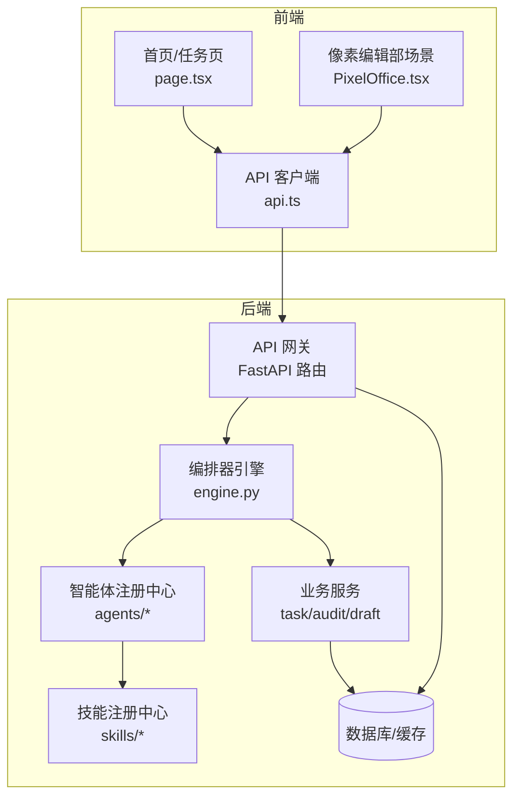
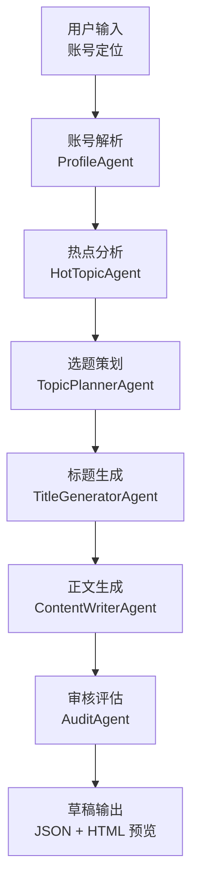
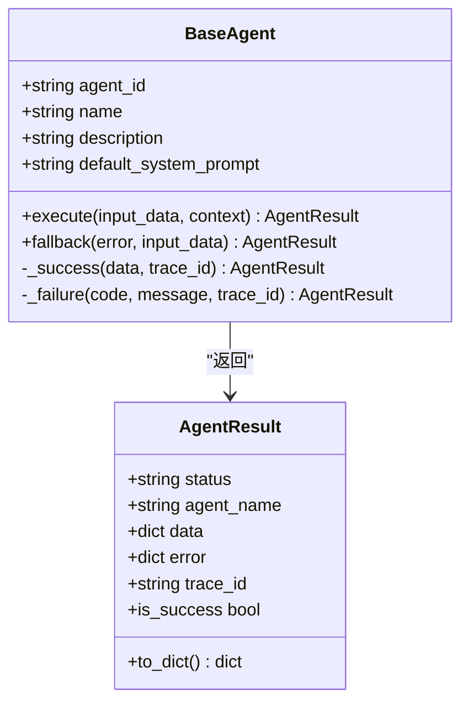
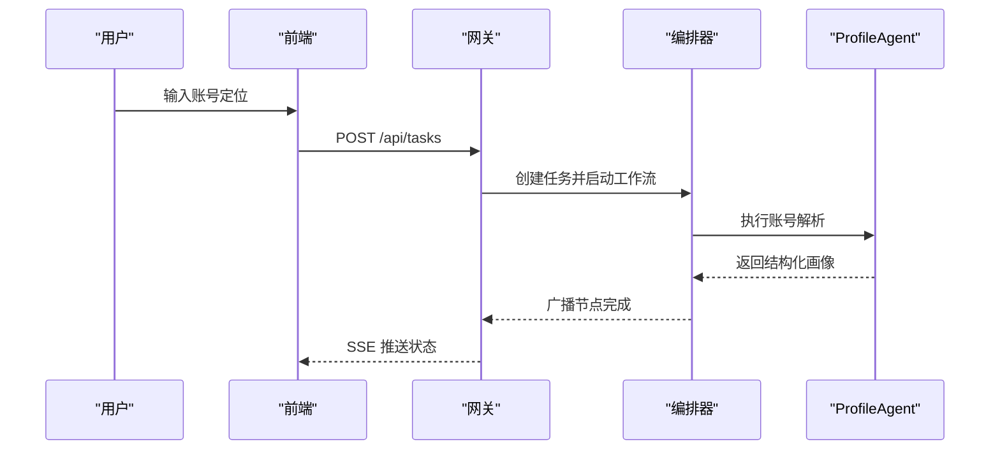
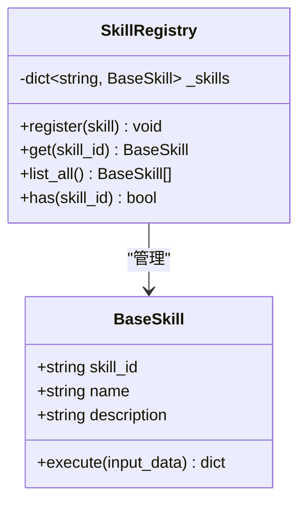
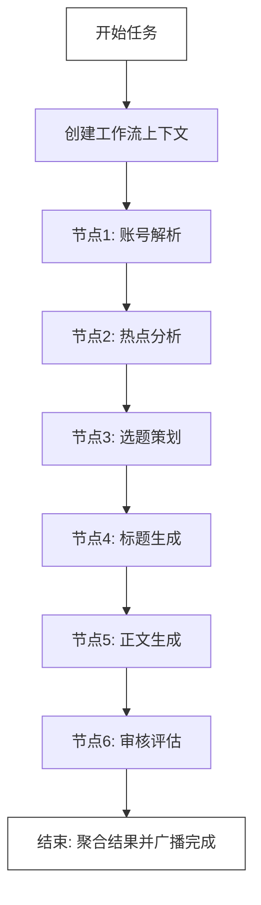
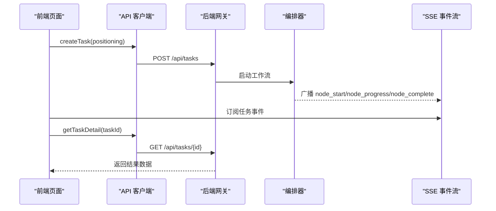
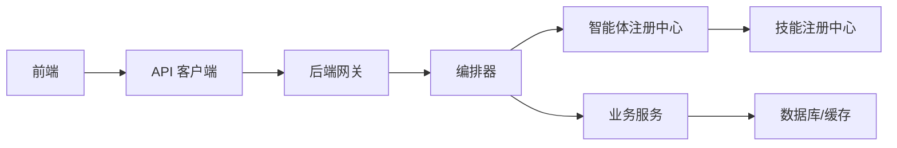

# 项目介绍

<cite>
**本文引用的文件**
- [ARCHITECTURE.md](file://ARCHITECTURE.md)
- [Notice.md](file://Notice.md)
- [ai_readme.md](file://ai_readme.md)
- [backend/app/main.py](file://backend/app/main.py)
- [backend/app/orchestrator/engine.py](file://backend/app/orchestrator/engine.py)
- [backend/app/agents/base.py](file://backend/app/agents/base.py)
- [backend/app/agents/profile_agent.py](file://backend/app/agents/profile_agent.py)
- [backend/app/agents/hot_topic_agent.py](file://backend/app/agents/hot_topic_agent.py)
- [backend/app/skills/base.py](file://backend/app/skills/base.py)
- [backend/app/skills/registry.py](file://backend/app/skills/registry.py)
- [frontend/app/page.tsx](file://frontend/app/page.tsx)
- [frontend/components/office/PixelOffice.tsx](file://frontend/components/office/PixelOffice.tsx)
- [frontend/lib/api.ts](file://frontend/lib/api.ts)
</cite>

## 目录
1. [引言](#引言)
2. [项目结构](#项目结构)
3. [核心组件](#核心组件)
4. [架构总览](#架构总览)
5. [详细组件分析](#详细组件分析)
6. [依赖分析](#依赖分析)
7. [性能考量](#性能考量)
8. [故障排查指南](#故障排查指南)
9. [结论](#结论)
10. [附录](#附录)

## 引言
HotClaw 是一个“基于多智能体协作的公众号内容生产平台”。它的核心价值在于：用户仅需输入“账号定位”，系统即可自动完成从热点抓取、选题策划、标题生成、正文撰写到审核风控的全链路内容生产，并输出可编辑的文章草稿。这显著降低了内容创作门槛，提升了规模化内容产出的效率与一致性。

- 解决的实际问题
  - 传统内容创作周期长、依赖个人经验、质量不稳定
  - 公众号运营需要持续产出高质量内容，但缺乏系统化的自动化支撑
  - 缺乏统一的可视化编排与可追溯的执行过程

- 多智能体协作模式如何提升效率
  - 将复杂内容生产拆解为多个“智能体”节点，每个节点专注单一职责
  - 通过“技能”（Skill）封装原子能力（如新闻抓取、摘要、风险检测），Agent 仅负责决策与编排
  - 工作流（Workflow）线性串联，MVP 阶段即实现“从账号定位到文章草稿”的最小闭环

- 目标用户
  - 微信公众号运营者、内容创作者、MCN 团队、品牌内容团队
  - 希望降低内容创作成本、提升产出效率与质量的团队

- 相比传统方式的优势
  - 一键启动：输入账号定位，自动完成全链路
  - 可视化运行：实时看到每个节点状态、耗时与输出摘要
  - 可配置可回放：支持 Agent/Skill 配置管理与任务级回放
  - 降级容错：单节点失败不影响整体流程，具备默认降级策略

**章节来源**
- [ARCHITECTURE.md: 9-36:9-36](file://ARCHITECTURE.md#L9-L36)
- [Notice.md: 8-37:8-37](file://Notice.md#L8-L37)

## 项目结构
项目采用前后端分离架构，后端基于 Python/FastAPI，前端基于 Next.js/TypeScript，核心模块划分清晰：

- 后端（Python/FastAPI）
  - 网关层：统一入口、参数校验、SSE 推送
  - 编排层：工作流引擎（Orchestrator），按顺序调度 Agent
  - 执行层：Agent 实现与注册中心
  - 能力层：Skill 实现与注册中心
  - 服务层：任务、配置、草稿、审核等业务服务
  - 模型与 Schema：SQLAlchemy 模型与 Pydantic 输入输出定义
  - 核心工具：日志、异常、追踪、配置

- 前端（Next.js/TypeScript）
  - 页面路由：新建任务、任务运行、结果预览、配置管理、历史任务
  - 可视化：像素风“编辑部”场景，实时渲染 Agent 状态
  - 实时通信：SSE 订阅任务节点事件
  - 状态管理：Zustand Store 管理任务、配置、历史

**图表来源**
- [backend/app/main.py: 14-137:14-137](file://backend/app/main.py#L14-L137)
- [backend/app/orchestrator/engine.py: 89-285:89-285](file://backend/app/orchestrator/engine.py#L89-L285)
- [frontend/app/page.tsx: 14-62:14-62](file://frontend/app/page.tsx#L14-L62)
- [frontend/components/office/PixelOffice.tsx: 28-327:28-327](file://frontend/components/office/PixelOffice.tsx#L28-L327)
- [frontend/lib/api.ts: 14-110:14-110](file://frontend/lib/api.ts#L14-L110)

**章节来源**
- [ARCHITECTURE.md: 191-290:191-290](file://ARCHITECTURE.md#L191-L290)
- [Notice.md: 100-122:100-122](file://Notice.md#L100-L122)

## 核心组件
- 智能体（Agent）
  - 定义：有角色、有上下文、有决策能力的执行单元，负责完成单一业务任务
  - 职责：接收结构化输入，调用 LLM 与/或 Skills，输出结构化结果
  - 示例：账号定位解析、热点分析、选题策划、标题生成、正文生成、审核评估

- 技能（Skill）
  - 定义：无状态的原子能力，封装具体技术操作（API 调用、数据处理、规则匹配）
  - 职责：不参与编排，仅做工具型处理，输出稳定可复用

- 工作流（Workflow）
  - 定义：定义 Agent 的执行顺序与依赖关系（MVP 为线性链）
  - 作用：编排器按节点顺序调度 Agent，管理 workspace 上下文

- 编排器（Orchestrator）
  - 定义：工作流执行引擎，负责加载定义、调度 Agent、广播状态、异常处理与结果收集
  - 特性：失败不阻塞、降级策略、可审计可回放

- 网关（Gateway）
  - 定义：统一入口，负责路由、参数校验、错误格式化、SSE 事件推送
  - 作用：前后端分离，前端独立消费事件流

**章节来源**
- [ARCHITECTURE.md: 541-632:541-632](file://ARCHITECTURE.md#L541-L632)
- [ARCHITECTURE.md: 635-759:635-759](file://ARCHITECTURE.md#L635-L759)
- [ARCHITECTURE.md: 761-86:761-86](file://ARCHITECTURE.md#L761-L86)
- [backend/app/orchestrator/engine.py: 89-285:89-285](file://backend/app/orchestrator/engine.py#L89-L285)
- [backend/app/agents/base.py: 49-99:49-99](file://backend/app/agents/base.py#L49-L99)
- [backend/app/skills/base.py: 16-37:16-37](file://backend/app/skills/base.py#L16-L37)

## 架构总览
HotClaw 的系统边界与最小闭环如下：

- 系统边界
  - MVP 范围：账号定位解析、热点抓取与分析、选题策划、标题生成、正文生成、基础审核风控、草稿输出、任务可视化、配置管理、历史回放
  - 不做：公众号 API 对接、多账号管理、用户登录/权限、多媒体内容生成、A/B 测试与数据回流、支付计费、Agent 自主学习、分布式部署

- 最小闭环
  - 用户输入 → 账号解析 Agent → 热点分析 Agent → 选题策划 Agent → 标题生成 Agent → 正文生成 Agent → 审核 Agent → 草稿输出
  - 约 2~5 分钟完成一次全链路运行

**图表来源**
- [ARCHITECTURE.md: 138-164:138-164](file://ARCHITECTURE.md#L138-L164)

**章节来源**
- [ARCHITECTURE.md: 13-36:13-36](file://ARCHITECTURE.md#L13-L36)
- [ARCHITECTURE.md: 138-164:138-164](file://ARCHITECTURE.md#L138-L164)

## 详细组件分析

### 智能体基类与结果封装
- AgentResult：统一的结构化返回格式，包含状态、Agent 名称、数据、错误与追踪 ID
- BaseAgent：抽象基类，定义执行接口与降级策略，提供成功/失败便捷方法

**图表来源**
- [backend/app/agents/base.py: 49-99:49-99](file://backend/app/agents/base.py#L49-L99)

**章节来源**
- [backend/app/agents/base.py: 18-99:18-99](file://backend/app/agents/base.py#L18-L99)

### 账号定位解析智能体（ProfileAgent）
- 输入：用户自然语言的账号定位描述
- 输出：结构化账号画像（领域、子领域、受众、调性、风格、关键词等）
- 降级策略：当 LLM 失败时返回通用默认画像

**图表来源**
- [backend/app/agents/profile_agent.py: 10-73:10-73](file://backend/app/agents/profile_agent.py#L10-L73)
- [backend/app/orchestrator/engine.py: 92-234:92-234](file://backend/app/orchestrator/engine.py#L92-L234)

**章节来源**
- [backend/app/agents/profile_agent.py: 10-73:10-73](file://backend/app/agents/profile_agent.py#L10-L73)

### 热点分析智能体（HotTopicAgent）
- 输入：账号画像
- 输出：与账号领域相关的热点列表（标题、来源、热度、摘要、相关度）
- 降级策略：当外部抓取失败时返回空列表

**章节来源**
- [backend/app/agents/hot_topic_agent.py: 7-82:7-82](file://backend/app/agents/hot_topic_agent.py#L7-L82)

### 技能基类与注册中心
- BaseSkill：定义技能执行接口，强调无状态与原子能力
- SkillRegistry：集中注册与获取技能实例，提供存在性检查

**图表来源**
- [backend/app/skills/base.py: 16-37:16-37](file://backend/app/skills/base.py#L16-L37)
- [backend/app/skills/registry.py: 10-37:10-37](file://backend/app/skills/registry.py#L10-L37)

**章节来源**
- [backend/app/skills/base.py: 16-37:16-37](file://backend/app/skills/base.py#L16-L37)
- [backend/app/skills/registry.py: 10-37:10-37](file://backend/app/skills/registry.py#L10-L37)

### 编排器引擎（OrchestratorEngine）
- 职责：加载默认线性工作流、按序调度 Agent、管理 workspace、广播节点事件、持久化节点运行记录、聚合最终结果
- 容错：节点超时/失败时广播错误事件，必要时终止并抛出异常；可执行降级策略
- 可观测：记录节点耗时、Token 消耗、错误信息，支持任务级追踪

**图表来源**
- [backend/app/orchestrator/engine.py: 31-86:31-86](file://backend/app/orchestrator/engine.py#L31-L86)
- [backend/app/orchestrator/engine.py: 92-234:92-234](file://backend/app/orchestrator/engine.py#L92-L234)

**章节来源**
- [backend/app/orchestrator/engine.py: 89-285:89-285](file://backend/app/orchestrator/engine.py#L89-L285)

### 前端工作流与可视化
- 首页与任务页：用户输入账号定位，创建任务并订阅 SSE 事件
- 像素编辑部场景：Canvas 渲染 6 位 Agent 角色，实时响应节点状态变化
- API 客户端：封装统一的请求与错误处理，支持任务查询、节点查询、Agent/Skill 配置管理

**图表来源**
- [frontend/app/page.tsx: 14-62:14-62](file://frontend/app/page.tsx#L14-L62)
- [frontend/components/office/PixelOffice.tsx: 28-327:28-327](file://frontend/components/office/PixelOffice.tsx#L28-L327)
- [frontend/lib/api.ts: 26-50:26-50](file://frontend/lib/api.ts#L26-L50)
- [backend/app/orchestrator/engine.py: 124-232:124-232](file://backend/app/orchestrator/engine.py#L124-L232)

**章节来源**
- [frontend/app/page.tsx: 14-62:14-62](file://frontend/app/page.tsx#L14-L62)
- [frontend/components/office/PixelOffice.tsx: 28-327:28-327](file://frontend/components/office/PixelOffice.tsx#L28-L327)
- [frontend/lib/api.ts: 14-110:14-110](file://frontend/lib/api.ts#L14-L110)

## 依赖分析
- 模块耦合与内聚
  - 后端：网关层与编排层职责清晰，编排层与执行层通过标准协议通信，降低耦合
  - 前端：页面组件与状态管理解耦，SSE 事件驱动 UI 更新，增强内聚

- 直接与间接依赖
  - 后端：编排器依赖智能体注册中心；智能体依赖技能注册中心；服务层依赖模型与数据库
  - 前端：页面组件依赖 API 客户端与状态管理；像素场景依赖游戏循环与画布状态

- 外部依赖与集成点
  - LLM 服务：通过统一接口调用（如 litellm/openai SDK）
  - 外部数据源：新闻抓取、热搜 API（MVP 可用 RSS 或公开接口）
  - 存储：SQLite（开发）、Redis（缓存）、PostgreSQL（生产）

**图表来源**
- [backend/app/main.py: 14-27:14-27](file://backend/app/main.py#L14-L27)
- [backend/app/orchestrator/engine.py: 18-26:18-26](file://backend/app/orchestrator/engine.py#L18-L26)
- [frontend/lib/api.ts: 14-24:14-24](file://frontend/lib/api.ts#L14-L24)

**章节来源**
- [backend/app/main.py: 14-137:14-137](file://backend/app/main.py#L14-L137)
- [Notice.md: 75-97:75-97](file://Notice.md#L75-L97)

## 性能考量
- 响应时间
  - 单次全链路约 2~5 分钟，主要受 LLM 调用与外部数据源影响
  - 建议：合理设置 Agent 超时、启用缓存（如热点抓取）、并发限制

- 可扩展性
  - MVP 为线性链，后续可扩展为 DAG 工作流
  - 技能与智能体均支持配置化，便于灰度与 A/B 调优

- 可靠性
  - 失败不阻塞：单节点失败可降级，必要时终止并广播错误
  - 可审计：节点输入输出、耗时、Token 消耗、错误信息持久化

[本节为通用指导，无需列出具体文件来源]

## 故障排查指南
- 常见问题与定位
  - 任务长时间无响应：检查 Agent 超时设置、外部服务可用性
  - 节点失败：查看节点错误事件与日志快照，确认是否触发降级
  - 结果为空：确认技能配置（如新闻源）与 LLM 模型可用性

- 前端调试
  - 确认 SSE 连接是否建立、事件类型是否正确
  - 检查 API 请求返回码与错误消息

- 后端调试
  - 查看编排器广播事件与节点运行记录
  - 核对 Agent/Skill 的输入输出 Schema 是否符合预期

**章节来源**
- [Notice.md: 316-340:316-340](file://Notice.md#L316-L340)
- [frontend/lib/api.ts: 14-24:14-24](file://frontend/lib/api.ts#L14-L24)
- [backend/app/orchestrator/engine.py: 164-196:164-196](file://backend/app/orchestrator/engine.py#L164-L196)

## 结论
HotClaw 通过“智能体 + 技能 + 工作流”的组合，构建了从账号定位到文章草稿的自动化内容生产闭环。它将复杂的创作过程分解为可配置、可观察、可回放的节点，显著降低了内容生产的门槛与成本。对于初学者，平台提供了直观的可视化界面与一键启动能力；对于有经验的用户，平台支持灵活的配置与扩展，满足规模化内容生产的长期需求。

[本节为总结性内容，无需列出具体文件来源]

## 附录

### 使用案例与预期效果
- 案例场景
  - 场景 A：运营者输入“关注职场成长的公众号，目标读者 25-35 岁的互联网从业者”
  - 预期效果：系统在数分钟内输出候选选题、标题、正文草稿与审核结果，供人工二次编辑

- 预期收益
  - 提升内容产出效率：从“天级”缩短至“分钟级”
  - 降低创作成本：减少重复劳动与试错成本
  - 提升内容质量：结构化输出与审核风控保障内容合规与吸引力

**章节来源**
- [ARCHITECTURE.md: 140-164:140-164](file://ARCHITECTURE.md#L140-L164)

### 开发与实施建议
- 遵循约束
  - 严格遵循 NOTICE.md 的目录结构、技术栈与分层职责
  - 保持接口与输出结构化，避免自由文本
  - 不提前实现未来功能，优先保证 MVP 可运行

- 实施步骤
  - 固定数据结构与接口协议
  - 先实现任务创建/查询/结果返回
  - 用 mock Agent 跑通整条链
  - 替换为真实 Agent 与技能
  - 优先完善结果页与运行页，再做配置页

**章节来源**
- [ai_readme.md: 1-24:1-24](file://ai_readme.md#L1-L24)
- [Notice.md: 484-495:484-495](file://Notice.md#L484-L495)