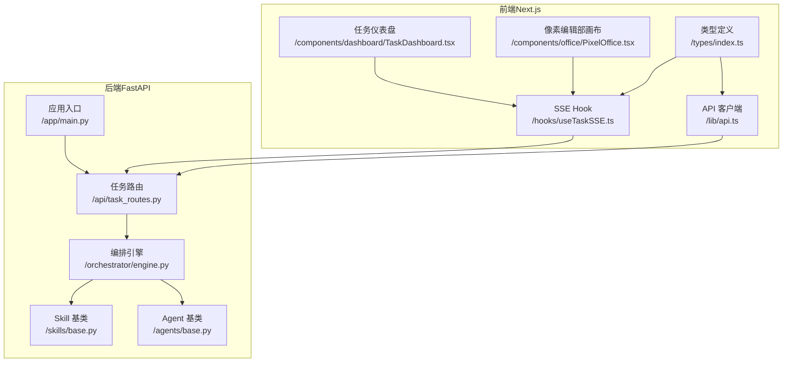
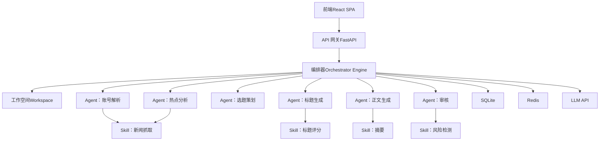
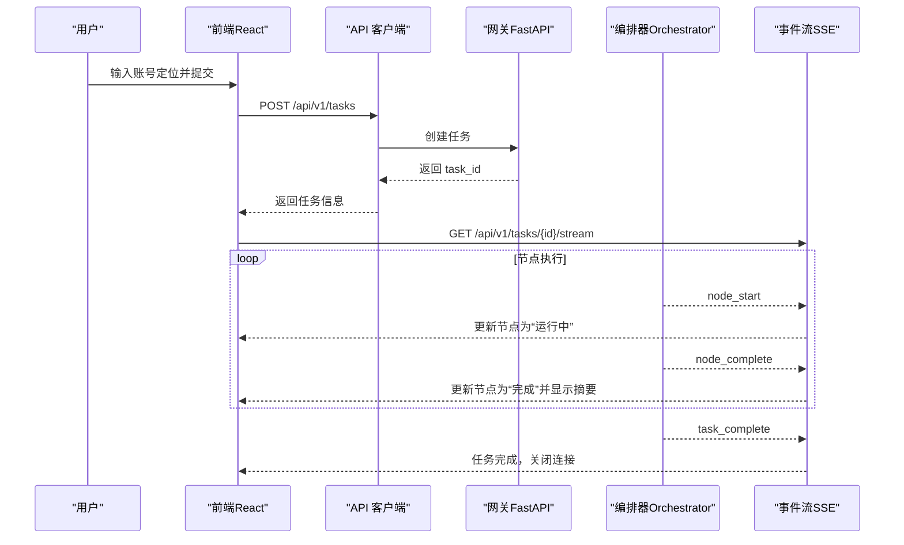
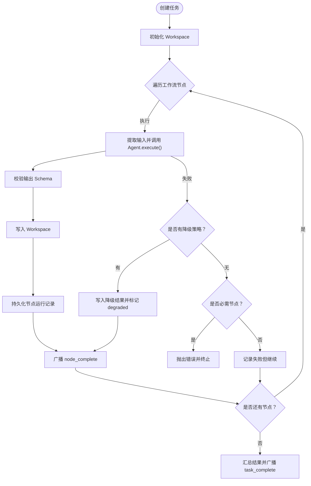
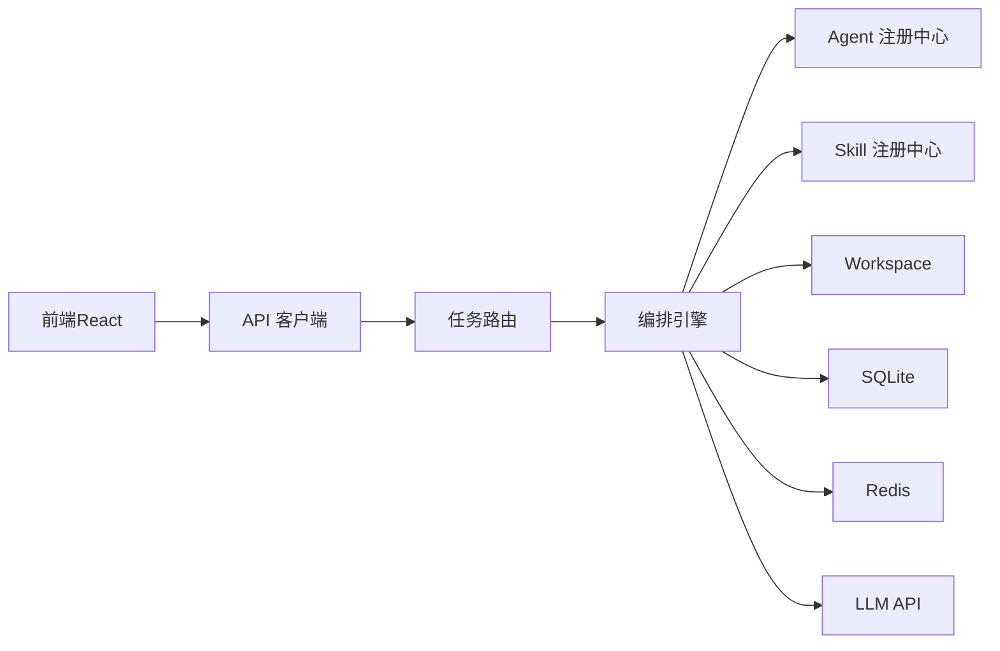

# 项目概述

<cite>
**本文引用的文件**
- [ARCHITECTURE.md](file://ARCHITECTURE.md)
- [backend/app/main.py](file://backend/app/main.py)
- [backend/pyproject.toml](file://backend/pyproject.toml)
- [backend/app/orchestrator/engine.py](file://backend/app/orchestrator/engine.py)
- [backend/app/agents/base.py](file://backend/app/agents/base.py)
- [backend/app/skills/base.py](file://backend/app/skills/base.py)
- [backend/app/api/task_routes.py](file://backend/app/api/task_routes.py)
- [frontend/app/layout.tsx](file://frontend/app/layout.tsx)
- [frontend/lib/api.ts](file://frontend/lib/api.ts)
- [frontend/hooks/useTaskSSE.ts](file://frontend/hooks/useTaskSSE.ts)
- [frontend/components/dashboard/TaskDashboard.tsx](file://frontend/components/dashboard/TaskDashboard.tsx)
- [frontend/components/office/PixelOffice.tsx](file://frontend/components/office/PixelOffice.tsx)
- [frontend/types/index.ts](file://frontend/types/index.ts)
</cite>

## 目录
1. [引言](#引言)
2. [项目结构](#项目结构)
3. [核心组件](#核心组件)
4. [架构总览](#架构总览)
5. [详细组件分析](#详细组件分析)
6. [依赖分析](#依赖分析)
7. [性能考量](#性能考量)
8. [故障排查指南](#故障排查指南)
9. [结论](#结论)
10. [附录](#附录)

## 引言
HotClaw 是一个“基于多智能体协作的公众号内容生产平台”。其核心价值在于：用户仅需输入“账号定位”，系统即可自动完成从热点抓取、选题策划、标题生成、正文撰写到审核风控的全链路内容生产，并输出可编辑的文章草稿。平台强调“所思即所得”的自动化体验，同时保持对关键节点的人工干预能力，确保内容质量与合规。

平台采用“前端独立、后端专注编排”的分层架构，借助实时事件流（SSE）实现任务运行状态的可视化推送，使用户在浏览器中即可获得接近“桌面应用”的即时反馈体验。

## 项目结构
项目采用前后端分离的组织方式：
- 后端（Python/FastAPI）：负责任务编排、Agent 执行、Skill 调用、数据库持久化与事件广播。
- 前端（Next.js/React）：负责页面路由、可视化组件、SSE 订阅与状态渲染。

**图表来源**
- [frontend/lib/api.ts:1-110](file://frontend/lib/api.ts#L1-L110)
- [frontend/hooks/useTaskSSE.ts:1-124](file://frontend/hooks/useTaskSSE.ts#L1-L124)
- [frontend/components/dashboard/TaskDashboard.tsx:1-176](file://frontend/components/dashboard/TaskDashboard.tsx#L1-L176)
- [frontend/components/office/PixelOffice.tsx:1-327](file://frontend/components/office/PixelOffice.tsx#L1-L327)
- [frontend/types/index.ts:1-119](file://frontend/types/index.ts#L1-L119)
- [backend/app/main.py:1-142](file://backend/app/main.py#L1-L142)
- [backend/app/api/task_routes.py:1-163](file://backend/app/api/task_routes.py#L1-L163)
- [backend/app/orchestrator/engine.py:1-285](file://backend/app/orchestrator/engine.py#L1-L285)
- [backend/app/agents/base.py:1-99](file://backend/app/agents/base.py#L1-L99)
- [backend/app/skills/base.py:1-37](file://backend/app/skills/base.py#L1-L37)

**章节来源**
- [frontend/app/layout.tsx:1-16](file://frontend/app/layout.tsx#L1-L16)
- [backend/pyproject.toml:1-41](file://backend/pyproject.toml#L1-L41)

## 核心组件
- 设计原则（12 条）：涵盖 Workspace-First、Manifest-First、控制平面与执行平面分离、Gateway 唯一入口、结构化输入输出、可审计可回放、渐进式自动化、Skills 是原子能力、失败不阻塞、配置优先于代码、最小权限原则、可视化是一等公民。
- 核心概念：
  - Agent（智能体）：有角色、有上下文、有决策能力的执行单元，调用 LLM 与/或 Skills。
  - Skill（技能）：无状态的原子能力，封装具体技术操作（如 API 调用、规则匹配）。
  - Workflow（工作流）：定义 agent 的执行顺序与依赖关系（MVP 为线性链）。
  - Workspace（工作空间）：一次任务执行的上下文容器，贯穿全链路共享数据。
  - Gateway（网关）：统一入口，负责路由、参数校验与错误格式化。
  - Orchestrator（编排器）：工作流执行引擎，调度 Agent、管理 Workspace、广播状态。

**章节来源**
- [ARCHITECTURE.md:94-135](file://ARCHITECTURE.md#L94-L135)

## 架构总览
HotClaw 的系统边界与分层如下：
- 前端层：React SPA，负责可视化与交互；通过 API 客户端与 SSE 与后端通信。
- 网关层（API Gateway）：统一入口，参数校验、路由与错误格式化。
- 编排层（Orchestrator）：加载 workflow、创建/维护 Workspace、按序调度 Agent、收集结果、广播状态。
- 执行层（Agent/Skill）：Agent 做决策与调用 LLM，Skill 做原子执行。
- 基础设施层：SQLite（持久化）、Redis（缓存）、LLM API（模型层）、日志/追踪、配置。

**图表来源**
- [ARCHITECTURE.md:37-78](file://ARCHITECTURE.md#L37-L78)
- [backend/app/orchestrator/engine.py:89-285](file://backend/app/orchestrator/engine.py#L89-L285)
- [backend/app/agents/base.py:49-99](file://backend/app/agents/base.py#L49-L99)
- [backend/app/skills/base.py:16-37](file://backend/app/skills/base.py#L16-L37)

## 详细组件分析

### 设计理念与核心概念
- Workspace-First：每个任务创建独立 Workspace，Agent 在其中共享上下文，保证隔离与协作。
- Manifest-First：Agent/Skill/Workflow 通过 YAML/JSON 声明式注册，系统启动时扫描加载。
- 控制平面与执行平面分离：Orchestrator 只负责调度，Agent 只负责执行，二者通过标准协议通信。
- 可视化是一等公民：运行链路可视化、实时状态、结果预览等前端逻辑独立且重要。

**章节来源**
- [ARCHITECTURE.md:94-135](file://ARCHITECTURE.md#L94-L135)

### 前端组件与实时状态推送
- API 客户端：封装 /api/v1 下的 REST 接口，统一错误处理。
- SSE Hook：订阅任务事件流，接收 node_start/node_complete/node_error/task_complete 等事件，驱动 UI 状态更新。
- 仪表盘与像素编辑部：前者展示任务进度、成功率、平均响应时间等指标；后者以 Canvas 像素风格呈现 Agent 活动与任务状态。

**图表来源**
- [frontend/lib/api.ts:26-50](file://frontend/lib/api.ts#L26-L50)
- [frontend/hooks/useTaskSSE.ts:58-120](file://frontend/hooks/useTaskSSE.ts#L58-L120)
- [backend/app/api/task_routes.py:19-51](file://backend/app/api/task_routes.py#L19-L51)
- [backend/app/orchestrator/engine.py:124-234](file://backend/app/orchestrator/engine.py#L124-L234)

**章节来源**
- [frontend/lib/api.ts:1-110](file://frontend/lib/api.ts#L1-L110)
- [frontend/hooks/useTaskSSE.ts:1-124](file://frontend/hooks/useTaskSSE.ts#L1-L124)
- [frontend/components/dashboard/TaskDashboard.tsx:1-176](file://frontend/components/dashboard/TaskDashboard.tsx#L1-L176)
- [frontend/components/office/PixelOffice.tsx:1-327](file://frontend/components/office/PixelOffice.tsx#L1-L327)
- [frontend/types/index.ts:66-95](file://frontend/types/index.ts#L66-L95)

### 后端编排与执行链
- 应用入口：注册路由、中间件（CORS、Trace ID）、全局异常处理，启动时创建数据库表。
- 任务路由：创建任务、查询状态、查询节点明细、分页列出任务。
- 编排引擎：加载默认线性工作流，逐节点提取输入、调用 Agent、校验输出、写入 Workspace、持久化节点运行记录、广播事件、累计 Token 消耗、最终汇总结果并广播任务完成。

**图表来源**
- [backend/app/orchestrator/engine.py:92-234](file://backend/app/orchestrator/engine.py#L92-L234)
- [backend/app/agents/base.py:64-99](file://backend/app/agents/base.py#L64-L99)

**章节来源**
- [backend/app/main.py:1-142](file://backend/app/main.py#L1-L142)
- [backend/app/api/task_routes.py:1-163](file://backend/app/api/task_routes.py#L1-L163)
- [backend/app/orchestrator/engine.py:1-285](file://backend/app/orchestrator/engine.py#L1-L285)
- [backend/app/agents/base.py:1-99](file://backend/app/agents/base.py#L1-L99)
- [backend/app/skills/base.py:1-37](file://backend/app/skills/base.py#L1-L37)

### 多智能体协作工作原理
- 线性链路：账号定位解析 → 热点分析 → 选题策划 → 标题生成 → 正文生成 → 审核评估。
- Agent 与 Skill 的职责划分：Agent 负责决策与调用 LLM，Skill 负责原子能力执行（如新闻抓取、摘要、评分、风险检测）。
- Workspace 作为上下文容器：每个节点的输出写入 Workspace，后续节点通过映射读取所需数据，形成强约束的数据流。

**章节来源**
- [ARCHITECTURE.md:148-154](file://ARCHITECTURE.md#L148-L154)
- [backend/app/orchestrator/engine.py:31-86](file://backend/app/orchestrator/engine.py#L31-L86)

### 从账号定位到文章草稿的完整流程
- 用户输入“账号定位”描述，前端提交至后端。
- 后端创建任务并立即返回 task_id，随后在后台异步运行编排器。
- 编排器按顺序执行各 Agent，期间通过 SSE 实时推送节点状态。
- 审核完成后，系统汇总结果（候选选题、标题、正文、审核结果），前端可预览与导出草稿。

**章节来源**
- [ARCHITECTURE.md:140-164](file://ARCHITECTURE.md#L140-L164)
- [frontend/lib/api.ts:26-50](file://frontend/lib/api.ts#L26-L50)
- [frontend/hooks/useTaskSSE.ts:58-120](file://frontend/hooks/useTaskSSE.ts#L58-L120)

## 依赖分析
- 技术栈与依赖：
  - 后端：FastAPI、SQLAlchemy 2.0、Alembic、Pydantic、Redis、HTTPX、structlog、PyYAML、sse-starlette、LiteLLM、aiosqlite。
  - 前端：React 18、TypeScript、Zustand、Ant Design 5、Axios、EventSource（SSE）。
- 模块耦合：
  - 前端通过 API 客户端与后端路由交互，SSE Hook 与后端事件流解耦。
  - 后端编排器与 Agent/Skill 解耦，通过注册中心与 Workspace 协同。
  - 数据持久化与事件广播相互独立，便于扩展与替换。

**图表来源**
- [backend/pyproject.toml:6-22](file://backend/pyproject.toml#L6-L22)
- [backend/app/main.py:14-28](file://backend/app/main.py#L14-L28)
- [backend/app/orchestrator/engine.py:18-26](file://backend/app/orchestrator/engine.py#L18-L26)

**章节来源**
- [backend/pyproject.toml:1-41](file://backend/pyproject.toml#L1-L41)
- [backend/app/main.py:1-142](file://backend/app/main.py#L1-L142)

## 性能考量
- 异步与并发：后端使用 asyncio 与 FastAPI 异步支持，避免阻塞；SSE 单向推送，降低前端复杂度。
- 事件驱动：通过事件流驱动前端状态更新，减少轮询带来的资源消耗。
- 降级策略：单节点失败时提供降级返回，避免整条链路崩溃，提升鲁棒性。
- 可观测性：记录节点输入输出、耗时、Token 消耗与错误信息，支持任务级回放与审计。

**章节来源**
- [ARCHITECTURE.md:106-109](file://ARCHITECTURE.md#L106-L109)
- [backend/app/orchestrator/engine.py:154-196](file://backend/app/orchestrator/engine.py#L154-L196)

## 故障排查指南
- 常见问题与定位：
  - 任务长时间无响应：检查 SSE 连接是否建立成功，确认后端编排器是否正常广播事件。
  - 节点报错：查看节点运行记录中的 error_message，结合降级标志（degraded）判断是否触发了降级策略。
  - 任务失败：确认 required 节点是否失败导致中断；必要时调整 Agent Prompt 或 Skill 配置。
- 前端调试：
  - 使用浏览器网络面板观察 /api/v1/tasks/{id}/stream 是否持续收到事件。
  - 检查前端类型定义与后端事件结构是否一致。
- 后端调试：
  - 查看全局异常处理器返回的 code/message，结合日志追踪（Trace ID）定位问题。

**章节来源**
- [frontend/hooks/useTaskSSE.ts:58-120](file://frontend/hooks/useTaskSSE.ts#L58-L120)
- [frontend/types/index.ts:66-95](file://frontend/types/index.ts#L66-L95)
- [backend/app/main.py:87-129](file://backend/app/main.py#L87-L129)
- [backend/app/orchestrator/engine.py:164-196](file://backend/app/orchestrator/engine.py#L164-L196)

## 结论
HotClaw 以“多智能体协作 + 声明式配置 + 可视化编排”为核心，构建了从账号定位到文章草稿的自动化内容生产闭环。通过前后端分离与 SSE 实时推送，平台在保证易用性的同时，提供了强大的可观测性与可扩展性。MVP 阶段聚焦线性工作流与关键节点的人机协同，为后续扩展 DAG 工作流、插件化对接与分布式部署打下坚实基础。

## 附录
- 设计原则与核心概念详见架构文档。
- 前端页面与组件树、状态管理与实时通信方式详见架构文档与前端源码。

**章节来源**
- [ARCHITECTURE.md:94-135](file://ARCHITECTURE.md#L94-L135)
- [frontend/components/office/PixelOffice.tsx:1-327](file://frontend/components/office/PixelOffice.tsx#L1-L327)