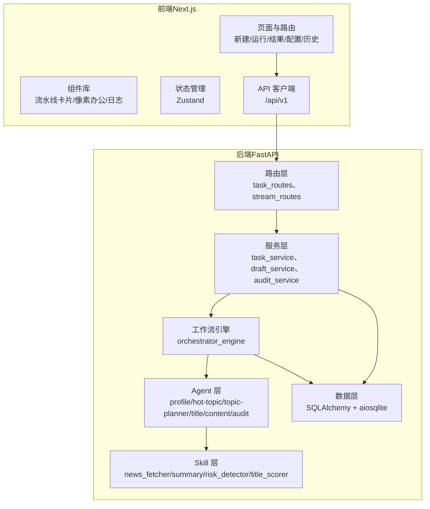
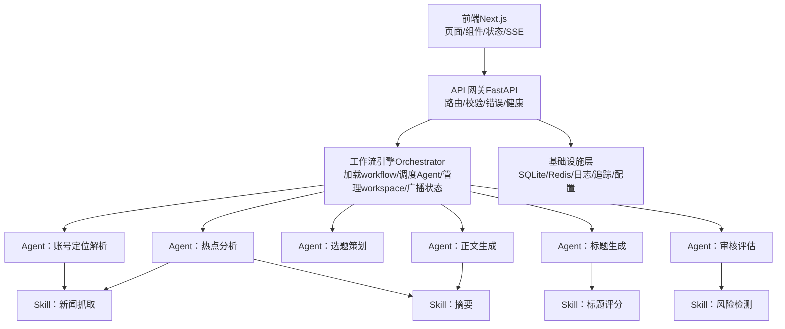
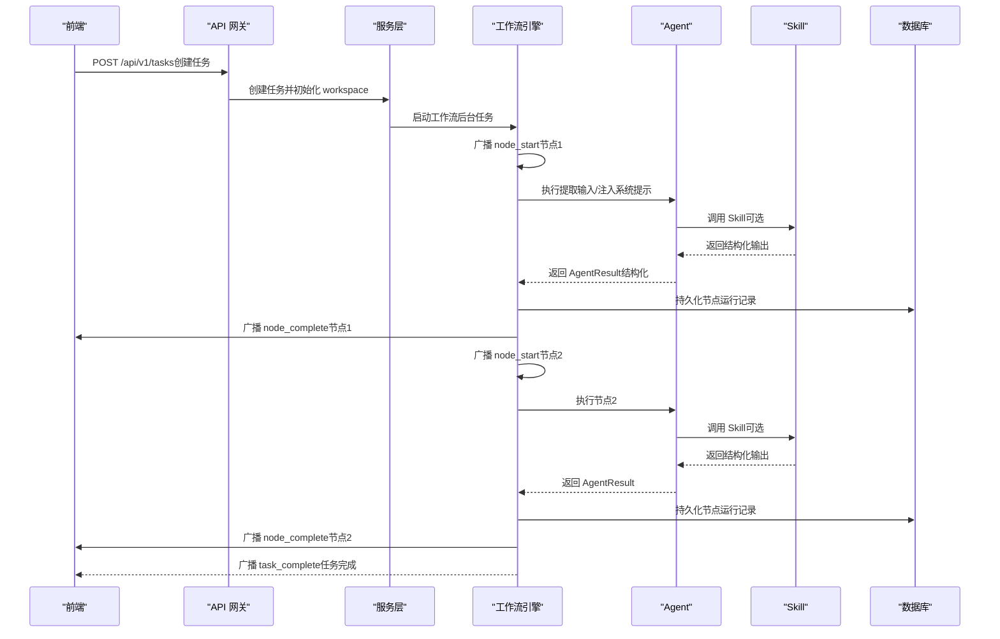
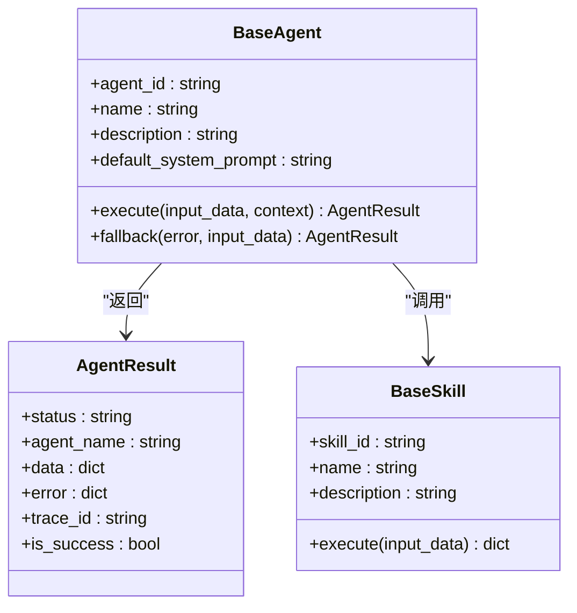
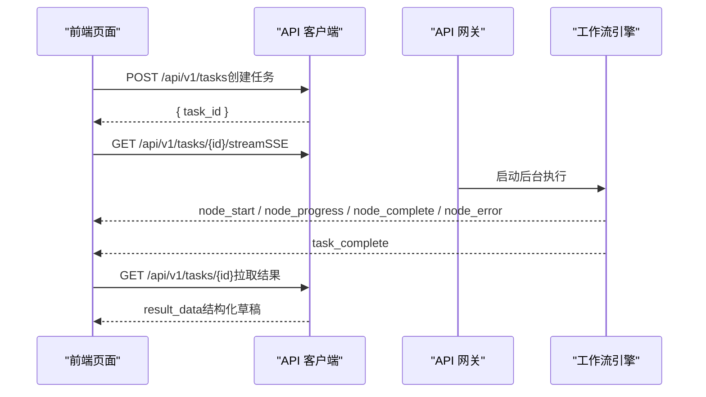
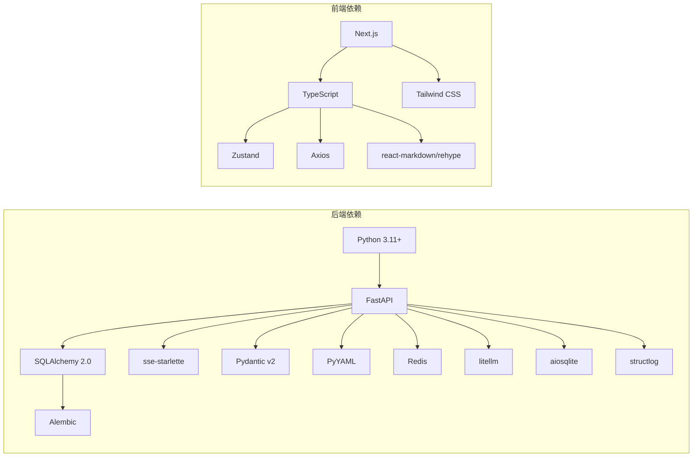

# 项目概述

<cite>
**本文引用的文件**   
- [ARCHITECTURE.md](file://ARCHITECTURE.md)
- [Notice.md](file://Notice.md)
- [ai_readme.md](file://ai_readme.md)
- [backend/app/main.py](file://backend/app/main.py)
- [backend/app/orchestrator/engine.py](file://backend/app/orchestrator/engine.py)
- [backend/app/agents/base.py](file://backend/app/agents/base.py)
- [backend/app/skills/base.py](file://backend/app/skills/base.py)
- [backend/app/api/task_routes.py](file://backend/app/api/task_routes.py)
- [frontend/app/page.tsx](file://frontend/app/page.tsx)
- [frontend/lib/api.ts](file://frontend/lib/api.ts)
- [frontend/types/index.ts](file://frontend/types/index.ts)
- [backend/pyproject.toml](file://backend/pyproject.toml)
- [frontend/package.json](file://frontend/package.json)
- [OpenClaw-bot-review-main/README.md](file://OpenClaw-bot-review-main/README.md)
</cite>

## 目录
1. [引言](#引言)
2. [项目结构](#项目结构)
3. [核心组件](#核心组件)
4. [架构总览](#架构总览)
5. [详细组件分析](#详细组件分析)
6. [依赖分析](#依赖分析)
7. [性能考量](#性能考量)
8. [故障排查指南](#故障排查指南)
9. [结论](#结论)
10. [附录](#附录)

## 引言
HotClaw 是一个“基于多智能体协作的公众号内容生产平台”。其核心价值主张是：用户仅需输入“账号定位”，系统即可自动完成从热点抓取、选题策划、标题生成、正文撰写到审核风控的全链路内容生产，并输出可编辑的文章草稿。项目以 MVP（最小可行产品）为目标，聚焦“可运行、可追踪、可维护”的闭环，强调前后端分离、Agent/Skill 分层、配置优先、可视化运行与严格输入输出协议。

## 项目结构
项目采用前后端分离架构，后端基于 Python + FastAPI，前端基于 Next.js + TypeScript。整体目录组织遵循“后端目录职责边界”和“前端目录职责边界”，确保分层清晰、职责单一。

- 后端（Python + FastAPI）
  - 路由层：接收请求、参数校验、统一错误响应
  - 服务层：任务编排、配置管理、草稿与审核服务
  - 工作流引擎：加载 workflow、调度 Agent、管理 workspace、广播状态
  - Agent 层：各业务 Agent 的实现与注册
  - Skill 层：原子能力封装（如新闻抓取、摘要、风险检测、标题评分）
  - 核心工具：日志、异常、追踪、配置
  - 数据层：SQLAlchemy + Alembic + aiosqlite（MVP）

- 前端（Next.js + TypeScript）
  - 页面与路由：新建任务、任务运行、结果预览、Agent/Skill 配置、历史任务
  - 组件：可视化流水线卡片、像素风格办公场景、实时日志面板
  - 状态管理：Zustand（任务状态、配置、历史）
  - 实时通信：SSE（Server-Sent Events）

```mermaid
graph TB
subgraph "前端Next.js"
FE_Page["页面与路由<br/>新建/运行/结果/配置/历史"]
FE_Comps["组件库<br/>流水线卡片/像素办公/日志"]
FE_Store["状态管理<br/>Zustand"]
FE_API["API 客户端<br/>/api/v1"]
end
subgraph "后端FastAPI"
BE_Router["路由层<br/>task_routes、stream_routes"]
BE_Services["服务层<br/>task_service、draft_service、audit_service"]
BE_Orchestrator["工作流引擎<br/>orchestrator_engine"]
BE_Agents["Agent 层<br/>profile/hot-topic/topic-planner/title/content/audit"]
BE_Skills["Skill 层<br/>news_fetcher/summary/risk_detector/title_scorer"]
BE_DB["数据层<br/>SQLAlchemy + aiosqlite"]
end
FE_Page --> FE_API
FE_API --> BE_Router
BE_Router --> BE_Services
BE_Services --> BE_Orchestrator
BE_Orchestrator --> BE_Agents
BE_Agents --> BE_Skills
BE_Services --> BE_DB
BE_Orchestrator --> BE_DB
```

图表来源
- [backend/app/api/task_routes.py:1-163](file://backend/app/api/task_routes.py#L1-L163)
- [backend/app/orchestrator/engine.py:89-235](file://backend/app/orchestrator/engine.py#L89-L235)
- [backend/app/agents/base.py:49-99](file://backend/app/agents/base.py#L49-L99)
- [backend/app/skills/base.py:16-37](file://backend/app/skills/base.py#L16-L37)
- [frontend/app/page.tsx:1-63](file://frontend/app/page.tsx#L1-L63)
- [frontend/lib/api.ts:1-110](file://frontend/lib/api.ts#L1-L110)

章节来源
- [ARCHITECTURE.md:191-290](file://ARCHITECTURE.md#L191-L290)
- [Notice.md:100-122](file://Notice.md#L100-L122)

## 核心组件
- Agent（智能体）
  - 有角色、有上下文、有决策能力，负责单一业务任务，返回结构化 JSON，可调用 Skill。
  - 示例：账号定位解析、热点分析、选题策划、标题生成、正文生成、审核评估。

- Skill（技能）
  - 无状态的原子能力，封装具体技术操作（API 调用、数据处理、规则匹配），对外提供标准化输入输出。

- 工作流引擎（Orchestrator）
  - 读取 workflow 定义，按顺序/依赖调度 Agent，管理 workspace 生命周期，广播执行状态，支持降级与失败处理。

- API 网关（FastAPI）
  - 统一路由、参数校验、错误格式化、SSE 端点，保障前后端协议一致。

- 前端可视化
  - 垂直流水线卡片布局，实时展示节点状态、耗时、输出摘要；支持结果预览与导出。

章节来源
- [ARCHITECTURE.md:541-632](file://ARCHITECTURE.md#L541-L632)
- [backend/app/agents/base.py:49-99](file://backend/app/agents/base.py#L49-L99)
- [backend/app/skills/base.py:16-37](file://backend/app/skills/base.py#L16-L37)
- [backend/app/orchestrator/engine.py:89-235](file://backend/app/orchestrator/engine.py#L89-L235)
- [frontend/app/page.tsx:1-63](file://frontend/app/page.tsx#L1-L63)

## 架构总览
HotClaw 采用“前后端分离 + Agent 层 + Skill 层 + 基础设施层”的分层架构。前端通过 /api/v1 与后端交互，后端通过工作流引擎编排 Agent，Agent 调用 Skill 完成具体能力，所有节点状态通过 SSE 推送给前端，形成“可追踪、可回放、可配置”的可视化闭环。

```mermaid
graph TB
FE["前端Next.js<br/>页面/组件/状态/SSE"] --> GW["API 网关FastAPI<br/>路由/校验/错误/健康"]
GW --> ORCH["工作流引擎Orchestrator<br/>加载workflow/调度Agent/管理workspace/广播状态"]
ORCH --> AG1["Agent：账号定位解析"]
ORCH --> AG2["Agent：热点分析"]
ORCH --> AG3["Agent：选题策划"]
ORCH --> AG4["Agent：标题生成"]
ORCH --> AG5["Agent：正文生成"]
ORCH --> AG6["Agent：审核评估"]
AG1 --> SK1["Skill：新闻抓取"]
AG2 --> SK1
AG2 --> SK2["Skill：摘要"]
AG4 --> SK3["Skill：标题评分"]
AG5 --> SK2
AG6 --> SK4["Skill：风险检测"]
GW --> DB["基础设施层<br/>SQLite/Redis/日志/追踪/配置"]
```

图表来源
- [ARCHITECTURE.md:37-78](file://ARCHITECTURE.md#L37-L78)
- [backend/app/orchestrator/engine.py:31-86](file://backend/app/orchestrator/engine.py#L31-L86)
- [backend/app/api/task_routes.py:1-163](file://backend/app/api/task_routes.py#L1-L163)

章节来源
- [ARCHITECTURE.md:37-123](file://ARCHITECTURE.md#L37-L123)

## 详细组件分析

### 工作流引擎（OrchestratorEngine）
- 职责
  - 加载默认线性工作流（MVP 阶段为固定链路）
  - 逐节点提取输入、调用 Agent、校验输出、写入 workspace、持久化节点运行记录
  - 广播节点开始/进度/完成/错误事件，支持降级策略与失败中断
  - 记录任务耗时、累计 token 消耗，最终广播任务完成

- 关键流程（线性链路）
  - 账号定位解析 → 热点分析 → 选题策划 → 标题生成 → 正文生成 → 审核评估

```mermaid
sequenceDiagram
participant FE as "前端"
participant GW as "API 网关"
participant SVC as "服务层"
participant ORCH as "工作流引擎"
participant AG as "Agent"
participant SK as "Skill"
participant DB as "数据库"
FE->>GW : POST /api/v1/tasks创建任务
GW->>SVC : 创建任务并初始化 workspace
SVC->>ORCH : 启动工作流后台任务
ORCH->>ORCH : 广播 node_start节点1
ORCH->>AG : 执行提取输入/注入系统提示
AG->>SK : 调用 Skill可选
SK-->>AG : 返回结构化输出
AG-->>ORCH : 返回 AgentResult结构化
ORCH->>DB : 持久化节点运行记录
ORCH->>FE : 广播 node_complete节点1
ORCH->>ORCH : 广播 node_start节点2
ORCH->>AG : 执行节点2
AG->>SK : 调用 Skill可选
SK-->>AG : 返回结构化输出
AG-->>ORCH : 返回 AgentResult
ORCH->>DB : 持久化节点运行记录
ORCH->>FE : 广播 node_complete节点2
ORCH-->>FE : 广播 task_complete任务完成
```

图表来源
- [backend/app/orchestrator/engine.py:92-235](file://backend/app/orchestrator/engine.py#L92-L235)
- [backend/app/api/task_routes.py:19-52](file://backend/app/api/task_routes.py#L19-L52)
- [frontend/lib/api.ts:48-50](file://frontend/lib/api.ts#L48-L50)

章节来源
- [backend/app/orchestrator/engine.py:89-235](file://backend/app/orchestrator/engine.py#L89-L235)
- [backend/app/api/task_routes.py:1-163](file://backend/app/api/task_routes.py#L1-L163)

### Agent 与 Skill 基类
- Agent 基类
  - 统一输入/输出结构，支持系统提示注入、降级策略、标准化返回 AgentResult
- Skill 基类
  - 统一执行接口，无状态、可复用、稳定输出

```mermaid
classDiagram
class BaseAgent {
+agent_id : string
+name : string
+description : string
+default_system_prompt : string
+execute(input_data, context) AgentResult
+fallback(error, input_data) AgentResult
}
class AgentResult {
+status : string
+agent_name : string
+data : dict
+error : dict
+trace_id : string
+is_success : bool
}
class BaseSkill {
+skill_id : string
+name : string
+description : string
+execute(input_data) dict
}
BaseAgent --> AgentResult : "返回"
BaseAgent --> BaseSkill : "调用"
```

图表来源
- [backend/app/agents/base.py:49-99](file://backend/app/agents/base.py#L49-L99)
- [backend/app/skills/base.py:16-37](file://backend/app/skills/base.py#L16-L37)

章节来源
- [backend/app/agents/base.py:1-99](file://backend/app/agents/base.py#L1-L99)
- [backend/app/skills/base.py:1-37](file://backend/app/skills/base.py#L1-L37)

### 前端可视化与实时通信
- 页面与路由
  - 首页：输入账号定位，一键启动
  - 任务运行页：实时查看各节点状态、耗时、输出摘要
  - 结果页：查看完整输出、预览文章、导出/复制
  - 配置页：查看/编辑 Agent/Skill 配置
  - 历史页：任务列表、详情与回放
- 实时通信
  - SSE（Server-Sent Events）：节点开始、进度、完成、错误、任务完成
  - 前端通过 EventSource 订阅 /api/v1/tasks/{id}/stream

```mermaid
sequenceDiagram
participant FE as "前端页面"
participant API as "API 客户端"
participant GW as "API 网关"
participant ORCH as "工作流引擎"
FE->>API : POST /api/v1/tasks创建任务
API-->>FE : { task_id }
FE->>API : GET /api/v1/tasks/{id}/streamSSE
GW->>ORCH : 启动后台执行
ORCH-->>FE : node_start / node_progress / node_complete / node_error
ORCH-->>FE : task_complete
FE->>API : GET /api/v1/tasks/{id}拉取结果
API-->>FE : result_data结构化草稿
```

图表来源
- [frontend/app/page.tsx:14-62](file://frontend/app/page.tsx#L14-L62)
- [frontend/lib/api.ts:26-50](file://frontend/lib/api.ts#L26-L50)
- [backend/app/api/task_routes.py:19-52](file://backend/app/api/task_routes.py#L19-L52)

章节来源
- [ARCHITECTURE.md:191-360](file://ARCHITECTURE.md#L191-L360)
- [frontend/app/page.tsx:1-63](file://frontend/app/page.tsx#L1-L63)
- [frontend/lib/api.ts:1-110](file://frontend/lib/api.ts#L1-L110)
- [frontend/types/index.ts:66-95](file://frontend/types/index.ts#L66-L95)

## 依赖分析
- 后端技术栈
  - Python 3.11+、FastAPI、SQLAlchemy 2.0 + Alembic、Redis、litellm、aiosqlite、sse-starlette、structlog、Pydantic v2、PyYAML
- 前端技术栈
  - Next.js、TypeScript、Tailwind CSS、Zustand、Axios、react-markdown + rehype

```mermaid
graph LR
subgraph "后端依赖"
PY["Python 3.11+"]
FA["FastAPI"]
SA["SQLAlchemy 2.0"]
AL["Alembic"]
RD["Redis"]
LL["litellm"]
AS["aiosqlite"]
SS["sse-starlette"]
SL["structlog"]
PD["Pydantic v2"]
YML["PyYAML"]
end
subgraph "前端依赖"
NX["Next.js"]
TS["TypeScript"]
TZ["Tailwind CSS"]
ZU["Zustand"]
AX["Axios"]
RM["react-markdown/rehype"]
end
PY --> FA
FA --> SA
SA --> AL
FA --> SS
FA --> PD
FA --> YML
FA --> RD
FA --> LL
FA --> AS
FA --> SL
NX --> TS
NX --> TZ
TS --> ZU
TS --> AX
TS --> RM
```

图表来源
- [backend/pyproject.toml:1-41](file://backend/pyproject.toml#L1-L41)
- [frontend/package.json:1-23](file://frontend/package.json#L1-L23)

章节来源
- [backend/pyproject.toml:1-41](file://backend/pyproject.toml#L1-L41)
- [frontend/package.json:1-23](file://frontend/package.json#L1-L23)

## 性能考量
- 线程与异步
  - 后端使用 asyncio 与 FastAPI 异步支持，SSE 推送与数据库异步 IO，降低阻塞
- 超时与降级
  - 工作流引擎为每个节点设置超时，失败时执行 Agent 降级策略，避免整条链路崩溃
- 缓存与持久化
  - Redis 用于缓存热点与配置，SQLite 存储任务与节点运行记录，减少重复计算
- 可观测性
  - trace_id 传播、结构化日志、节点耗时与 token 统计，便于性能分析与问题定位

章节来源
- [backend/app/orchestrator/engine.py:236-264](file://backend/app/orchestrator/engine.py#L236-L264)
- [Notice.md:342-371](file://Notice.md#L342-L371)

## 故障排查指南
- 常见问题与定位
  - 节点失败：查看节点运行记录（输入/输出/错误信息），确认是否触发降级
  - 任务级错误：检查任务状态与错误消息，定位首个失败节点
  - SSE 连接异常：确认 /api/v1/tasks/{id}/stream 是否可达，浏览器控制台网络面板
  - Agent/Skill 配置异常：检查配置项 schema 与默认值，必要时回滚至默认配置
- 前端状态处理
  - 正确处理 loading/error/empty/success 四态，避免静默失败
- 后端异常处理
  - 统一异常映射为 HTTP 状态码，错误响应包含 code/message/details

章节来源
- [backend/app/api/task_routes.py:54-107](file://backend/app/api/task_routes.py#L54-L107)
- [backend/app/main.py:87-130](file://backend/app/main.py#L87-L130)
- [Notice.md:316-340](file://Notice.md#L316-L340)

## 结论
HotClaw 以“可运行、可追踪、可维护”为核心目标，通过前后端分离、Agent/Skill 分层与可视化运行，构建了从账号定位到文章草稿输出的最小闭环。MVP 阶段聚焦线性工作流与基础能力，后续可在保持协议稳定的前提下逐步扩展为 DAG 工作流、插件系统与多账号管理。

## 附录
- 项目背景与对比参考
  - 与 OpenClaw 的理念吸收与改造：保留控制/执行平面分离、Manifest 声明式注册、Canvas 可视化等，结合 HotClaw 的 Workspace-first、内置 Orchestrator、简化 Canvas 等实践
- 设计原则与约束
  - 设计原则（12 条）：Workspace-First、Manifest-First、控制平面与执行平面分离、Gateway 唯一入口、结构化输入输出、可审计可回放、渐进式自动化、Skills 是原子能力、失败不阻塞、配置优先于代码、最小权限原则、可视化是一等公民
  - 不可变约束：目录结构、技术栈、接口与表结构命名、状态管理与编排框架、业务逻辑位置、密钥与 URL 硬编码、未来功能提前实现、伪代码替代真实实现、静默吞错

章节来源
- [ARCHITECTURE.md:92-135](file://ARCHITECTURE.md#L92-L135)
- [Notice.md:40-72](file://Notice.md#L40-L72)
- [OpenClaw-bot-review-main/README.md:1-176](file://OpenClaw-bot-review-main/README.md#L1-L176)