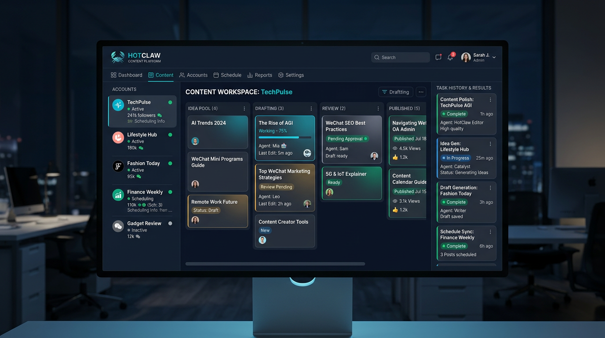

<div align="center">
  

  # HotClaw

  **Multi-Agent Content Production Platform for WeChat Official Accounts**

  [](https://opensource.org/licenses/MIT)
  [](https://www.python.org/)
  [](https://fastapi.tiangolo.com/)
  [](https://nextjs.org/)

</div>

---

## 🎯 一句话描述

**HotClaw** 是一款基于 Multi-Agent 架构的微信公众号内容创作平台，只需输入账号定位，即可自动完成从热点分析、选题策划、内容创作到审核发布的全链路工作流。

---

## ✨ 核心特性

### 🤖 智能体编排
- **6 个专业智能体**：账号定位解析、热点分析、选题策划、标题生成、内容创作、内容审核
- **编排引擎**：基于 Task 的 DAG 编排，支持顺序/并行/条件分支
- **插件化架构**：新增智能体只需继承 BaseAgent 并注册

### 📋 三种运营模式
| 模式 | 说明 | 适用场景 |
|------|------|----------|
| **Manual** | 手动触发，生成草稿供人工审核 | 精细化运营 |
| **Semi-Auto** | 自动生成 → 人工确认发布 | 平衡效率与质量 |
| **Full-Auto** | 全自动生成与发布 | 高频更新账号 |

### 📝 草稿工作流
- 自动生成待审核草稿（pending_review）
- 支持确认发布 / 废弃 / 拒绝 / 重跑
- Terminal State 保护，防止非法状态流转
- 草稿列表筛选与计数

### ⏰ 账号托管调度
- 支持定时调度（每日/每周/自定义）
- Scheduler 防重复触发机制
- 账号运行状态实时跟踪
- 失败自动降级与错误记录

### 🧪 端到端测试
- 完整的 E2E 测试覆盖
- Mock LLM Provider，保证测试稳定性
- 16+ 核心业务场景测试用例

---

## 🚀 当前进度

### ✅ 已完成
- [x] Task 模式（手动触发内容生成）
- [x] Account 模式（账号托管与调度）
- [x] 6 个 Agent 链路（Profile → HotTopic → Topic → Title → Content → Audit）
- [x] 草稿箱（Draft Inbox）功能
- [x] 草稿状态机（draft → pending_review → approved/rejected/discarded → published）
- [x] 确认发布 / 废弃 / 拒绝 / 重跑操作
- [x] 账号详情页待审核草稿入口
- [x] 历史任务页 / 结果页 / 设置页
- [x] E2E 测试能力（16 个测试用例）
- [x] 统一错误处理与错误码体系
- [x] Scheduler 防重复触发
- [x] 最小降级策略

### 🔄 进行中
- [ ] Playwright 前端 E2E 测试
- [ ] 真实 LLM 集成测试
- [ ] 微信公众号 API 集成

### 📋 待办
- [ ] 技能系统（Skill）插件化
- [ ] 热点抓取数据源扩展
- [ ] 数据分析与报表
- [ ] 多语言支持

---

## 🏃 快速启动

### 前置要求
- Python 3.12+
- Node.js 18+
- MySQL 5.7+ 或 SQLite

### 1. 克隆项目
```bash
git clone https://github.com/sansansansansan2022-web/hotclaw.git
cd hotclaw
```

### 2. 后端设置
```bash
cd backend

# 创建虚拟环境
python -m venv venv
source venv/bin/activate  # Windows: venv\Scripts\activate

# 安装依赖
pip install -r requirements.txt

# 配置环境变量
cp .env.example .env
# 编辑 .env 填入 LLM API Key

# 启动后端
uvicorn app.main:app --reload --port 8000
```

### 3. 前端设置
```bash
cd frontend

# 安装依赖
npm install

# 启动开发服务器
npm run dev
```

### 4. 访问
- 前端：http://localhost:3000
- 后端 API：http://localhost:8000/api/v1
- API 文档：http://localhost:8000/docs

---

## 📂 项目结构

```
hotclaw/
├── backend/
│   ├── app/
│   │   ├── agents/          # 智能体实现
│   │   ├── api/            # API 路由
│   │   ├── core/           # 核心模块（配置、异常、日志）
│   │   ├── db/             # 数据库会话
│   │   ├── models/         # ORM 模型
│   │   ├── orchestrator/   # 编排引擎
│   │   ├── schemas/        # Pydantic 模型
│   │   ├── scheduler/      # 调度器
│   │   ├── services/       # 业务逻辑服务
│   │   └── main.py         # FastAPI 入口
│   └── tests/              # 测试
│       └── e2e/           # 端到端测试
├── frontend/
│   ├── app/               # Next.js App Router
│   ├── lib/               # 工具库
│   ├── types/             # TypeScript 类型
│   └── public/            # 静态资源
├── docs/                  # 项目文档
└── README.md
```

---

## 🧪 运行测试

```bash
cd backend

# 运行所有测试
pytest -v

# 运行 E2E 测试
pytest tests/e2e/ -v

# 运行单元测试
pytest tests/ -v --ignore=tests/e2e/
```

---

## 📖 技术栈

### 后端
- **FastAPI** - 异步 Web 框架
- **SQLAlchemy** - ORM（支持 MySQL/SQLite）
- **Litellm** - LLM 调用抽象层
- **APScheduler** - 定时任务调度
- **Pydantic** - 数据验证

### 前端
- **Next.js 16** - React 框架
- **TypeScript** - 类型安全
- **TailwindCSS** - 样式
- **Zustand** - 状态管理

### 架构
- **Agent Registry** - 智能体注册表模式
- **Orchestrator Engine** - DAG 编排引擎
- **Workspace** - 任务上下文管理

---

## 📄 License

MIT License - 详见 [LICENSE](LICENSE) 文件

---

## 🤝 贡献

欢迎提交 Issue 和 Pull Request！

---

<p align="center">
  Made with ❤️ by <a href="https://github.com/sansansansansan2022-web">@sansansansansan2022-web</a>
</p>
