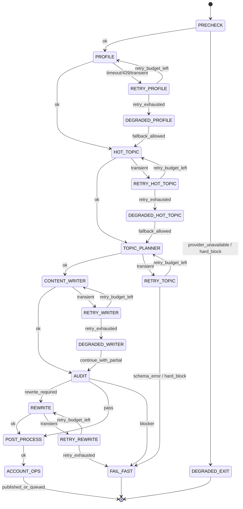

# PRD: 多智能体编排重构（13 → 8）

## 1. 背景与目标

当前内容生产链路存在 13 个智能体节点，阶段切分较细，导致：

- 节点间上下文传递频繁，链路延迟和失败面变大
- 相邻职责高度重叠（如选题与标题、审校风格与结构）
- 编排复杂度高，问题定位成本高

本 PRD 目标是在不牺牲质量闸门的前提下，将 13 个智能体合并为 8 个（双闸门并为单总审），提升稳定性与吞吐效率，并为后续模型路由策略提供更清晰的阶段边界。

---

## 2. 成功标准（Success Metrics）

### 2.1 业务与质量
- 生成成功率不低于当前基线（目标 +2%）
- 人工验收通过率不低于当前基线
- 重写触发后通过率保持或提升

### 2.2 性能与稳定性
- 端到端平均耗时下降 20%+
- P95 耗时下降 15%+
- 任务失败率下降 20%+

### 2.3 可维护性
- 编排 DAG 节点数从 13 降至 8
- 关键日志链路可在单任务内完整追溯（trace_id + stage）

---

## 3. 范围（In Scope / Out of Scope）

### 3.1 In Scope
- 智能体职责合并与注册表更新
- 编排执行顺序重构（13→8）
- 阶段输入输出契约（payload schema）对齐
- 监控指标与日志埋点更新
- 向后兼容策略（老 agent_id 映射或兼容读）

### 3.2 Out of Scope
- 大规模 Prompt 体系重写（仅做必要合并）
- 全量模型路由重构（可保留后续迭代）
- 前端大改（仅必要的名称/状态展示对齐）

---

## 4. 当前 13 Agent 清单

1. `profile_agent`
2. `hot_topic_agent`
3. `topic_planner_agent`
4. `title_generator_agent`
5. `outline_planner_agent`
6. `section_writer_agent`
7. `style_reviewer_agent`
8. `structure_reviewer_agent`
9. `rewrite_agent`
10. `post_process_agent`
11. `content_writer_agent`
12. `audit_agent`
13. `account_ops_agent`

---

## 5. 目标 8 Agent 方案（确认版）

## 5.1 合并映射

### A. 主题策划合并
- `title_generator_agent` 并入 `topic_planner_agent`
- 新职责：在选题阶段直接输出标题候选与选择理由

### B. 写作链路合并
- `outline_planner_agent` + `section_writer_agent` 并入 `content_writer_agent`
- 新职责：统一完成大纲生成 + 分段正文生成

### C. 质量评审合并
- `style_reviewer_agent` + `structure_reviewer_agent` 合并为单一质量评审节点
- 并入总审节点（`audit_agent`），不再独立新增 `quality_reviewer_agent`

### D. 总审闸门合并
- 原 `quality_review` 与 `audit` 双闸门合并为一个总审闸门（`audit_agent`）
- `rewrite` 是否触发由总审结果统一判定

## 5.2 保留节点
- `profile_agent`
- `hot_topic_agent`
- `topic_planner_agent`（已并入 title）
- `content_writer_agent`（已并入 outline+section）
- `rewrite_agent`
- `post_process_agent`
- `audit_agent`（总审，包含原 quality_review 能力）
- `account_ops_agent`

---

## 6. 目标编排流程（8 节点）

`profile -> hot_topic -> topic_planner(+title) -> content_writer(+outline+section) -> rewrite(按需) -> post_process -> audit(总审) -> account_ops`

### 6.1 阶段说明
- `topic_planner`: 输出 topic shortlist + selected title
- `content_writer`: 输出 article_outline + sections + full_draft
- `audit(总审)`: 输出 style_issues + structure_issues + severity + rewrite_required + publish_decision
- `rewrite`: 仅在总审判定需要时触发

---

## 6.2 显式状态图（State Machine）



说明：
- 所有阶段先进入 `PRECHECK`（模型可用性/配置健康/预算检查），失败恢复策略在进入业务阶段前决定。
- 每阶段统一 `ok -> retry -> degraded/fail_fast` 路径，保证可恢复、可追踪、可降级。
- `audit` 为唯一总审门，决定 `rewrite_required`、`pass`、`blocker` 三类流转。

---

## 7. 需求细化

## 7.1 功能需求
- 支持新 8 节点流程执行
- 支持原任务恢复与重试（断点续跑）
- 合并阶段可观测（输入摘要、输出摘要、耗时、重试）

## 7.2 兼容需求
- 监控面板/列表页展示不因 agent 合并而报错

## 7.3 非功能需求
- 新链路在高并发下不低于现网稳定性
- 日志与指标结构化，支持后续路由优化分析

---

## 7.4 阶段输出统一结构化（统一契约）

所有阶段输出统一包裹为 `StageEnvelope`，便于编排器做重试、降级、回放与审计。

```json
{
  "trace_id": "string",
  "task_id": "string",
  "stage": "profile|hot_topic|topic_planner|content_writer|rewrite|post_process|audit|account_ops",
  "status": "ok|retryable_error|degraded|hard_fail",
  "severity": "none|minor|major|blocker",
  "attempt": 1,
  "max_attempts": 3,
  "latency_ms": 1234,
  "model_route": {
    "provider": "string",
    "model": "string",
    "fallback_used": false
  },
  "error": {
    "code": "optional_string",
    "message": "optional_string",
    "retry_after_ms": 0
  },
  "output": {},
  "next_action": "continue|retry|degrade|rewrite|stop"
}
```

阶段 `output` 规范（最小要求）：
- `topic_planner.output`: `topic_candidates[]`, `selected_topic`, `title_candidates[]`, `selected_title`
- `content_writer.output`: `outline[]`, `sections[]`, `draft_markdown`
- `audit.output`: `issues[]`, `rewrite_required`, `publish_decision`, `reason_codes[]`
- `account_ops.output`: `publish_status`, `publish_target`, `record_id`

---

## 8. 数据与接口影响

### 8.1 Agent Registry
- 移除/停用：`title_generator_agent`, `outline_planner_agent`, `section_writer_agent`, `style_reviewer_agent`, `structure_reviewer_agent`
- 不新增独立质量评审节点，质量评审能力并入 `audit_agent`

### 8.2 Pipeline Contract
- `topic_planner` 输出字段新增 `title_candidates`, `selected_title`
- `content_writer` 输入接受 topic+title，输出统一 draft 结构
- `audit` 输出统一 issue schema（style/structure）与总审结论

### 8.3 API/UI
- 设置页 Agent 列表显示数量由 13 变 8
- 旧任务详情页不展示“13→8 合并来源”解释

---

## 9. 里程碑与实施计划

### M1：设计冻结（0.5 天）
- 冻结合并映射、节点命名、输出 schema

### M2：后端编排改造（1.5~2 天）
- Registry、Pipeline、Agent 调用链改造
- 兼容层与老数据映射

### M3：验证与灰度（1 天）
- 回归测试 + 性能对比 + 样本质量评审
- 灰度开关仅按环境/版本，不做按账号切换

### M4：全量切换（0.5 天）
- 监控观察 + 回滚预案待命

---

## 10. 风险与回滚

### 10.1 风险
- 合并后单节点 Prompt 复杂度提升，输出波动增加
- 旧任务回放时出现 schema 不匹配
- 质量评审合并后可能漏掉细粒度问题

### 10.2 缓解
- 为合并节点增加结构化输出约束与失败兜底
- 先灰度再全量，指标阈值触发自动回滚

### 10.3 回滚策略
- Feature flag 一键切回 13 节点编排
- 新旧流程并行保留一段窗口期

---

## 10.4 失败恢复与降级策略（前置到编排层）

编排层在调度每个阶段前执行统一策略，不依赖阶段内部“各自处理”：

1. **Preflight 检查（阶段前）**
   - 检查 provider/model 可用性、配额、超时预算、熔断状态。
   - 如主路由不可用，编排层先切 fallback，再触发阶段执行。

2. **错误分级（阶段后）**
   - `retryable_error`: 超时/429/短暂网络错误 -> 指数退避重试。
   - `degraded`: 达到重试上限但可降级 -> 降级模型或降级能力继续。
   - `hard_fail`: schema 错误/关键字段缺失/策略阻断 -> 立即终止。

3. **降级优先级**
   - 模型降级（同能力低成本） > 提示词简化 > 输出粒度降级（保核心内容） > 终止。

4. **审计记录**
   - 每次重试、降级、fallback 都记录 `trace_id/stage/attempt/model_route/error_code`。

这保证了“失败恢复与降级策略”由编排层统一管控，而不是散落在各 agent 内部。

---

## 11. 对当前编排的改进建议（答你问题 1）

在 13→8 之外，建议再做三点以提升长期稳定性：

- **建议 A：阶段化状态机**
  - 用明确状态机替代隐式串行调用，支持断点恢复、重跑单阶段。
- **建议 B：统一质量门控**
  - 以总审节点输出统一 severity policy（如 `blocker/major/minor`），避免多处判断冲突。
- **建议 C：失败分级重试**
  - 根据错误类型（超时、429、schema）做差异化重试与 fallback，避免“同策略重试”。

---

## 12. 参考 GitHub 项目与建议（答你问题 2）

以下是可直接借鉴的工程实践方向：

- **OpenHands**（执行链路与角色分工）
  - 借鉴点：清晰阶段职责 + 失败恢复路径
- **LangGraph**（状态图编排）
  - 借鉴点：状态驱动工作流、分支/回边、可恢复执行
- **AutoGen**（多 agent 选择机制）
  - 借鉴点：候选约束 + 选择器机制，可用于后续模型/角色路由

建议不是直接复制框架，而是借鉴三件事落地在当前项目：
- 把编排显式建模为状态图
- 把阶段输出统一结构化
- 把失败恢复与降级策略前置到编排层

---

## 13. 已确认决策（执行前）

1. 双闸门最终合并为一个总审（`audit_agent` 承担总审能力）。
2. 旧任务详情页不展示“13→8 映射解释”。
3. 不支持按账号切换旧/新编排，只做统一切换。

